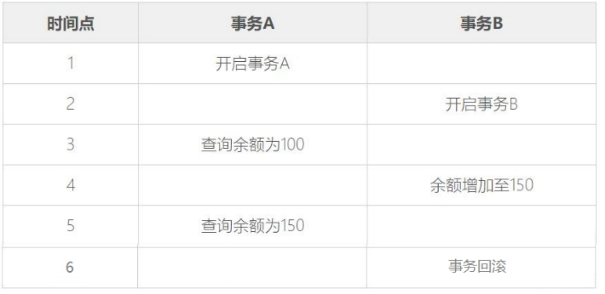
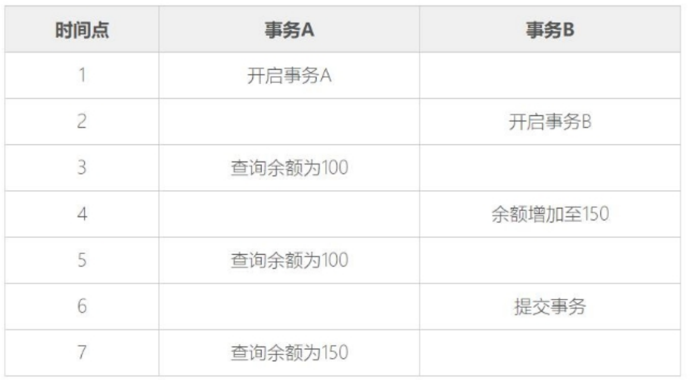
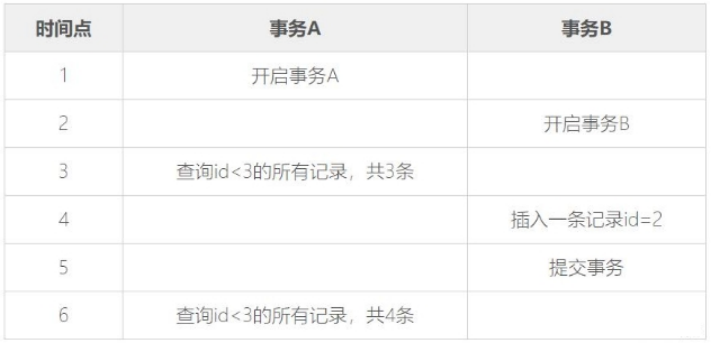

### SQL语言的五个部分

#### DQL

数据查询语言（Data Query Language，DQL），DQL主要用于数据的查询，其基本结构是使用SELECT子句，FROM子句和WHERE子句的组合来查询一条或多条数据。 

#### DML

数据操作语言（Data Manipulation Language，DML），DML主要用于对数据库中的数据进行增加、修改和删除的操作，其主要包括： 

- INSERT：增加数据
- UPDATE：修改数据 
- DELETE：删除数据 

#### DDL

数据定义语言（Data Definition Language，DDL），DDL主要用针对是数据库对象（数据库、表、索引、视图、触发器、存储过程、函数）进行创建、修改和删除操作。其主要包括： 

- CREATE：创建数据库对象
- ALTER：修改数据库对象
- DROP：删除数据库对象

#### DCL

数据控制语言（Data Control Language，DCL），DCL用来授予或回收访问 数据库的权限，其主要包括：

- GRANT：授予用户某种权限
- REVOKE：回收授予的某种权限 

#### TCL

事务控制语言（Transaction Control Language，TCL），TCL用于数据库的事务管理。其主要包括： 

- START TRANSACTION：开启事务 
- COMMIT：提交事务 
- ROLLBACK：回滚事务 
- SET TRANSACTION：设置事务的属性 

### 配置MySQL

设置密码永不过期

```mysql
alert user 'root'@'localhost' identified by 'root' password exipre never;
```

设置加密规则为mysql_native_password

```mysql
alert user 'root'@'localhost' identified with mysql_native_password by 'root';
```

### 数据库表列类型

#### 整数类型

| 类型名称      | 说明           | 存储需求 | 表数范围（有符号）                          |                           |
| ------------- | -------------- | -------- | ------------------------------------------- | ------------------------- |
| TINYINT       | 很小的整数     | 1个字节  | (-128, 127)                                 | (0, 255)                  |
| SMALLINT      | 小的整数       | 2个宇节  | (-32768, 32767)                             | (0, 65535)                |
| MEDIUMINT     | 中等大小的整数 | 3个字节  | (-8388608, 8388607)                         | (0, 16777215)             |
| INT (INTEGHR) | 普通大小的整数 | 4个字节  | (-2147483648, 2147483647)                   | (0, 4294967295)           |
| BIGINT        | 大整数         | 8个字节  | (-9223372036854775808, 9223372036854775807) | (0, 18446744073709551615) |

MySQL支持选择在该类型关键字后面的括号内指定整数值的显示宽度(例如，INT(4))。显示宽度并不限制可以在列内保存的值的范围，也不限制超过列的指定宽度的值的显示。即如果插入了大于显示宽度的值，只要该值不超过该类型整数的取值范围，数值依然可以插入，而且能够显示出来。

#### 浮点数类型

| 类型名称            | 说明               | 存储需求   |
| ------------------- | ------------------ | ---------- |
| FLOAT               | 单精度浮点数       | 4 个字节   |
| DOUBLE              | 双精度浮点数       | 8 个字节   |
| DECIMAL (M, D)，DEC | 压缩的“严格”定点数 | M+2 个字节 |

浮点类型有两种，分别是单精度浮点数（**FLOAT**）和双精度浮点数（**DOUBLE**）；定点类型只有一种，就是 **DECIMAL**。

浮点类型和定点类型都可以用`(M, D)`来表示，其中`M`称为精度，表示总共的位数；`D`称为标度，表示小数的位数。

浮点数类型的取值范围为 M（1～255）和 D（1～30，且不能大于 M-2），分别表示显示宽度和小数位数。

FLOAT 和 DOUBLE 在不指定精度时，默认会按照实际的精度（由计算机硬件和操作系统决定），DECIMAL 如果不指定精度，默认为（10，0）。

与整数类型不一样的是，浮点数类型的宽度不会自动扩充。不论是定点还是浮点类型，如果用户指定的精度超出精度范围，则会四舍五入进行处理。

在 MySQL 中，定点数以字符串形式存储，在对精度要求比较高的时候（如货币、科学数据），使用 DECIMAL 的类型比较好。另外两个浮点数进行减法和比较运算时也容易出问题，所以在使用浮点数时需要注意，并尽量避免做浮点数比较。

#### 字符串类型

| 类型名称       | 说明                                         | 存储需求                                                   |
| -------------- | -------------------------------------------- | ---------------------------------------------------------- |
| CHAR(M)        | 固定长度非二进制字符串                       | M 字节，1<=M<=255                                          |
| VARCHAR(M)     | 变长非二进制字符串                           | L+1字节，在此，L< = M和 1<=M<=255                          |
| TINYTEXT       | 非常小的非二进制字符串                       | L+1字节，在此，L<2^8                                       |
| TEXT           | 小的非二进制字符串                           | L+2字节，在此，L<2^16                                      |
| MEDIUMTEXT     | 中等大小的非二进制字符串                     | L+3字节，在此，L<2^24                                      |
| LONGTEXT       | 大的非二进制字符串                           | L+4字节，在此，L<2^32                                      |
| ENUM           | 枚举类型，只能有一个枚举字符串值             | 1或2个字节，取决于枚举值的数目 (最大值为65535)             |
| SET            | 一个设置，字符串对象可以有零个或 多个SET成员 | 1、2、3、4或8个字节，取决于集合 成员的数量（最多64个成员） |
| BIT(M)         | 位字段类型                                   | 大约 (M+7)/8 字节                                          |
| BINARY(M)      | 固定长度二进制字符串                         | M 字节                                                     |
| VARBINARY (M)  | 可变长度二进制字符串                         | M+1 字节                                                   |
| TINYBLOB (M)   | 非常小的BLOB                                 | L+1 字节，在此，L<2^8                                      |
| BLOB (M)       | 小 BLOB                                      | L+2 字节，在此，L<2^16                                     |
| MEDIUMBLOB (M) | 中等大小的BLOB                               | L+3 字节，在此，L<2^24                                     |
| LONGBLOB (M)   | 非常大的BLOB                                 | L+4 字节，在此，L<2^32                                     |

括号中的`M`表示可以为其指定长度(其代表的是字符个数)，`L`表示数据的实际长度，表第三列中的`L+1`等表示实际的存储长度，实际的存储需要字符串的长度 `L`加上一个字节以记录字符串的长度。

##### CHAR 和 VARCHAR 类型

CHAR(M) 为固定长度字符串，在定义时指定字符串列长。当保存时，在右侧填充空格以达到指定的长度。

VARCHAR(M) 是长度可变的字符串，最大实际长度由最长的行的大小和使用的字符集确定，而实际占用的空间为字符串的实际长度加 1。

下面将不同的字符串保存到 CHAR(4) 和 VARCHAR(4) 列，说明 CHAR 和 VARCHAR 之间的差别，如下表所示。

| 插入值   | CHAR(4) | 存储需求 | VARCHAR(4) | 存储需求 |
| -------- | ------- | -------- | ---------- | -------- |
| ' '      | '  '    | 4字节    | ''         | 1字节    |
| 'ab'     | 'ab '   | 4字节    | 'ab'       | 3字节    |
| 'abc'    | 'abc '  | 4字节    | 'abc'      | 4字节    |
| 'abcd'   | 'abcd'  | 4字节    | 'abcd'     | 5字节    |
| 'abcdef' | 'abcd'  | 4字节    | 'abcd'     | 5字节    |

##### TEXT 类型

TEXT列保存非二进制字符串，如文章内容、评论等。当保存或查询 TEXT 列的值时，不删除尾部空格。

##### ENUM 类型

ENUM 是一个字符串对象，值为表创建时列规定中枚举的一列值。其语法格式如下：

```mysql
<字段名> ENUM( '值1', '值1', …, '值n' )
```

ENUM 类型的字段在取值时，能在指定的枚举列表中获取，而且一次只能取一个。如果创建的成员中有空格，尾部的空格将自动被删除。

ENUM 值在内部用整数表示，每个枚举值均有一个索引值；列表值所允许的成员值从 1 开始编号，MySQL 存储的就是这个索引编号，枚举最多可以有 65535 个元素。

例如，定义 ENUM 类型的列（'first'，'second'，'third'），该列可以取的值和每个值的索引如下表所示。

| 值     | 索引 |
| ------ | ---- |
| NULL   | NULL |
| ''     | 0    |
| ’first | 1    |
| second | 2    |
| third  | 3    |

ENUM 值依照列索引顺序排列，并且空字符串排在非空字符串前，NULL 值排在其他所有枚举值前。

> 提示：ENUM 列总有一个默认值。如果将 ENUM 列声明为 NULL，NULL 值则为该列的一个有效值，并且默认值为 NULL。如果 ENUM 列被声明为 NOT NULL，其默认值为允许的值列表的第 1 个元素。

##### SET 类型

SET 是一个字符串的对象，可以有零或多个值，SET 列最多可以有 64 个成员，值为表创建时规定的一列值。指定包括多个 SET 成员的 SET 列值时，各成员之间用逗号`,`隔开，语法格式如下：

```mysql
SET( '值1', '值2', …, '值n' )
```

与 ENUM 类型相同，SET 值在内部用整数表示，列表中每个值都有一个索引编号。当创建表时，SET 成员值的尾部空格将自动删除。

但与 ENUM 类型不同的是，ENUM 类型的字段只能从定义的列值中选择一个值插入，而 SET 类型的列可从定义的列值中选择多个字符的联合。

> 提示：如果插入 SET 字段中的列值有重复，则 MySQL 自动删除重复的值；插入 SET 字段的值的顺序并不重要，MySQL 会在存入数据库时，按照定义的顺序显示；如果插入了不正确的值，默认情况下，MySQL 将忽视这些值，给出警告。

##### BIT 类型

位字段类型。M 表示每个值的位数，范围为 1～64。如果 M 被省略，默认值为 1。如果为 BIT(M) 列分配的值的长度小于 M 位，在值的左边用 0 填充。例如，为 BIT(6) 列分配一个值 b'101'，其效果与分配 b'000101' 相同。

BIT 数据类型用来保存位字段值，例如以二进制的形式保存数据 13，13 的二进制形式为 1101，在这里需要位数至少为 4 位的 BIT 类型，即可以定义列类型为 BIT(4)。大于二进制 1111 的数据是不能插入 BIT(4) 类型的字段中的。

##### BINARY 和 VARBINARY 类型

BINARY 和 VARBINARY 类型类似于 CHAR 和 VARCHAR，不同的是它们包含二进制字节字符串。

BINARY 类型的长度是固定的，指定长度后，不足最大长度的，将在它们右边填充 “\0” 补齐，以达到指定长度。例如，指定列数据类型为 BINARY(3)，当插入 a 时，存储的内容实际为 “\a0\0”，当插入 ab 时，实际存储的内容为“ab\0”，无论存储的内容是否达到指定的长度，存储空间均为指定的值 M。

VARBINARY 类型的长度是可变的，指定好长度之后，长度可以在 0 到最大值之间。例如，指定列数据类型为 VARBINARY(20)，如果插入的值长度只有 10，则实际存储空间为 10 加 1，实际占用的空间为字符串的实际长度加 1。

##### BLOB 类型

BLOB 是一个二进制的对象，用来存储可变数量的数据。

#### 日期和时间类型

| 类型名称  | 日期格式            | 日期范围                                          | 存储需求 |
| --------- | ------------------- | ------------------------------------------------- | -------- |
| YEAR      | YYYY                | 1901 ~ 2155                                       | 1 个字节 |
| TIME      | HH:MM:SS            | -838:59:59 ~ 838:59:59                            | 3 个字节 |
| DATE      | YYYY-MM-DD          | 1000-01-01 ~ 9999-12-3                            | 3 个字节 |
| DATETIME  | YYYY-MM-DD HH:MM:SS | 1000-01-01 00:00:00 ~ 9999-12-31 23:59:59         | 8 个字节 |
| TIMESTAMP | YYYY-MM-DD HH:MM:SS | 1980-01-01 00:00:01 UTC ~ 2040-01-19 03:14:07 UTC | 4 个字节 |

DATE 类型用于仅需要日期值时，没有时间部分，可以使用 CURRENT_DATE 或者 NOW()，插入当前系统日期。

如果我们对TIMESTAMP类型的字段没有明确赋值，或是被赋与了NULL值，MySQL会自动将该字段赋值为系统当前的日期与时间。

TIMESTEMP类型还可以使用CURRENT_TIMESTAMP来获取系统当前时间。 

TIMESTAMP 与 DATETIME 除了存储字节和支持的范围不同外，还有一个最大的区别是：

- DATETIME 在存储日期数据时，按实际输入的格式存储，即输入什么就存储什么，与时区无关；
- 而 TIMESTAMP 值的存储是以 UTC（世界标准时间）格式保存的，存储时对当前时区进行转换，检索时再转换回当前时区。即查询时，根据当前时区的不同，显示的时间值是不同的。

### DDL、DML

#### 创建数据表

```mysql
/*
建立一张用来存储学生信息的表
字段包含学号、姓名、性别，年龄、入学日期、班级，email等信息
*/
-- 创建数据库表：
create table t_student(
        sno int(6),
        sname varchar(5),
        sex char(1),
        age int(3),
        enterdate date,
        classname varchar(10),
        email varchar(15)
);
-- 查看表的结构：展示表的字段详细信息
desc t_student;

-- 查看表中数据：
select * from t_student;

-- 查看建表语句：
show create table t_student;
/*
CREATE TABLE `t_student` (
  `sno` int DEFAULT NULL,
  `sname` varchar(5) DEFAULT NULL,
  `sex` char(1) DEFAULT NULL,
  `age` int DEFAULT NULL,
  `enterdate` date DEFAULT NULL,
  `classname` varchar(10) DEFAULT NULL,
  `email` varchar(15) DEFAULT NULL
) ENGINE=InnoDB DEFAULT CHARSET=utf8mb4 COLLATE=utf8mb4_0900_ai_ci
*/


-- 快速添加一张表：结构和数据跟t_student 都是一致的
create table t_student2
as
select * from t_student;

-- 快速添加一张表，结构跟t_student一致，数据没有：
create table t_student3
as
select * from t_student where 1=2; -- 这里相当于给了一个永远为false的条件导致没有数据命中

-- 快速添加一张表，结构跟t_student一致，只要部分列，部分数据：
create table t_student4
as
select sno,sname,age from t_student where sno = 2;
```

#### 插入数据

```mysql
-- 在t_student数据库表中插入数据：
insert into t_student values (1,'张三','男',18,'2022-5-8','软件1班','123@126.com');
insert into t_student values (10010010,'张三','男',18,'2022-5-8','软件1班','123@126.com'); -- 可以超出int(6)的范围
insert into t_student values (2,'张三','男',18,'2022.5.8','软件1班','123@126.com');
insert into t_student values (7,"张三",'男',18,now(),'软件1班','123@126.com');
#如果不是全字段插入数据的话，需要加入字段名
insert into t_student (sno,sname,enterdate) values (10,'李四','2023-7-5');
```

#### 修改、删除数据

```mysql
-- 修改表中数据
update t_student set sex = '女' ;
update t_student set sex = '男' where sno = 10 ;
UPDATE T_STUDENT SET AGE = 21 WHERE SNO = 10;
update t_student set CLASSNAME = 'java01' where sno = 10 ;
update t_student set CLASSNAME = 'JAVA01' where sno = 9 ;
update t_student set age = 29 where classname = 'java01';

-- 删除操作：
delete from t_student where sno = 2;

-- 清空表数据
delete from t_student;
truncate table t_student;
```

> delete和truncate的区别： 
>
> 从最终的结果来看，虽然使用TRUNCATE操作和使用DELETE操作都可以删除表中的全部记录，但是两者还是有很多区别的，其区别主要体现在以下几个方面： 
>
> - DELETE为数据操作语言DML；TRUNCATE为数据定义语言DDL。 
> - DELETE操作是将表中所有记录一条一条删除直到删除完；TRUNCATE操作则是保留了表的结构，重新创建了这个表，所有的状态都相当于新表。因此，TRUNCATE操作的效率更高。 
> - DELETE操作可以回滚；TRUNCATE操作会导致隐式提交，因此不能回滚（在第十章中会讲解事务的提交和回滚）。 
> - DELETE操作执行成功后会返回已删除的行数（如删除4行记录，则会显示“Affected rows：4”）；截断操作不会返回已删除的行量，结果通常是“Affected rows：0”。DELETE操作删除表中记录后，再次向表中添加新记录时，对于设置有自增约束字段的值会从删除前表中该字段的最大值加1开始自增；TRUNCATE操作则会重新从1开始自增。

#### 修改、删除数据库表

```mysql
-- 修改表的结构：
-- 增加一列：
alter table t_student add score double(5,2) ; -- 5:总位数  2：小数位数 
update t_student set score = 123.5678 where sno = 1 ;

-- 增加一列（放在最前面）
alter table t_student add score double(5,2) first;

-- 增加一列（放在sex列的后面）
alter table t_student add score double(5,2) after sex;

-- 删除一列：
alter table t_student drop score;

-- 修改一列：
alter table t_student modify score float(4,1); -- modify修改是列的类型的定义，但是不会改变列的名字
alter table t_student change score score1 double(5,1); -- change修改列名和列的类型的定义

-- 删除表：
drop table t_student;
```

#### 注意事项

- 关键字，表名，字段名不区分大小写 

- 默认情况下，内容不区分大小写 
- 字符串不区分单引号和双引号 
- 如果不是全字段插入数据的话，需要加入字段名

- 删除操作from关键字不可缺少 

- 修改，删除数据别忘记加限制条件 

### 完整性约束

| 约束条件       | 约束描述                                     |
| -------------- | -------------------------------------------- |
| PRIMARY KEY    | 主键约束，约束字段的值可唯一地标识对应的记录 |
| NOT NULL       | 非空约束                                     |
| UNIQUE         | 唯一约束，约束字段的值是唯一的               |
| CHECK          | 检查约束，限制某个字段的取值范围             |
| DEFULT         | 默认值约束，约束字段的默认值                 |
| AUTO_INCREMENT | 自增约束，约束字段的值自动递增               |
| FOREIGN KEY    | 外键约束，约束表与表之间的关系               |

#### 非外键约束

```mysql
/*
建立一张用来存储学生信息的表
字段包含学号、姓名、性别，年龄、入学日期、班级，email等信息

约束：
建立一张用来存储学生信息的表
字段包含学号、姓名、性别，年龄、入学日期、班级，email等信息
【1】学号是主键 = 不能为空 +  唯一 ，主键的作用：可以通过主键查到唯一的一条记录【2】如果主键是整数类型，那么需要自增
【3】姓名不能为空
【4】Email唯一
【5】性别默认值是男
【6】性别只能是男女
【7】年龄只能在18-50之间
*/
-- 使用列级约束创建数据库表：
create table t_student(
        sno int(6) primary key auto_increment, 
        sname varchar(5) not null, 
        sex char(1) default '男' check(sex='男' || sex='女'),
        age int(3) check(age>=18 and age<=50),
        enterdate date,
        classname varchar(10),
        email varchar(15) unique
);

-- 使用表级约束创建数据库表：
create table t_student(
        sno int(6) auto_increment, 
        sname varchar(5) not null, 
        sex char(1) default '男',
        age int(3),
        enterdate date,
        classname varchar(10),
        email varchar(15),
        constraint pk_stu primary key (sno),  -- pk_stu 主键约束的名字
        constraint ck_stu_sex check (sex = '男' || sex = '女'),
        constraint ck_stu_age check (age >= 18 and age <= 50),
        constraint uq_stu_email unique (email)
);

-- 在创建表以后添加约束：
alter table t_student add constraint pk_stu primary key (sno) ; -- 主键约束
alter table t_student modify sno int(6) auto_increment; -- 修改自增条件
alter table t_student add constraint ck_stu_sex check (sex = '男' || sex = '女');
alter table t_student add constraint ck_stu_age check (age >= 18 and age <= 50);
alter table t_student add constraint uq_stu_email unique (email);
```

#### 外键约束

```mysql
-- 外键约束
create table t_class(
        cno int(4) primary key auto_increment,
        cname varchar(10) not null,
        room char(4)
)

create table t_student(
        sno int(6) primary key auto_increment, 
        sname varchar(5) not null, 
        classno int(4)
        constraint fk_stu_classno foreign key (classno) references t_class (cno) -- 为classno字段添加外键约束，主表为t_class
);

-- 在创建表以后添加外键约束：
alter table t_student add constraint fk_stu_classno foreign key (classno) references t_class (cno)

-- 注意：外键约束只有表级约束，没有列级约束。
```

##### 外键策略

主表被依赖的情况下，对主表进行更改删除操作会受外键约束。

```mysql
/* 
	现在需要在t_class中删除cno = 2的数据，但t_class中还存在classno = 2的数据。
*/

-- 策略1：no action ，默认情况下是不允许操作的
-- 通过操作sql来完成，先把班级2的学生对应的班级 改为null 
update t_student set classno = null where classno = 2;
-- 然后再删除班级2：
delete from t_class where cno = 2;

-- 策略2：cascade 级联操作：操作主表的时候影响从表的外键信息：
-- 先删除之前的外键约束：
alter table t_student drop foreign key fk_stu_classno;
-- 重新添加外键约束并添加级联操作：在主表更新和删除的同时，对从表中关联的数据进行更新或删除
alter table t_student add constraint fk_stu_classno foreign key (classno) references t_class (cno) on update cascade on delete cascade;

-- 策略3：set null  置空操作：
-- 先删除之前的外键约束：
alter table t_student drop foreign key fk_stu_classno;
-- 重新添加外键约束，并在主表更新和删除的同时，对从表的关联数据进行置空
alter table t_student add constraint fk_stu_classno foreign key (classno) references t_class (cno) on update set null on delete set null;

-- 级联操作和置空可以混合使用
alter table t_student add constraint fk_stu_classno foreign key (classno) references t_class (cno) on update cascade on delete set null ;
```

### DQL

```mysql
-- 对emp表查询：
select * from emp; -- *代表所有数据
-- 显示部分列：
select empno,ename,sal from emp;
-- 显示部分行：where子句
select * from emp where sal > 2000;
-- 显示部分列，部分行：
select empno,ename,job,mgr from emp where sal > 2000;

-- 起别名：
select empno 员工编号,ename 姓名,sal 工资 from emp; -- as 省略，''或者""省略了
-- as alias 别名
select empno as 员工编号,ename as 姓名,sal as 工资 from emp;
select empno as '员工编号',ename as "姓名",sal as 工资 from emp;

-- 算术运算符：
select empno,ename,sal,sal+1000 as '涨薪后',deptno from emp where sal < 2500;

-- 去重操作：
select distinct job from emp;
select distinct job,deptno from emp; -- 对后面的所有列组合 去重 ，而不是单独的某一列去重

-- 排序：
select * from emp order by sal; -- 默认情况下是按照升序排列的
select * from emp order by sal asc; -- asc 升序，可以默认不写
select * from emp order by sal desc; -- desc 降序
select * from emp order by sal asc ,deptno desc; -- 在工资升序的情况下，deptno按照降序排列
```

```mysql
-- where子句：将过滤条件放在where子句的后面，可以筛选/过滤出我们想要的符合条件的数据：
-- where 子句 + 关系运算符
select * from emp where deptno = 10;
select * from emp where deptno > 10;
select * from emp where deptno >= 10;
select * from emp where deptno < 10;
select * from emp where deptno <= 10;
select * from emp where deptno <> 10;
select * from emp where deptno != 10;
select * from emp where job = 'CLERK'; 
select * from emp where job = 'clerk'; -- 默认情况下字符串不区分大小写 
select * from emp where binary job = 'clerk'; -- 如果需要区分大小写使用binary关键字
select * from emp where hiredate < '1981-12-25';

-- where 子句 + 逻辑运算符：and 
select * from emp where sal > 1500 and sal < 3000;  -- (1500,3000)
select * from emp where sal > 1500 && sal < 3000; 
select * from emp where sal > 1500 and sal < 3000 order by sal;
select * from emp where sal between 1500 and 3000; -- [1500,3000]

-- where 子句 + 逻辑运算符：or
select * from emp where deptno = 10 or deptno = 20;
select * from emp where deptno = 10 || deptno = 20;
select * from emp where deptno in (10,20);
select * from emp where job in ('MANAGER','CLERK','ANALYST');

-- where子句 + 模糊查询：
-- 查询名字中带A的员工  
-- %代表任意多个字符 0,1,2，.....
select * from emp where ename like '%A%' ;
-- -代表任意一个字符
select * from emp where ename like '__A%' ;

-- 关于null的判断：
select * from emp where comm is null;
select * from emp where comm is not null;

-- 小括号的使用  ：因为不同的运算符的优先级别不同，加括号为了可读性
select * from emp where job = 'SALESMAN' or job = 'CLERK' and sal >=1500; -- 先and再or  and > or
select * from emp where job = 'SALESMAN' or (job = 'CLERK' and sal >=1500); 
select * from emp where (job = 'SALESMAN' or job = 'CLERK') and sal >=1500;
```

#### 分组

```mysql
-- 统计各个部门的平均工资 
# select deptno,avg(sal) from emp; -- 字段和多行函数不可以同时使用
select deptno,avg(sal) from emp group by deptno; -- 字段和多行函数不可以同时使用,除非这个字段属于分组

-- 统计各个部门的平均工资 ,只显示平均工资2000以上的：分组以后进行二次筛选 having
select deptno,avg(sal) from emp group by deptno having avg(sal) > 2000;

-- 统计各个岗位的平均工资,除了MANAGER
-- 方法1：
select job,avg(sal) from emp where job != 'MANAGER' group by job;
-- 方法2：
select job,avg(sal) from emp group by job having job != 'MANAGER' ;
-- where在分组前进行过滤的，having在分组后进行后滤。
```

#### 单表查询总结

```mysql
/**
select语句总结:
select column, group_function(column)  
from table 
[where condition] 
[group by group_by_expression] 
[having group_condition] 
[order by column];

select语句的执行顺序:
from -- where -- group by – select - having - order by 
**/
```

### 函数

封装了特定的一些功能，不会改变数据自身的值，而是在真实数据的上面进行加工处理，展示新的结果。

常用函数参考：http://c.biancheng.net/mysql/function/

#### 单行函数

单行函数是指对每一条记录输入值进行计算，并得到相应的计算结果，然后返回给用户，也就是说，每条记录作为一个输入参数，经过函数计算得到每条记录的计算结果。 

常用的单行函数主要包括字符串函数、数值函数、日期与时间函数、流程函数以及其他函数。

> 注意：多行函数会自动忽略null值。

#### 多行函数

多行函数是指对一组数据进行运算，针对这一组数据（多行记录）只返回一个结果，也称为分组函数。

多行函数有：max、min、count、sum、avg

除了多行函数（max,min,count,sum,avg），都是单行函数。 

### 多表查询

#### 交叉连接

```mysql
select * from emp cross join dept; -- 两个表查询结果的笛卡尔乘积,没有实际意义
select * from emp join dept; -- cross 可以省略不写，mysql中可以，oracle中不可以
```

```mysql
-- 92语法
select e.empno,e.ename,e.sal,e.deptno,d.dname from emp e,dept d
```

#### 自然连接

```mysql
-- 优点：自动匹配所有的同名列,同名列只展示一次,简单
select * from emp natural join dept; -- 缺点：查询字段的时候，没有指定字段所属的数据库表，效率低

-- 解决方法：指定表名：
select emp.empno,emp.ename,emp.sal,dept.dname,dept.loc,dept.deptno from emp natural join dept;

-- 缺点：表名太长
-- 解决方法：表起别名
select e.empno,e.ename,e.sal,d.dname,d.loc,d.deptno from emp e natural join dept d;

-- natural join 缺点：自动匹配表中所有的同名列，但是有时候我们希望只匹配部分同名列
-- 解决方法：内连接
```

#### 内连接

```mysql
select * from emp e inner join dept d using(deptno);
select * from emp e join dept d using(deptno); -- inner 可省略

-- using缺点：关联的字段，必须是同名的
-- 解决方法：内连接 - on子句：
select * from emp e inner join dept d on (e.deptno = d.deptno);
```

```mysql
-- 92语法
select e.empno,e.ename,e.sal,e.deptno,d.dname from emp e,dept d where e.deptno = d.deptno;

-- 92语法总结：
-- 92语法中表的连接条件和筛选条件是放在一起的，没有分开
-- 99语法中提供了更多的表连接类型：cross,natural,inner,outer
-- 92语法只支持内连接，不支持外连接
```

#### 外连接

内连接中，只显示两表中的交集数据。而外连接除了显示匹配的数据外，还可以显示不匹配的数据。

```mysql
-- 左外连接： left outer join   -- 左面的那个表的信息，即使不匹配也可以查看出效果
select * from emp e left outer join dept d on e.deptno = d.deptno;

-- 右外连接： right outer join   -- 右面的那个表的信息，即使不匹配也可以查看出效果
select * from emp e right outer join dept d on e.deptno = d.deptno;

-- 全外连接  full outer join
-- 这个语法在mysql中不支持，在oracle中支持 -- 可以展示左，右表都不匹配的数据 
select * from emp e full outer join dept d on e.deptno = d.deptno;

-- 解决mysql中不支持全外连接的问题：
select * from emp e left outer join dept d on e.deptno = d.deptno
union -- 并集 去重 效率低
select * from emp e right outer join dept d on e.deptno = d.deptno;

select * from emp e left outer join dept d on e.deptno = d.deptno
union all-- 并集 不去重 效率高
select * from emp e right outer join dept d on e.deptno = d.deptno;
```

#### 两张表以上的联合查询

```mysql
select e.ename,e.sal,e.empno,e.deptno,d.dname,s.* from emp e right outer join dept d on e.deptno = d.deptno -- 把前面两张表的查询结果当作一张表
inner join salgrade s 
on e.sal between s.losal and s.hisal -- 写好第三张表的查询条件
```

```mysql
-- 92语法
select e.empno,e.ename,e.sal,e.deptno,d.dname,s.grade from emp e,dept d,salgrade s where e.deptno = d.deptno and e.sal >= s.losal and e.sal <= s.hisal;
```

#### 自连接查询

```mysql
-- 查询员工的编号、姓名、上级编号,上级的姓名 -- 员工的领导也是员工，也在员工表
select e1.empno 员工编号,e1.ename 员工姓名,e1.mgr 领导编号,e2.ename 领导姓名
from emp e1
inner join emp e2
on e1.mgr = e2.empno;

-- 左外连接 boss没有上级领导，也在员工表，也需要显示：
select e1.empno 员工编号,e1.ename 员工姓名,e1.mgr 领导编号,e2.ename 领导姓名
from emp e1
left outer join emp e2
on e1.mgr = e2.empno;
```

```mysql
-- 92语法
select e1.ename,e1.job,e1.mgr ,e2.ename from emp e1,emp e2 where e1.mgr = e2.empno;
```

### 子查询

#### 不相关子查询

##### 单行子查询

```mysql
-- 查询语句中使用了另一个查询语句的结果，被嵌入的查询语句为子查询语句
-- 子查询语句与父语句都可以独立运行，称为不相关子查询
-- 子查询语句的结果只有一条数据，称为单行子查询
select ename,sal from emp where sal > (select avg(sal) from emp); -- 查询工资高于平均工资的雇员名字和工资

select ename,sal from emp where deptno = (select deptno from emp where ename = 'CLARK') and sal < (select sal from emp where ename = 'CLARK') -- 查询和CLARK同一部门且比他工资低的雇员名字和工资
```

##### 多行子查询

```mysql
-- 多行子查询指子查询语句的结果是多条
-- 查询部门20中职务同部门10的雇员一样的雇员信息
/**
-- 先拆分各个条件
-- 查询部门20中的雇员信息
select * from emp where deptno = 20;-- CLERK,MANAGER,ANALYST
-- 部门10的雇员的职务：
select job from emp where deptno = 10; -- MANAGER,PRESIDENT,CLERK
-- 再组合条件得到如下
**/
select * from emp where deptno = 20 and job in (select job from emp where deptno = 10)
-- 或者
select * from emp where deptno = 20 and job = any(select job from emp where deptno = 10)

-- 查询工资比所有的“SALESMAN”都高的雇员的编号、名字和工资。
-- 多行子查询：
select empno,ename,sal from emp where sal > all(select sal from emp where job = 'SALESMAN');
-- 单行子查询：
select empno,ename,sal from emp where sal > (select max(sal) from emp where job = 'SALESMAN');

-- 查询工资低于任意一个“CLERK”的工资的雇员信息
select * from emp where sal < any(select sal from emp where job = 'CLERK') and job != 'CLERK'
-- 单行子查询：
select * from emp where sal < (select max(sal) from emp where job = 'CLERK') and job != 'CLERK' -- 低于任意一个，低于最大的就满足条件
```

#### 相关子查询

不相关的子查询：子查询可以独立运行，先运行子查询，再运行外查询。 

相关子查询：子查询不可以独立运行，并且先运行外查询，再运行子查询 

```mysql
-- 查询本部门最高工资的员工
-- 方法1：通过不相关子查询实现：
select * from emp where deptno = 10 and sal = (select max(sal) from emp where deptno = 10)
union
select * from emp where deptno = 20 and sal = (select max(sal) from emp where deptno = 20)
union
select * from emp where deptno = 30 and sal = (select max(sal) from emp where deptno = 30)
-- 缺点：语句比较多，具体到底有多少个部分未知
-- 方法2： 相关子查询
select * from emp e where sal = (select max(sal) from emp where deptno = e.deptno) order by deptno

-- 【3】查询工资高于其所在岗位的平均工资的那些员工
-- 不相关子查询：
select * from emp where job = 'CLERK' and sal > (select avg(sal) from emp where job = 'CLERK')
union ......
-- 相关子查询：
select * from emp e where sal > (select avg(sal) from emp e2 where e2.job = e.job)
```

### 事务

事务（Transaction）指的是一个操作序列，该操作序列中的多个操作要么都做，要么都不做，是一个不可分割的工作单位，是数据库环境中的逻辑工作单位，由DBMS（数据库管理系统）中的事务管理子系统负责事务的处理。 

事务（Transaction）是用来维护数据库完整性的，它能够保证一系列的MySQL操作要么全部执行，要么全不执行。

目前常用的存储引擎有InnoDB（MySQL5.5以后默认的存储引擎）和MyISAM（MySQL5.5之前默认的存储引擎），其中InnoDB支持事务处理机制，而MyISAM不支持。

默认一个DML语句是一个事务。

#### 事务的特性

事务处理可以确保除非事务性序列内的所有操作都成功完成，否则不会永久更新面向数据的资源。通过将一组相关操作组合为一个要么全部成功要么全部失败的序列，可以简化错误恢复并使应用程序更加可靠。 

但并不是所有的操作序列都可以称为事务，这是因为一个操作序列要成为事务，必须满足事务的原子性（Atomicity）、一致性（Consistency）、隔离性（Isolation）和持久性（Durability）。这四个特性简称为ACID特性。 

**原子性**

事务中的所有操作可以看做一个原子，事务是应用中不可再分的最小的逻辑执行体。 

使用事务对数据进行修改的操作序列，要么全部执行，要么全不执行。通常，某个事务中的操作都具有共同的目标，并且是相互依赖的。如果数据库系统只执行这些操作中的一部分，则可能会破坏事务的总体目标，而原子性消除了系统只处理部分操作的可能性。 

**一致性**

一致性是指事务执行的结果必须使数据库从一个一致性状态，变到另一个一致性状态。当数据库中只包含事务成功提交的结果时，数据库处于一致性状态。一致性是通过原子性来保证的。 

**隔离性**

隔离性是指各个事务的执行互不干扰，任意一个事务的内部操作对其他并发的事务，都是隔离的。也就是说：并发执行的事务之间既不能看到对方的中间状态，也不能相互影响。

**持久性**

持久性指事务一旦提交，对数据所做的任何改变，都要记录到永久存储器中，通常是保存进物理数据库，即使数据库出现故障，提交的数据也应该能够恢复。但如果是由于外部原因导致的数据库故障，如硬盘被损坏，那么之前提交的数据则有可能会丢失。 

```mysql
-- 手动开启事务：
start transaction;

update account set balance = balance - 200 where id = 1;
update account set balance = balance + 200 where id = 2;

-- 手动回滚：刚才执行的操作全部取消：
rollback;

-- 手动提交：
commit;

-- 在回滚和提交之前，数据库中的数据都是操作的缓存中的数据，而不是数据库的真实数据
```

#### 事务并发问题

**脏读（Dirty read）**

当一个事务正在访问数据并且对数据进行了修改，而这种修改还没有提交到数据库中，这时另外一个事务也访问了这个数据，然后使用了这个数据。因为这个数据是还没有提交的数据，那么另外一个事务读到的这个数据是“脏数据”，依据“脏数据”所做的操作可能是不正确的。 

 

 **不可重复读（Unrepeatableread）** 

指在一个事务内多次读同一数据。在这个事务还没有结束时，另一个事务也访问该数据。那么，在第一个事务中的两次读数据之间，由于第二个事务的修改导致第一个事务两次读取的数据可能不太一样。这就发生了在一个事务内两次读到的数据是不一样的情况，因此称为不可重复读。 

 

**幻读（Phantom read）**

幻读与不可重复读类似。它发生在一个事务（T1）读取了几行数据，接着另一个并发事务（T2）插入了一些数据时。在随后的查询中，第一个事务（T1）就会发现多了一些原本不存在的记录，就好像发生了幻觉一样，所以称为幻读。 

 
**不可重复度和幻读区别：**

不可重复读的重点是修改，幻读的重点在于新增或者删除。 

**解决不可重复读的问题只需锁住满足条件的行，解决幻读需要锁表** 

#### 事务隔离级别

事务的隔离级别用于决定如何控制并发用户读写数据的操作。数据库是允许多用户并发访问的，如果多个用户同时开启事务并对同一数据进行读写操作的话，有可能会出现脏读、不可重复读和幻读问题，所以MySQL中提供了四种隔离级别来解决上述问题。 

事务的隔离级别从低到高依次为READ UNCOMMITTED、READ COMMITTED、REPEATABLE READ以及SERIALIZABLE，隔离级别越低，越能支持高并发的数据库操作。                     

| 隔离级别         | 脏读 | 不可重复读 | 幻读 |
| ---------------- | ---- | ---------- | ---- |
| READ UNCOMMITTED | √    | √          | √    |
| READ COMMITTED   | ×    | √          | √    |
| REPEATABLE READ  | ×    | ×          | √    |
| SERIALIZABLE     | ×    | ×          | ×    |

 PS：√  代表会出现问题 ， ×代表不会出现问题 = 解决问题 

```mysql
-- 查看默认的事务隔离级别  MySQL默认的是repeatable read  
select @@transaction_isolation; 
-- 设置事务的隔离级别（设置当前会话的隔离级别）
set session transaction isolation level read uncommitted;
set session transaction isolation level read committed;
set session transaction isolation level repeatable read;
set session transaction isolation level serializable;
```

### 视图

视图（view）是一个从单张或多张基础数据表或其他视图中构建出来的虚拟表。

同基础表一样，视图中也包含了一系列带有名称的列和行数据，但是数据库中只是存放视图的定义，也就是动态检索数据的查询语句，而并不存放视图中的数据，这些数据依旧存放于构建视图的基础表中，只有当用户使用视图时才去数据库请求相对应的数据，即视图中的数据是在引用视图时动态生成的。因此视图中的数据依赖于构建视图的基础表，如果基本表中的数据发生了变化，视图中相应的数据也会跟着改变。 

视图本质上就是：一个查询语句，是一个虚拟的表，不存在的表，你查看视图，其实就是查看视图对应的sql语句。

视图的作用

- 简化用户操作：视图可以使用户将注意力集中在所关心地数据上，而不需要关心数据表的结构、与其他表的关联条件以及查询条件等。 

- 对机密数据提供安全保护：有了视图，就可以在设计数据库应用系统时，对不同的用户定义不同的视图，避免机密数据（如，敏感字段“salary”）出现在不应该看到这些数据的用户视图上。这样视图就自动提供了对机密数据的安全保护功能 。

```mysql
-- 创建/替换单表视图：
create or replace view myview01
as
select empno,ename,job,deptno 
from emp
where deptno = 20
with check option;

-- 查看视图：
select * from myview01;

-- 在视图中插入数据：
insert into myview01 (empno,ename,job,deptno) values (9999,'lili','CLERK',20);
insert into myview01 (empno,ename,job,deptno) values (8888,'nana','CLERK',30); -- 由于创建视图的时候带了with check option条件，因此插入语句的时候如果不满足视图的查询条件，则会报错 -> 1369 - CHECK OPTION failed 'mytestdb.myview01'

-- 创建/替换多表视图：
create or replace view myview02
as 
select e.empno,e.ename,e.sal,d.deptno,d.dname
from emp e
join dept d
on e.deptno = d.deptno
where sal > 2000 ;

-- 创建统计视图：
create or replace view myview03
as
select e.deptno,d.dname,avg(sal),min(sal),count(1)
from emp e
join dept d
using(deptno)
group by e.deptno ;

-- 创建基于视图的视图：
create or replace view myview04
as
select * from myview03 where deptno = 20;
```

### 存储过程

SQL基本是一个命令实现一个处理，是所谓的非程序语言。 在不能编写流程的情况下，所有的处理只能通过一个个命令来实现。当然，通过使用连接及子查询，即使使用SQL的单一命令也能实现一些高级的处理，但是，其局限性是显而易见的。例如，在SQL中就很难实现针对不同条件进行不同的处理以及循环等功能。 

这个时候就出现了存储过程这个概念，简单地说，存储过程就是数据库中保存(Stored)的一系列SQL命令（Procedure）的集合。也可以将其看作相互之间有关系的SQL命令组织在一起形成的一个小程序。 

存储过程的优点：

- 提高执行性能。存储过程执行效率之所高，在于普通的SQL语句，每次都会对语法分析，编译，执行，而存储过程只是在第一次执行语法分析，编译，执行，以后都是对结果进行调用。 
- 可减轻网络负担。使用存储过程，复杂的数据库操作也可以在数据库服务器中完成。只需要从客户端(或应用程序)传递给数据库必要的参数就行，比起需要多次传递SQL命令本身，这大大减轻了网络负担。
- 可将数据库的处理黑匣子化。应用程序中完全不用考虑存储过程的内部详细处理，只需要知道调用哪个存储过程就可以了。

```mysql
-- 定义一个没有返回值的存储过程，实现：模糊查询操作：
select * from emp where ename like '%A%';

create procedure mypro01(name varchar(10))
begin
	if name is null or name = "" then
		select * from emp;
	else
		select * from emp where ename like concat('%',name,'%');
  end if;	
end;

-- 删除存储过程：
drop procedure mypro01;

-- 调用存储过程：
call mypro01(null);
call mypro01('R');


-- 定义一个有返回值的存储过程，实现：模糊查询操作：
create procedure mypro02(in name varchar(10),out num int(3)) -- in标识，可以省略不写
begin
	if name is null or name = "" then
		select * from emp;
	else
    select * from emp where ename like concat('%',name,'%');
	end if;	
	select found_rows() into num; -- found_rows()mysql中定义的一个函数，作用返回查询结果的条数
end;

-- 调用存储过程：
call mypro02(null,@num);
select @num;

call mypro02('R',@aaa);
select @aaa;
```

