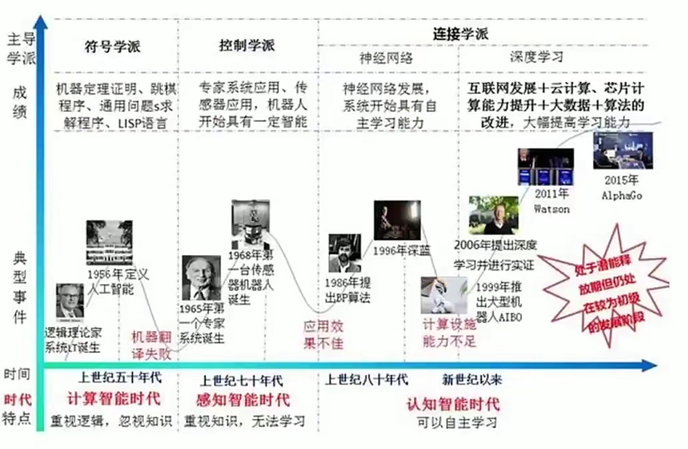

# 人工智能的三个阶段

周期性特征：人工智能发展呈现"人类毁灭论"与"骗子论"交替出现的周期性运动。

历史阶段

- 1950-1960年代：首次出现"人类要毁灭了"的论调
- 1970-1980年代：被质疑为"骗子"
- 1990年代至今：再次经历"人类毁灭论"与质疑的循环

## 符号主义阶段

符号主义阶段的标志性人物是阿兰图灵，他提出了图灵机理论框架。 图灵机是一个概念原型，用于解释计算机和人工智能算法的核心组件。 图灵机的工作原理包括内部状态、输入和输出，以及根据状态和输入进行转换的规则。

### 图灵机

**核心思想**

将世界所有问题转化为由0和1组成的图灵机磁带，通过寻找相应规则来解决问题。

**规则设定**

规则通常由人工设定，是符号主义的核心特征。

**典型应用**

包括机器定理证明、跳棋专家系统、LISP语言等。

**可编程的概念**

可编程概念表明，万事万物都可以用数字和规则进行表示和操作。

图灵机框架用于理解思考过程和世界万物的结构。 

数字的基础是二进制，世界可以表示为多维的零一状态。

**规则驱动**

用逻辑符号和预设规则模拟智能（人工智能1.0版本）

**局限性**

依赖人工设计规则，难以处理复杂现实问题。

**局限性原因**

- 世界具有复杂性和随机性，由多种复杂元素组成。
- 可能情况无限多，无法穷尽所有规则。
- 专家经验输入计算机仍无法解决新情况。

**局限性问题具体表现**

- 1968年机器翻译失败
- 专家系统应用效果不佳
- 处理"似曾相识但不同"情况能力不足

## 连接主义阶段

机器学习阶段使用数据来解决问题，让机器进行学习。 统计模型和算法在机器学习中起到关键作用。

### 统计模型和算法

- 无监督学习算法如PCA（主成分分析）和逻辑回归。
- 决策树和贝叶斯网络等统计模型。
- 这些模型都可以用数据来改变自身的结构，模拟人的思维。

**统计模型的共同点** 

- 数据驱动：使用数据改变自身结构，实现自适应和调整。
- 思维模拟：模拟人类思维方式（如决策树模拟人类优先级思考）。
- 学习能力：算法具备自我学习能力，能通过实际数据优化结构。
- 应用优势：相比符号主义，能更好处理复杂性和随机性问题。