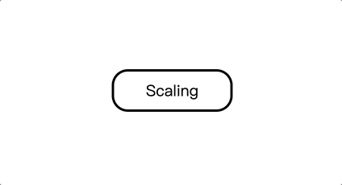

# CSS属性

### accent-color

`accent-color = auto | <color>`

为一些控件设置强调色。

支持标签：

- `<input type="checkbox">`
- `<input type="radio">`
- `<input type="range">`
- `<progress>`

```html
<input type="checkbox" style="accent-color: auto;" checked>
<input type="checkbox" style="accent-color: red;" checked>

<input type="radio" style="accent-color: auto;" checked>
<input type="radio" style="accent-color: red;" checked>

<input type="range" style="accent-color: auto;">
<input type="range" style="accent-color: red;">

<progress style="accent-color: auto;"></progress>
<progress style="accent-color: red;"></progress>
```


参考：https://developer.mozilla.org/en-US/docs/Web/CSS/accent-color

### all

`all = initial | inherit | unset | revert | revert-layer `

- initial：属性初始值。
- inherit：继承父元素属性的值。
- unset：如果属性是可继承的，则值为父元素的属性值，否则值为初始值。
- revert：将属性的级联值从其当前值恢复为如果当前样式原点未对当前元素进行更改，则该属性将具有的值。因此，如果属性从其父级继承，它会将属性重置为继承的值，或者重置为由用户代理的样式表（即浏览器默认样式），或者如果浏览器默认值都没有，则为初始值。

all属性为一个简写属性，功能是将`unicode-bidi`与`direction`属性之外的所有属性重新设置为初始值或者默认值。

```html
<style>
    div {
        background-color: #f0f0f0;
        font-size: small;
        color: blue;
        margin: 20px;
    }
    blockquote {
        background-color: skyblue;
        color: red;
    }
    .initial blockquote {
        all: initial;
        /* 
          属性值为inital的情况下，blockquote变成了display: inline，且background-color、font-size、color均恢复成了初始值：
          background-color: transparent;
          font-size: medium;
          color: black;
        */
    }
    .inherit blockquote {
        all: inherit;
        /* 
          属性值为inherit的情况下，font-size、color属于继承属性，继承了其父元素的属性值：
          font-size: small;
          color: blue;
        */
    }
    .unset blockquote {
        all: unset;
        /* 
          属性值为unset的情况下，由于display为非继承元素，因此display为初始值inline，且font-size、color继承了其父元素的属性值：
          font-size: small;
          color: blue;
        */
    }
    .revert blockquote {
        all: revert;
        /* 
          属性值为revert的情况下，display采用浏览器为blockquote定义的display值，为block。而font-size、color继承了其父元素的属性值：
          font-size: small;
          color: blue;
        */
    }
</style>

<div>
    <blockquote>这是一个块级引用元素，引用了一句诗：日出有影，日落有盼。心有可期，忙而不茫。</blockquote>
    然后这是一句紧接着的苍白的文字。
</div>
<div class="initial">
    <blockquote>这是一个块级引用元素，引用了一句诗：日出有影，日落有盼。心有可期，忙而不茫。</blockquote>
    然后这是一句紧接着的苍白的文字。
</div>
<div class="inherit">
    <blockquote>这是一个块级引用元素，引用了一句诗：日出有影，日落有盼。心有可期，忙而不茫。</blockquote>
    然后这是一句紧接着的苍白的文字。
</div>
<div class="unset">
    <blockquote>这是一个块级引用元素，引用了一句诗：日出有影，日落有盼。心有可期，忙而不茫。</blockquote>
    然后这是一句紧接着的苍白的文字。
</div>
<div class="revert">
    <blockquote>这是一个块级引用元素，引用了一句诗：日出有影，日落有盼。心有可期，忙而不茫。</blockquote>
    然后这是一句紧接着的苍白的文字。
</div>
```


### aspect-ratio

```
aspect-ratio = auto || <ratio>
<ratio> = <number [0,∞]> [ / <number [0,∞]> ]? 
```

为容器规定了一个**期待的纵横比**，这个纵横比可以用来计算自动尺寸以及为其他布局函数服务。

```html
<style>
    body {
        display: flex;
    }
    div {
        width: 100px;
        height: 100px;
        background-color: bisque;
        margin: 20px;
    }
    div:nth-of-type(1) img {
        width: 100%;
    }
    div:nth-of-type(2) img {
        width: 50%;
        aspect-ratio: 0.5;
    }
    div:nth-of-type(3) img {
        width: 100%;
        aspect-ratio: 1;
    }
    div:nth-of-type(4) img {
        width: 100%;
        aspect-ratio: 2;
    }
    div:nth-of-type(5) img {
        width: 100%;
        aspect-ratio: 0.5;
    }
    div div {
        width: 100%;
        height: auto;
        aspect-ratio: 2;
        background-color: blue;
        margin: 0;
    }
</style>

<div></div>
<div></div>
<div></div>
<div></div>
<div></div>
<div><div></div></div>
```


### backdrop-filter

```css
backdrop-filter = none | <filter-value-list>  

<filter-value-list> = [ <filter-function> | <url> ]+  

<filter-function> = <blur()> | <brightness()> | <contrast()> | <drop-shadow()>  | <grayscale()> | <hue-rotate()> | <invert()> | <opacity()> | <sepia()> | <saturate()>     

/* 获取指向 SVG 滤镜的 URI。 */
<url> = url( <string> <url-modifier>* ) | src( <string> <url-modifier>* )  

/* 将高斯模糊应用于输出图片。*/
<blur()> = blur( <length>? )  

/* 将线性乘数应用于输入图像，使其看起来更亮或更暗。 */
<brightness()> = brightness( [ <number> | <percentage> ]? )  

/* 调整输入图像的对比度。 */
<contrast()> = contrast( [ <number> | <percentage> ]? )  

/* 将投影应用于图像，这个函数有点类似于 box-shadow 属性。box-shadow 属性在元素的整个框后面创建一个矩形阴影，而 drop-shadow() 过滤器则是创建一个符合图像本身形状 (alpha 通道) 的阴影。 */
<drop-shadow()> = drop-shadow( [ <color>? && <length>{2,3} ] )  

/* 对图片进行灰度转换。 */
<grayscale()> = grayscale( [ <number> | <percentage> ]? )  

/* 在图像上对非黑白色应用色相旋转。 */
<hue-rotate()> = hue-rotate( [ <angle> | <zero> ]? )  

/* 在图像上应用颜色反转。 */
<invert()> = invert( [ <number> | <percentage> ]? )  

/* 为元素指定不透明度。 */
<opacity()> = opacity( [ <number> | <percentage> ]? )  

/* 将图像转换为深褐色。 */
<sepia()> = sepia( [ <number> | <percentage> ]? )  

/* 转换图像饱和度。 */
<saturate()> = saturate( [ <number> | <percentage> ]? ) 
```

属性可以为一个元素后面区域添加图形效果，它适用于元素*背后*的所有元素，为了看到效果，必须使元素或其背景至少部分透明。

```html
<style>
    body {
        display: flex;
        justify-content: center;
    }
    div {
        display: flex;
        align-items: center;
        justify-content: center;
    }
    .wrap {
        width: 500px;
        height: 280px;
        background: url('http://www.eternitywith.xyz/image/2.jpg');
        background-size: contain;
        margin: 20px;
    }
    .content1 {
        width: 200px;
        height: 100px;
        border-radius: 5px;
        background-color: rgba(255, 255, 255, 0.3);
        backdrop-filter: blur(10px);
    }
    .content2 {
        width: 200px;
        height: 100px;
        border-radius: 5px;
        background-color: rgba(255, 255, 255, 0.3);
        backdrop-filter: hue-rotate(120deg);
    }
</style>

<body>
    <div class="wrap">
        <div class="content1">只有月亮经过。</div>
    </div>
    <div class="wrap">
        <div class="content2">只有月亮经过。</div>
    </div>
</body>
```


### backface-visibility

`backface-visibility = visibile | hidden`

属性指定当元素背面朝向观察者时是否可见，此属性对2D变换没有影响，2D没有透视，但是当变换导致元素在3D空间中旋转时，背面变得可见。

```html
<style>
  .showbf div {
    backface-visibility: visible;
  }
  .hidebf div {
    backface-visibility: hidden;
  }
  .container {
    width: 150px;
    height: 150px;
    margin: 75px 0 0 75px;
    border: none;
  }
  .cube {
    width: 100%;
    height: 100%;
    /* perspective指定了观察者与 z=0 平面的距离，使具有三维位置变换的元素产生透视效果 */
    perspective: 550px;
    /* perspective-origin 指定了观察者的位置，用作 perspective 属性的消失点。 */
    perspective-origin: 150% 150%;
    /* transform-style 设置元素的子元素是位于 3D 空间中(preserve-3d)还是平面中(flat) */
    transform-style: preserve-3d;
  }
  .face {
    display: block;
    position: absolute;
    width: 100px;
    height: 100px;
    border: none;
    line-height: 100px;
    font-size: 60px;
    color: white;
    text-align: center;
  }
  .front {
    background: rgba(0, 0, 0, 0.3);
    transform: translateZ(50px);
  }
  .back {
    background: rgba(0, 255, 0, 1);
    color: black;
    transform: rotateY(180deg) translateZ(50px);
  }
  .right {
    background: rgba(196, 0, 0, 0.7);
    transform: rotateY(90deg) translateZ(50px);
  }
  .left {
    background: rgba(0, 0, 196, 0.7);
    transform: rotateY(-90deg) translateZ(50px);
  }
  .top {
    background: rgba(196, 196, 0, 0.7);
    transform: rotateX(90deg) translateZ(50px);
  }
  .bottom {
    background: rgba(196, 0, 196, 0.7);
    transform: rotateX(-90deg) translateZ(50px);
  }
  th, p, td {
    background-color: #eeeeee;
    margin: 0px;
    padding: 6px;
    text-align: left;
  }
</style>
<body>
  <table>
    <tr>
      <th><code>backface-visibility: visible;</code></th>
      <th><code>backface-visibility: hidden;</code></th>
    </tr>
    <tr>
      <td>
        <div class="container">
          <div class="cube showbf">
            <div class="face front">1</div>
            <div class="face back">2</div>
            <div class="face right">3</div>
            <div class="face left">4</div>
            <div class="face top">5</div>
            <div class="face bottom">6</div>
          </div>
        </div>
        <p>由于所有的面都是部分透明的，所以背面（2、4、5）可以透过前面（1、3、6）看到。</p>
      </td>
      <td>
        <div class="container">
          <div class="cube hidebf">
            <div class="face front">1</div>
            <div class="face back">2</div>
            <div class="face right">3</div>
            <div class="face left">4</div>
            <div class="face top">5</div>
            <div class="face bottom">6</div>
          </div>
        </div>
        <p>后面的三个面（2、4、5）被隐藏了。</p>
      </td>
    </tr>
  </table>
</body>
```


### block-size

`block-size = <'width'>`

属性会根据元素的书写模式来定义元素的水平宽度或者垂直高度。

它会根据`writing-mode`的值来映射width属性或者height属性。如果书写模式是垂直方向，则`block-size`的值就会和元素的宽有关，否则就会和元素的高有关。

一个与`block-size`相关的属性是`inline-size`，`block-size`用于定义某元素在某方向上的长度，而`inline-size`则用于定义元素在另一个方向上的长度。

```html
<style>
    body {
        display: flex;
    }
    p {
        margin: 20px;
        background-color: aqua;
        display: flex;
        align-items: center;
        justify-content: center;
        padding: 0 10px;
    }
    .text1 {
        block-size: 100px;
        writing-mode: horizontal-tb;
    }
    .text2 {
        block-size: 100px;
        writing-mode: vertical-lr;
    }
    .text3 {
        block-size: auto;
        writing-mode: horizontal-tb;
    }
    .text4 {
        block-size: auto;
        writing-mode: vertical-lr;
    }
</style>
<body>
    <p class="text1">春天里的事物都太浅薄，我不要春天，我不要玫瑰。</p>
    <p class="text2">春天里的事物都太浅薄，我不要春天，我不要玫瑰。</p>
    <p class="text3">春天里的事物都太浅薄，我不要春天，我不要玫瑰。</p>
    <p class="text4">春天里的事物都太浅薄，我不要春天，我不要玫瑰。</p>
</body>
```


### caption-side

```css
caption-side: top;
caption-side: bottom;

/* 非标准值，具体按浏览器支持度为准 */
caption-side: left;
caption-side: right;
caption-side: top-outside;
caption-side: bottom-outside;
```

属性会将表格的标题`<caption>`放到规定的位置，但是具体显示的位置与表格的`writing-mode`属性有关。

```html
<style>
  body {
    display: flex;
  }
  table {
    margin: 20px;
  }
  td {
    padding: 5px;
  }
  tr {
    background: #eee;
  }
  caption {
    background: #fc3;
  }
  table:nth-of-type(2) caption {
    caption-side: bottom;
  }
</style>
<body>
  <table>
    <caption>最后一卷胶片</caption>
    <tr>
      <td>这卷胶片再珍贵</td>
      <td>也值得为你浪费</td>
    </tr>
  </table>
  <table>
    <caption>最后一卷胶片</caption>
    <tr>
      <td>这卷胶片再珍贵</td>
      <td>也值得为你浪费</td>
    </tr>
  </table>
</body>
```


### caret-color

`caret-color = auto | <color>`

属性用来定义插入光标的颜色，这里说的插入光标，指的是在网页的可编辑器区域内，用来指示用户的输入具体会插入到哪里的那个一闪一闪的形似竖杠`|`的东西。
>这里说的“插入光标(insertion caret)”只是光标(caret)的一种。比如有些浏览器中有一种光标叫做“导航光标(navigation caret)”，它可以在不可编辑区域内来回移动。此外，当鼠标指针移动到一段`cursor`属性是`auto`的文本上方时，或移动到`cursor`属性是`text`、`vertical-text`的内容上方时，虽然看起来有点像插入光标，但它不是插入光标(caret)，而是鼠标指针光标(cursor)。

```html
<style>
  input {
    caret-color: red;
  }
</style>
<body>
  <input type="text">
</body>
```


### clear

`clear = inline-start | inline-end | block-start | block-end | left | right | top | bottom | none`

属性指定一个元素是否必须移动（清除浮动后）到在它之前的浮动元素下面，适用于浮动和非浮动元素。

当应用于非浮动块时，它将非浮动块的边框边界移动到所有相关浮动元素外边界的下方。这个非浮动块的顶部外边距会折叠。

另一方面，两个浮动元素的垂直外边距不会折叠。当应用于浮动元素时，它将底部元素的外边界边缘移动到所有相关浮动元素外边界边缘的下方。这会影响后面浮动元素的布局，因为后面的浮动元素的位置无法高于它之前的元素。

```html
<style>
  body {
    display: flex;
  }
  .container {
    border: 1px solid #c5c5c5;
    padding: 0.75em;
    text-align: left;
    line-height: normal;
    margin: 10px;
  }
  .floated-left {
    border: solid 10px #ffc129;
    background-color: rgba(255, 244, 219, 0.6);
    padding: 1em;
    float: left;
  }
  .floated-right {
    border: solid 10px #ffc129;
    background-color: rgba(255, 244, 219, 0.6);
    padding: 1em;
    float: right;
    height: 150px;
  }
  .words1 {
    clear: none;
  }
  .words2 {
    clear: left;
  }
  .words3 {
    clear: right;
  }
  .words4 {
    clear: both;
  }
</style>
<div class="container">
  <div class="floated-left">Left</div>
  <div class="floated-right">Right</div>
  <div class="words1">
    “春天里的事物太浅薄，我不要春天，不要玫瑰。不要你眼里的泪光。我只要你。我只要你一个完整的朝夕” ——余秀华《你说抱着我如抱着一朵白云》
  </div>
</div>
<div class="container">
  <div class="floated-left">Left</div>
  <div class="floated-right">Right</div>
  <div class="words2">
    “春天里的事物太浅薄，我不要春天，不要玫瑰。不要你眼里的泪光。我只要你。我只要你一个完整的朝夕” ——余秀华《你说抱着我如抱着一朵白云》
  </div>
</div>
<div class="container">
  <div class="floated-left">Left</div>
  <div class="floated-right">Right</div>
  <div class="words3">
    “春天里的事物太浅薄，我不要春天，不要玫瑰。不要你眼里的泪光。我只要你。我只要你一个完整的朝夕” ——余秀华《你说抱着我如抱着一朵白云》
  </div>
</div>
<div class="container">
  <div class="floated-left">Left</div>
  <div class="floated-right">Right</div>
  <div class="words4">
    “春天里的事物太浅薄，我不要春天，不要玫瑰。不要你眼里的泪光。我只要你。我只要你一个完整的朝夕” ——余秀华《你说抱着我如抱着一朵白云》
  </div>
</div>
```


### clip-path

```css
clip-path = <clip-source> | [<basic-shape> || <geometry-box>] | none

<clip-source> = <url>

<geometry-box> = <shape-box> | fill-box | stroke-box | view-box

<url> = url(<string> <url-modifier>*) |  src(<string><url-modifier>*)

<shape-box> = <box> | margin-box

<box> = border-box | padding-box | content-box
```

属性使用裁剪方式创建元素的可显示区域，区域内的部分显示，区域外的隐藏。

```html
<style>
  html,
  body {
    height: 100%;
    box-sizing: border-box;
    background: #eee;
  }
  .grid {
    width: 100%;
    height: 100%;
    display: flex;
    font: 1em monospace;
  }
  .row {
    display: flex;
    flex: 1 auto;
    flex-direction: row;
    flex-wrap: wrap;
  }
  .col {
    flex: 1 auto;
  }
  .cell {
    margin: 0.5em;
    padding: 0.5em;
    background-color: #fff;
    overflow: hidden;
    text-align: center;
    flex: 1;
  }
  .note {
    background: #fff3d4;
    padding: 1em;
    margin: 0.5em 0.5em 0;
    font: 0.8em sans-serif;
    text-align: left;
    white-space: nowrap;
  }
  .note + .row .cell {
    margin-top: 0;
  }
  .container {
    display: inline-block;
    border: 1px dotted grey;
    position: relative;
  }
  .container::before {
    content: "margin";
    position: absolute;
    top: 2px;
    left: 2px;
    font: italic 0.6em sans-serif;
  }
  .view-box {
    box-shadow: 1rem 1rem 0 #efefef inset, -1rem -1rem 0 #efefef inset;
  }
  .container.view-box::after {
    content: "view-box";
    position: absolute;
    left: 1.1rem;
    top: 1.1rem;
    font: italic 0.6em sans-serif;
  }
  .cell span {
    display: block;
    margin-bottom: 0.5em;
  }
  p {
    font-family: sans-serif;
    background: #bbffcc;
    color: pink;
    margin: 2em;
    padding: 3em 1em;
    border: 1em solid pink;
    width: 6em;
  }
  .none {
    clip-path: none;
  }
  .svg {
    clip-path: url(#myPath);
  }
  .svg2 {
    clip-path: path(
      "M15,45 A30,30,0,0,1,75,45 A30,30,0,0,1,135,45 Q135,90,75,130 Q15,90,15,45 Z"
    );
  }
  .shape1 {
    clip-path: circle(25%);
  }
  .shape2 {
    clip-path: circle(25% at 25% 25%);
  }
  pre {
    margin-bottom: 0;
  }
  svg {
    margin: 1em;
    font-family: sans-serif;
    width: 192px;
    height: 192px;
  }
  svg rect {
    stroke: pink;
    stroke-width: 16px;
    fill: #bbffcc;
  }
  svg text {
    fill: pink;
    text-anchor: middle;
  }
</style>
<body>
  <div class="grid">
    <div class="col">
      <div class="note">clip-path: none</div>
      <div class="row">
        <div class="cell">
          <span>HTML</span>
          <div class="container">
            <p class="none">山有扶苏<br />隰有荷华</p>
          </div>
        </div>
        <div class="cell">
          <span>SVG</span>
          <div class="container view-box">
            <svg viewBox="0 0 192 192">
              <g class="none">
                <rect x="24" y="24" width="144" height="144"></rect>
                <text x="96" y="91">山有扶苏</text>
                <text x="96" y="109">隰有荷华</text>
              </g>
            </svg>
          </div>
        </div>
      </div>

      <div class="note">
        clip-path: url(#myPath)<br /><br />
        Assuming the following clipPath definition:
        <pre>
&lt;svg&gt;
&lt;clipPath id="myPath" clipPathUnits="objectBoundingBox"&gt;
  &lt;path d="M0.5,1
    C 0.5,1,0,0.7,0,0.3
    A 0.25,0.25,1,1,1,0.5,0.3
    A 0.25,0.25,1,1,1,1,0.3
    C 1,0.7,0.5,1,0.5,1 Z" /&gt;
&lt;/clipPath&gt;
&lt;/svg&gt;</pre
        >
      </div>
      <div class="row">
        <div class="cell">
          <span>HTML</span>
          <div class="container">
            <p class="svg">山有扶苏<br />隰有荷华</p>
          </div>
        </div>
        <div class="cell">
          <span>SVG</span>
          <div class="container view-box">
            <svg viewBox="0 0 192 192">
              <g class="svg">
                <rect x="24" y="24" width="144" height="144"></rect>
                <text x="96" y="91">山有扶苏</text>
                <text x="96" y="109">隰有荷华</text>
              </g>
            </svg>
          </div>
        </div>
      </div>

      <div class="note">
        clip-path: path('M15,45 A30,30,0,0,1,75,45 A30,30,0,0,1,135,45
        Q135,90,75,130 Q15,90,15,45 Z')
      </div>
      <div class="row">
        <div class="cell">
          <span>HTML</span>
          <div class="container">
            <p class="svg2">山有扶苏<br />隰有荷华</p>
          </div>
        </div>
        <div class="cell">
          <span>SVG</span>
          <div class="container view-box">
            <svg viewBox="0 0 192 192">
              <g class="svg2">
                <rect x="24" y="24" width="144" height="144"></rect>
                <text x="96" y="91">山有扶苏</text>
                <text x="96" y="109">隰有荷华</text>
              </g>
            </svg>
          </div>
        </div>
      </div>

      <div class="note">clip-path: circle(25%)</div>
      <div class="row">
        <div class="cell">
          <span>HTML</span>
          <div class="container">
            <p class="shape1">山有扶苏<br />隰有荷华</p>
          </div>
        </div>
        <div class="cell">
          <span>SVG</span>
          <div class="container view-box">
            <svg viewBox="0 0 192 192">
              <g class="shape1">
                <rect x="24" y="24" width="144" height="144"></rect>
                <text x="96" y="91">山有扶苏</text>
                <text x="96" y="109">隰有荷华</text>
              </g>
            </svg>
          </div>
        </div>
      </div>
    </div>
  </div>
  <svg>
    <clipPath id="myPath" clipPathUnits="objectBoundingBox">
      <path
        d="M0.5,1
    C 0.5,1,0,0.7,0,0.3
    A 0.25,0.25,1,1,1,0.5,0.3
    A 0.25,0.25,1,1,1,1,0.3
    C 1,0.7,0.5,1,0.5,1 Z"
      />
    </clipPath>
  </svg>
</body>
```


### color-scheme

`color-scheme = normal | light | dark | light dark`

操作系统配色方案的常见选择是“亮”和“暗”，或者是“白天模式”和“夜间模式”。当用户选择其中一种配色方案时，操作系统会对用户界面进行调整。这包括表单控件、滚动条和CSS系统颜色的使用值。

```html
<style>
    body {
        display: flex;
    }
    .container p {
        text-align: center;
    }
    .light {
        color-scheme: light;
    }
    .dark {
        color-scheme: dark;
    }
    .outer {
        width: 300px;
        height: 100px;
        overflow: auto;
        background-color: bisque;
    }
    .inner {
        height: 500px;
    }
    li {
        display: flex;
        margin: 10px;
    }
</style>
<body>
    <div class="container light">
        <p>color-scheme: light</p>
        <ul>
            <li>输入框：<input type="text"></li>
            <li>复选框：<input type="checkbox"></li>
            <li>单选框：<input type="radio"></li>
            <li>范围框：<input type="range"></li>
            <li>进度条：<progress id="file" max="100" value="70"> 70% </progress></li>
            <li>文本框：<textarea name="" id="" cols="30" rows="10"></textarea></li>
            <li>滚动条：<div class="outer"><div class="inner"></div></div></li>
        </ul>
    </div>
    <div class="container dark">
        <p>color-scheme: dark</p>
        <ul>
            <li>输入框：<input type="text"></li>
            <li>复选框：<input type="checkbox"></li>
            <li>单选框：<input type="radio"></li>
            <li>范围框：<input type="range"></li>
            <li>进度条：<progress id="file" max="100" value="70"> 70% </progress></li>
            <li>文本框：<textarea name="" id="" cols="30" rows="10"></textarea></li>
            <li>滚动条：<div class="outer"><div class="inner"></div></div></li>
        </ul>
    </div>
</body>
```


### columns

`columns = <'column-width'> || <'column-count'>`

属性用来设置元素的列宽和列数。

这是一个简写属性，可单独使用`column-width`和`column-count`来实现其功能。

> column-width：指定最佳列宽。实际列宽可能与指定值不同：当需要填充可用空间时，列宽可能会更宽，而当可用空间太小时，列宽会更窄。该值必须严格为正，否则声明无效。百分比值也是无效的。

```html
<style>
    .content {
        width: 300px;
        background-color: blanchedalmond;
    }
</style>
<body style="display: flex; gap: 50px;">
    <p class="content" style="columns: 2;">
        If you shed tears when you miss the sun, you also miss the stars. </br> 如果你因失去了太阳而流泪，那么你也将失去群星了。
    </p>
    <p class="content" style="columns: 50px 4;"> <!-- 这里50px并不是真实列宽 -->
        If you shed tears when you miss the sun, you also miss the stars. </br> 如果你因失去了太阳而流泪，那么你也将失去群星了。</br> You smiled and talked to me of nothing and I felt that for this I had been waiting long. </br> 你微微地笑着，不同我说什么话。而我觉得，为了这个，我已等待得久了。
    </p>
    <p class="content" style="columns: 100px 4;"> <!-- 这里期望列宽为100px，但如果列宽为100px，300px等分3列才能分得下，但还得留出列间距，因此只能分为两列。 -->
        If you shed tears when you miss the sun, you also miss the stars. </br> 如果你因失去了太阳而流泪，那么你也将失去群星了。</br> You smiled and talked to me of nothing and I felt that for this I had been waiting long. </br> 你微微地笑着，不同我说什么话。而我觉得，为了这个，我已等待得久了。
    </p>
</body>
```


### direction

`direction = ltr | rtl`

属性用于设置文本、表格列和水平溢出的方向。对于从右到左书写的语言（如阿拉伯语），应该将属性设置为`rtl`，对于从左到右书写的语言，则应该将属性设置为`ltr`。

请注意，文本方向通常在文档中定义（如使用HTML的`dir`属性），而不是通过直接使用`direction`属性来定义。

> `dir`是一个指示元素中文本方向的枚举属性，取值如下：
>
> - ltr：从左到右，用于从左到右书写的语言。
> - rtl：从右到左，用于从右到左书写的语言。
> - auto：由用户代理决定方向，它在解析元素中字符时会运用一个基本算法，直到发现一个具有强方向性的字符，然后将这一方向应用于整个元素。

> **全局属性**
>
> 是指所有HTML元素共有的属性，它们可以用于所有元素，即使属性可能对某些元素不起作用。

该属性设置可以设置块级元素文本的基本方向，也可以设置由通过`unicode-bidi`属性创建的嵌入元素的方向。与此同时，它还可以设置文本、块级元素的默认对齐方式，以及表行中的单元格的流动方向。

与HTML的`dir`属性不同，`direction`属性不会从列表继承到表单元格，因为CSS继承遵从文档流，而表单元格位于行内部，但不在列内部。

`direction`和`unicode-bidi`属性是唯二不受`all`简写属性影响的属性。

要使`direction`属性在行级元素上生效，`unicode-bidi`属性的值必须是`embed`或者`override`。

```html
<style>
  body {
    display: flex;
  }
  .container {
    border: 1px solid #c5c5c5;
    width: 300px;
    max-height: 200px;
    margin: 20px;
  }
  .container > div > div {
    background-color: rgba(0, 0, 255, 0.2);
    border: 3px solid #00f;
    margin: 10px;
    flex: 1;
  }
</style>
<body>
  <div class="container" style="direction: ltr">
    <p>direction: ltr</p>
    <div style="display: flex">
      <div>12</div>
      <div>23</div>
      <div>34</div>
      <div>45</div>
    </div>
  </div>
  <div class="container" style="direction: rtl">
    <p>direction: rtl</p>
    <div style="display: flex">
      <div>12</div>
      <div>23</div>
      <div>34</div>
      <div>45</div>
    </div>
  </div>
</body>
```


### unicode-bidi

`unicode-bidi = normal | embed | isolate | bidi-override | isolate-override | plaintext`

`unicode-bidi`属性和`direction`属性，决定如何处理文档中的双书写方向文本（bidirectional text）。比如，如果一块内容同时包含有从左到右和从右到左书写的文本，那么用户代理（the user-agent）会使用复杂的Unicode算法来决定如何显示文本。`unicode-bidi`属性会覆盖此算法，允许开发人员控制文本嵌入。

`unicode-bidi`和`direction`属性是仅有的两个不受`all`简写影响的属性。

> 此属性是文档类型定义（Document Type Definition，DTD）的设计者专用的。Web设计者与其他类似的人员不应覆盖此属性。

- normal：对双向算法，此元素不提供额外的嵌入级别。对于内联元素，隐式的重新排序在元素的边界上起作用。
- embed：对于内联元素，该值会为双向算法打开一个额外的嵌入级别。嵌入级别的方向是由`direction`属性给出的。
- bidi-override：对于内联元素，该值会创建一个覆盖；对于块容器元素，该值将为不在另一个块容器元素内的内联级别的后代创建一个覆盖。这意味着在元素内部，根据`direction`属性，重新排序是严格按照顺序排列的；双向算法的隐式部分被忽略。
- isolate：这个关键字表示计算元素容器的方向时，不考虑这个元素的内容。因此，这个元素就从它的兄弟姐妹中分离出来了。当应用它的双向分辨算法的时候，它的容器元素将其视为一个或多个 `U+FFFC Object Replacement Character`，即像 image 一样。
- isolate-override：这个关键字将`override`关键字的隔离行为应用于周围的内容，并将`bidi-override`关键字的覆盖行为应用于内部内容。
- plaintext：这个关键字在计算元素方向的时候，不考虑父元素的双向状态，也不考虑`direction`属性的值。它是使用Unicode双向算法的P2和P3规则计算的。这个值允许按照Unicode双向算法显示已格式化的数据。

```html
<style>
  body {
    display: flex;
  }
  .container {
    border: 1px solid #c5c5c5;
    width: 500px;
    max-height: 200px;
    margin: 20px;
  }
  .container > div > div {
    background-color: rgba(0, 0, 255, 0.2);
    border: 3px solid #00f;
    margin: 10px;
    flex: 1;
  }
  .bidi-override * {
    unicode-bidi: bidi-override;
  }
  .embed {
    unicode-bidi: embed;
  }
</style>
<body>
  <div class="container" style="direction: ltr">
    <p>direction: ltr</p>
    <div style="display: flex">
      <div>12</div>
      <div>23</div>
      <div>34</div>
      <div>45</div>
      <span>内联元素：123</span>
    </div>
  </div>
  <div class="container" style="direction: rtl">
    <p>direction: rtl</p>
    <div style="display: flex">
      <div>12</div>
      <div>23</div>
      <div>34</div>
      <div>45</div>
      <span>内联元素：123</span>
    </div>
  </div>
  <div class="container bidi-override" style="direction: ltr">
    <p>direction: ltr</p>
    <p>unicode-bidi: bidi-override</p>
    <div style="display: flex">
      <div>12</div>
      <div>23</div>
      <div>34</div>
      <div>45</div>
      <span>内联元素：123</span>
    </div>
  </div>
  <div class="container bidi-override" style="direction: rtl">
    <p>direction: rtl</p>
    <p>unicode-bidi: bidi-override</p>
    <div style="display: flex">
      <div>12</div>
      <div>23</div>
      <div>34</div>
      <div>45</div>
      <span>内联元素：123</span>
    </div>
  </div>
  <div class="container embed" style="direction: ltr">
    <p>direction: ltr</p>
    <p>unicode-bidi: embed</p>
    <div style="display: flex">
      <div>12</div>
      <div>23</div>
      <div>34</div>
      <div>45</div>
      <span>内联元素：123</span>
    </div>
  </div>
  <div class="container embed" style="direction: rtl">
    <p>direction: rtl</p>
    <p>unicode-bidi: embed</p>
    <div style="display: flex">
      <div>12</div>
      <div>23</div>
      <div>34</div>
      <div>45</div>
      <span>内联元素：123</span>
    </div>
  </div>
</body>
```


### empty-cells

`empty-cells = show | hide`

属性定义了用户端（user agent）应该怎么来渲染表格`<table>`中没有可见内容的单元格的边框和背景。

只有当`border-collapse`属性值是`separate`时，才会生效。

```html
<style>
  body {
    display: flex;
    gap: 20px;
  }
  .table_1 {
    empty-cells: show;
  }
  .table_2 {
    empty-cells: hide;
  }
  .table_3 {
    border-collapse: collapse;
    empty-cells: hide;
  }
  td,
  th {
    border: 1px solid gray;
    padding: 0.5rem;
  }
</style>
<body>
  <table class="table_1">
    <tr>
      <td>Moe</td>
      <td>Larry</td>
    </tr>
    <tr>
      <td>Curly</td>
      <td></td>
    </tr>
  </table>
  <br />
  <table class="table_2">
    <tr>
      <td>Moe</td>
      <td>Larry</td>
    </tr>
    <tr>
      <td>Curly</td>
      <td></td>
    </tr>
  </table>
  <br />
  <table class="table_3">
    <tr>
      <td>Moe</td>
      <td>Larry</td>
    </tr>
    <tr>
      <td>Curly</td>
      <td></td>
    </tr>
  </table>
</body>
```


### hanging-punctuation

`hanging-punctuation = none | [ first || [ force-end | allow-end ] || last ]`

属性指定了标点符号应该挂在文本句子的开头还是结尾。悬挂标点符号可能被放在线框外。

- none：无悬挂字符。
- first：元素的第一个格式化行开头的括号或引号挂起。
- last：元素的最后一个格式化行结尾的括号或引号挂起。
- force-end：行结尾处的句号或者逗号挂起。
- allow-end：如果行尾的停止符或逗号在对齐之前不合适，则挂起。

> 支持的浏览器不多，目前只在Safari浏览器支持，且force-end、allow-end似乎没有生效。

```html
<style>
  body {
    display: flex;
    flex-wrap: wrap;
    justify-content: center;
  }
  p {
    margin: 5px;
  }
  div p:nth-of-type(1) {
    text-align: center;
  }
  div p:nth-of-type(2) {
    width: 15em;
    border: 1px solid #cccccc;
    font-size: 2rem;
    font-style: italic;
  }
  p.right {
    text-align: right;
  }
  p.first {
    hanging-punctuation: first;
  }
  p.last {
    hanging-punctuation: last;
  }
  p.force-end {
    hanging-punctuation: force-end;
  }
  p.allow-end {
    hanging-punctuation: allow-end;
  }
  p.hanging {
    hanging-punctuation: first last;
  }
</style>
<body>
  <div>
    <p>hanging-punctuation: none</p>
    <p>
      «Since the moment we met, you have been my star that never sets day and night.»
    </p>
  </div>
  <div>
    <p>hanging-punctuation: none; text-align: right</p>
    <p class="right">
      «Since the moment we met, you have been my star that never sets day and night.»
    </p>
  </div>
  <div>
    <p>hanging-punctuation: first</p>
    <p class="first">
      «Since the moment we met, you have been my star that never sets day and night.»
    </p>
  </div>
  <div>
    <p>hanging-punctuation: last; text-align: right</p>
    <p class="last right">
      «Since the moment we met, you have been my star that never sets day and night.»
    </p>
  </div>
  <div>
    <p>hanging-punctuation: force-end; text-align: right</p>
    <p class="force-end right">
      «Since the moment we met, you have been my star that never sets day and night.
    </p>
  </div>
  <div>
    <p>hanging-punctuation: allow-end; text-align: right</p>
    <p class="allow-end right">
      «Since the moment we met, you have been my star that never sets day and night.
    </p>
  </div>
  <div>
    <p>hanging-punctuation: first last</p>
    <p class="hanging">
      «Since the moment we met, you have been my star that never sets day and night.»
    </p>
  </div>
  <div>
    <p>hanging-punctuation: first last text-align: right</p>
    <p class="hanging right">
      «Since the moment we met, you have been my star that never sets day and night.»
    </p>
  </div>
</body>
```


### hyphenate-character

`hyphenate-character = auto | <string>`

属性设置在断字符中断之前的行末尾使用的连字字符。

根据指定的连字符值显示自动连字符和软连字符。

- auto：用户代理根据内容语言的排版约定选择适当的字符串。这是默认的属性值，只有在覆盖不同的继承值时才需要显式设置。

```html
<style>
  dd {
    width: 90px;
    border: 1px solid black;
    hyphens: auto;
  }
  dd#string {
    -webkit-hyphenate-character: "=";
    hyphenate-character: "=";
  }
</style>

<body>
  <dl>
    <dt><code>hyphenate-character: "="</code></dt>
    <dd id="string" lang="en">Superc&shy;alifragilisticexpialidocious</dd>
    <dt><code>hyphenate-character is not set</code></dt>
    <dd lang="en">Superc&shy;alifragilisticexpialidocious</dd>
  </dl>
</body>
```


### hyphenate-limit-chars

`hyphenate-limit-chars = [ auto | <integer> ]{1,3}`

属性指定允许连字符的最小单词长度，以及连字符前后的最小字符数。

此属性提供了对文本中连字符的细粒度控制。这个控制能够避免尴尬的连字符，并为不同的语言设置适当的连字符，这反过来又允许更好的排版。

- x y z：第一个值是单词需要连字符之前的最小单词长度。第二个值是连字符前的最小字符数。第三个值是连字符后的最小字符数。
- x y：第一个值是单词需要连字符之前的最小单词长度。第二个值是连字符前和连字符后的最小字符数。
- x：该值是单词需要连字符之前的最小单词长度。连字符前后的最小字符数将被设置为自动。
- auto：如果设置为`auto`用户代理将为当前布局选择适当的值。除非用户代理可以计算出更好的值，否则将使用以下默认值：
  - 需要连字符的最小单词长度：5
  - 连字符前的最小字符数：2
  - 连字符后的最小字符数：2

```html
<style>
  dd {
    width: 90px;
    border: 1px solid black;
    hyphens: auto;
    hyphenate-limit-chars: 18 11 1;
  }
  dd#string {
    -webkit-hyphenate-character: "=";
    hyphenate-character: "=";
    hyphenate-limit-chars: 18 12 1;
  }
</style>
<body>
  <dl>
    <!-- 当设置连字符前最小字符数为11时，第二行可以刚好显示11个字符 -->
    <dt><code>hyphenate-limit-chars: 18 11 1</code></dt>
    <dd lang="en">Superc&shy;alifragilisticexpialidocious</dd>
    <!-- 当设置连字符前最小字符数为12时，第二行就显示超过了11个字符 -->
    <dt><code>hyphenate-limit-chars: 18 12 1</code></dt>
    <dd id="string" lang="en">Superc&shy;alifragilisticexpialidocious</dd>
  </dl>
</body>
```


### hyphens

`hyphens = none | manual | auto`

属性告知浏览器在换行时如何使用连字符连接单词。可以完全阻止使用连字符，也可以控制浏览器什么时候使用，或者让浏览器决定什么时候使用。

连字规则具有语言特性，在HTML中，由语言lang属性决定，浏览器只会在当前属性存在且有合适的连字字典可用的情况下使用连字进行连接。在XML中，必须使用`xml:lang`属性。

> 在规范中，没有明确定义连字符的现实规则，所以具体连字符在不同浏览器中可能有所区别。

- none：即便单词内有建议换行点也不会在那里换行。只会在空白符处换行。
- manual：只有当单词内存在建议换行点时，才会在该位置断开单词并使用连字符换行。
- auto：浏览器可以按照它选择的任何规则，在适当的连字符处自动打断单词。可以参照如下的建议换行点所述，应优先尽可能自动选择断行点。

> **建议换行点**
>
> 有两个Unicode字符可以用于在文本中手动指定可能的换行点：
>
> - U+2010（HYPHEN）：“硬”连字符，表示一个可见的换行点。即使在指定的位置没有真正换行，连字符仍然会显示出来。
> - U+00AD（SHY）：一个不可见的“软”连字符。此连字符不会在屏幕上显示出来，而是表示在必要时浏览器可能会在该位置断开单词并出现连字符。在HTML中，可以使用`&shy;来插入软连字符。

```html
<style>
  dd {
    width: 55px;
    border: 1px solid black;
  }
  dd.none {
    hyphens: none;
  }
  dd.manual {
    hyphens: manual;
  }
  dd.auto {
    hyphens: auto;
  }
</style>
<body>
  <dl>
    <dt><code>none</code>: no hyphen; overflow if needed</dt>
    <dd lang="en" class="none">An extreme&shy;ly long English word</dd>
    <dt>
      <code>manual</code>: hyphen only at &amp;hyphen; or &amp;shy; (if
      needed)
    </dt>
    <dd lang="en" class="manual">An extreme&shy;ly long English word</dd>
    <dt>
      <code>auto</code>: hyphens where the algorithm decides (if needed)
    </dt>
    <dd lang="en" class="auto">An extreme&shy;ly long English word</dd>
  </dl>
</body>
```


### initial-letter

`initial-letter = normal | <number [1,∞]> <integer [1,∞]>  | <number [1,∞]> && [ drop | raise ]?`

属性设置首字母下沉、凸起和凹陷的样式。

- normal：没有首字母下沉，文本表现正常。
- `<number>`：定义首字母的大小，这决定首字母所占的行数，不允许使用负值。
- `<integer>`：定义当给出了首字母的大小时，首字母应该下沉的行数。值必须大于零，如果省略，则复制`<number>`的值，向下取最近的正整数。

该属性适用于`::first-letter`和块容器的第一个内联子元素。

> `::first-letter`会选中某个块级元素第一行的第一个字母，并且文字所处的行之前没有其他内容。

```html
<style>
  .normal::first-letter {
    -webkit-initial-letter: normal;
    initial-letter: normal;
  }
  .onefive::first-letter {
    -webkit-initial-letter: 1.5;
    initial-letter: 1.5;
  }
  .three::first-letter {
    -webkit-initial-letter: 3;
    initial-letter: 3;
  }
  .threeone::first-letter {
    -webkit-initial-letter: 3 1;
    initial-letter: 3 1;
  }
  .threetwo::first-letter {
    -webkit-initial-letter: 3 2;
    initial-letter: 3 2;
  }
  .threethree::first-letter {
    -webkit-initial-letter: 3 3;
    initial-letter: 3 3;
  }
  .threefour::first-letter {
    -webkit-initial-letter: 3 4;
    initial-letter: 3 4;
  }
</style>
<body>
  <p class="normal">Initial letter is normal</p>
  <p class="onefive">Initial letter occupies 1.5 lines</p>
  <p class="three">Initial letter occupies 3 lines</p>
  <p class="threeone">Initial letter occupies 3 lines and sinks 1 lines</p>
  <p class="threetwo">Initial letter occupies 3 lines and sinks 2 lines</p>
  <p class="threethree">Initial letter occupies 3 lines and sinks 3 lines</p>
  <p class="threefour">Initial letter occupies 3 lines and sinks 4 lines</p>
</body>
```


### inline-size

`inline-size = <'width'>`

属性根据元素的书写模式定义了元素块的水平或者竖直尺寸。根据`writing-mode`的值，此属性对应于`width`或`height`属性。

若书写模式为竖直朝向，则`inline-size`的值对应于元素的高度，否则对应于元素的宽度。与此相关的属性为`block-size`，此属性定义了元素另一方向的尺度。

```html
<style>
  body {
    display: flex;
  }
  p {
    background-color: aqua;
    display: flex;
    align-items: center;
    justify-content: center;
  }
  .text1 {
    inline-size: 200px;
    writing-mode: horizontal-tb;
  }
  .text2 {
    inline-size: 200px;
    writing-mode: vertical-lr;
  }
  .text3 {
    inline-size: auto;
    writing-mode: horizontal-tb;
  }
  .text4 {
    inline-size: auto;
    writing-mode: vertical-lr;
  }
</style>
<body>
  <!-- 水平方向，宽度200px -->
  <p class="text1">玫瑰到了花期</p>
  <!-- 竖直方向，高度200px -->
  <p class="text2">玫瑰到了花期</p>
  <!-- 水平方向，宽度自适应 -->
  <p class="text3">玫瑰到了花期</p>
  <!-- 竖直方向，高度自适应 -->
  <p class="text4">玫瑰到了花期</p>
</body>
```


### letter-spacing

`letter-spacing = normal | <length>`

属性用于设置文本字符的间距表现。在渲染文本时添加到字符之间的自然间距中。`letter-spacing`的正值会导致字符分布得更远，而`letter-sapcing`的负值会使字符更接近。

- normal：此间距是按照当前字体的正常间距确定的。和0不同的是，`normal`会让用户代理调整文字之间空间来对对齐文字。
- `<length>`：指定文字间的间距以代替默认间距。可以是负值，但有可能会出现执行限制。用户代理不会在此基础上进一步增加或缩减来对齐文字。

一个很大的正或负的`letter-spacing`值会将应用这个样式的单词变为不可读的。给文本`letter-spacing`属性应用了一个很大的正值，字母之间的距离会很远，以至于文本中的单词将显示为一系列的单独的、无任何关联的字母。给`letter-sapcing`属性应用了一个很大的负值，字母将会相互重叠到一个点，在这个点上单词可能无法识别了。

最佳的易辨认的字母间距必须根据具体情况来确定，因为不同的字体系列具有不同的字符宽度。没有任何一个值可以确保所有字体系列自动保持它们的可读性。

```	html
<style>
  body {
    display: flex;
    flex-direction: column;
  }
  p {
    background-color: rgb(229, 229, 199);
    padding: 5px;
    align-self: flex-start;
    margin: 5px;
  }
  .normal {
    letter-spacing: normal;
  }
  .em-wide {
    letter-spacing: 0.4em;
  }
  .em-wider {
    letter-spacing: 1em;
  }
  .em-tight {
    letter-spacing: -0.05em;
  }
  .px-wide {
    letter-spacing: 6px;
  }
</style>
<body>
  <p class="normal">这世间，青山灼灼，星光杳杳；秋雨渐渐，晚风慢慢</p>
  <p class="em-wide">这世间，青山灼灼，星光杳杳；秋雨渐渐，晚风慢慢</p>
  <p class="em-wider">这世间，青山灼灼，星光杳杳；秋雨渐渐，晚风慢慢</p>
  <p class="em-tight">这世间，青山灼灼，星光杳杳；秋雨渐渐，晚风慢慢</p>
  <p class="px-wide">这世间，青山灼灼，星光杳杳；秋雨渐渐，晚风慢慢</p>
</body>
```


### isolation

```css
isolation = <isolation-mode>

<isolation-mode> = auto | isolate
```

属性定义该元素是否必须创建一个新的层叠上下文。

该属性的主要作用是当和`background-blend-mode`属性一起使用时，可以只混合一个指定元素栈的背景：它允许使一组元素从它们后面的背景中独立出来，只混合这组元素的背景。

- auto：该关键字定义只有在该元素的属性需要的时候才会创建一个新的元素栈环境。
- isolate：该关键字定义一个新的元素栈环境会被创建。

```html
<style>
  .a {
    background-color: rgb(0, 255, 0);
  }
  #b {
    width: 200px;
    height: 210px;
  }
  .c {
    width: 100px;
    height: 100px;
    border: 1px solid black;
    padding: 2px;
    mix-blend-mode: difference;
  }
  #d {
    isolation: auto;
  }
  #e {
    isolation: isolate;
  }
</style>
<body>
  <div id="b" class="a">
    <div id="d">
      <div class="a c">auto</div>
    </div>
    <div id="e">
      <div class="a c">isolate</div>
    </div>
  </div>
</body>
<!-- 
	个人理解如下：
	mix-blend-mode属性描述了元素的内容应该与元素的直系父元素的内容和元素的背景如何混合。
	默认情况下，mix-blend-mode的值为normal：以堆叠元素最顶层的元素为主，即上层覆盖下层，也就是正常元素组合表现出的结果。
	mix-blend-mode为difference的效果是：最终的颜色是两种颜色中较深的颜色减去较浅的颜色的结果。黑色图层没有效果，而白色图层会反转另一层的颜色。
	在这个例子中的表现是，正常情况下，mix-blend-mode为difference时，子元素的背景色会受父元素背景色的影响，最终的颜色并不是子元素设置的颜色，也就是第一行div的表现。
	第二行由于设置了div的isolation为isolate，div拥有了新的元素栈环境，因此不受父元素的背景色影响。
-->
```


### mix-blend-mode

```css
mix-blend-mode = <blend-mode> | plus-darker | plus-lighter

<blend-mode> = normal | multiply | screen | overlay | darken | lighten | color-dodge | color-burn | hard-light | soft-light | difference | exclusion | hue | saturation | color | luminosity
```

属性描述了元素的内容应该与元素的直系父元素的内容和元素的背景如何混合。

- normal：最终颜色永远是顶层色，无论底层颜色是什么。其效果类似于两张不透明的纸重叠在一起。
- multiply：最终颜色为顶层颜色与底层颜色相乘的结果。如果叠加黑色层，则最终必定为黑色层，叠加白色层不会造成变化。其效果类似于在透明薄膜上重叠印刷的两个图像。
- screen：最终的颜色是反转顶层颜色和底层颜色，将反转后的两个颜色相乘，再反转相加得到的和的结果。黑色层不会造成变化，白色层导致白色最终层。其效果类似于（被投影仪）投射到投影屏幕上的两个图像。
- overlay：如果底层颜色比顶层颜色深，则最终颜色是`multiply`的结果，如果底层颜色比顶层颜色浅，则最终颜色是`screen`的结果。此混合模式相当于顶层于底层互换后的`hard-light`。
- darken：最终颜色是由每个颜色通道下，顶底两层颜色中最暗值所组成的颜色。
- lighten：最终颜色是每个颜色通道下，顶底两层颜色中的最亮值所阻层的颜色。
- color-dodge：最终颜色是将底部颜色除以顶部颜色的反色的结果。黑色前景不会造成变化。前景如果是背景的反色，会得到白色。此混合模式类似于`screen`，但是，前景只需要和背景的反色一样亮，最终图像就会变为全白。
- color-burn：最终颜色是反转底部颜色，将反转后的值除以顶部颜色，再反转除以后的值得到的结果。白色的前景不会导致变化，前景如果是背景的反色，会得到黑色。此混合模式类似于`multiply`，但是，前景只需要和背景的反色一样暗，最终图像就会变为全黑。
- hard-light：如果顶层颜色比底层颜色深，则最终颜色是`multiply`的结果，如果顶层颜色比底层颜色浅，则最终颜色是`screen`的结果。此混合模式相当于顶层于底层互换后的`overlay`。其效果类似于在背景层上（用前景层）打出一片刺眼的聚光灯。
- soft-light：最终颜色类似于`hard-light`的结果，但更加柔和一些。此混合模式的表现类似于`hard-light`。其效果类似于在背景层上（用前景层）打出一片发散的聚光灯。
- difference：最终的颜色是两种颜色中较深的颜色减去较浅的颜色的结果。黑色图层没有效果，而白色图层会反转另一层的颜色。
- exclusion：最终颜色类似于`difference`，但对比度更低一些。和`difference`相同，黑色层不会造成变化，而白色层会反转另一层的颜色。
- hue：最终颜色由顶部颜色的色调和底部颜色的饱和度与亮度组成。
- saturation：最终颜色由顶部颜色的色调和底部颜色的饱和度与发光度组成。饱和度为零的纯灰色背景层不会造成变化。
- color：最终颜色由顶部颜色的色调与饱和度和底部颜色的亮度组成。此效果保留了灰度级别，可用于为前景着色。
- luminosity：最终颜色由顶部颜色的亮度和底部颜色的色调和饱和度组成。此混合模式相当于顶层与底层互换后的`color`。

```html
<style>
    html,body {
    height: 100%;
    box-sizing: border-box;
    background: #EEE;
    }
    .grid {
    width: 100%;
    display: flex;
    font: 1em monospace;
    }
    .row {
    display: flex;
    flex: 1 auto;
    flex-direction: row;
    flex-wrap: wrap;
    height: auto;
    }
    .col {
    display: flex;
    flex: 1 auto;
    flex-direction: column;
    height: auto;
    }
    .cell {
    margin: .5em;
    padding: .5em;
    background-color: #FFF;
    overflow: hidden;
    text-align: center;
    }
    .note {
    background: #fff3d4;
    padding: 1em;
    margin: .5em .5em 0;
    font: .8em sans-serif;
    text-align: left;
    white-space: nowrap;
    }
    .note + .row .cell {
    margin-top: 0;
    }
    .container {
    position: relative;
    background: linear-gradient(to right, #000 0%, transparent 50%, #FFF 100%),
                linear-gradient(to bottom, #FF0 0%, #F0F 50%, #0FF 100%);
    width: 150px;
    height: 150px;
    margin: 0 auto;
    }
    .R {
    transform-origin: center;
    transform: rotate(-30deg);
    fill: url(#red);
    }
    .G {
    transform-origin: center;
    transform: rotate(90deg);
    fill: url(#green);
    }
    .B {
    transform-origin: center;
    transform: rotate(210deg);
    fill: url(#blue);
    }
    .isolate .group { isolation: isolate; }
    .normal .item      { mix-blend-mode: normal; }
    .multiply .item    { mix-blend-mode: multiply; }
    .screen .item      { mix-blend-mode: screen; }
    .overlay .item     { mix-blend-mode: overlay; }
    .darken .item      { mix-blend-mode: darken; }
    .lighten .item     { mix-blend-mode: lighten; }
    .color-dodge .item { mix-blend-mode: color-dodge; }
    .color-burn .item  { mix-blend-mode: color-burn; }
    .hard-light .item  { mix-blend-mode: hard-light; }
    .soft-light .item  { mix-blend-mode: soft-light; }
    .difference .item  { mix-blend-mode: difference; }
    .exclusion .item   { mix-blend-mode: exclusion; }
    .hue .item         { mix-blend-mode: hue; }
    .saturation .item  { mix-blend-mode: saturation; }
    .color .item       { mix-blend-mode: color; }
    .luminosity .item  { mix-blend-mode: luminosity; }
</style>
<body>
    <div class="grid">
        <div class="col">
            <div class="note">Blending in isolation (no blending with the background)</div>
            <div class="row isolate">
            <div class="cell"> normal
                <div class="container normal">
                <div class="group">
                    <div class="item firefox"></div>
                    <svg viewBox="0 0 150 150">
                    <defs>
                        <linearGradient id="red">
                        <stop offset="0" stop-color="hsl(0,100%,50%)"></stop>
                        <stop offset="100%" stop-color="hsl(0,0%,100%)"></stop>
                        </linearGradient>
                        <linearGradient id="green">
                        <stop offset="0" stop-color="hsl(120,100%,50%)"></stop>
                        <stop offset="100%" stop-color="hsl(120,0%,100%)"></stop>
                        </linearGradient>
                        <linearGradient id="blue">
                        <stop offset="0" stop-color="hsl(240,100%,50%)"></stop>
                        <stop offset="100%" stop-color="hsl(240,0%,100%)"></stop>
                        </linearGradient>
                    </defs>
                    <ellipse class="item R" cx="75" cy="75" rx="25" ry="70"></ellipse>
                    <ellipse class="item G" cx="75" cy="75" rx="25" ry="70"></ellipse>
                    <ellipse class="item B" cx="75" cy="75" rx="25" ry="70"></ellipse>
                    </svg>
                </div>
                </div>
            </div>
            <div class="cell"> multiply
                <div class="container multiply">
                <div class="group">
                    <div class="item firefox"></div>
                    <svg viewBox="0 0 150 150">
                    <ellipse class="item R" cx="75" cy="75" rx="25" ry="70"></ellipse>
                    <ellipse class="item G" cx="75" cy="75" rx="25" ry="70"></ellipse>
                    <ellipse class="item B" cx="75" cy="75" rx="25" ry="70"></ellipse>
                    </svg>
                </div>
                </div>
            </div>
            <div class="cell"> darken
                <div class="container darken">
                <div class="group">
                    <div class="item firefox"></div>
                    <svg viewBox="0 0 150 150">
                    <ellipse class="item R" cx="75" cy="75" rx="25" ry="70"></ellipse>
                    <ellipse class="item G" cx="75" cy="75" rx="25" ry="70"></ellipse>
                    <ellipse class="item B" cx="75" cy="75" rx="25" ry="70"></ellipse>
                    </svg>
                </div>
                </div>
            </div>
            <div class="cell"> screen
                <div class="container screen">
                <div class="group">
                    <div class="item firefox"></div>
                    <svg viewBox="0 0 150 150">
                    <ellipse class="item R" cx="75" cy="75" rx="25" ry="70"></ellipse>
                    <ellipse class="item G" cx="75" cy="75" rx="25" ry="70"></ellipse>
                    <ellipse class="item B" cx="75" cy="75" rx="25" ry="70"></ellipse>
                    </svg>
                </div>
                </div>
            </div>
            <div class="cell"> lighten
                <div class="container lighten">
                <div class="group">
                    <div class="item firefox"></div>
                    <svg viewBox="0 0 150 150">
                    <ellipse class="item R" cx="75" cy="75" rx="25" ry="70"></ellipse>
                    <ellipse class="item G" cx="75" cy="75" rx="25" ry="70"></ellipse>
                    <ellipse class="item B" cx="75" cy="75" rx="25" ry="70"></ellipse>
                    </svg>
                </div>
                </div>
            </div>
            <div class="cell"> overlay
                <div class="container overlay">
                <div class="group">
                    <div class="item firefox"></div>
                    <svg viewBox="0 0 150 150">
                    <ellipse class="item R" cx="75" cy="75" rx="25" ry="70"></ellipse>
                    <ellipse class="item G" cx="75" cy="75" rx="25" ry="70"></ellipse>
                    <ellipse class="item B" cx="75" cy="75" rx="25" ry="70"></ellipse>
                    </svg>
                </div>
                </div>
            </div>
            <div class="cell"> color-dodge
                <div class="container color-dodge">
                <div class="group">
                    <div class="item firefox"></div>
                    <svg viewBox="0 0 150 150">
                    <ellipse class="item R" cx="75" cy="75" rx="25" ry="70"></ellipse>
                    <ellipse class="item G" cx="75" cy="75" rx="25" ry="70"></ellipse>
                    <ellipse class="item B" cx="75" cy="75" rx="25" ry="70"></ellipse>
                    </svg>
                </div>
                </div>
            </div>
            <div class="cell"> color-burn
                <div class="container color-burn">
                <div class="group">
                    <div class="item firefox"></div>
                    <svg viewBox="0 0 150 150">
                    <ellipse class="item R" cx="75" cy="75" rx="25" ry="70"></ellipse>
                    <ellipse class="item G" cx="75" cy="75" rx="25" ry="70"></ellipse>
                    <ellipse class="item B" cx="75" cy="75" rx="25" ry="70"></ellipse>
                    </svg>
                </div>
                </div>
            </div>
            <div class="cell"> hard-light
                <div class="container hard-light">
                <div class="group">
                    <div class="item firefox"></div>
                    <svg viewBox="0 0 150 150">
                    <ellipse class="item R" cx="75" cy="75" rx="25" ry="70"></ellipse>
                    <ellipse class="item G" cx="75" cy="75" rx="25" ry="70"></ellipse>
                    <ellipse class="item B" cx="75" cy="75" rx="25" ry="70"></ellipse>
                    </svg>
                </div>
                </div>
            </div>
            <div class="cell"> soft-light
                <div class="container soft-light">
                <div class="group">
                    <div class="item firefox"></div>
                    <svg viewBox="0 0 150 150">
                    <ellipse class="item R" cx="75" cy="75" rx="25" ry="70"></ellipse>
                    <ellipse class="item G" cx="75" cy="75" rx="25" ry="70"></ellipse>
                    <ellipse class="item B" cx="75" cy="75" rx="25" ry="70"></ellipse>
                    </svg>
                </div>
                </div>
            </div>
            <div class="cell"> difference
                <div class="container difference">
                <div class="group">
                    <div class="item firefox"></div>
                    <svg viewBox="0 0 150 150">
                    <ellipse class="item R" cx="75" cy="75" rx="25" ry="70"></ellipse>
                    <ellipse class="item G" cx="75" cy="75" rx="25" ry="70"></ellipse>
                    <ellipse class="item B" cx="75" cy="75" rx="25" ry="70"></ellipse>
                    </svg>
                </div>
                </div>
            </div>
            <div class="cell"> exclusion
                <div class="container exclusion">
                <div class="group">
                    <div class="item firefox"></div>
                    <svg viewBox="0 0 150 150">
                    <ellipse class="item R" cx="75" cy="75" rx="25" ry="70"></ellipse>
                    <ellipse class="item G" cx="75" cy="75" rx="25" ry="70"></ellipse>
                    <ellipse class="item B" cx="75" cy="75" rx="25" ry="70"></ellipse>
                    </svg>
                </div>
                </div>
            </div>
            <div class="cell"> hue
                <div class="container hue">
                <div class="group">
                    <div class="item firefox"></div>
                    <svg viewBox="0 0 150 150">
                    <ellipse class="item R" cx="75" cy="75" rx="25" ry="70"></ellipse>
                    <ellipse class="item G" cx="75" cy="75" rx="25" ry="70"></ellipse>
                    <ellipse class="item B" cx="75" cy="75" rx="25" ry="70"></ellipse>
                    </svg>
                </div>
                </div>
            </div>
            <div class="cell"> saturation
                <div class="container saturation">
                <div class="group">
                    <div class="item firefox"></div>
                    <svg viewBox="0 0 150 150">
                    <ellipse class="item R" cx="75" cy="75" rx="25" ry="70"></ellipse>
                    <ellipse class="item G" cx="75" cy="75" rx="25" ry="70"></ellipse>
                    <ellipse class="item B" cx="75" cy="75" rx="25" ry="70"></ellipse>
                    </svg>
                </div>
                </div>
            </div>
            <div class="cell"> color
                <div class="container color">
                <div class="group">
                    <div class="item firefox"></div>
                    <svg viewBox="0 0 150 150">
                    <ellipse class="item R" cx="75" cy="75" rx="25" ry="70"></ellipse>
                    <ellipse class="item G" cx="75" cy="75" rx="25" ry="70"></ellipse>
                    <ellipse class="item B" cx="75" cy="75" rx="25" ry="70"></ellipse>
                    </svg>
                </div>
                </div>
            </div>
            <div class="cell"> luminosity
                <div class="container luminosity">
                <div class="group">
                    <div class="item firefox"></div>
                    <svg viewBox="0 0 150 150">
                    <ellipse class="item R" cx="75" cy="75" rx="25" ry="70"></ellipse>
                    <ellipse class="item G" cx="75" cy="75" rx="25" ry="70"></ellipse>
                    <ellipse class="item B" cx="75" cy="75" rx="25" ry="70"></ellipse>
                    </svg>
                </div>
                </div>
            </div>
            </div>

            <div class="note">Blending globally (blend with the background)</div>
            <div class="row">
            <div class="cell"> normal
                <div class="container normal">
                <div class="group">
                    <div class="item firefox"></div>
                    <svg viewBox="0 0 150 150">
                    <ellipse class="item R" cx="75" cy="75" rx="25" ry="70"></ellipse>
                    <ellipse class="item G" cx="75" cy="75" rx="25" ry="70"></ellipse>
                    <ellipse class="item B" cx="75" cy="75" rx="25" ry="70"></ellipse>
                    </svg>
                </div>
                </div>
            </div>
            <div class="cell"> multiply
                <div class="container multiply">
                <div class="group">
                    <div class="item firefox"></div>
                    <svg viewBox="0 0 150 150">
                    <ellipse class="item R" cx="75" cy="75" rx="25" ry="70"></ellipse>
                    <ellipse class="item G" cx="75" cy="75" rx="25" ry="70"></ellipse>
                    <ellipse class="item B" cx="75" cy="75" rx="25" ry="70"></ellipse>
                    </svg>
                </div>
                </div>
            </div>
            <div class="cell"> darken
                <div class="container darken">
                <div class="group">
                    <div class="item firefox"></div>
                    <svg viewBox="0 0 150 150">
                    <ellipse class="item R" cx="75" cy="75" rx="25" ry="70"></ellipse>
                    <ellipse class="item G" cx="75" cy="75" rx="25" ry="70"></ellipse>
                    <ellipse class="item B" cx="75" cy="75" rx="25" ry="70"></ellipse>
                    </svg>
                </div>
                </div>
            </div>
            <div class="cell"> screen
                <div class="container screen">
                <div class="group">
                    <div class="item firefox"></div>
                    <svg viewBox="0 0 150 150">
                    <ellipse class="item R" cx="75" cy="75" rx="25" ry="70"></ellipse>
                    <ellipse class="item G" cx="75" cy="75" rx="25" ry="70"></ellipse>
                    <ellipse class="item B" cx="75" cy="75" rx="25" ry="70"></ellipse>
                    </svg>
                </div>
                </div>
            </div>
            <div class="cell"> lighten
                <div class="container lighten">
                <div class="group">
                    <div class="item firefox"></div>
                    <svg viewBox="0 0 150 150">
                    <ellipse class="item R" cx="75" cy="75" rx="25" ry="70"></ellipse>
                    <ellipse class="item G" cx="75" cy="75" rx="25" ry="70"></ellipse>
                    <ellipse class="item B" cx="75" cy="75" rx="25" ry="70"></ellipse>
                    </svg>
                </div>
                </div>
            </div>
            <div class="cell"> overlay
                <div class="container overlay">
                <div class="group">
                    <div class="item firefox"></div>
                    <svg viewBox="0 0 150 150">
                    <ellipse class="item R" cx="75" cy="75" rx="25" ry="70"></ellipse>
                    <ellipse class="item G" cx="75" cy="75" rx="25" ry="70"></ellipse>
                    <ellipse class="item B" cx="75" cy="75" rx="25" ry="70"></ellipse>
                    </svg>
                </div>
                </div>
            </div>
            <div class="cell"> color-dodge
                <div class="container color-dodge">
                <div class="group">
                    <div class="item firefox"></div>
                    <svg viewBox="0 0 150 150">
                    <ellipse class="item R" cx="75" cy="75" rx="25" ry="70"></ellipse>
                    <ellipse class="item G" cx="75" cy="75" rx="25" ry="70"></ellipse>
                    <ellipse class="item B" cx="75" cy="75" rx="25" ry="70"></ellipse>
                    </svg>
                </div>
                </div>
            </div>
            <div class="cell"> color-burn
                <div class="container color-burn">
                <div class="group">
                    <div class="item firefox"></div>
                    <svg viewBox="0 0 150 150">
                    <ellipse class="item R" cx="75" cy="75" rx="25" ry="70"></ellipse>
                    <ellipse class="item G" cx="75" cy="75" rx="25" ry="70"></ellipse>
                    <ellipse class="item B" cx="75" cy="75" rx="25" ry="70"></ellipse>
                    </svg>
                </div>
                </div>
            </div>
            <div class="cell"> hard-light
                <div class="container hard-light">
                <div class="group">
                    <div class="item firefox"></div>
                    <svg viewBox="0 0 150 150">
                    <ellipse class="item R" cx="75" cy="75" rx="25" ry="70"></ellipse>
                    <ellipse class="item G" cx="75" cy="75" rx="25" ry="70"></ellipse>
                    <ellipse class="item B" cx="75" cy="75" rx="25" ry="70"></ellipse>
                    </svg>
                </div>
                </div>
            </div>
            <div class="cell"> soft-light
                <div class="container soft-light">
                <div class="group">
                    <div class="item firefox"></div>
                    <svg viewBox="0 0 150 150">
                    <ellipse class="item R" cx="75" cy="75" rx="25" ry="70"></ellipse>
                    <ellipse class="item G" cx="75" cy="75" rx="25" ry="70"></ellipse>
                    <ellipse class="item B" cx="75" cy="75" rx="25" ry="70"></ellipse>
                    </svg>
                </div>
                </div>
            </div>
            <div class="cell"> difference
                <div class="container difference">
                <div class="group">
                    <div class="item firefox"></div>
                    <svg viewBox="0 0 150 150">
                    <ellipse class="item R" cx="75" cy="75" rx="25" ry="70"></ellipse>
                    <ellipse class="item G" cx="75" cy="75" rx="25" ry="70"></ellipse>
                    <ellipse class="item B" cx="75" cy="75" rx="25" ry="70"></ellipse>
                    </svg>
                </div>
                </div>
            </div>
            <div class="cell"> exclusion
                <div class="container exclusion">
                <div class="group">
                    <div class="item firefox"></div>
                    <svg viewBox="0 0 150 150">
                    <ellipse class="item R" cx="75" cy="75" rx="25" ry="70"></ellipse>
                    <ellipse class="item G" cx="75" cy="75" rx="25" ry="70"></ellipse>
                    <ellipse class="item B" cx="75" cy="75" rx="25" ry="70"></ellipse>
                    </svg>
                </div>
                </div>
            </div>
            <div class="cell"> hue
                <div class="container hue">
                <div class="group">
                    <div class="item firefox"></div>
                    <svg viewBox="0 0 150 150">
                    <ellipse class="item R" cx="75" cy="75" rx="25" ry="70"></ellipse>
                    <ellipse class="item G" cx="75" cy="75" rx="25" ry="70"></ellipse>
                    <ellipse class="item B" cx="75" cy="75" rx="25" ry="70"></ellipse>
                    </svg>
                </div>
                </div>
            </div>
            <div class="cell"> saturation
                <div class="container saturation">
                <div class="group">
                    <div class="item firefox"></div>
                    <svg viewBox="0 0 150 150">
                    <ellipse class="item R" cx="75" cy="75" rx="25" ry="70"></ellipse>
                    <ellipse class="item G" cx="75" cy="75" rx="25" ry="70"></ellipse>
                    <ellipse class="item B" cx="75" cy="75" rx="25" ry="70"></ellipse>
                    </svg>
                </div>
                </div>
            </div>
            <div class="cell"> color
                <div class="container color">
                <div class="group">
                    <div class="item firefox"></div>
                    <svg viewBox="0 0 150 150">
                    <ellipse class="item R" cx="75" cy="75" rx="25" ry="70"></ellipse>
                    <ellipse class="item G" cx="75" cy="75" rx="25" ry="70"></ellipse>
                    <ellipse class="item B" cx="75" cy="75" rx="25" ry="70"></ellipse>
                    </svg>
                </div>
                </div>
            </div>
            <div class="cell"> luminosity
                <div class="container luminosity">
                <div class="group">
                    <div class="item firefox"></div>
                    <svg viewBox="0 0 150 150">
                    <ellipse class="item R" cx="75" cy="75" rx="25" ry="70"></ellipse>
                    <ellipse class="item G" cx="75" cy="75" rx="25" ry="70"></ellipse>
                    <ellipse class="item B" cx="75" cy="75" rx="25" ry="70"></ellipse>
                    </svg>
                </div>
                </div>
            </div>
            </div>
        </div>
    </div>
</body>
```


### object-fit

`object = fill | contain | cover | none | scale-down`

属性指定可替换元素(如：``或`<video>`)的内容应该如何适应到其使用高度和宽度确定的框。

> 在CSS中，可替换元素的展现效果不是由CSS来控制的。这些元素是一种外部对象，它们外观的渲染，是独立于CSS的。
>
> 简单来说，它们的内容不受当前文档的样式的影响，CSS可以影响可替换元素的位置，但不会影响到可替换元素自身的内容。某些可替换元素，例如`<iframe>`元素，可能具有自己的样式表，但它们不会继承父文档的样式。
>
> CSS能对可替换元素产生的唯一影响在于：部分属性支持控制元素内容在其框中的位置或者定位方式。
>
> 典型的可替换元素有：`<iframe>`、`video`、`embed`、`img`。

- fill：被替换的内容正好填充元素的内容框。整个对象将完全填充此框。如果对象的宽高比与内容框不相匹配，那么该对象将被拉伸以适应内容框。
- contain：被替换的内容将被缩放，以在填充元素的内容框时保持其宽高比。整个对象在填充盒子的同时保留其长宽比，因此如果宽高比与框的宽高比不匹配，该对象将被添加黑边。
- cover：被替换的内容在保持宽高比的同时填充元素的整个内容框。如果对象的宽高比与内容框不相匹配，该对象将被裁减以适应内容框。
- none：被替换的内容将保持其原有的尺寸。
- scale-down：内容高的尺寸与`none`或`contain`中的一个相同，取决于它们两个之间谁得到的对象尺寸会更小一些。

```html
<style>
  body {
    display: flex;
    flex-wrap: wrap;
    justify-content: space-around;
  }
  h2 {
    font-family: Courier New, monospace;
    font-size: 1em;
    margin: 1em 0 0.3em;
  }
  img {
    width: 150px;
    height: 100px;
    border: 1px solid #000;
    margin: 10px 0;
  }
  .narrow {
    width: 100px;
    height: 150px;
  }
  .fill {
    object-fit: fill;
  }
  .contain {
    object-fit: contain;
  }
  .cover {
    object-fit: cover;
  }
  .none {
    object-fit: none;
  }
  .scale-down {
    object-fit: scale-down;
  }
</style>
<body>
  <div>
    <h2>object-fit: fill</h2>
    

    
  </div>
  <div>
    <h2>object-fit: contain</h2>
    

    
  </div>

  <div>
    <h2>object-fit: cover</h2>
    

    
  </div>

  <div>
    <h2>object-fit: none</h2>
    

    
  </div>

  <div>
    <h2>object-fit: scale-down</h2>
    

    
  </div>
</body>
```


### object-position

```css
object-position = <position>  

<position> = [ left | center | right ] || [ top | center | bottom ]  | [ left | center | right | <length-percentage> ] [ top | center | bottom | <length-percentage> ]?  | [ [ left | right ] <length-percentage> ] && [ [ top | bottom ] <length-percentage> ]  

<length-percentage> = <length> | <percentage>  
```

属性规定了可替换元素的内容在其内容框中的位置。可替换元素的内容框未被对象所覆盖的部分，则会显示该元素的背景。

使用 1 到 4 个值来定义该元素在它所处的二维平面中的定位。可以使用相对或绝对偏移。这些定位方式允许被替换元素的对象被定位到内容框外部。

```html
<style>
  body {
    display: flex;
  }
  .output {
    background-color: var(--background-primary);
    height: 300px;
    overflow: hidden;
    padding: 1em;
    position: relative;
  }
  .output section {
    align-items: center;
    display: flex;
    justify-content: center;
    height: 100%;
    text-align: center;
  }
  img {
    height: 250px;
    width: 250px;
    object-fit: none;
    border: 1px solid red;
    flex-grow: 0;
  }
</style>
<body>
  <div>
    <div class="output">
      <section>
        
      </section>
    </div>
  </div>
  <div>
    <div class="output">
      <section>
        
      </section>
    </div>
  </div>
  <div>
    <div class="output">
      <section>
        
      </section>
    </div>
  </div>
  <div>
    <div class="output">
      <section>
        
      </section>
    </div>
  </div>
</body>
```


### orphans

`orphans = <integer [0,∞]>`

属性设置块容器中必须显示在页、区域或者列底部的最小行数。

当一个块级元素的文本被分割成多个页面时，`orphans`属性可以指定在最后一页中应该保留行。使用`orphans`属性可以确保最后一页不包含太少的文本，从而提高页面布局的美观性和可读性。

需要注意的是，这个属性只在分页时起作用，如果段落不会被分页显示，那么设置orphans也没有任何效果。

```html
<style>
  div {
    width: 630px;
    background-color: #8cffa0;
    height: 150px;
    columns: 3;
  }
  p {
    background-color: #8ca0ff;
  }
  p:first-child {
    margin-top: 0;
  }
</style>
<body>
  <div style="orphans: 2;">
    <p>This is the first paragraph containing some text.</p>
    <p>
      This is the second paragraph containing some more text than the first
      one. It is used to demonstrate how orphans work.
    </p>
    <p>
      This is the third paragraph. It has a little bit more text than the
      first one.
    </p>
  </div>
  <div style="orphans: 3;">
    <p>This is the first paragraph containing some text.</p>
    <p>
      This is the second paragraph containing some more text than the first
      one. It is used to demonstrate how orphans work.
    </p>
    <p>
      This is the third paragraph. It has a little bit more text than the
      first one.
    </p>
  </div>
</body>
```


### paint-order

`painter-order = normal | [ fill || stroke || markers ]`

属性可以让你控制文本区域和图形绘制的填充和绘制的顺序。

如果没有指定值，默认顺序将是`fill`、`stroke`、`markers`。

当只指定一个值的时候，这个值将会被首先渲染，然后剩下的两个值将会以默认顺序渲染，当指定两个值的时候，这两个值以指定的顺序渲染，接着渲染剩下未指定的那个。

> 在这个属性的值中，markers只有当在绘制SVG图形时引用了`marker-*`属性（如：`marker-start`）和`marker`元素时才能进行控制。他们不适用于HTML文本，所以大部分情况下只能决定`stroke`和`fill`的顺序。

```html
<style>
  p {
    font-family: sans-serif;
    font-size: 5rem;
    font-weight: bold;
    margin: 0;
    -webkit-text-stroke: 5px red;
  }
  .stroke-behind {
    /* 先描边，然后填充，然后 markers */
    paint-order: stroke fill;
  }
</style>
<body>
  <p>Stroke in front</p>
  <p class="stroke-behind">Stroke behind</p>
</body>
```


### perspective

`perspective = none | <length [0, ∞]>`

属性指定了观察者与z=0平面的距离，使具有三维位置变换的元素产生透视效果。z>0的三维元素比正常大，而z<0时则比正常小，大小程度由该属性的值决定。

- none：没有应用该属性样式时的默认值。
- length：指定观察者距离z=0平面的距离，为元素及内容应用透视变换。当值为0或负值时，无透视变换。

> 需要注意，在css中3d坐标和数学坐标有所不同：
>
> 

```html
<style>
  /* Shorthand classes for different perspective values */
  .pers250 {
    perspective: 250px;
  }
  .pers350 {
    perspective: 350px;
  }
  .pers500 {
    perspective: 500px;
  }
  .pers650 {
    perspective: 650px;
  }
  /* Define the container div, the cube div, and a generic face */
  .container {
    width: 200px;
    height: 200px;
    margin: 75px 0 0 75px;
    border: none;
  }
  .cube {
    width: 100%;
    height: 100%;
    backface-visibility: visible;
    perspective-origin: 150% 150%;
    transform-style: preserve-3d;
  }
  .face {
    display: block;
    position: absolute;
    width: 100px;
    height: 100px;
    border: none;
    line-height: 100px;
    font-family: sans-serif;
    font-size: 60px;
    color: white;
    text-align: center;
  }
  /* Define each face based on direction */
  .front {
    background: rgba(0, 0, 0, 0.3);
    transform: translateZ(50px);
  }
  .back {
    background: rgba(0, 255, 0, 1);
    color: black;
    transform: rotateY(180deg) translateZ(50px);
  }
  .right {
    background: rgba(196, 0, 0, 0.7);
    transform: rotateY(90deg) translateZ(50px);
  }
  .left {
    background: rgba(0, 0, 196, 0.7);
    transform: rotateY(-90deg) translateZ(50px);
  }
  .top {
    background: rgba(196, 196, 0, 0.7);
    transform: rotateX(90deg) translateZ(50px);
  }
  .bottom {
    background: rgba(196, 0, 196, 0.7);
    transform: rotateX(-90deg) translateZ(50px);
  }
  /* Make the table a little nicer */
  th,
  p,
  td {
    background-color: #eeeeee;
    padding: 10px;
    font-family: sans-serif;
    text-align: left;
  }
</style>
<body>
  <table>
    <tbody>
      <tr>
        <th><code>perspective: 250px;</code></th>
        <th><code>perspective: 350px;</code></th>
      </tr>
      <tr>
        <td>
          <div class="container">
            <div class="cube pers250">
              <div class="face front">1</div>
              <div class="face back">2</div>
              <div class="face right">3</div>
              <div class="face left">4</div>
              <div class="face top">5</div>
              <div class="face bottom">6</div>
            </div>
          </div>
        </td>
        <td>
          <div class="container">
            <div class="cube pers350">
              <div class="face front">1</div>
              <div class="face back">2</div>
              <div class="face right">3</div>
              <div class="face left">4</div>
              <div class="face top">5</div>
              <div class="face bottom">6</div>
            </div>
          </div>
        </td>
      </tr>
      <tr>
        <th><code>perspective: 500px;</code></th>
        <th><code>perspective: 650px;</code></th>
      </tr>
      <tr>
        <td>
          <div class="container">
            <div class="cube pers500">
              <div class="face front">1</div>
              <div class="face back">2</div>
              <div class="face right">3</div>
              <div class="face left">4</div>
              <div class="face top">5</div>
              <div class="face bottom">6</div>
            </div>
          </div>
        </td>
        <td>
          <div class="container">
            <div class="cube pers650">
              <div class="face front">1</div>
              <div class="face back">2</div>
              <div class="face right">3</div>
              <div class="face left">4</div>
              <div class="face top">5</div>
              <div class="face bottom">6</div>
            </div>
          </div>
        </td>
      </tr>
    </tbody>
  </table>
</body>
```


### perspective-origin

```css
perspective-origin = <position>

<position> = [ left | center | right ] || [ top | center | bottom ] | [ left | center | right | <length-percentage> ] [ top | center | bottom | <length-percentage> ]? | [ [ left | right ] <length-percentage> ] && [ [ top | bottom ] <length-percentage> ]

<length-percentage> = <length> | <percentage>
```

属性指定了观察者的位置，用作`perspective`属性的消失点。

- x-position：指定消失点的横坐标，其值有以下形式：
  - length-percentage：长度值或相对于元素宽度的百分比值，可以为负值。
  - left：0值的简写。
  - center：50%的简写。
  - right：100%的简写。
- y-position：指定消失点的纵坐标，其值有以下形式：
  - length-percentage：长度值或相对于元素高度的百分比值，可以为负值。
  - top：0值的简写。
  - center：50%的简写。
  - bottom：100%的简写。

```html
<style>
  /* Shorthand classes for perspective-origin values */
  .potl {
    perspective-origin: top left;
    -webkit-perspective-origin: top left;
  }
  .potm {
    perspective-origin: top;
    -webkit-perspective-origin: top;
  }
  .potr {
    perspective-origin: top right;
    -webkit-perspective-origin: top right;
  }
  .poml {
    perspective-origin: left;
    -webkit-perspective-origin: left;
  }
  .pomm {
    perspective-origin: 50% 50%;
    -webkit-perspective-origin: 50% 50%;
  }
  .pomr {
    perspective-origin: right;
    -webkit-perspective-origin: right;
  }
  .pobl {
    perspective-origin: bottom left;
    -webkit-perspective-origin: bottom left;
  }
  .pobm {
    perspective-origin: bottom;
    -webkit-perspective-origin: bottom;
  }
  .pobr {
    perspective-origin: bottom right;
    -webkit-perspective-origin: bottom right;
  }
  /* Define the container div, the cube div, and a generic face */
  .container {
    width: 100px;
    height: 100px;
    margin: 24px;
    border: none;
  }
  .cube {
    width: 100%;
    height: 100%;
    backface-visibility: visible;
    perspective: 300px;
    transform-style: preserve-3d;
    -webkit-backface-visibility: visible;
    -webkit-perspective: 300px;
    -webkit-transform-style: preserve-3d;
  }
  .face {
    display: block;
    position: absolute;
    width: 100px;
    height: 100px;
    border: none;
    line-height: 100px;
    font-family: sans-serif;
    font-size: 60px;
    color: white;
    text-align: center;
  }
  /* Define each face based on direction */
  .front {
    background: rgba(0, 0, 0, 0.3);
    transform: translateZ(50px);
    -webkit-transform: translateZ(50px);
  }
  .back {
    background: rgba(0, 255, 0, 1);
    color: black;
    transform: rotateY(180deg) translateZ(50px);
    -webkit-transform: rotateY(180deg) translateZ(50px);
  }
  .right {
    background: rgba(196, 0, 0, 0.7);
    transform: rotateY(90deg) translateZ(50px);
    -webkit-transform: rotateY(90deg) translateZ(50px);
  }
  .left {
    background: rgba(0, 0, 196, 0.7);
    transform: rotateY(-90deg) translateZ(50px);
    -webkit-transform: rotateY(-90deg) translateZ(50px);
  }
  .top {
    background: rgba(196, 196, 0, 0.7);
    transform: rotateX(90deg) translateZ(50px);
    -webkit-transform: rotateX(90deg) translateZ(50px);
  }
  .bottom {
    background: rgba(196, 0, 196, 0.7);
    transform: rotateX(-90deg) translateZ(50px);
    -webkit-transform: rotateX(-90deg) translateZ(50px);
  }
  /* Make the table a little nicer */
  th,
  p,
  td {
    background-color: #eeeeee;
    padding: 10px;
    font-family: sans-serif;
    text-align: left;
  }
</style>
<body>
  <table>
    <tbody>
      <tr>
        <th>
          <code>perspective-origin: top left;</code>
        </th>
        <th>
          <code>perspective-origin: top;</code>
        </th>
        <th>
          <code>perspective-origin: top right;</code>
        </th>
      </tr>
      <tr>
        <td>
          <div class="container">
            <div class="cube potl">
              <div class="face front">1</div>
              <div class="face back">2</div>
              <div class="face right">3</div>
              <div class="face left">4</div>
              <div class="face top">5</div>
              <div class="face bottom">6</div>
            </div>
          </div>
        </td>
        <td>
          <div class="container">
            <div class="cube potm">
              <div class="face front">1</div>
              <div class="face back">2</div>
              <div class="face right">3</div>
              <div class="face left">4</div>
              <div class="face top">5</div>
              <div class="face bottom">6</div>
            </div>
          </div>
        </td>
        <td>
          <div class="container">
            <div class="cube potr">
              <div class="face front">1</div>
              <div class="face back">2</div>
              <div class="face right">3</div>
              <div class="face left">4</div>
              <div class="face top">5</div>
              <div class="face bottom">6</div>
            </div>
          </div>
        </td>
      </tr>
      <tr>
        <th>
          <code>perspective-origin: left;</code>
        </th>
        <th>
          <code>perspective-origin: 50% 50%;</code>
        </th>
        <th>
          <code>perspective-origin: right;</code>
        </th>
      </tr>
      <tr>
        <td>
          <div class="container">
            <div class="cube poml">
              <div class="face front">1</div>
              <div class="face back">2</div>
              <div class="face right">3</div>
              <div class="face left">4</div>
              <div class="face top">5</div>
              <div class="face bottom">6</div>
            </div>
          </div>
        </td>
        <td>
          <div class="container">
            <div class="cube pomm">
              <div class="face front">1</div>
              <div class="face back">2</div>
              <div class="face right">3</div>
              <div class="face left">4</div>
              <div class="face top">5</div>
              <div class="face bottom">6</div>
            </div>
          </div>
        </td>
        <td>
          <div class="container">
            <div class="cube pomr">
              <div class="face front">1</div>
              <div class="face back">2</div>
              <div class="face right">3</div>
              <div class="face left">4</div>
              <div class="face top">5</div>
              <div class="face bottom">6</div>
            </div>
          </div>
        </td>
      </tr>
      <tr>
        <th>
          <code>perspective-origin: bottom left;</code>
        </th>
        <th>
          <code>perspective-origin: bottom;</code>
        </th>
        <th>
          <code>perspective-origin: bottom right;</code>
        </th>
      </tr>
      <tr>
        <td>
          <div class="container">
            <div class="cube pobl">
              <div class="face front">1</div>
              <div class="face back">2</div>
              <div class="face right">3</div>
              <div class="face left">4</div>
              <div class="face top">5</div>
              <div class="face bottom">6</div>
            </div>
          </div>
        </td>
        <td>
          <div class="container">
            <div class="cube pobm">
              <div class="face front">1</div>
              <div class="face back">2</div>
              <div class="face right">3</div>
              <div class="face left">4</div>
              <div class="face top">5</div>
              <div class="face bottom">6</div>
            </div>
          </div>
        </td>
        <td>
          <div class="container">
            <div class="cube pobr">
              <div class="face front">1</div>
              <div class="face back">2</div>
              <div class="face right">3</div>
              <div class="face left">4</div>
              <div class="face top">5</div>
              <div class="face bottom">6</div>
            </div>
          </div>
        </td>
      </tr>
    </tbody>
  </table>
</body>
```


### pointer-events

`pointer-events = auto | none | visiblePainted | visibleFill | visibleStroke | visible | painted | fill | stroke | all`

属性指定在什么情况下某个特定的图形元素可以成为鼠标事件的target。

当此属性未指定时，`visiblePainted` 的值相同特征适用于SVG内容。

除了指示该元素不是鼠标事件的目标外，值`none`表示鼠标事件“穿透”该元素并且指定该元素“下面”的任何东西。

> 如果为`none`时，元素失去鼠标事件，hover事件也无法触发，`cursor`属性也无效。

- auto：与`pointer-events`属性未指定时的表现效果相同，对于SVG内容，该值与`visiblePainted`效果相同。

- none：元素永远不会成为鼠标事件的target。但是，当其后代元素的`pointer-events`属性指定其他值时，鼠标事件可以指向后代元素，这种情况下，鼠标事件将在捕获或者冒泡阶段触发父元素的事件侦听器。

- visiblePainted：只适用于SVG，元素只有在以下情况下才会成为鼠标事件的目标：

  - `visibility`属性值为`visible`，且鼠标指针在元素内部，且`fill`属性指定了`none`之外的值。
  - `visibility`属性值为`visible`，且鼠标指针在元素内部，且`stroke`属性指定了`none`之外的值。

- visibleFill：只适用于SVG。只有在元素`visibility`属性值为`visible`，且鼠标指针在元素内部，元素才会成为鼠标事件的目标，`fill`属性的值不影响事件处理。

- visibleStroke：只适用于SVG。只有在元素`visibility`属性值为`visible`，且鼠标指针在元素边界时，元素才会成为鼠标事件的目标，`stroke`属性的值不影响事件处理。

- visible：只适用于SVG。只有在元素`visibility`属性值为`visible`，且鼠标指针在元素内部或边界时，元素才会成为鼠标事件的目标，`fill`和`stroke`属性的值不影响事件处理。

- painted：只适用于SVG。元素只有在以下情况下才会成为鼠标事件的目标：

  - 鼠标指针在元素内部，且`fill`属性指定了`none`之外的值。
  - 鼠标指针在元素边界上，且`stroke`属性指定了`none`之外的值。

  `visibility`属性的值不影响事件处理。

- fill：只适用于SVG。只有鼠标指针在元素内部时，元素才会成为鼠标事件的目标，`fill`和`visibility`属性的值不影响事件处理。

- stoke：只适用于SVG。只有鼠标指针在元素边界上时，元素才会成为鼠标事件的目标，`stroke`和`visibility`属性的值不影响事件处理。

- all：只适用于SVG。只有鼠标指针在元素外部或边界时，元素才会成为鼠标事件的目标，`fill`、`stroke`、`visibility`属性的值不影响事件处理。

> 使用`pointer-events`来阻止元素成为鼠标事件目标不一定意味着元素上的事件侦听器永远不会触发。如果元素后代明确指定了`pointer-events`属性并允许其成为鼠标事件的目标，那么指向该元素的任何事件在事件传播过程中都将通过父元素，并以适当的方式触发其上的事件侦听器。当然，位于父元素但不在后代元素上的鼠标活动都不会被父元素和后代元素捕获（鼠标活动将会穿过父元素而指向其位于下面的元素。）
>
> 该属性也可以用来提高滚动时的帧频。的确，当滚动时，鼠标悬停在某些元素上，则触发其上的hover效果，然而这些影响通常不被用户注意，并多半导致滚动出现问题。对`body`元素应用`pointer-events: none`，禁用了包括`hover`在内的鼠标事件，从而提高滚动性能。

```html
<style>
  a[href="http://example.com"] {
    pointer-events: none;
  }
</style>
<body>
  <ul>
    <li><a href="https://developer.mozilla.org/">MDN</a></li>
    <!-- 点击example.com时不会跳转 -->
    <li><a href="http://example.com">example.com</a></li>
  </ul>
</body>
```

### print-color-adjust

`print-color-adjust = economy | exact`

属性设置用户代理可以做什么来优化输出设备上元素的外观。默认情况下，考虑到输出设备的类型和功能，允许浏览器对元素的外观进行任何必要和谨慎的调整。

- economy：允许用户代理在其认为适当且谨慎的情况下对元素进行调整，以优化要渲染的设备的输出。例如，在打印时，浏览器可能会选择忽略所有背景图像并调整文本颜色，以确保对比度针对在白纸上阅读进行了优化。这是默认的。
- exact：元素的内容经过精心设计，以一种经过深思熟虑和/或重要的方式使用颜色、图像和样式，因此被浏览器更改实际上可能会使事情变得更糟而不是更好。除非用户要求，否则不得更改内容的外观。例如，一个页面可能包含一个信息列表，其背景色在白色和浅灰色之间交替。删除背景色会降低内容的可读性。

> 浏览器可能有许多原因希望偏离指定的外观，例如：
>
> - 内容使用的文字和背景颜色在输出设备上会过于相似，难以辨认。
> - 如果输出设备是打印机，为了节省墨水，可能会删除深色或密度极高的背景图像。
> - 打印页面时，浏览器可能希望将深色背景的浅色文本替换为白色背景的深色文本。

```html
<style>
  .my-box {
    background-color: black;
    background-image: linear-gradient(
      rgba(0, 0, 180, 0.5),
      rgba(70, 140, 220, 0.5)
    );
    color: #900;
    width: 15rem;
    height: 6rem;
    text-align: center;
    font: 24px "Helvetica", sans-serif;
    display: flex;
    align-items: center;
    justify-content: center;
    print-color-adjust: exact;
  }
</style>
<body>
  <!-- 在此示例中，显示了一个框，该框使用 background-image 和半透明的 linear-gradient() 函数在黑色背景颜色之上，以在中等红色文本后面具有深蓝色渐变。无论出于何种原因，这都是任何渲染环境（包括在纸上）中所需的外观，因此我们还使用 print-color-adjust: exact 告诉浏览器在渲染框时不要对框进行颜色或样式调整。 -->
  <div class="my-box">
    <p>Need more contrast!</p>
  </div>
</body>
```


### quotes

`quotes = auto | none | [ <string> <string> ]+`

属性用于设置引号的样式。

- none：`content`属性的值`open-quote`和`close-quote`将不会展示引号。
- 用适当的引号，基于所选元素上设置的任何语言值(例如，通过`lang`属性)。
- `[ <string> <string> ]+`：一组或者多组`<string>`的值对应`open-quote`和`close-quote`。第一对表示引号的外层，第二对表示第一个嵌套层，下一对表示第三层，以此类推。

```html
<style>
  q {
    quotes: auto;
  }
  .custom1 q {
    quotes: "'" "'";
  }
  .custom2 q {
    quotes: "„" "“" "‚" "‘";
  }
  .custom3 q {
    quotes: "«" "»" "‹" "›";
  }
</style>
<body>
  <div lang="fr">
    <q>Ceci est une citation française.</q>
  </div>
  <hr />
  <div lang="ru">
    <q>Это русская цитата</q>
  </div>
  <hr />
  <div lang="de">
    <q>Dies ist ein deutsches Zitat</q>
  </div>
  <hr />
  <div lang="en">
    <q>This is an English quote.</q>
  </div>
  <hr />
  <div>
    <q style="quotes: none"
      >Show us the wonder-working <q>Brothers,</q> let them come out
      publicly—and we will believe in them!</q
    >
  </div>
  <hr />
  <div>
    <q style="quotes: initial"
      >Show us the wonder-working <q>Brothers,</q> let them come out
      publicly—and we will believe in them!</q
    >
  </div>
  <hr />
  <div class="custom1">
    <q
      >Show us the wonder-working <q>Brothers,</q> let them come out
      publicly—and we will believe in them!</q
    >
  </div>
  <hr />
  <div class="custom2">
    <q
      >Show us the wonder-working <q>Brothers,</q> let them come out
      publicly—and we will believe in them!</q
    >
  </div>
  <hr />
  <div class="custom3">
    <q
      >Show us the wonder-working <q>Brothers,</q> let them come out
      publicly—and we will believe in them!</q
    >
  </div>
  <hr />
</body>
```


### resize

`resize = none | both | horizontal | vertical | block | inline`

属性设置元素是否可以调整尺寸，以及可调整的方向。

属性适用于`overflow`不是`visible`的元素，以及可替换的表示图像或者视频的元素或者iframe。

- none：元素不提供用户可控的调整其尺寸的方法。
- both：元素显示可让用户调整其尺寸的机制，可沿水平和竖直方向调整尺寸。
- horizontal：元素显示可让用户沿水平方向调整其尺寸的机制。
- vertical：元素显示可让用户沿竖直方向调整其尺寸的机制。
- block：元素显示可让用户沿块向（水平或竖直方向之一，取决于`writing-mode`和`direction`的值）调整其尺寸的机制。
- inline：元素显示可让用户沿行向（水平或竖直方向之一，取决于`writing-mode`和`direction`的值）调整其尺寸的机制。

```html
<style>
  .resizable {
    resize: both;
    overflow: scroll;
    border: 1px solid black;
  }
  div {
    height: 300px;
    width: 300px;
  }
  p {
    height: 200px;
    width: 200px;
  }
  textarea {
    width: 400px;
    height: 50px;
    resize: none;
  }
</style>
<body>
  <textarea>
原本可以调整尺寸的<code>textarea</code>元素，可以用这属性禁用其调整属性。</textarea
  >
  <hr />
  <div class="resizable">
    <p class="resizable">
      此段落可在各个方向上调整尺寸，这是因为在此元素上 CSS `resize` 属性设置为
      `both`。
    </p>
  </div>
</body>
```


### rotate

`rotate = none | <angle> | [ x | y | z | <number>{3} ] && <angle>`

属性允许单独设置`transform`的旋转属性。这种映射方式可以让我们更方便的设置我们想要的效果，并且避免了简写形式需要记忆属性顺序的不方便之处。

- none：指定不应用旋转。
- 角度值：指定受影响元素绕Z轴旋转的角度。等效于`rotate()`（2D旋转）函数。
- x，y，z轴名称加上角度值：要旋转受影响元素的轴的名称("x","y"或"z")，加上旋转的角度。等效于 `rotateX()`/`rotateY()`/`rotateZ()` (3D旋转)函数。
- 向量加上角度值：三个`<number>`表示以原点为中心的矢量，该矢量定义了要绕其旋转元素的线，再加上一个`<angle>`，指定要旋转的角度。等效于`rotate3d()`(3D旋转)函数。

```html
<style>
  * {
    box-sizing: border-box;
  }
  html {
    font-family: sans-serif;
  }
  div {
    width: 150px;
    margin: 0 auto;
    margin-top: 100px;
  }
  p {
    padding: 10px 5px;
    border: 3px solid black;
    border-radius: 20px;
    width: 150px;
    font-size: 1.2rem;
    text-align: center;
  }
  .rotate {
    transition: rotate 1s;
  }
  div:hover .rotate {
    rotate: 1 -0.5 1 180deg;
  }
</style>
<body>
  <div>
    <p class="rotate">Rotation</p>
  </div>
</body>
```


### ruby-position

`ruby-position = [ alternate || [ over | under ] ] |  inter-character`

属性定义ruby元素相对于其基本元素的位置。它可以位于元素上方(`over`)、下方(`under`)或元素右侧字符之间(`inter-character`)。

- over：表示对于水平脚本，ruby必须放置于文本上方，对于垂直脚本，ruby必须放置于其右侧。
- under：表示对于水平脚本，ruby必须放置在文本下方，对于垂直脚本，ruby则放置在其左侧。
- inter-character：指示ruby必须放置在不同的字符之间。
- alternate：表示当有多层注释时，ruby在over和under之间交替。

```html
<body>
  <ruby style="ruby-position: over">
    <rb>超電磁砲</rb>
    <rp>（</rp><rt>レールガン</rt><rp>）</rp>
  </ruby>
  <ruby style="ruby-position: under">
    <rb>超電磁砲</rb>
    <rp>（</rp><rt>レールガン</rt><rp>）</rp>
  </ruby>
  <ruby style="ruby-position: alternate">
    <rb>A</rb><rb>B</rb><rb>C</rb>
    <rtc>Above</rtc>
    <rtc>Below</rtc>
  </ruby>
</body>
```


### scale

`scale = none | [ <mumber> | <percentage> ]{1,3}`

属性允许可以分别且独立地指定CSS属性`transform`缩放的比例。这更好的映射到典型的UI(用户界面)用法中，并免去了在指定变换值时必须记住变换函数的精确顺序的麻烦。

- none：指定不进行缩放。
- 单一数值：单一的数值即指定了一个缩放系数，同时作用于X轴和Y轴让该元素进行缩放，相对于指定了单个值的scale()(2D缩放)函数。
- 两个长度/百分比值：两个数值分别指定了2D比例的X轴和Y轴的缩放系数，相对于指定了两个值的scale()(2D缩放)函数。
- 三个长度/百分比值：三个数值分别指定了3D比例的X轴、Y轴和Z轴的缩放系数。相对于一个scale3d()(3D缩放)函数。

```html
<style>
  * {
    box-sizing: border-box;
  }
  html {
    font-family: sans-serif;
  }
  div {
    width: 150px;
    margin: 0 auto;
    margin-top: 100px;
  }
  p {
    padding: 10px 5px;
    border: 3px solid black;
    border-radius: 20px;
    width: 150px;
    font-size: 1.2rem;
    text-align: center;
  }
  .scale {
    transition: scale 1s;
  }
  div:hover .scale {
    scale: 2 0.7;
  }
</style>
<body>
  <div>
    <p class="scale">Scaling</p>
  </div>
</body>
```



### tab-size

`tab-size = <number> | <length>`

属性用于自定义制表符(`U+0009`)的宽度。

- `integer`：制表符对应的空格数，必须为非负值。
- `length`：制表符的宽度，必须为非负值。

```html
<style>
  p {
    white-space: pre;
  }
  .custom {
    -moz-tab-size: 3;
    tab-size: 3;
  }
</style>
<body>
  <p>no tab</p>
  <p>&#0009;default tab size of 8 spaces</p>
  <p class="custom">&#0009;custom tab size of 3 spaces</p>
  <p>&nbsp;&nbsp;&nbsp;3 spaces, equivalent to the custom tab size</p>
</body>
```


### table-layout

`table-layout = auto | fixed`

属性定义了用于布局表格的单元格、行和列的算法。

- auto：默认情况下，大多数浏览器自动表格布局算法。表格及其单元格的宽度会根据内容自动调整大小。

- fixed：表格和列的宽度是由table和col元素的宽度或第一行单元格的宽度来设置的。后续行中的单元格不会影响列的宽度。

  在“fixed”布局方法下，一旦下载并分析了第一行表格，整个表格就可以被渲染出来。相比于“automatic”布局方法，这可以加快渲染时间，但是后续单元格内容可能不适合提供的列宽。单元格使用`overflow`属性来确定是否要裁减任何溢出的内容，但仅当表格具有已知宽度是才会生效，否则，它们不会溢出到单元格之外。

```html
<style>
  body {
    display: flex;
    gap: 30px;
  }
  table {
    width: 120px;
    border: 1px solid red;
  }
  td {
    border: 1px solid blue;
    overflow: hidden;
    white-space: nowrap;
    text-overflow: ellipsis;
  }
  .fixed {
    table-layout: fixed;
  }
</style>
<!-- 这个例子使用了固定的表格布局，结合 width 属性，限制了表格的宽度。text-overflow 属性被用来在单词太长无法容纳时应用省略号。如果表格布局是 auto，表格将会根据其内容自动扩展大小，而不考虑指定的 width。 -->
<body>
  <table>
    <tr>
      <td>Ed</td>
      <td>Wood</td>
    </tr>
    <tr>
      <td>Albert</td>
      <td>Schweitzer</td>
    </tr>
    <tr>
      <td>Jane</td>
      <td>Fonda</td>
    </tr>
    <tr>
      <td>William</td>
      <td>Shakespeare</td>
    </tr>
  </table>
  <table class="fixed">
    <tr>
      <td>Ed</td>
      <td>Wood</td>
    </tr>
    <tr>
      <td>Albert</td>
      <td>Schweitzer</td>
    </tr>
    <tr>
      <td>Jane</td>
      <td>Fonda</td>
    </tr>
    <tr>
      <td>William</td>
      <td>Shakespeare</td>
    </tr>
  </table>
</body>
```


### touch-action

`touch-action = auto | none | [ [ pan-x | pan-left | pan-right ] || [ pan-y | pan-up | pan-down ] || pinch-zoom ] | manipulation`

属性用于设置触摸用户如何操纵元素的区域（例如：浏览器内置的缩放功能）。

默认情况下，平移（滚动）和缩放手势由浏览器专门处理。使用`Pointer events`的应用程序将在浏览器开始处理触摸手势时收到一个pointercancel事件。通过明确指定浏览器应该处理那些手势，应用程序可以在pointermove和pointerup监听器中为其余的手势提供自己的行为。使用`Touch events`的应用程序通过调用`preventDefault()`禁用浏览器处理手势，但也应使用触摸操作确保浏览器在调用任何事件侦听器之前，了解应用程序的意图。

当手势开始时，浏览器触摸的元素及其所有祖先的触摸动作值相交直到一个实现手势（换句话说，第一个包含滚动元素）的触摸动作值。这意味着在实践中，触摸动作通常仅适用于具有某些自定义行为的单个元素，而无需在该元素的任何后代上明确指定触摸动作。手势开始之后，触摸动作值的更改将不会对当前的手势的行为产生任何影响。

- auto：当触控事件发生在元素身上时，由浏览器来决定进行哪些操作，比如对viewport进行平滑、缩放等。
- none：当触控事件发生在元素上时，不进行任何操作。
- pan-x：启用单指水平平移手势，可以于pan-y、pan-up、pan-down或pinch-zoom组合使用。
- pan-y：启用单指垂直平移手势，可以于pan-x、pan-left、pan-right或pinch-zoom组合使用。
- manipulation：浏览器只允许进行滚动和持续缩放操作。任何其他被auto值支持的行为不被支持。启用平移和缩小手势，但禁用其他非标准手势，例如双击进行缩放。禁用双击可缩放功能可减少浏览器在用户点击屏幕时延迟生成点击事件的需要。这是“pan-x pan-y pinch-zoom”的别名。
- pan-left，pan-right， pan-up，pan-down：启用以指定方向滚动开始的单指手势。一旦滚动开始，方向可能仍然相反。请注意，滚动向上（pan-up）意味着用户正在将其手指向下拖动到屏幕表面上，同样pan-left表示用户将其手指向右拖动。多个方向可以组合，除非有更简单的表示（例如：“pan-left pan-right”无效，因为pan-x更简单，而“pan-left pan-down”有效）。
- pinch-zoom：启用多手指平移和缩放页面，这可以与任何平移值组合。

```css
/* 最常见的用法是禁用元素（及其不可滚动的后代）上的所有手势，以使用自己提供的拖放和缩放行为（如地图或游戏表面） */
#mian {
  touch-aciton: none;
}

/* 另一种常见的模式是使用指针事件处理水平平移的图像轮播，但不想干扰网页的垂直滚动或缩放。 */
.image-carousel {
  width: 100%;
  touch-action: pan-y pinch-zoom;
}

/* 触摸动作也经常用于完全解决由支持双击缩放手势引起的点击事件的延迟 */
html {
  touch-action: manipulation;
}
```

### translate

```css
translate = none | <length-percentage> [ <length-percentage> <length>? ]?

<length-percentage> = <length> | <percentage>
```

属性允许单独声明平移变换，并独立于`transform`属性。这在一些典型的用户界面上更好用，而且这样就无需在`transform`中声明该函数并记住转换函数的确切顺序了。

- 单个长度/百分比值：以恶搞长度值或百分比，表示二维平移，与声明了X轴和Y轴的平移一样（此时省略的第二个值默认为0）。等同于在`translate()`函数（2D平移）中指定单个值。
- 两个长度/百分比值：两个长度或者百分比表示在二维上分别按照指定X轴和Y轴的值进行的平移。等同于在`translate()`函数（2D平移）中指定两个值。
- 三个长度/百分比值：三个长度值或百分比，表示分别指定X轴、Y轴、Z轴的值进行三维平移。等同于`translate3d()`函数（3D平移）。

```html
<style>
  * {
    box-sizing: border-box;
  }
  html {
    font-family: sans-serif;
  }
  div {
    width: 150px;
    margin: 0 auto;
    margin-top: 100px;
  }
  p {
    padding: 10px 5px;
    border: 3px solid black;
    border-radius: 20px;
    width: 150px;
    font-size: 1.2rem;
    text-align: center;
  }
  .translate {
    transition: translate 1s;
  }
  div:hover .translate {
    translate: 200px 50px;
  }
</style>
<body>
  <div>
    <p class="translate">Translation</p>
  </div>
</body>
```


### user-select

`user-select = auto | text | none | contain | all`

属性控制用户能否选中文本。

> `user-select`不是继承属性，即使默认的属性值`auto`的表现基本上以继承为主，似乎是继承属性。甚至，WebKit/基于Chromium的浏览器在实现此属性时将其作为继承属性，但这和相关规范是相悖的，且会带来一些问题。目前，Chromium暂时选择修复其作为继承属性所带来的问题，使其最终表现符合规范。

- auto：auto的具体取值取决于一系列条件，具体如下：
  - 在`::befoer`和`::after`伪元素上，采用的属性值是`none`。
  - 如果元素是可编辑元素，则采用的属性值是`contain`。
  - 否则，如果此元素的父元素的`user-select`采用的属性值为`all`，则该元素采用的属性值也为`all`。
  - 否则，如果此元素的父元素的`user-select`采用的属性值为`none`，则该元素采用的属性值也为`none`。
  - 否则，采用的属性值为`text`。
- text：用户可以选择文本。
- all：在一个HTML编辑器中，当双击子元素或者上下文时，那么包含该子元素的最顶层元素也会被选中。
- contain：允许在元素内选择，但是，选区将被限制在元素的边界之内。

```html
<style>
  .unselectable {
    -moz-user-select: none;
    -webkit-user-select: none;
    -ms-user-select: none;
    user-select: none;
  }
  .all {
    -moz-user-select: all;
    -webkit-user-select: all;
    -ms-user-select: all;
    user-select: all;
  }
</style>
<body>
  <p>你应该可以选中这段文本。</p>
  <p class="unselectable">嘿嘿，你不能选中这段文本！</p>
  <p class="all">点击一次就会选中这段文本。</p>
</body>
```

### vertival-align

`vertical-align = [ first | last ] || <'alignment-baseline'> || <'baseline-shift'>`

属性用来指定行内元素或者表格单元格元素的垂直对齐方式。

`vertical-align`属性可被用于两种环境：

- 使行内元素盒模型与其行内元素容器垂直对齐。例如，用于垂直对齐一行文本内的图片。
- 垂直对齐表格单元内容。

注意`vertical-align`只对行内元素、行内块元素和表格单元格元素生效，不能垂直对齐块级元素。

`vertical-align`属性指定为下面列出的值之一。没有基线的元素，使用外边距的下边缘替代。

行内元素的值

- 相对父元素的值，这些值使元素相对其父元素垂直对齐：
  - baseline：使元素的基线与父元素的基线对齐。HTML规范没有详细说明部分可替代元素的基线，如`<textarea>`，这意味着这些元素使用此值的表现因浏览器而异。
  - sub：使元素的基线与父元素的下标基线对齐。
  - super：使元素的基线与父元素的上标基线对齐。
  - text-top：使元素的顶部与父元素的字体顶部对齐。
  - text-bottom：使元素的底部与父元素的字体底部对齐。
  - middle：使元素的中部与父元素的基线加上父元素[x-height](https://www.zhangxinxu.com/wordpress/2015/06/about-letter-x-of-css/)的一半对齐。
  - `<length>`：使元素的基线对齐到父元素的基线之上的给定长度，可以是负数。
  - `<percentage>`：使元素的基线对齐服饰元素的基线之上的给定百分比，该百分比是line-height属性的百分比，可以是负数。
- 相对行的值，下列值使其元素相对整行垂直对齐：
  - top：使元素及其后代元素的顶部与整行的顶部对齐。
  - bottom：使元素及其后代元素的底部与整行的底部对齐。

表格单元格的值（可以是负数）

- baseline(以及 `sub`, `super`, `text-top`, `text-bottom`, `<length>`, `<percentage>`)：使单元格的基线，与该行中所有以基线对齐的其他单元格的基线对齐。
- top：使单元格内边距的上边缘与该行顶部对齐。
- middle：使单元格内边距盒模型在该行内居中对齐。
- bottom：使单元格内边距的下边缘与该行底部对齐。

```html
<style>
    body {
        display: flex;
        gap: 50px;
        flex-wrap: wrap;
    }
    img.top {
        vertical-align: text-top;
    }

    img.bottom {
        vertical-align: text-bottom;
    }

    img.middle {
        vertical-align: middle;
    }

    table {
        margin-left: auto;
        margin-right: auto;
        width: 80%;
    }
    table,
    th,
    td {
        border: 1px solid black;
    }
    td {
        padding: 0.5em;
        font-family: monospace;
    }
</style>
<body>
    <div>
        <div>
            An
            
            image with a default alignment.
        </div>
        <div>
            An
            
            image with a text-top alignment.
        </div>
        <div>
            An
            
            image with a text-bottom alignment.
        </div>
        <div>
            An
            
            image with a middle alignment.
        </div>
    </div>
    <div>
        <p>
            top:
            
            middle:
            
            bottom:
            
            super:
            
            sub:
            
        </p>
        <p>
            text-top:
            
            text-bottom:
            
            0.2em:
            
            -1em:
            
            20%:
            
            -100%:
            
        </p>
    </div>
    <div>
        <table>
            <tr>
                <td style="vertical-align: baseline">baseline</td>
                <td style="vertical-align: top">top</td>
                <td style="vertical-align: middle">middle</td>
                <td style="vertical-align: bottom">bottom</td>
                <td>
                    <p>
                        There is a theory which states that if ever anyone discovers
                        exactly what the Universe is for and why it is here, it will
                        instantly disappear and be replaced by something even more bizarre
                        and inexplicable.
                    </p>
                    <p>
                        There is another theory which states that this has already
                        happened.
                    </p>
                </td>
            </tr>
        </table>
    </div>
</body>
```


### visibility

`visibility = visible | hidden | collapse`

属性显示或隐藏元素而不更改文档的布局。该属性还可以隐藏`<table>`中的行或列。

要隐藏并从文档布局中移除元素，请将`display`属性设置为`none`来代替`visibility`属性。

- visible：元素可见。
- hidden：元素不可见(不绘制)，但仍然影响常规的布局。如果将其子元素的`visibility`设置为`visible`，则该子元素依然可见。元素无法获得焦点（例如通过`tabindex`进行键盘导航）。
- collapse：该关键字对不同的元素有不同的效果：
  - 用于`<table>`行、列、列组、行组，将隐藏表格的行或列，并且不占用任何空间（与将`display:none`用于表格的行、列上的效果相当）。但是计算其他行和列的大小时，仍会像显示折叠行或列中的单元格一样计算。此值允许从表中快速删除行或列，而不强制重新计算整个表的宽度和高度。
  - 折叠的弹性元素和ruby元素会被隐藏，它们本来将要占用的空间会被移除。
  - 对于其他元素，`collapse`被视为与`hidden`相同。

将元素的`visibility`设置为`hidden`会将其从可访问树中移除。这将导致元素及所有子元素不再被屏幕阅读器所读取。

在设置动画时，会对visibility在可见和不可见之间插值。因此起始值或结束值必须是`visible`，否则不会发生插值。该值会以离散的步长进行插值，计时函数的值介于0到1之间，会被映射到`visible`，对于其他计时函数的值（即过渡开始/结束时或`cubic-bezier()`函数结果的y值在[0, 1]的范围之外）则映射到较为接近的一个端点。

有些现代浏览器对 `visibility: collapse` 不支持或是不完全支持。很多时候用在不是表格行与列的元素上时不会正确的将它显示成 `visibility: hidden` 的效果。

`visibility:collapse` 会改变表格的布局，嵌套在其被折叠的单元格中的表格也会同样被折叠，除非专门为此嵌套表格指定 `visibility: visible`。

```html
<style>
  .visible {
    visibility: visible;
  }
  .not-visible {
    visibility: hidden;
  }
</style>
<body>
  <p class="visible">第一段是可见的。</p>
  <p class="not-visible">第二段是不可见的。</p>
  <p class="visible">第三段是可见的。注意第二段仍占用空间。</p>
 </body>
```


### white-space

`white-space = normal | pre | nowrap | pre-wrap | break-spaces | pre-line`

属性用来设置如何处理元素中的空白。

- normal：连续的空白符会被合并，换行符会被当作空白符来处理。换行在填充「行框盒子」时是必要的。
- nowrap：和normal一样，连续的空白符会被合并。但文本内的换行无效。
- pre：连续的空白符会被保留。在遇到换行符或者`<br>`元素时才会换行。
- pre-wrap：连续的空白符会被保留。在遇到换行符或者`<br>`元素，或者需要为了填充「行框盒子」时才会换行。
- pre-line：连续的空白符会被合并。在遇到换行符或者`<br>`元素，或者需要为了填充「行框盒子」时会换行。
- break-space与pre-wrap的行为相同，除了：
  - 任何保留的空白序列总是占用空间，包括在行尾。
  - 每个保留的空格字符后都存在换行机会，包括空格字符之间。
  - 这样保留的空间占用空间而不会挂起，从而影响盒子的固有尺寸（最小内容大小和最大内容大小）。

这个属性表明了两件事：

- 空白字符是否以及它们该如何合并。
- 行是否采用软换行。

下面表格总结了各种white- space值的行为：

|              | 换行符 | 空格和制表符 | 文字换行 | 行尾空格 |
| ------------ | ------ | ------------ | -------- | -------- |
| normal       | 合并   | 合并         | 换行     | 删除     |
| nowrap       | 合并   | 合并         | 不换行   | 删除     |
| pre          | 保留   | 保留         | 不换行   | 保留     |
| pre-wrap     | 保留   | 保留         | 换行     | 挂起     |
| pre-line     | 保留   | 合并         | 换行     | 删除     |
| break-spaces | 保留   | 保留         | 换行     | 换行     |

```html
<style>
  .box {
    width: 500px;
    padding: 16px;
    border-radius: 10px;
  }
  #css-code {
    background-color: rgb(220, 220, 220);
    font-size: 16px;
    font-family: monospace;
  }
  #css-code select {
    font-family: inherit;
  }
  #results {
    background-color: rgb(230, 230, 230);
    overflow-x: scroll;
    height: 250px;
    white-space: normal;
    font-size: 14px;
  }
</style>
<body>
  <div id="css-code" class="box">
    p { white-space:
    <select>
      <option>normal</option>
      <option>nowrap</option>
      <option>pre</option>
      <option>pre-wrap</option>
      <option>pre-line</option>
      <option>break-spaces</option>
    </select>
    }
  </div>
  <div id="results" class="box">
    <p>
      Lorem ipsum dolor sit amet, consectetur adipiscing elit, sed do eiusmod
      tempor incididunt ut labore et dolore magna aliqua. Ut enim ad minim
      veniam, quis nostrud exercitation ullamco laboris nisi ut aliquip ex ea
      commodo consequat. Duis aute irure dolor in reprehenderit in voluptate
      velit esse cillum dolore eu fugiat nulla pariatur. Excepteur sint
      occaecat cupidatat non proident, sunt in culpa qui officia deserunt
      mollit anim id est laborum.
    </p>
  </div>
  <script>
    const select = document.querySelector("#css-code select");
    const results = document.querySelector("#results p");
    select.addEventListener("change", (e) => {
      results.setAttribute("style", `white-space: ${e.target.value}`);
    });
  </script>
</body>
```


### widows

`widows = <integer [0,∞]>`

属性可以用来设置一个块级容器在新的分页、区域或者列的顶部需要结合在一起的最小行数。

在排版中，widows指的是在新页面顶部单独出现的段落的最后一行。（这一行来自于上一个页面的段落）

widows:5 意味着至少有 5 行必须在分页符下面可见。

orphans 属性设置或返回一个元素必须在页面底部的可见行的最小数量。

```html
 <style>
  div {
    background-color: #8cffa0;
    columns: 3;
    widows: 2;
  }
  p {
    background-color: #8ca0ff;
  }
  p:first-child {
    margin-top: 0;
  }
</style>
<body>
  <div>
    <p>This is the first paragraph containing some text.</p>
    <p>
      This is the second paragraph containing some more text than the first
      one. It is used to demonstrate how widows work.
    </p>
    <p>
      This is the third paragraph. It has a little bit more text than the
      first one.
    </p>
  </div>
</body>
```

设置为2时，最少留了2行。


再放大一点时，一行都不留。


### will-change

```css
will-change = auto | <animateable-feature>#

<animateable-feature> = scroll-position | contents | <custom-ident>
```

属性为web开发者提供了一种告知浏览器元素会有哪些变化的方法，这样浏览器可以在元素属性真正发生变化之前提前做好应对的优化准备工作。这种优化可以将一部分复杂的计算工作提前准备好，使页面的反应更为快速灵敏。

- auto：表示没有特别指定哪些属性会变化，浏览器需要自己去猜，然后使用浏览器经常使用的一些常规方法去优化。
- `<animateable-feature>`可以是以下值：
  - scroll-position：表示开发者希望在不久之后改变滚动条的位置或者使之产生动画。
  - contents：表示开发者希望在不久后改变元素内容的某些东西，或使它们产生动画。
  - `<custom-ident>`：该属性表示开发者期望在不久的将来对元素上给定名称的属性进行动画或更改。如果给定的属性是一个缩写，它表示对缩写展开的所有属性的期望。它不能是以下任何值：`unset`、`initial`、`inherit`、`will-change`、`auto`、`scroll-position`或`contents`。规范没有定义特定值的行为，但是`transform`通常会被用作合成层提示。在给定特定的CSS属性标识时，Chrome目前会执行两个操作：建立新的合成层或新的层叠上下文。

> 警告：`will-change`应该被视为最后的应对手段，用于解决现有的性能问题。不应该用来预测性能问题。

想要用好该属性可能有些棘手：

- 不要将`will-change`应用于过多的元素。浏览器已经尽力优化了所有东西。一些较强的优化可能与`will-change`相关联，它们可能会使用大量机器资源，当过度使用时会导致页面变慢或消耗大量资源。
- 谨慎使用。浏览器进行的优化通常是在尽可能短的时间内删除优化并恢复到正常状态。但是，将`will-change`直接添加到样式表中意味着目标元素通常会在不久的将来发生变化，而浏览器会保留优化更长的时间。因此，最好的做法是在更改发生之前和之后使用脚本代码开启和关闭`will-change`。
- 不要为了过早优化而将`will-change`应用与元素。如果你的页面表现良好，则不要仅为了提高一点速度而将`will-change`属性添加到元素中。`will-change`旨在作为最后的手段使用，以尝试解决现有的性能问题，不应该用来预测性能问题。过度使用将导致内存使用过多，并导致更复杂的渲染发生，因为浏览器试图为可能的更改做准备。这将导致更差的性能。
- 要给它足够的时间来发挥作用。该属性旨在为开发者提供一种方法，让用户代理提前了解可能会发生变化的属性。然后浏览器可以选择在实际属性更改之前应用所需的任何提前优化。因此，重要的是给浏览器一些时间来实际执行优化。找到一些方法，预测某些事讲将会在稍微提前的时间内发生，并在那时设置`will-change`。
- 请注意。当与创建层叠上下文的属性值一起使用（如：`will-change: opacity`）时，`will-change`实际上可能会影响元素的视觉外观，因为层叠上下文是提前创建的。

在需要通过按键进行页面翻转的应用程序中（例如相册或者幻灯片演示文稿），或者在页面内容较大、较复杂的应用程序中，将`will-change`属性包含在样式表中可能是合适的。这将让浏览器提前准备好转换，并允许在按键按下时实现流畅的页面转换效果。但是，在样式表中直接使用`will-change`属性时需要谨慎。这可能会导致浏览器将优化保留在内存中的时间比实际需要的时间更长。

这是一个示例，演示如何通过脚本应用`will-change`属性，这可能是在大多数情况下你应该采用的方法。

```js
const el = document.getElementById("element")

// 当鼠标移动到该元素上时给元素设置will-change属性
el.addEventListener('mouseenter', hintBrowser);
el.addEventListener('animationEnd', removeHint);

function hintBrowser() {
  this.style.willChange = "transform, opacity";
}
function removeHint() {
  this.style.willChange = "auto";
}
```

### word-break

`word-break = normal | keep-all | break-all | break-word`

属性指定了怎样在单词内断行。

- normal：使用默认的断行规则。
- break-all：对于Non-CJK（CJK指中文/日文/韩文）文本，可在任意字符间断行。
- keep-all：CJK文本不断行。Non-CJK文本表现同`normal`。
- break-word：它的效果是`word-break: normal`和`overflow-wrap: anywhere`的合，不论`overflow-wrap`的值是多少。

> 与`word-break: break-word`和`overflow-wrap: break-word`对比，`word-break: break-word`将在文本可能溢出其容器的确切位置创建一个断点。
>
>  **`overflow-wrap`** 属性是用来说明当一个不能被分开的字符串太长而不能填充其包裹盒时，为防止其溢出，浏览器是否允许这样的单词中断换行。

```html
<style>
  .narrow {
    padding: 10px;
    border: 1px solid;
    width: 500px;
    margin: 0 auto;
    font-size: 15px;
    line-height: 1.5;
    letter-spacing: 1px;
  }
  .normal {
    word-break: normal;
  }
  .breakAll {
    word-break: break-all;
  }
  .keepAll {
    word-break: keep-all;
  }
  .breakWord {
    word-break: break-word;
  }
</style>
<body>
  <p>1. <code>word-break: normal</code></p>
  <p class="normal narrow">
    This is a long and Honorificabilitudinitatibus
    califragilisticexpialidocious
    Taumatawhakatangihangakoauauotamateaturipukakapikimaungahoronukupokaiwhenuakitanatahu
    グレートブリテンおよび北アイルランド連合王国という言葉は本当に長い言葉
  </p>

  <p>2. <code>word-break: break-all</code></p>
  <p class="breakAll narrow">
    This is a long and Honorificabilitudinitatibus
    califragilisticexpialidocious
    Taumatawhakatangihangakoauauotamateaturipukakapikimaungahoronukupokaiwhenuakitanatahu
    グレートブリテンおよび北アイルランド連合王国という言葉は本当に長い言葉
  </p>

  <p>3. <code>word-break: keep-all</code></p>
  <p class="keepAll narrow">
    This is a long and Honorificabilitudinitatibus
    califragilisticexpialidocious
    Taumatawhakatangihangakoauauotamateaturipukakapikimaungahoronukupokaiwhenuakitanatahu
    グレートブリテンおよび北アイルランド連合王国という言葉は本当に長い言葉
  </p>

  <p>4. <code>word-break: break-word</code></p>
  <p class="breakWord narrow">
    This is a long and Honorificabilitudinitatibus
    califragilisticexpialidocious
    Taumatawhakatangihangakoauauotamateaturipukakapikimaungahoronukupokaiwhenuakitanatahu
    グレートブリテンおよび北アイルランド連合王国という言葉は本当に長い言葉
  </p>
</body>
```

 

### word-spacing

`word-spacing = normal | <length>`

属性用于设置标签、单词之间的空格长度。

- normal：正常的单词间距，由当前字体或浏览器定义。
- `<length>`：通过指定具体的额外间距来增加字体的单词间距。
- `<percentage>`：通过指定受影响字符的宽度的百分比的方式来增加间距。

过大的正或负的`word-spacing`将使应用样式的句子不可读。对于应用了非常大正值样式的文本，单词将相距非常远，甚至不再显示为句子。对于使用非常大负值样式的文本，单词将相互重叠，甚至每个单词的开头和结尾都无法识别。

必须根据具体情况确定合适的`word-spacing`值，因为不同的字体具有不同的字符宽度。没有一个值可以确保所有字体系列都自动保持其易读性。

```html
<style>
  #mozdiv1 {
    word-spacing: 15px;
  }
  #mozdiv2 {
    word-spacing: 5em;
  }
</style>  
<body>
  <div id="mozdiv1">Lorem ipsum dolor sit amet.</div>
  <div id="mozdiv2">Lorem ipsum dolor sit amet.</div>
</body>
```


### writing-mode

`writing-mode = horizontal-tb | vertical-rl | vertical-lr | sideways-rl | sideways-lr`

属性定义了文本水平或垂直排布以及在块级元素中文本的行进方向。为整个文档设置该属性时，应在根元素上设置它。

此属性指定块流动方向，即块级容器堆叠的方向，以及行内容器在块级容器中的流动方向。因此，它也确定块级内容的顺序。

将`writing-mode`属性指定为下面列出的值之一。水平流动方向也受文本的方向影响，从左到右或从右到左（`rtl`，如希伯来语或阿拉伯语）。

- horizontal-tb：对于左对齐（`ltr`）文本，内容从左到右水平流动。对于右对齐（`rtl`）文本，内容从右到左水平流动。下一水平行位于上一行下方。
- vertical-rl：对于左对齐文本，内容从上到下垂直流动，下一垂直行位于上一行左侧。对于右对齐文本，内容从下到上垂直流动，下一垂直行位于上一行右侧。
- vertical-lr：对于左对齐文本，内容从上到下垂直流动，下一垂直行位于上一行右侧。对于右对齐文本，内容从下到上垂直流动，下一垂直行位于上一行左侧。
- sideways-rl：对于左对齐文本，内容从下到上垂直流动。对于右对齐文本，内容从上到下垂直流动。所有字形（即使是垂直文本中的字形）都朝向右侧。
- sideways-lr：对于左对齐文本，内容从上到下垂直流动。对于右对齐文本，内容从下到上垂直流动。多有字形（即使是垂直文本中的字形）都朝向左侧。

```html
<style>
    .example.Text1 span,
    .example.Text1 {
    writing-mode: horizontal-tb;
    }
    .example.Text2 span,
    .example.Text2 {
    writing-mode: vertical-lr;
    }
    .example.Text3 span,
    .example.Text3 {
    writing-mode: vertical-rl;
    }
    .example.Text4 span,
    .example.Text4 {
    writing-mode: sideways-lr;
    }
    .example.Text5 span,
    .example.Text5 {
    writing-mode: sideways-rl;
    }
</style>
<body>
    <table>
        <tr>
            <th>值</th>
            <th>竖排文本</th>
            <th>横排文本（从左到右）</th>
            <th>横排文本（从右到左）</th>
            <th>混合文本</th>
        </tr>
        <tr>
            <td>horizontal-tb</td>
            <td class="example Text1"><span>我家没有电脑。</span></td>
            <td class="example Text1"><span>Example text</span></td>
            <td class="example Text1"><span>מלל ארוך לדוגמא</span></td>
            <td class="example Text1"><span>1994年に至っては</span></td>
        </tr>
        <tr>
            <td>vertical-lr</td>
            <td class="example Text2"><span>我家没有电脑。</span></td>
            <td class="example Text2"><span>Example text</span></td>
            <td class="example Text2"><span>מלל ארוך לדוגמא</span></td>
            <td class="example Text2"><span>1994年に至っては</span></td>
        </tr>
        <tr>
            <td>vertical-rl</td>
            <td class="example Text3"><span>我家没有电脑。</span></td>
            <td class="example Text3"><span>Example text</span></td>
            <td class="example Text3"><span>מלל ארוך לדוגמא</span></td>
            <td class="example Text3"><span>1994年に至っては</span></td>
        </tr>
        <tr>
            <td>sideways-lr</td>
            <td class="example Text4"><span>我家没有电脑。</span></td>
            <td class="example Text4"><span>Example text</span></td>
            <td class="example Text4"><span>מלל ארוך לדוגמא</span></td>
            <td class="example Text4"><span>1994年に至っては</span></td>
        </tr>
        <tr>
            <td>sideways-rl</td>
            <td class="example Text5"><span>我家没有电脑。</span></td>
            <td class="example Text5"><span>Example text</span></td>
            <td class="example Text5"><span>מלל ארוך לדוגמא</span></td>
            <td class="example Text5"><span>1994年に至っては</span></td>
        </tr>
    </table>
</body>
```


### z-index

`z-index = auto | <integer> | inherit`

属性设定了一个定位元素及其后代元素或flex项目的z-order。当元素之间重叠的时候，z-index较大的元素会覆盖较小的元素在上层进行显示。

- auto：盒子不会创建一个新的堆叠上下文。在当前堆叠上下文中生成的盒子的堆叠层级和父级盒子相同。
- `integer`：整型数字是生成的盒子在当前堆叠上下文中堆叠层级。此盒子也会创建一个堆叠层级为0的本地堆叠上下文。这意味着后代元素的z-indexes不与此元素的外部元素的z-indexes进行对比。

对于一个已经定位的盒子（即其`position`属性值不是`static`，这里要注意的是css把元素看作盒子），`z-index`属性指定：

- 盒子在当前堆叠上下文中的堆叠层级。
- 盒子是否创建一个堆叠上下文。

```html
<style>
  .wrapper {
    position: relative;
  }
  .dashed-box {
    position: relative;
    z-index: 1;
    border: dashed;
    height: 8em;
    margin-bottom: 1em;
    margin-top: 2em;
  }
  .gold-box {
    position: absolute;
    z-index: 3; /* put .gold-box above .green-box and .dashed-box */
    background: gold;
    width: 80%;
    left: 60px;
    top: 3em;
  }
  .green-box {
    position: absolute;
    z-index: 2; /* put .green-box above .dashed-box */
    background: lightgreen;
    width: 20%;
    left: 65%;
    top: -25px;
    height: 7em;
    opacity: 0.9;
  }
</style>
<body>
  <div class="wrapper">
    <div class="dashed-box">Dashed box</div>
    <div class="gold-box">Gold box</div>
    <div class="green-box">Green box</div>
  </div>
</body>
```


### zoom

`zoom = noraml | reset | <number> | <percentage>`

属性用于控制元素的放大级别。如果可能的话，应该使用`transform: scal()`代替次属性。但是，与CSS Transforms不同，`zoom`会影响元素的布局大小。

> 此属性不是标准属性，不要在面向Web的生产网站上使用它：它不会对每个用户都有效。实现之间也可能存在很大的不兼容性，并且行为可能在未来发生变化。

- normal：以正常大小渲染该元素。
- reset：一般不使用此值。
- `<percentage>`：缩放系数。100%等于normal，大于100%的值放大，小于100%的值缩小。
- `<number>`：缩放系数。相当于相应的百分比（1.0 = 100% = normal）。大于1.0的值放大，小于1.0的值缩小。

```html
<style>
  div.circle {
    width: 25px;
    height: 25px;
    border-radius: 100%;
    text-align: center;
    vertical-align: middle;
    display: inline-block;
    zoom: 1.5;
  }
  div#a {
    background-color: gold;
    zoom: normal;
  }
  div#b {
    background-color: green;
    zoom: 200%;
  }
  div#c {
    background-color: blue;
    zoom: 2.9;
  }
</style>
<body>
  <div id="a" class="circle"></div>
  <div id="b" class="circle"></div>
  <div id="c" class="circle"></div>
</body>
```


