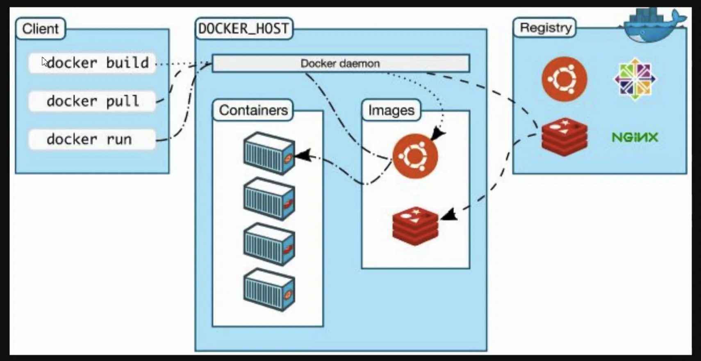
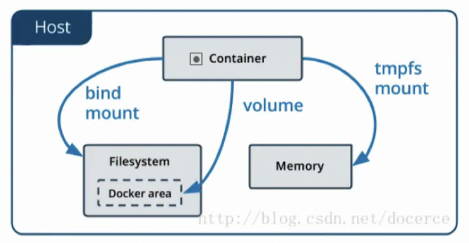

# Docker

### 解决软件部署问题

软件运行需要必备的运行环境。

#### 虚拟机

虚拟机是带环境安装的一种解决方案，可以在一种操作系统中运行另一种操作系统。

缺点：

- 资源占用多
- 冗余步骤多
- 启动速度慢

#### Linux容器

Linux容器不是模拟一个完整的操作系统，而是对进程进行隔离，或者说在正常的进程外面套了一个保护层，对容器里的进场来说，它接触到的各种资源都是虚拟的，从而实现与底层系统的隔离。

- 启动快
- 资源占用小
- 体积小

####  Docker

Docker属于Linux容器的一种封装，提供简单易用的容器使用接口，它是目前最流行的Linux容器解决方案。

Docker将应用程序与程序的依赖打包在一个文件里，运行这个文件就会生成一个虚拟容器。程序在这个虚拟容器里运行，就好像是在真实的物理机上运行一样。

#### Docker和KVM

启动时间：

- Docker秒级启动
- KVM分钟级启动

轻量级：

- 容器镜像通常以M为单位，虚拟机以G为单位，容器资源占用小，要比虚拟机部署更快。
- 容器共享宿主机内核，系统级虚拟化，占用资源少，容器性能基本接近物理机。
- 虚拟机要虚拟化一些设备，具有完整的OS，虚拟机开销大，因而降低性能，没有容器性能好。

安全性：

- 由于容器共享宿主机内核，只是进程隔离，因此隔离性和稳定性不如虚拟机，容器具有一定权限访问宿主机内核，存在一定安全隐患。

使用要求：

- KVM基于硬件的完全虚拟化，需要硬件CPU虚拟化技术支持。
- 容器共享宿主机内核，可运行在主机的Linux的发行版，不用考虑CPU是否支持虚拟化技术。

### Docker

#### 应用场景

- 节省项目环境部署时间
  - 单项目打包
  - 整体项目打包
  - 新开源技术
- 环境一致性
- 持续集成
- 微服务
- 弹性伸缩

#### 结构体系


- containerd是一个守护进程，使用runC管理容器，向Docker Engine提供接口。
- shim只负责管理一个容器。
- runC是一个轻量级工具，只用来运行容器。

> 推荐：一个服务对应一个镜像和容器。

#### Docker内部组件

- namespaces：命名空间，Linux内核提供的一种对进程资源隔离的机制，例如进程、网络、挂载等资源。
- cgroups：控制组，linux内核提供的一种限制进程资源的机制，例如cpu、内存等资源。
- unonFS：联合文件系统，支持将各种不位置的目录挂载到同一虚拟文件系统，形成一种分层的模型。

#### Docker架构



#### image镜像

Docker把应用程序及其依赖，打包在image文件里面，只有通过这个文件，才能生成Docker容器。

image文件可以看作是容器的模板，Docker根据image文件生成容器的实例，同一个image文件可以生成多个同时运行的容器实例。

镜像不是单一的文件，可以有多层，容器其实就是在镜像的最上面加了一层读写层，在运行容器里做的任何文件改动，都会写到这个读写层里。如果容器删除了，最上面的读写层也就删除了，改动也就丢失了。

删除镜像前，需要删除所有依赖镜像的容器，否则无法删除镜像。

我们可以通过`docker history <ID/NAME>`查看镜像中各层内容及大小，每层对应着Dockerfile中的一条指令。

| 命令    | 含义                                                  | 案例                                                       |
| ------- | ----------------------------------------------------- | ---------------------------------------------------------- |
| ls      | 查找全部镜像                                          | docker image ls                                            |
| search  | 查找镜像                                              | docker search [imageName]                                  |
| history | 查看历史镜像                                          | docker history [imageName]                                 |
| inspect | 查看一个活多个镜像详细信息                            | docker inspect [imageName]                                 |
| pull    | 拉取镜像                                              | docker pull [imageName]                                    |
| push    | 推送一个镜像到镜像仓库                                | docker push [imageName]                                    |
| rmi     | 删除镜像                                              | docker rmi [imageName] / docker image rmi 2                |
| prune   | 移除未使用的镜像，没有被标记(没有tag)或被任何容器引用 | docker image prune                                         |
| tag     | 标记本地镜像，将其归入某一仓库                        | docker image tag [imageName] [username]/[repository]:[tag] |
| export  | 导出容器文件系统tar归档文件创建镜像（容器->文件）     | docker export -o mysqlv1.tar a404c6c174a2                  |
| import  | 导入容器快照文件系统tar归档文件创建镜像（文件->镜像） | docker import mysqlv1.tar name/mysql:v2                    |
| save    | 保存一个或多个镜像到一个tar归档文件（镜像->文件）     | docker save -o mysqlv2.tar name/mysqlv2:v3                 |
| load    | 加载镜像存储文件来自tar归档或标注输入（文件->镜像）   | docker load -i mysqlv2.tar                                 |
| build   | 根据Dockerfile构建镜像                                |                                                            |

> 用户既可以使用`docker load`来导入镜像存储文件到本地镜像库，也可以使用`docker import`来导入一个容器快照到本地镜像库。这两者的区别在于容器快照文件将丢弃所有的历史记录和元数据信息(即仅保存容器当时的快照状态)，而镜像存储文件将保存完整记录，体积也要大。此外，从容器快照文件导入时可以重新指定标签等元数据信息。

#### 容器

`docker run`命令会从镜像文件生成一个正在运行的容器实例。

`docker container run`命令具有自动抓取image文件的功能，如果发现本地没有制定的image文件，就会从仓库文件自动抓取。

image文件生成的容器实例，本身也是一个文件，称为容器文件。容器生成就会同时存在两个文件：image文件和容器文件。关闭容器并不会删除容器文件，只是容器停止运行。

停止容器后不会删除这个容器，除非在启动容器时制定了`--rm`标识。

使用`docker ps -a`命令查看docker主机上包含停止的容器在内的所有容器。

停止状态的容器可写层仍然占用磁盘空间，要清理可以使用`docker container prune`。

| 命令                 | 含义                                         | 案例                                                         |
| -------------------- | -------------------------------------------- | ------------------------------------------------------------ |
| create               | 创建一个容器但不运行                         | docker create --name logger centos                           |
| run                  | 从镜像运行一个容器                           | docker run ubuntu /bin/echo 'hello-world'                    |
| ls                   | 列出容器                                     | docker container ls                                          |
| inspect              | 显示一个或多个容器详细信息                   | docker inspect                                               |
| stats                | 显示容器资源使用统计                         | docker container stats                                       |
| top                  | 显示一个容器运行的进程                       | docker container top                                         |
| update               | 更新一个或多个容器配置                       | docker update -m 500m --memory-swap -1 [containerId]         |
| port                 | 列出指定的容器的端口映射                     | 设置映射：docker run -d -p 8080:80 nginx<br />查看映射：docker container port [contianerId] |
| ps                   | 查看当前运行的容器                           | docker ps                                                    |
| kill [containerId]   | 终止容器(发送SIGKILL)                        | docker kill [containerId]                                    |
| rm [containerId]     | 删除容器                                     | docker rm [containerId]                                      |
| start [containerId]  | 启动已经生成、已经停止运行的容器文件         | docker start [containerId]                                   |
| stop [containerId]   | 终止容器运行(发送SIGTERM)                    | docker stop [containerId]                                    |
| logs [containerId]   | 查看docker容器的输出                         | docker logs [containerId]                                    |
| exec [containerId]   | 进入一个正在运行的docker容器执行命令         | docker container exec -it [containerId] command              |
| cp [containerId]     | 从正在运行的Docker容器里面，将文件拷贝到本机 | docker container cp [containerId]:app/package.json           |
| commit [containerId] | 创建一个新镜像来自一个容器                   | docker commit -a "author" -m "commit description"  [containerId] [imageName]:[imageTag] |

> docker container rm $(docker container ps -a -q)：可以直接删除所有容器
>
> docker container ps -a -q：该命令的作用时列出所有容器的id

#####  启动容器

```bash
docker run ubuntu /bin/echo "hello world"
```

Docker以ubuntu镜像创建一个新容器，然后在容器里执行bin/echo "Hello world"，然后输出结果：

- docker：Docker的二进制执行文件。

- run：与前面的docker组合来运行一个容器。

- ubuntu：制定要运行的镜像，Docker首先从本地主机上查找镜像是否存在，如果不存在，Docker就会从镜像仓库Docker Hub下载公共镜像。

- /bin/echo "Hello world"：在启动容器里执行的命令。

| 参数              | 含义                         |
| ----------------- | ---------------------------- |
| -i --interactive  | 交互式                       |
| -t --tty          | 分配一个伪终端               |
| -d --detach       | 运行容器到后台               |
| -a --attch list   | 附加到运行的容器             |
| -e --env list     | 设置环境变量                 |
| -p --publish list | 发布容器端口到主机(映射端口) |
| -P                | --publish-all                |
| --mount mount     | 挂载宿主机分区到容器         |
| -v,--volumn list  | 挂载宿主机分区到容器         |

##### 查看容器

```bash
docker ps
docker -a # 显示所有容器，包括已经停止的
docker -l # 显示最新的那个容器
```

| 字段         | 含义           |
| ------------ | -------------- |
| CONTAINER ID | 容器ID         |
| IMAGE        | 使用的镜像     |
| COMMAND      | 使用的命令     |
| CREATERD     | 创建时间       |
| STATUS       | 状态           |
| PORTS        | 端口映射       |
| NAMES        | 自动分配的名称 |

#### commit制作个性化镜像

docker commit：从容器创建一个新的镜像

docker commit [options] container [repository[:tag]]

- -a：镜像作者
- -c：使用Dockerfile指令来创建镜像
- -m：提交时的说明文字
- -p：在commit时，将容器暂停

#### Dockerfile

Docker的镜像是用一层一层的文件组成，可以使用`docker inpect`查看文件层。Layers就是镜像的层文件，只读不能修改，基于镜像创建的容器会共享这些文件层。

##### 编写Dockerfile

| 命令    | 含义                       | 案例              |
| ------- | -------------------------- | ----------------- |
| FROM    | 继承的镜像                 | FROM node         |
| COPY    | 拷贝                       | COPY ./app/app    |
| WORKDIR | 指定工作路径               | ROWKDIR /app      |
| RUN     | 编译镜像打包阶段运行的命令 | RUN npm install   |
| EXPOSE  | 暴露端口                   | EXPOSE 3000       |
| CMD     | 容器运行阶段运行的命令     | CMD npm run start |

.dockerignore：表示要排除，不要打包到镜像中的文件路径

步骤：

构建镜像：docker build -t [imageName] [path]

启动容器：docker run -d -p 8080:3000 [imageName]

### 数据盘

删除容器的时候，容器层里创建的文件也会被删除掉，如果有些数据你想永久保存，比如Web服务器的日志，数据库管理系统中的数据，可以为容器创建一个数据盘。



#### volume

volumes是Docker管理宿主机文件系统的一部分(/var/lib/docker/valumes)，如果没有指定卷，则会自动创建。建议使用--mount，更通用。

##### 创建volume

```bash
docker volume create nginx-vol # 创建名为nginx-vol的volume
docker volume ls # 查看volume
docker volume inspect nginx-vol # 查看nginx-vol数据卷的详情，其中会显示其在宿主机中的地址

# 通过镜像nginx启动一个名为nginx1的容器，并把名为nginx-vol的volume挂载到容器的/usr/share/nginx/html目录，挂载后该目录会指向宿主机的nginx-vol数据卷
docker run -d --name nginx1 --mount src=nginx-vol,dst=/usr/share/nginx/html nginx

# 另一种写法
docker run -d --name nginx1 -v nginx-vol:/usr/share/nginx/html nginx
```

> 在linux中volume默认地址在/var/lib/docker/volumes/下，但在mac中，会为docker生成一个虚拟机，通过命令：`docker run -it --privileged --pid=host debian nsenter -t 1 -m -u -n -i sh`进入虚拟机，即可找到/var/lib/docker/volumes/目录。

##### 删除volume

```bash
# 删除数据卷
docker volume rm nginx-vol

# 如果数据卷有被容器使用(不管容器是否正在运行)，则无法被删除，需要先停止容器并删除容器
```

##### 管理volume

```bash
# 查看所有volume
docker volume ls

# 查看未被引用的数据卷
docker volume ls -f dangling=true

# 删除所有未被引用的数据卷
docker volume prune
```

#### Bind mounts

创建容器的时候我们可以通过-v或--vloume给它指定一个数据盘，但`bind mounts`可以存储在宿主机系统的任意位置。

此方式与Linux系统的mount方式很相似，即会覆盖容器内已存在的目录或文件，但不会改变容器内原有文件，当unmount后，容器内原有的文件就会还原。

如果宿主机源目录/目标目录不存在，不会自动创建，会抛出一个错误。如果挂载目标在容器中非空目录，则该目录现有内容将被隐藏。

```bash
# 将宿主机的/Users/eternitywith/Desktop/docker-shared挂载到容器的/mnt
docker run -v /Users/eternitywith/Desktop/docker-shared:/mnt -it --name logs centos
```

多个容器继承同一个容器的数据卷映射：

```bash
# 创建一个容器用于继承
docker create -v /logger:/logger --name logger centos

# 多个容器继承一个容器的映射
docker run --volumes-from logger --name logger1 -it centos
docker run --volumes-from logger --name logger2 -it centos
```

### 网络

安装docker时，它会自动创建三个网络，bridge（创建容器默认连接到此网络）、host、none。

- bridge：桥接网络，此模式会为每一个容器分配ip

- host：容器将不会虚拟出自己的网卡，配置自己的ip等，而是使用宿主机的ip和端口

- none：该模式关闭了容器的网络功能，对外界完全隔离

可以使用`--network`标识来指定容器应该连接到哪些网络。

```bash
docker network ls # 查看docker的网络类型
```

#### bridge

bridge是docker启动容器后默认使用的网络，除非使用`docker run --network=<NETWORK>`来指定，否则docker守护程序默认将容器连接到此网络，容器有自己的ip地址。

bridge模式使用`--net=bridge`指定，默认设置。

```bash
docker inspect bridge # 查看当前的桥接网络
docker run -d --name nginx1 nginx
docker run -d --name nginx2 --link nginx1 nginx # 使用--link后能通过容器名ping同容器，否则只能通过容器的ip来ping
docker exec -it nginx2 bash # 进入容器
apt update
apt install -y inetutils-ping # 为容器安装ping命令
ping nginx1
cat /etc/hosts # 查看host文件
```

#### none

none模式使用`--net=none`指定。

```bash
docker run -d --name nginx_none --net none nginx # 使用none网络启动一个容器，容器启动后，容器内无法使用网络
```

#### host

host模式使用`--net=host`来指定。

```bash
docker run -d --name nginx_host --net host nginx # 使用host网络启动一个容器，容器没有自己的ip，但是能使用网络。
docker inspcet nginx_host # 查看容器信息，其中的ip地址为空，说明容器没有自己的网络
apt update
apt install iproute2 # 安装iproute2 使容器能够使用ip命令查看ip地址
ip addr | grep --color=auto 192 # 使用ip addr命令查看网络，并在结果中匹配192并变色，出现的是宿主机ip
```

#### 端口映射

```bash
docker image inspect nginx # 查看nginx镜像的信息，Config.Entrypoints可以查看nginx默认暴露的端口

docker run -d --name port_nginx -p 8080:80 nginx # 将容器暴露的80端口映射到宿主机的8080端口

docker run -d --name radom_nginx -p 80 nginx # 如果不进行宿主机端口映射，将随机映射到宿主机的端口

docker port radom_nginx # 查看映射的端口，是一个宿主机的随机端口

docker run -d --name port_nginx2 --publish-all nginx # --publish-all暴露容器内所有的端口并随机映射到宿主机的端口
```

#### 自定义网络

可以创建除docker自带的三种网络类型之外的网络，每个网络ip范围均不同。

自定义网络内部自带DNS服务，可以通过容器名称和id直接访问。

```bash
docker network create --driver bridge myweb # 创建自定义网络
docker network inspect myweb
docker run -d --name mynginx1 --net myweb nginx
docker run -d --name mynginx2 --net myweb nginx
docker exec -it mynginx2 bash
ping mynginx1 # 同一个自定义网络内的容器可以ping通

docker network rm myweb # 移除自定义网络
```

#### 连接到指定网络

```bash
docker run -d --name no_nginx nginx # 创建一个不指定网络的容器，它将被分配到默认的bridge网络中，此时它只能ping通bridge网络内的容器

docker network connect dev_web no_nginx # 将no_nginx加入到dev_web网络，就能ping通dev_web网络内的容器，此时no_nginx属于bridge和dev_web两个网络内

docker network disconnect dev_web no_nginx # 将no_nginx容器移除dev_web网络
```

> 宿主机中的DHCP服务器会为docker中的容器分配ip，同一局域网下的不同宿主机的docker都有自己的DHCP服务器为其分配容器的ip，因此，如果容器是bridge网络，同一局域网的不同宿主机中的容器不能直接通信，需要同过映射端口到宿主机，借助宿主机相互通信。或者容器使用host网络，直接使用宿主机的ip进行相互通信。

### compose

Compose通过配置一个配置文件来管理多个Docker容器，在配置文件中，所有的容器通过services来定义，然后使用docker-compose脚本来启动、停止和重启应用和应用中的服务以及所有依赖服务的容器。

- services：可以定义需要的服务，每个服务都有自己的名字、使用的镜像、挂载的数据卷所属的网络和依赖的其他服务。
- networks：是应用的网络，在它下面可以定义使用的网络名称、类型。
- volumes：是数据卷，可以在此定义数据卷，然后挂载到不同的服务上面使用。

#### 安装compose

```bash
yum -y install epel-release
yum -y install python-pip
yum clean all
pip install docker-compose
```

> mac系统安装完docker之后自带docker-compose无需再安装。

#### 编写docker-compose.yml

在`docker-compose.yml`中定义组成应用程序的服务，以便他们可以在隔离的环境中一起运行。

```yaml
version: '2.2'
services:
	nginx1:
		image: nginx
		ports:
			- "8080:80"
	nginx2:
		image: nginx
		ports:
			- "8081:80"
```

#### 启动服务

docker-compose会创建默认的网络，同一个compose内的容器网络可以互通，可以直接使用容器名ping通。

| 命令                            | 含义                         |
| ------------------------------- | ---------------------------- |
| docker-compose up               | 启动所有服务                 |
| docker-compose up -d            | 后台启动所有服务             |
| docker-compose ps               | 打印所有的容器               |
| docker-compose stop             | 停止所有服务                 |
| docker-compose log -f           | 持续跟踪日志                 |
| docker-compose exec nginx1 bash | 进入其中的nginx1服务容器中   |
| docker-compose rm nginx1        | 删除服务容器                 |
| docker-compose down             | 删除所有的容器和所创建的网络 |

#### 配置network和volume

```yaml
version: 1.0.0
services:
  nginx1:
    image: nginx
    networks:
      - "myweb"
      - "default"
    volumes:
      - "data:/data"
      - "./front:/usr/share/nginx/html"
    ports:
      - "8081:80"
  nginx2:
    image: nginx
    volumes:
      - "data:/data"
      - "./backend:/usr/share/nginx/html"
    ports:
      - "8082:80"
volumes:
  data:
    driver: local
networks:
  myweb:
    driver: bridge
```

一个service启动两个容器，并且创建一个volume和一个network。compose启动后，volume和network都会自动创建。
