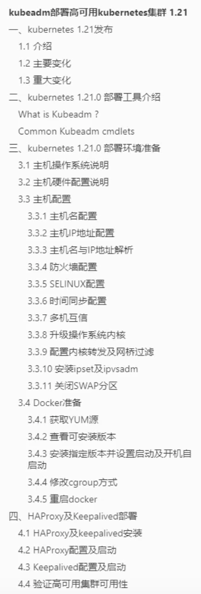
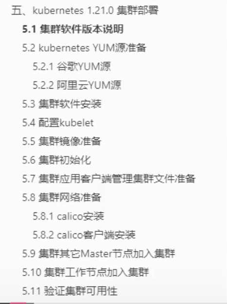
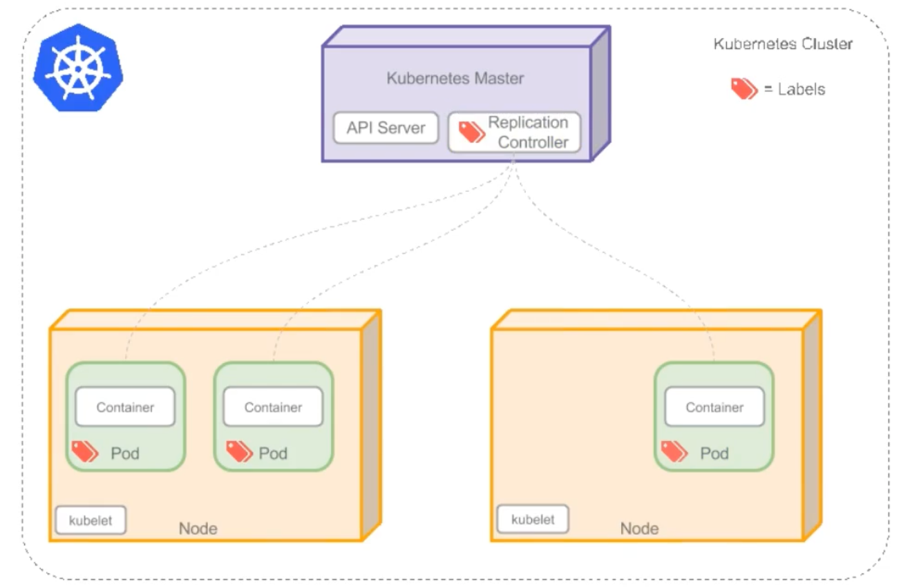
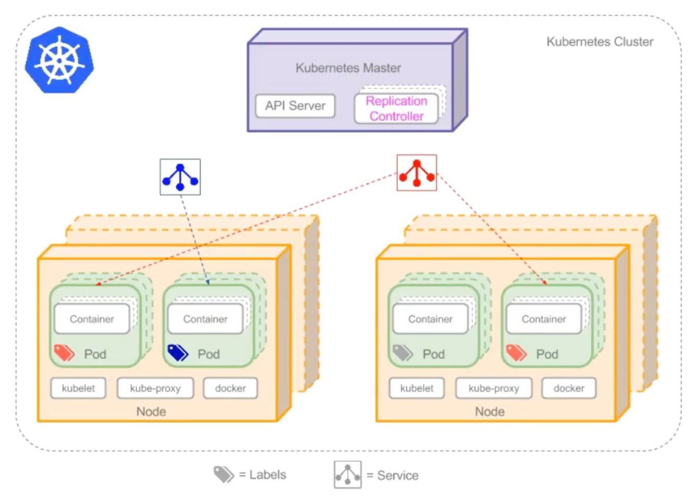
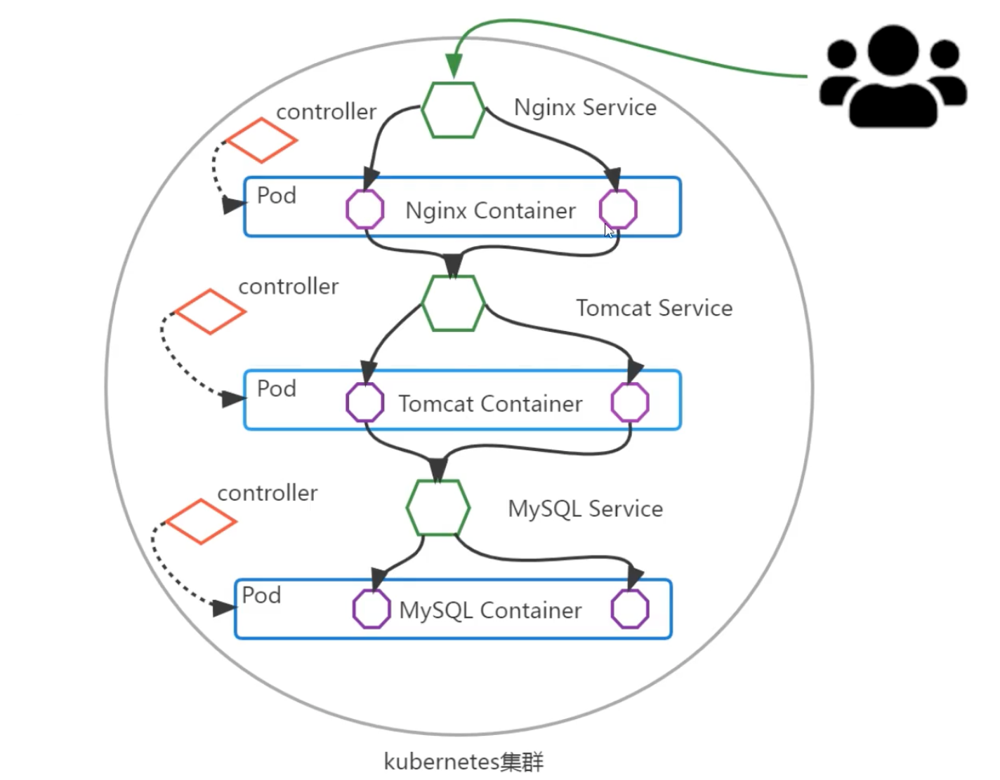
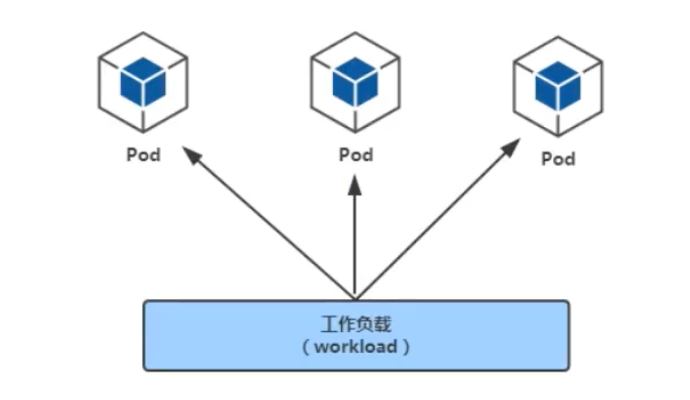

# Kubernetes介绍及集群架构

## Kubernetes架构


## Kubernetes集群节点组件

### Master节点组件

master节点是集群管理节点，它的组件可以在集群任意节点运行，但是为了方便管理所以会在一台主机上运行Master组件，并且不在此主机上运行用户节点。

Master组件包括：

- kube-api-server
  - 用于暴露kubernetes API，任何的资源请求/调用操作都是通过kube-api-server提供的接口进行。
- kube-controller-manager
  - 控制器管理器，用于对控制器进行管理，它们是集群中处理常规任务的后台线程。
- kube-scheduler
  - 监视新创建没有分配到Node的Pod，为Pod选择一个Node运行。
- ETCD
  - 是kubernetes提供默认的存储系统，保存所有集群数据。

### Node节点组件

node节点用于运行及维护Pod，管理volume(CVI)和网络(CNI)，维护Pod及service等信息。

Node组件包括：

- kubelet
  - 负责维护容器的生命周期（创建pod，销毁pod），同时也负责Volume和网络的管理。
- kube-proxy
  - 通过在主机上维护网络规则并执行连接转发来实现servide（iptables/ipvs）
  - 随时与apiserver通信，把service或pod改变提交给apiserver，保存至etcd中，负责service实现从内部pod至service和外部node到service访问。
- Container Runtime
  - 容器运行时Container Runtime
  - 负责镜像管理及Pod和容器的真正运行
  - 支持docker/containerd/Rkt/Kata等多种运行时
  - pod、容器、应用之间的关系是：应用在容器中，容器在pod中。

### Addons

Addons（附件）使k8s功能更丰富，没它不影响实际使用，可以与主体程序很好结合起来使用。

- coredns/kube-dns：负责为整个集群提供DNS服务。
- Ingress Controller：为服务提供集群外部访问。
- Heapster/Metries-server：提供集群资源监控（监控容器可以使用prometheus）。
- Dashboard：提供集群GUI。
- Federation：提供跨可用区的集群。
- Fluentd-elasticsearch：提供集群日志采集、存储与查询。

# Kubernetes集群部署方式

### Kubeadm

- Kubeadm是一个工具，旨在提供创建Kubernetes集群kubeadm init的kubeadm join最佳实践快速路径”。
- Kubeadm执行必要的操作以启动并运行最小的可行集群。
- 按照设计，它只关心引导，而不关心配置机器。
- 同样，安装各种不措的插件，如Kubernetes仪表板、监控解决方案和特定于云的插件，也不在范围内。
- 相反，我们希望在kubeadm之上构建更高级别和更量身定制的工具，理想情况下，使用kubeadm作为所有部署的基础将更容易创建符合要求的集群。


### minikube

- minikube适合用于部署本地kubernetes集群，此集群主要用于测试目的
- minikube可以快速让你在单主机上部署kubernetes集群
- 可以跨平台部署kubernetes集群(Linux、MAC、Windows)

### 二进制部署方式

- 纯人肉方式部署
- 企业生产级别的部署方式
- 部署时间长
- 需要配置内容：
  - 证书
  - 服务配置文件
  - 用systemd管理服务管理文件
  - kubeconfig

### 国内第三方部署工具

#### rke

- 是一个快速的，多功能的kubernetes集群部署工具
- 仅通过一个配置文件就可以快速完成kubernetes集群部署
- 方便在kubernetes中添加任何节点数量的主机

#### kubekey

- kubeykey是KubeSphere基于Go语言开发的ubernetes:集群安装工具，可以轻松、高效、灵活地单独或整体安装Kubernetes和KubeSphere,底层使用Kubeadm在多个节点上并行安装Kubernetes集群，支持创建、扩缩和升级Kubernetes集群。
- KubeKey提供内置高可用模式，支持一键安装高可用Kubernetes集群。
- KubeKey不仅能帮助用户在线创建集群，还能作为离线安装解决方案。
- KubeKeyi可以用于以下三种安装场景：
  - 仅安装Kubernetes集群
  - 一键安装Kubernetes和KubeSphere
  - 已有Kubernetes:集群，使用ks-installer在其上部署KubeSphere

#### kubeasz

项目致力于提供快速部署高可用k8s集群的工具，同时也努力成为k8s实践、使用的参考书；基于二进制方式部署和利用ansible-playbook实现自动化：既提供一键安装脚本，也可以根据安装指南分步执行安装各个组件。

- 集群特性TLS双向认证、RBAC授权、多Masteri高可用、支持Network Policy、备份恢复、离线安装
- 集群版本kubernetes v1.20,v1.21,v1.22,v1.23
- 操作系统Cent0S/RedHat7,Debian9/10,Ubuntu16.04/18.04/20.04
- 运行时docker19.03.X,20.10.x containerd v1.5.8
- 网络calico,cilium,flannel,,kube-ovn,kube-router

# 使用kubeadm快速部署Kubernetes集群





# Kubenernetes集群Node管理

## 查看集群信息

kubectl cluster-info

## 查看节点信息

### 查看集群节点信息

kubectl get nodes

### 查看集群节点详细信息

kubectl get nodes -o wide

### 查看节点描述详细信息

kubectl describe node k8s-master-1

### woker node节点管理集群

如果是kubeasz安装，所有节点（包括master和node）都已经可以对集群进行管理。

如果是kubeadm安装，在node节点上管理时会报错。需要把master上的管理文件/etc/kubernetes/admin.conf拷贝到node节点的$HOME/.kube/config就可以让node节点也可以实现kubectl命令管理。

## 节点标签

k8s集群如果由大量节点组成，可将节点打上对应的标签，然后通过标签进行筛选及查看，更好的进行资源对象的相关选择与匹配。

### 查看节点标签信息

kubectl get node --show-labels

### 设置节点标签信息 

kubectl label node $node-name $key=$value

### 查看指定标签的节点

kubectl get nodes -L $label-key

### 多维度标签

#### 设置节点多维度标签

kubeclt label node $nodename $key1=$value1 $key2=$value2

#### 查看多个指定标签的所有节点

kubectl get nodes -L $label-key1,$label-key2

#### 查看某个标签值的节点

kubectl get nodes -l $label-key=$label-value

#### 标签的修改

加上--overwrite=true覆盖原标签的value进行修改操作

kubectl label node $node-name $label-key=$label-new-value --overwrite=true

#### 标签的删除

使用key后面加一个减号的写法来取消标签

kubectl label node $node-name $label-key-

#### 删除多个标签

kubectl label node $node-name $label-key1- $label-key2-

#### 标签选择器

标签选择器主要有2类：

- 等值关系：=，!=
- 集合关系：KEY in {VALUE1, VALUE2, ...}

kubectl get node -l "$label-key in($label-value1,$label-value2)"

# Kubernetes集群中资源对象描述方法

在kubernetes中，一般使用yaml格式的文件来创建符合我们预期期望的pod，这样的yaml文件称之为资源对象清单文件。

列举某个资源对象有哪些配置属性：

kubectl explain $resource-object

# Kubernetes集群命名空间

## 命名空间作用

- Namespace是对一组资源和对象的抽象集合。
- 常见的pod、service、deployment等都是属于某一个namespace的。
- 不是所有的资源都属于namespace，如nodes、persistent volume、namespace等资源不属于任何namespace。
- 所有未指定namespace的对象都会被默认分配在default命名空间。
- 所有由Kubernetes系统创建的资源都处于kube-system命名空间中。
- kube-public命名空间中的资源，可以被所有人访问。

## 查看namespace

kubectl get namespaces

kubectl get ns

## 查看namespace里的资源

### 查看命名空间的所有资源

kubectl get all --namespace=$namespace-name

### 查看命名空间的某种资源

kubectl get $resource-object --namespace $namespace-name

kubectl get $resource-object -n $namespace-name

### 查看所有命名空间的资源

kubectl get $resource-object -A

## 创建namespace

### 命令行创建

kubectl create namespace  $namespace-name

### YAML文件创建

k8s中几乎所有资源都可以通过yaml编排来创建。

#### 查看语法文档

kubectl explain namespace

kubectl explain namespace.emtadata

#### 编写namespace的yaml文件

vim **.yaml

#### 应用yaml文件

kubectl apply -f **.yaml

#### 编辑yaml文件

kubectl edit namespace $resource-object

#### 查看资源的的yaml编排

kubectl get $resource-object-type $resource-object-name -o yaml

kuebctl get ns ns1 -o yaml

## 删除namespace

删除一个namespace会自动删除所有属于该namespace的资源。

default、kube-system、kube-public命名空间不可删除。

### 命令删除

kubectl delete namespace $namespace-name

### yaml文件删除

kubectl delete -f **.yaml

# Kubernetes核心概念

## Kubernetes核心概念概述

### Pod

Pod是可以在Kubernetes中创建和管理的、最小的可部署的计算单元。

Pod中包含着一组（一个或多个）容器，这些容器共享存储、网络、以及怎样运行这些容器的声明。

Pod就像一台物理服务器一样，其中包含一个或多个应用容器，这些容器中运行着用户应用程序。Pod不能直接运行服务，需要依赖容器来运行服务。

### Controller

在Kubernetes中controller用于管理和运行Pod的对象。

在Kubernetes中，控制器通过监控集群的公共状态，并致力于将当前状态转变为期望的状态。

一个控制器至少追踪一种类型的Kubernetes资源。这些对象有一个代表期望状态的`spec`字段。该资源的控制器负责确保其当前状态接近期望状态。

不同类型的控制器所实现的控制方式不一样，例如：

- depolyment
  - 部署无状态应用：认为pod都一样，没有顺序要求，不用考虑在哪个node运行，随意进行拓展和伸缩。
  - 管理Pod和ReplicaSet
  - 部署、滚动升级等
  - 典型的像web服务、分布式服务等
- StatefulSet
  - 部署有状态应用：每个pod都独立运行，保持pod启动顺序和唯一性；有唯一的网络标识符，持久存储；有序，比如mysql主从；主机名称固定；而且其扩容以及升级等操作也是按顺序进行的操作。
- DaemonSet
  - 部署守护进程
  - DaemonSet保证在每个Node上都运行一个容器副本，常用来部署一些集群的日志、监控或者其他系统管理应用。新加入的node也同样运行在一个pod里面。
- job
  - 一次性任务
  - job负责批量处理短暂的一次性任务（short lived one-off tasks），即仅执行一次的任务，它保证批处理任务的一个或多个Pod成功结束。
- Cronjob
  - 周期性定时任务

### Label

### Label Selector

### Service

Service是将运行在一组Pods上的应用程序公开为网络服务的抽象方法。

由于Pod是非永久性资源对象，如果你使用Controller运行你的应用程序，你可以动态创建和销毁Pod，这样就会导致无法准确访问到所想要访问的Pod。

例如：如果一组Pod（称为后端）为集群内其他的Pod（称为前端）提供功能，那么前端如何找出并跟踪要连接的IP地址，以便前端可以使用工作负载的后端部分？Service就实现这个功能。

Service本质是一组iptables或ipvs规划，通过把客户端的请求转发到服务端，如果服务端有多个Pod，还可以实现负载均衡的效果。

例如：一个图片处理后端，运行了三个Pod副本，这些Pod是可以互换的--前端不需要关心他们调用了哪个后端副本，然而组成这一组的后端程序的Pod实际可能发生了变化，前端客户端不应该也没必要知道，而且也不需要跟踪这一组后端的状态。

### Endpoints

为Service管理后端Pod，当后端Pod被创建或者销毁时，endpoints列表会更新Pod对应的IP地址，以便Service访问请求能够确保被响应。

### DNS

为Kubernetes集群内资源对象的访问提供名称解析，这样就可以实现通过DNS名称而非IP地址来访问。

- 实现集群内Service名称解析。
- 实现集群内Pod内Container中应用访问互联网提供域名解析。

### Kubernetes核心概念之间的关系

#### Pod与Controller

Pod是通过Controller实现应用的运维，比如伸缩、滚动升级等等，Pod和Controller通过Label标签建立关系。



#### Pod与Service

Service是为了防止与Pod失联，提供的服务发现，类似于微服务的注册中心。定义一组Pod的访问策略，可以为一组具有相同功能的容器应用提供一个统一的入口地址，并将请求负载分发到后端的各个容器应用上。

Service通过selector来管控对应的Pod，根据label和selector建立关联，通过service实现pod的负载均衡。



#### Service与DNS

通过DNS实现对Service名称解析，以此达到访问后端Pod的目的。

### 基于Kubernetes集群容器化应用的微服务

#### 服务部署方式

- 单体服务架构
  - 所有服务进程运行在同一台主机内。
- 分布式服务架构
  - 服务进程分布于不同的主机，其中一台主机出现故障，不影响其他主机上的服务运行。
- 微服务架构
  - 使用容器化技术把分布式服务架构运行起来，并实现对不同的服务进程的高可用即快速发布。

### 微服务架构组件服务（Kubernetes核心概念）之间关系举例说明

以在Kubernetes集群中运行LNMT应用为例：

把Kubernetes集群看作是一个IDC机房，把LNMT Web架构应用以微服务（Kubernetes集群资源对象）的方式部署到Kubernetes集群中。



## Kubernetes集群核心概念Pod

### 工作负载

工作负载（workload）是在Kubernetes集群中运行的应用程序。无论你的工作负载是单一服务还是多个同一工作的服务构成，在Kubernetes中都可以使用pod来运行它。

workload分为pod与controllers

- pod通过控制器实现应用的运行，如何伸缩，升级等。
- controllers在集群中管理pod
- pod与控制器之间通过label-selector相关联，是唯一的关联方式



在pod的YAML里指定pod标签

```yaml
	labels:
		app: nginx
```

在controller的YAML里指定标签选择器匹配标签

```yaml
	selector:
		matchLabels:
			app: nginx
```

### pod介绍

#### pod定义

- pod是Kubernetes集群管理（创建、部署）与调度的最小计算单元，表示处于运行状态的一组容器。
- pod不是进程，而是容器运行的环境。
- 一个pod可以封装一个或多个容器。如果运行一个容器，则namespace则由该容器独享。如果运行多个容器，则一定有一个主容器，其他容器都是sidecar边车容器。
- 如果一个pod有多个容器，则多个容器之间共享部分命名空间，例如：Net Namespace，UTS Namespace，IPC Namespace及存储资源。
- 用户pod默认会被调度运行在node节点之上，不运行在master节点上，但也有例外情况。
- pod内的ip是不固定的，集群外不能直接访问pod。

#### pod分类

- 静态pod：也称之为“无控制器管理的自主式pod”，直接由特定节点上的kubelet守护进程管理，不需要API服务器看到他们，尽管大多数pod都是通过控制面板

### pod的YAML资源清单格式

TODO

#### YAMl格式查找帮助

```bash
kuebctl explain namespace

kubectl explain pod

kubectl explain pod.spec

kubectl explain pod.spec.containers
```

