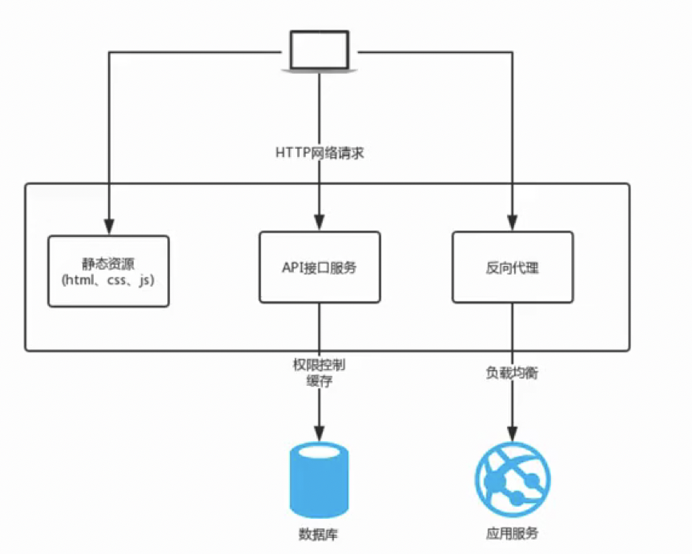
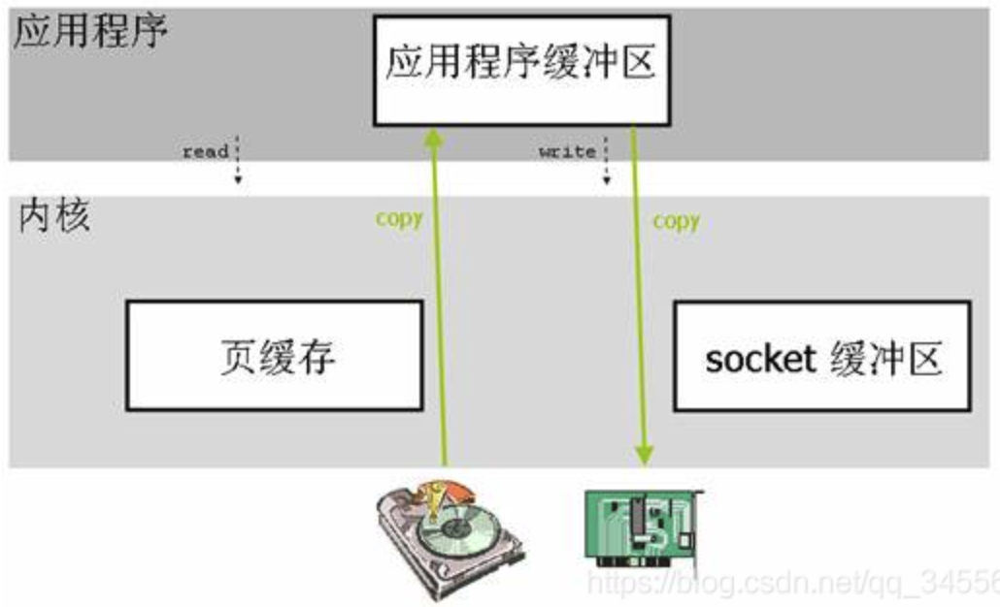
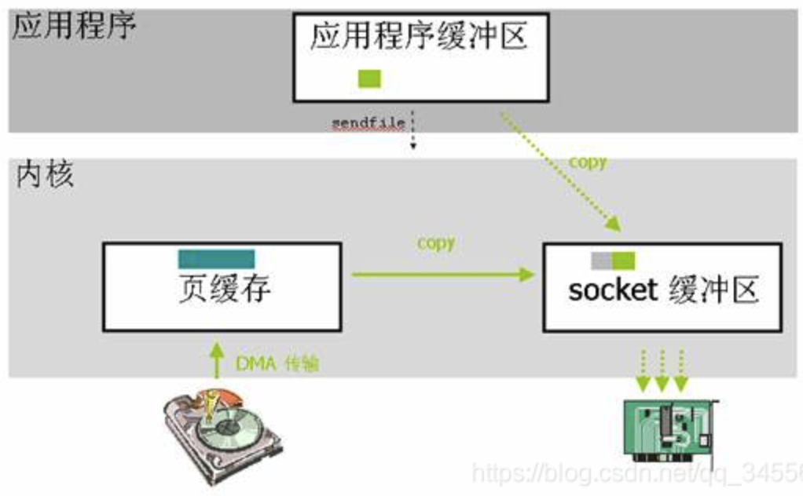
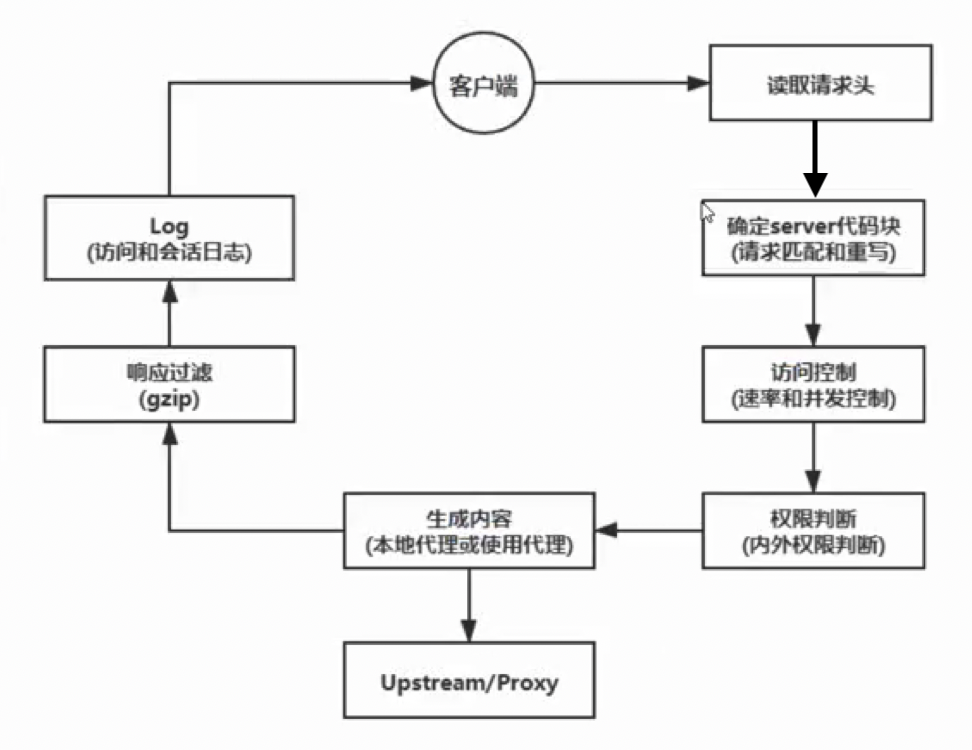

# nginx

### nginx应用场景

- 静态资源服务器
- 反向代理服务
- API接口服务



### nginx优势

- 高并发高性能
- 可拓展性好
- 高可靠性
- 热部署
- 开源许可证

### 学习环境

centos7 64位

#### 环境确认

##### 关闭防火墙

| 功能           | 命令                                |
| -------------- | ----------------------------------- |
| 查看防火墙状态 | systemctl status firewalld          |
| 停止防火墙     | systemctl stop firewalld.service    |
| 永久关闭防火墙 | systemctl disable firewalld.service |
| 启动防火墙     | systemctl start firewalld           |

##### 停用selinux

安全增强型linux（Security-Enhanced Linux）简称SELinux，它是一个Linux内核模块，也是Linux的一个安全子系统。

SELinux主要作用是最大限度地减少系统中服务进程可访问的资源（最小权限原则）。

| 功能     | 命令                                                       |
| -------- | ---------------------------------------------------------- |
| 检查状态 | getenforce                                                 |
| 检查状态 | /usr/sbin/sestatus -v                                      |
| 临时关闭 | setenforce 0                                               |
| 永久关闭 | /etc/selinux/config SELINUX=enforcing 改为SELINUX=disabled |

##### 安装依赖模块

```bash
yum -y install gcc gcc-c++ autoconf pcre pcre-devel make automake openssl openssl-devel
```


##### 约定目录

| 目录名   |                        |
| -------- | ---------------------- |
| app      | 存放代码和应用         |
| backup   | 存放备份的文件         |
| download | 下载下来的代码和安装包 |
| logs     | 存放日志               |
| work     | 工作目录               |

### 安装nginx

##### centos下yum安装nginx

vi /etc/yum.repos.d/nginx.repo

写入nginx安装配置如下内容：

```
[nginx]
name=nginx repo
baseurl=http://nginx.org/packages/centos/7/$basearch/
gpgcheck=0
enable=1
```

 ```
 yum install nginx -y // 安装nginx
 nginx -v // 查看安装的版本
 nginx -V // 查看编译时的参数
 ```

主要参数解释如下：

- --prefix：nginx的安装目录
- --modules-path：安装的额外模块的路径
- --conf-path：配置文件路径
- --error-log-path：错误日志路径
- --http-log-path：普通日志路径
- --pid-path：存放进程ID
- --lock-path：存放加锁文件

### nginx架构

##### 轻量

- 源代码只包含核心模块
- 其他非核心功能都是通过模块实现，可以自由选择

#### 架构

nginx采用的是多进程(单线程)和多路IO复用模型。

##### 工作流程

1. nginx在启动后，会有一个master进程和多个相互独立的worker进程。
2. 接收来自外界的信号，向worker进程发送信号，每个进程都可能来处理这个连接。
3. master进程能监控worker进程的运行状态，当worker进程退出后(异常情况下)，会自动启动新的worker进程。

worker进程数一般会设置成机器cpu数，因为更多的worker数，只会导致进程相互竞争cpu，从而带来不必要的上下文切换。

使用多进程模式，不仅能提高并发率，而且进程之间相互独立，一个worker进程挂了不会影响到其他worker进程。

##### IO多路复用

- 多个文件描述符的IO操作都能在一个线程里并发交替顺序完成，复用线程。

##### CPU亲和

把CPU内核和nginx的工作进程绑到一起，让每个worker进程固定在一个cpu上执行，从而减少CPU切换并提高缓存命中率，提高性能。

##### sendfile

sendfile零拷贝传输模式。

###### 传统的文件传输方式（read、write/send方式）

具体流程细节如下：

- 调用read函数，文件数据拷贝到内核缓冲区(磁盘高速缓存)
- read函数返回，数据从内核缓冲区拷贝到用户缓冲区
- 调用write/send函数，将数据从用户缓冲区拷贝到内核socket缓冲区
- 数据从内核socket缓冲区拷贝到协议引擎中

在这个过程当中，文件数据实际上是经过了四次拷贝操作：硬盘—>内核缓冲区—>用户缓冲区—>内核socket缓冲区—>协议引擎


###### sendfile系统调用

sendfile系统调用则提供了一种减少拷贝次数，提升文件传输性能的方法。

- sendfile系统调用利用DMA引擎将文件数据拷贝到内核缓冲区，之后数据被拷贝到内核socket缓冲区中

- DMA引擎将数据从内核socket缓冲区拷贝到协议引擎中

这里没有用户态和内核态之间的切换，也没有内核缓冲区和用户缓冲区之间的拷贝，大大提升了传输性能。（实际上只调用了sendfile，sendfile告诉要从哪个文件，哪个字节开始读取，读取多少个字节。将读取出来的字节发送到哪个socket上面，相当于正常情况下减少了拷贝次数。）

这个过程数据经历的拷贝操作：硬盘—>内核缓冲区—>内核socket缓冲区—>协议引擎



### 目录

#### 安装目录

查看nginx安装的配置文件和目录

```bash
rpm -ql nginx
```

#### 日志切割文件

/etc/logrotate.d/nginx

对访问日志进行切割

```
/var/log/nginx/*.log {

}
```

#### 主配置文件

| 路径                           | 用途                 |
| ------------------------------ | -------------------- |
| /etc/nginx/nginx.conf          | 核心配置文件         |
| /etc/nginx/conf.d/default.conf | 默认http服务配置文件 |

#### 守护进程管理

用于配置系统守护进程管理方式

```
systemctl restart nginx.service
```

#### nginx模块目录

nginx安装的模块

| 路径               | 用途                     |
| ------------------ | ------------------------ |
| /etc/nginx/modules | 最基本的共享库和内核模块 |

目的是存放用于启动系统和执行root文件系统的命令，如`/bin`和`/bash`的二进制文件的共享库。

### nginx工作流

#### 配置块

1. 请求到来时先按域名找到server块
2. 再按请求路径找到location块
3. Context是指本指令出现在哪个块

```
http {
	upstream {}
	server {
		if() {}
		location {
			location {}
		}
	}
	server {}
}
```

#### 值指令继承规则

- `值指令`可以合并，`动作类指令`不可以合并。
- 值指令是向上覆盖的，子配置不存在可以使用父配置块的指令，如果子指令存在，则会覆盖父配置块中的指令。

```
server {
	listen 80;
	root /home/nginx/html;
	access_log logs/access.log main;
	location /image {
		access_log logs/access.log image;
	}
}
```

#### server(server_name)匹配顺序

- 精确匹配
- *在前
- *在后
- 按文件中的顺序匹配正则式域名
- default server

#### HTTP请求处理流程

| 阶段           | 名称           | 对应模块                       |
| -------------- | -------------- | ------------------------------ |
| 读取请求后     | POST_READ      | realip                         |
| 重写           | SERVER_REWRITE | rewrite                        |
| 匹配location   | FIND_CONFIG    | rewrite                        |
| 重写           | REWROTE        | rewrite                        |
| 重写后         | POST_REWRITE   |                                |
| 访问前限制     | PREACCESS      | limit_conn,limit_req           |
| 是否有权限访问 | ACCESS         | auth_basic,access,auth_request |
| 判断权限后     | POST_ACCESS    |                                |
| 响应前         | PRECONTENT     | try_files                      |
| 生成相应       | CONTENT        | index,autoindex,concat         |
| 打印日志       | LOG            | access_log                     |



### 核心模块

#### 监控nginx客户端的状态

##### 模块名

--with-http_stub_status_module

##### 语法

```
Syntax: stub_status on/off # 语法
Default: - # 默认off
Context: server,location # 表示可以写在server块或者location块中
```

##### 实战

/etc/nginx/conf.d/default.conf

```
server {
	location /status {
		stub_status on;
	}
}
```

修改配置文件后重新加载nginx配置：`systeml reload nginx.service`，然后访问目标路径，可得到如下内容：

```
Active connections: 2
server accepts handled requests
3 3 10
Reading: 0 Writing: 1 Waiting: 1
```

| 参数               | 含义                                                         |
| ------------------ | ------------------------------------------------------------ |
| Active connections | 当前nginx正在处理的活动连接数                                |
| accepts            | 总共处理的连接数                                             |
| handled            | 成功创建的握手数                                             |
| requests           | 总共处理的请求数                                             |
| Reading            | 当前读取到客户端的Header信息的数目                           |
| Writing            | 正在返回给客户端的Header信息的数目                           |
| Waiting            | 当前等待的连接数，开启keep-alive的情况下，这个值等于active-(reading + writing) |

#### 随机主页

##### 模块名

--with-http_random_index_module

功能：在根目录里随机选择一个主页显示

##### 语法

```
Syntax: random_index on/off
Default: off
Context: location
```

##### 实战

/etc/nginx/conf.d/default.conf

```
location / {
	root /opt/app; # 访问/地址时会随机返回/opt/app目录中的文件
	random_index on;
}
```

#### 内容替换

##### 模块名

--with-http_sub_module

##### 语法

```
Syntax: sub_filter string replacement;
Default: --
Context: http,service,location
```

##### 实战

/etc/nginx/conf.d/default.conf

```
location / {
	root /usr/share/nginx/html;
	index index.html index.html;
	sub_filter 'name' 'my_name'; # 访问/路径返回的内容中如果有name字段的都会被替换成my_name字段
}
```

#### 请求限制

##### 模块名

- --with-limit_conn_module：连接频率限制
- --with-limit_req_module：请求频率限制

一次TCP连接至少产生一个HTTP请求。

##### ab

apache的ab命令模拟多线程并发请求，测试服务器负载压力，也可以测试nginx、lighthttp、IIS等其他web服务器压力。

- -n 总共的请求数
- -c 并发的请求数

```
yum -y install httpd-tools
ab -n 40 -c 20 http://127.0.0.1/
```

##### 连接限制

nginx_http_limit_conn_module模块会在NGX_HTTP_PREACCESS_PHASE阶段生效。

其针对全部的worker生效，依赖realip模块获得到的真实IP。

> nginx_http_limit_conn_module是模块名，--with-limit_conn_module是对应的编译参数，加上这个参数，编译时会把该模块编译进nginx中。

###### 语法

先 limit_conn_zone定义共享内存(大小)，以及key关键字。

> 该模块使用共享内存来限制连接，所以需要先定义共享内存。

```
# 可以以IP为key zone为空间的名称 size为申请空间的大小
Syntax: limit_conn_zone key zone=name:size;
Default: --
Context: http(定义在server以外)
```

然后 limit_conn定义详细的限制规则。

```
# zone名称 number限制的数量 
# 表示用哪个共享内存来限制连接，并且设置限制的每秒连接数
Syntax: limit_conn zone number;
Default: --
Context: http,server,location
```

```
# 定义日志级别
Syntax: limit_conn_log_level info|notice|warn|error;
Default: limit_conn_log_level error;
Context: http,server,location
```

```
# 定义超出限制的连接返回的状态码
Syntax: limit_conn_status code;
Default: limit_conn_status 503;
Context: http,server,location
```

```
# 定义连接速率，每秒服务器返回的字节数 
Syntax: limit_rate rate;
Default: limit_conn_status 503;
Context: http,server,location
```

###### 实例

```
http {
	# 声明一个用于存放连接限制的共享内存，名为conn_zone，大小为10m
	# $binary_remote_addr为nginx的内置变量，可以获取客户端IP
	limit_conn_zone $binary_remote_addr zone=conn_zone:10m;
	
	server {
		listen 80;
		server_name localhost;
		
		location / {
			root /usr/share/nginx/html;
			index index.html index.htm;
			
			limit_conn conn_zone 1; # 使用conn_zone的共享内存来限制连接，每秒连接数为1个
			limit_conn_status 500; # 超出限制的请求返回状态码为500
			limit_conn_log_level warn; # 超出限制的错误请求的日志级别为warn级别
			limit_rate 50; # 限制连接速率为每秒50字节
		}
		...
	}
}
```

##### 请求限制

nginx_http_limit_req_module模块是在NGX_HTTP_PREACCESS_PHASE阶段生效。

生效算法是漏斗算法(Leaky Bucket)把突出的流量限定为每秒恒定多少个请求。

Traffic Shaping的核心理念是等待，Traffic Policing的核心理念是丢弃。

limit_req生效是在limit_conn之前的。

###### 语法

limit_req_zone定义共享内存，以及key和限制速度。

```
# 可以以IP为key zone为空间的名称 size为申请空间的大小
Syntax: limit_req_zone key zone=name:size rate=rate;
Default: --
Context: http(定义在server以外)
```

limit_req限制并发请求数

```
# zone名称 number限制的数量
Syntax: limit_req zone=name [burst=number] [nodelay];
Default: --
Context: http,server,location
```

burst是bucket的数量，默认为0。

nodelay是对burst中的请求不再采用延迟处理的做法，而是立刻处理。

###### 实例

```
http {
	# 声明一个用于存放请求限制的共享内存，名为req_zone，大小为10m，限制为每个ip每秒只能发1个请求
	# $binary_remote_addr为nginx的内置变量，可以获取客户端IP
	limit_req_zone $binary_remote_addr zone=req_zone:10m rate=1r/s;
	
	server {
		listen 80;
		server_name localhost;
		
		location / {
			root /usr/share/nginx/html;
			index index.html index.htm;
			
			# limit_req zone=req_zone; # 使用req_zone的共享内存来限制请求，每个ip每秒只能通过1个请求，其余请求都被失败
			limit_req zone=req_zone burst=3; # 使用req_zone的共享内存来限制请求，nginx将启用漏斗算法，以恒定每秒1个的速率处理请求，超出限制的请求将被漏斗缓存，例如，一秒内有5个请求并发，nginx处理1个请求，缓存3个请求，剩下的1个请求将会被作失败处理，被缓存的3个请求将在后面nginx空闲的时间时以每秒1个的速率处理。但是如果之后nginx没有空闲，比如第二秒也立刻来5个并发请求，第二秒时漏斗中缓存的3个中1个被nginx处理掉，漏斗还能缓存第二秒的5个请求中的1个请求，其余4个请求将被作失败处理，以此类推。
		}
		...
	}
}
```

- burst设置一个大小为3的缓冲区，当有大量请求过来时，超过了访问频次限制的请求将会先放到缓冲区内等待，但是这个等待区里的位置只有3个，超出的请求将会报错。
- nodelay如果设置，会在瞬时提供处理(burst+rate)个请求的能力，请求超过(burst+rate)的时候将会报错，永远不存在请求需要等待的情况。如果没有设置，则请求会依次等待排队。

##### 访问控制

- 基于IP的访问控制：--http_access_module
- 基于用户的信任登陆：--http_auth_basic_module

###### http_access_module

```
Syntax: allow address|all; # 允许访问
Default: --
Context: http,server,location,limit_except
```

```
Syntax: deny address|CIDR|all; # 拒绝访问
Default: --
Context: http,server,location,limit_except
```

实例

```
server {
	location = /admin.html {
		deny 192.168.1.15; # 拒绝该ip的访问
		allow all; # 允许其他所有的访问
	}
}
```

