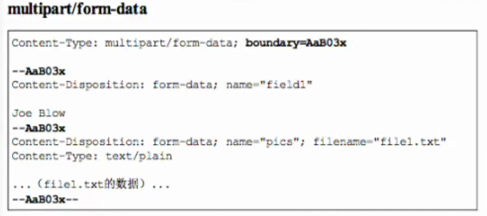
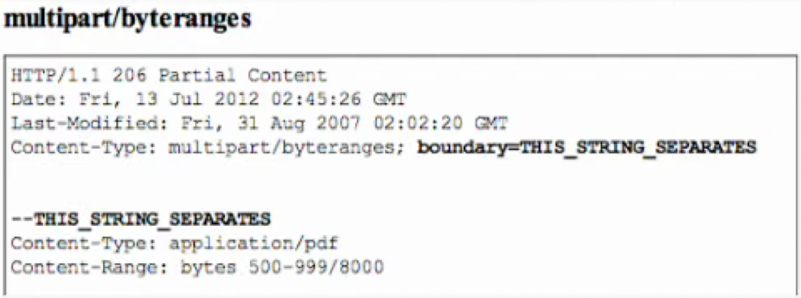
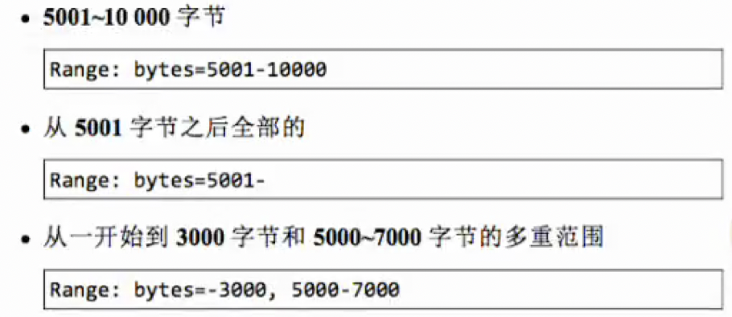
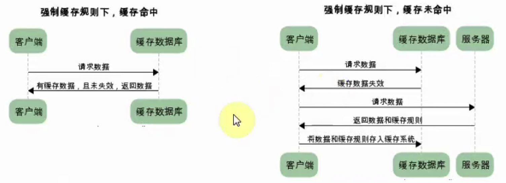
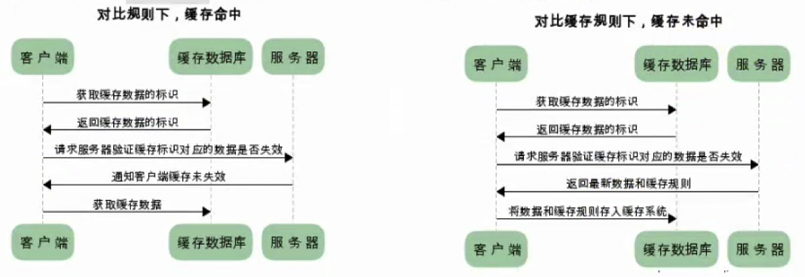

# HTTP和TCP

### HTTP

#### 编码

HTTP可以在传输过程中通过编码提升传输效率，但是会消耗更多的CPU时间。

##### 编码压缩

发送文件时可以先用ZIP压缩功能后再发送文件。

如：gizp、compress、deflate、identify

##### 分割发送的分块传输编码

请求的实体在尚未传输完成前浏览器不能显示，所以在传输大容量数据时，通过吧数据分割成多块，能让

##### 多部分对象集合

- 一份报文主体中可以包含多类型实体。
- 使用boundary字符串来划分多部分对象指名的各类实体。在各个实体起始行之前插入--标记，多部分对象集合最后插入--标记。

###### multipart/form-data

上传表单时使用multipart/form-data

###### multipart/byteranges

状态码(Partical Content)响应报文中包含多个范围时使用

##### 获取部分内容的范围请求

为了实现中断恢复下载的需求，需要能下载指定的下载的实体范围。

- 请求头中的Range来指定资源的byte范围。
- 响应会返回状态码206响应报文
- 对于多重范围的范围请求，响应会在首部字段 `Content-Type`中标明 `multipart/byteranges`

byte范围的指定形式：

#### 内容协商

- 首部字段
  - Accept
  - Accept-Charset
  - Accept-Encoding
  - Accept-Language
  - Content-Language
- 协商类型
  - 服务器驱动
  - 客户端驱动协商
  - 透明协商

#### 状态码

状态码负责表示客户端请求的返回结果、标记服务器端是否正常、通知出现的错误

##### 状态码类别

| 类别 | 原因短语                       |
| ---- | ------------------------------ |
| 1XX  | Infomational(信息性状态码)     |
| 2XX  | Success(成功状态码)            |
| 3XX  | Redirection(重定向)            |
| 4XX  | Client Error(客户端错误状态码) |
| 5XX  | Server Error(服务器错误状态码) |

##### 2XX 成功

- 200：OK 客户端发过来的数据被正常处理
- 204：Not Content 正常响应，没有实体
- 206：Partial Content 范围请求，返回部分数据，响应报文中由Content-Range指定实体内容

##### 3XX 重定向

- 301：Moved Permanently 永久重定向
- 302：Found 临时重定向，规范要求方法名不变，但是实际上方法名都会被改变
- 303：See Other 和302类似，但必须用GET方法
- 304：Not Modified 状态未改变，配合(If-Match、If-Modified-Since、If-None_Match、If-Range、If-UnModified-Since)
- 307：Temporary Redirect 临时重定向，不改变请求方法

##### 4XX 客户端错误

- 400：Bad Request 请求报文语法错误
- 401：unauthorized 需要认证
- 403：Forbidden 服务器拒绝访问的资源
- 404：Not Found 服务器上无法找到资源

##### 5XX 服务器端错误

- 500：Internal Server Error 服务器故障
- 503：Service Unavailable 服务器处于超负载或者正在停机维护

### Web服务器

#### 虚拟主机

一台HTTP服务器上搭建多个Web站点，客户端发送请求时必须在Host首部完整指定主机名或域名的URL。

#### 通信转发程序：代理、网关

##### 代理

代理就是客户端和服务器的中间人

###### 为啥使用代理？

- 利用缓存技术减少网络流量
- 组织内部针对网站进行访问控制
- 获取访问日志

###### 代理的分类

- 缓存代理：会预先吧资源副本保存在服务器上
- 透明代理：不对报文进行任何加工

##### 网关

接收从客户端发来的数据时，会转发给其他服务器处理，再由自己返回。

- 使通信线路上的服务器提供非HTTP协议服务
- 提高通信安全性

#### 首部

#### 通用首部字段

| 首部字段名        | 说明                       |
| ----------------- | -------------------------- |
| Cache-Control     | 控制缓存行为               |
| Connection        | 链接的管理                 |
| Date              | 报文日期                   |
| Pragma            | 报文指令                   |
| Trailer           | 报文尾部的字段             |
| Transfer-Encoding | 指定报文主体的传输编码方式 |
| Upgrade           | 升级为其他协议             |
| Via               | 代理服务器信息             |
| Warning           | 错误通知                   |

#### 请求首部字段

| 首部字段名          | 说明                                        |
| ------------------- | ------------------------------------------- |
| Accept              | 用户代理可处理的媒体类型                    |
| Accept-Charset      | 优先的字符集                                |
| Accept-Encoding     | 优先的编码                                  |
| Accept-Langulage    | 优先的语言                                  |
| Authorization       | 认证信息                                    |
| Expect              | 期待服务器的特定行为                        |
| From                | 用户的电子邮箱地址                          |
| Host                | 请求资源所在的服务器                        |
| If-Match            | 比较实体标记                                |
| If-Modified-Since   | 比较资源的更新时间                          |
| If-None-Match       | 比较实体标记                                |
| If-Range            | 资源未更新时发送实体Byte的范围请求          |
| If-Unmodified-Since | 比较资源的更新时间(和If-Modified-Since相反) |
| Max-Forwards        | 最大传输条数                                |
| Proxy-Authorization | 代理服务器需要客户端认证                    |
| Range               | 实体字节范围请求                            |
| Referer             | 请求中的URI的原始获取方                     |
| TE                  | 传输编码的优先级                            |
| User-Agent          | HTTP客户端程序的信息                        |

#### 响应首部字段

| 首部字段名         | 说明                         |
| ------------------ | ---------------------------- |
| Accept-Ranges      | 是否接受字节范围             |
| Age                | 资源的创建时间               |
| ETag               | 资源的匹配信息               |
| Location           | 客户端重定向至指定的URI      |
| Proxy-Authenticate | 代理服务器对客户端的认证信息 |
| Retry-After        | 再次发送请求的时机           |
| Server             | 服务器的信息                 |
| Vary               | 代理服务器缓存的管理信息     |
| www-Authenticate   | 服务器对客户端的认证         |

#### 实体首部字段

| 首部字段名       | 说明                 |
| ---------------- | -------------------- |
| Allow            | 资源可支持的HTTP方法 |
| Content-Encoding | 实体的编码方式       |
| Content-Language | 实体的自然语言       |
| Content-Length   | 实体的内容大小(字节) |
| Content-Location | 替代对应资源的URI    |
| Content-MD5      | 实体的报文摘要       |
| Content-Range    | 实体的位置范围       |
| Content-Type     | 实体主体的媒体类型   |
| Expires          | 实体过期时间         |
| Last-Modified    | 资源的最后修改时间   |

#### 缓存

##### 缓存的作用

- 减少冗余的数据传输，节省了网费。
- 减少了服务器的负担，大大提高了网站的性能。
- 加快了客户端加载网页的速度。

##### 缓存的分类

强制缓存如果生效，不需要和服务器发生交互，而对比缓存不管是否生效，都需要与服务器发生交互。

两类缓存规则可以同时存在，强制缓存优先级高于对比缓存，也就是说，当执行强制缓存的规则时，如果缓存生效，直接使用缓存，不再执行对比缓存规则。

###### 强制缓存

强制缓存，在缓存数据未失效的情况下，可以直接使用缓存数据，那么浏览器是如何判断缓存数据是否失效呢？我们知道，在没有缓存数据的时候，浏览器向服务器请求数据时，服务器会将数据和缓存规则一并返回，缓存规则信息包含在响应header中。

###### 对比缓存

对比缓存，顾名思义，需要进行比较判断是否可以使用缓存。

浏览器第一次请求数据时，服务器会将缓存标识与数据一起返回给客户端，客户端将二者备份至缓存数据库中。

再次请求数据时，客户端将备份的缓存标识发送给服务器，服务器根据缓存标识进行判断，判断成功后，返回304状态码。通知客户端比较成功，可以使用缓存数据。

##### 通过最后修改时间来判断缓存是否可用

1. 响应时服务端通过响应头`Last-Modified`来告诉客户端次资源的最后修改时间。
2. 下次请求该资源时发现资源具有`Last-Modified`声明，则把请求头`If-Modified-Since`设置为上次响应的`Last-Modified`的时间。
3. 服务器收到请求后，将请求头`If-Modified-Since`的时间和请求资源的最后修改时间做对比，若有变动，则响应最新的资源并返回200状态码。
4. 若时间相等，则说明资源没有被修改，直接响应304状态码，客户端会直接从缓存中获取。

###### 最后修改时间存在的问题

-  某些服务器不能精确得到文件的最后修改时间，这样无法通过最后修改时间来判断文件是否更新了。
- 某些文件的修改非常频繁，能精确到秒级以下的修改，但是最后修改时间只能精确到秒。
- 一些文件的最后修改时间改变了，但是文件内容没变，我们不希望客户端认为这个文件修改了。
- 如果同样的一个文件位于多个CDN服务器上的时候，内容虽然一样，但修改时间不一样。

##### Etag

ETag是实体标签的缩写，根据实体内容生成的一段hash字符串，可以标识资源的状态。当资源发生改变时，ETag也随之发生变化。ETag是服务端产生的，然后发给客户端。

1. 客户端想判断缓存是否可用，可以先获取缓存中文档的ETag，然后通过`If-None-Match`发送请求给Web服务器询问此缓存是否可用。
2. 服务器收到请求，将服务器中此资源的ETag，跟请求头中的`If-None-Match`相比较，如果值是一样的，说明缓存还是最新的，服务器将发送304响应码给客户端表示缓存未修改过，可以使用。
3. 如果不一样则服务器将发送新的资源给客户端。

##### 如何强制缓存

浏览器会将文件缓存到Cache目录，第二次请求时浏览器会先检查Cache目录下是否含有该文件，如果有，并且还没到`Expires`设置的时间，即文件还没有过期，那么此时浏览器将直接从Cache目录中读取文件，而不再发送请求。

`Expires`是服务器响应消息头字段，在响应http请求时告诉浏览器在过期时间前浏览器可以直接从浏览器缓存取数据，而无需再次请求，这是HTTP1.0的内容，现在浏览器均默认使用HTTP1.1，所以基本可以忽略。

`Cache-Control`与Expires的作用一致，都是指明当前资源的有效期，控制浏览器是否直接从浏览器缓存取数据还是重新发请求到服务器取数据，如果同时设置的话，其优先级高于Expires。

###### Cache-Control

- private：客户端可以缓存
- public：客户端和代理服务器都可以缓存
- max-age=60：缓存内容将在60s之后失效
- no-cache：需要使用对比缓存验证数据，强制向服务器再次验证
- no-store：所有内容都不会缓存，强制缓存和对比缓存都不会触发

如：Cache-Control: private, max-age=60, no-cache
