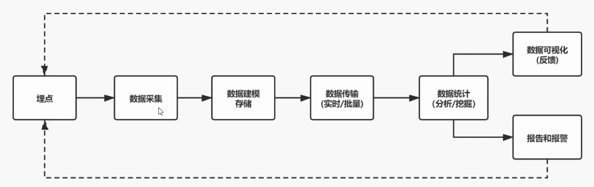

### 前端监控目标

> 关注业务稳定性的人，运气都不会太差~

**稳定性**

| 错误名称 | 备注                       |
| -------- | -------------------------- |
| JS错误   | JS执行错误或者promise      |
| 资源异常 | script、link等资源加载异常 |
| 接口错误 | ajax或fetch请求接口异常    |
| 白屏     | 页面空白                   |

**用户体验**

| 错误名称                                      | 备注                                                         |
| --------------------------------------------- | ------------------------------------------------------------ |
| 加载时间                                      | 各个阶段的加载时间                                           |
| TTFB（Time Of First Byte，首字节时间）        | 指浏览器发起第一个请求到数据返回第一个字节所消耗的时间，这个时间包含了网络请求时间、后端处理时间等 |
| FP（First Paint，首次绘制）                   | 首次绘制包括了任何用户自定义的背景绘制，它是将第一个像素点绘制到屏幕的时刻 |
| FCP（First Content Paint，首次内容绘制）      | 首次内容绘制是浏览器将第一个DOM渲染到屏幕的时间，可以是任何文本、图像、SVG等的时间 |
| FMP（First Meaningful Paint，首次有意义绘制） | 首次有意义绘制是页面可用性的量度标准                         |
| FID（First Input Delay，首次输入延迟）        | 用户首次和页面交互到页面相应交互的时间                       |
| 卡顿                                          | 超过50ms的长任务                                             |

**业务**

| 错误名称       | 备注                             |
| -------------- | -------------------------------- |
| PV             | page view即页面浏览量或点击量    |
| UV             | 指访问某个站点的不同IP地址的人数 |
| 页面的停留时间 | 用户在每一个页面的停留时间       |

### 前端监控流程

- 前端埋点
- 数据上报
- 分析和计算：将采集到的数据进行加工汇总
- 可视化展示：将数据按各种维度进行展示
- 监控报警：发现问题后按一定的条件触发报警



#### 常见的埋点方案

##### 代码埋点

代码埋点就是以嵌入代码的形式进行埋点，比如需要监控用户的点击事件，会选择在用户点击时插入一段代码，保存这个监听行为或者将监听行为以某一种数据格式直接传递给服务端。

例如，我们可以在用户点击某个按钮时，手动插入代码来记录用户行为，如下所示：

```html
<button onclick="track('button_click')">点击我</button>

<script>
  function track(action) {
    // 发送数据到后台进行分析
    // ...
  }
</script>
```

**优点**

- 可以在任意时刻，精准的发送或保存所需要的数据信息。

**缺点**

- 工作量大

##### 可视化埋点

通过可视化的方式在页面上选择需要监控的元素，自动生成代码并插入到页面中进行数据收集。将业务代码和埋点代码分离，提供一个可视化交互的页面，输入为业务代码，通过这个可视化系统，可以在业务代码中自定义的增加埋点事件等等，最后输出的代码耦合了业务代码和埋点代码。

可视化埋点其实是用系统来代替手工插入埋点代码。

如：神策、GrowingIO

##### 无痕埋点

通过在页面中注入代码，自动收集数据。前端的任意一个事件都被绑定一个标识，所有事件都被记录下来。通过定期上传记录文件，配合文件解析，解析出来我们想要的数据，并生成可视化报告供专业人员分析。无痕埋点的优点在于不需要修改原有代码，不影响页面性能，但需要保证注入的代码不会对页面产生影响。

```html
<script>
  document.addEventListener('click', function(event) {
    // 发送数据到后台进行分析
    // ...
  });
</script>
```

**优点**

- 采集全量数据，不会出现漏埋和误埋等现象。

**缺点**

- 给数据传输和服务器增加压力
- 无法灵活定制数据结构

### 前端监控指标

#### JS异常监控

通过监听全局未捕获的错误。

```js
window.addEventListener('error', function (event) {}, true);
```

#### Promise异常监控

通过监听全局的`unhandledrejection`事件。

```js
window.addEventListener('unhandledrejection', function (event) {}, true)
```

#### JS、CSS资源文件加载异常监控

通过监听全局错误的`event.target`是否有`src`或者`href`属性来判断是否是文件加载错误。

```js
window.addEventListener('error', function (event) {
    if (event.target && (event.target.src || event.target.href)) {}
}, true);
```

#### 白屏检测

根据检测时机，可以有：
- onload：在页面某个生命周期时进行检测
- onerror：在检测到页面异常时进行白屏判断
- Mutation Observer：Mutation Observer API可以监听DOM变化，可以在DOM变化时进行检测。
- 定时器：定时器定时检测或轮训检测
- requestAnimationFrame：实时监测

根据检测方法，可以有：
- 判断根DOM或关键DOM：页面加载完成后判断DOM
- 截图识别：对页面进行截图，将截图与一张纯白的图片做对比，判断两者是否足够相似
- elementsFromPoint api 采样

白屏检测的方案众多，也各有优劣，不同情况根据不同的检测时机可搭配不同的检测方法。

**判断DOM**
```js
document.addEventListener("load", function() {
  setTimeout(function() {
    if (document.querySelectorAll("body *").length === 0) {
      // 页面白屏
    }
  }, 3000);
});
```
优点：简单易实现。
缺点：不同项目情况不一样，很难用同一个判断所有项目和页面（如有的项目存在常驻节点，有的页面有骨架屏等），而且无法准确判断页面是否真正显示内容，易误判。

**关键点采样检测**
```js
/**
 * 白屏检测方法：关键点采样检测法
 * 原理：在页面有元素的方位选取点进行元素检测，这里采用以中心为基点的十字轴采样18个点，检测每个点对应的元素是否是原始的标签元素，如果是则认为该点是空白点，空白点达到阈值则发送白屏监控日志
 */

export function blankScreen() {
    // 关键点的元素是这些则认为是空白点
    let wrapperElements = ['html', 'body', '#container', '.content']
    let emptyPoints = 0;

    function getSelector(element) {
        if (element?.id) {
            return "#" + element.id;
        } else if (element?.className) {
            return "." + element.className.split(' ').filter(item => !!item).join('.')
        } else {
            return element?.nodeName.toLowerCase()
        }
    }
    function isWrapper(element) {
        let selector = getSelector(element)

        if (wrapperElements.indexOf(selector) != -1) {
            emptyPoints++;
        }
    }

    // 在页面onload事件完成后调用
    onload(function () {
        // 以中心为基点的横纵轴各取9个点作为采样点
        for (let i = 1; i <= 9; i++) {
            let xElement = document.elementFromPoint(window.innerWidth * i / 10, window.innerHeight / 2)
            let yElement = document.elementFromPoint(window.innerWidth / 2, window.innerHeight * i / 10)

            isWrapper(xElement)
            isWrapper(yElement)
        }
        // 空白点超过阈值发送日志
        if (emptyPoints >= 18) {
            let centerElement = document.elementFromPoint(window.innerWidth / 2, window.innerHeight / 2)
            tracker.send({
                kind: 'stability',
                type: 'blank',
                emptyPoints,
                screen: window.screen.width + "X" + window.screen.height,
                viewPoint: window.innerWidth + "X" + window.innerHeight,
                selector: getSelector(centerElement)
            })
        }
    })
}
```

导致白屏的原因通常如下：
- 资源加载失败页面依赖的关键资源(CSS、JS、图片等)加载失败
- 资源加载延迟资源加载延迟(或阻塞)

因此白屏检测通常需要配合异常信息来定位产生白屏的原因。

#### 加载时间


navigationStart：导航开始的时间点，通常是浏览器开始加载文档的时间。也表示上一个文档卸载结束时的unix时间戳，如果没有上一个文档，则等于fetchStart。

unloadEventStart：表示前一个网页（与当前页面同域）unload的时间戳，如无前一个网页unloade或前一个网页与当前不同域，则为0。

unloadEventEnd: 返回前一个unload时间绑定的回调执行完毕的时间戳。

redirectStart：前一个Http重定向发送时的时间。有跳转且是同域名内重定向，否则为0。

redirectEnd：前一个Http重定向完成时的时间。有跳转且是同域名内重定向，否则为0。

workerStart：浏览器开始初始化一个代理服务器，最常见用途就是拦截和处理网络请求。

fetchStart：浏览器准备使用http请求文档的时间，在检查本地缓存之前。

domainLookupStart/domainLookupEnd：DNS域名查询开始/结束的时间，如果使用本地缓存（则无需DNC查询）或持久链接，则和fetchStart一致。

connectStart：HTTP（TCP）开始或重新建立链接的时间，如果是持久链接，则和fetchStart一致。

connectEnd：HTTP（TCP）完成建立链接的时间（完成握手），如果是持久链接，则和fetchStart一致。

secureConnectionStart：Https链接开始的时间，如果不是安全链接则为0。

requestStart：http在建立链接之后，正式开始请求真实文档的时间，包括从本地读取缓存。

responseStart：http开始接收响应的时间（获取第一个字节），包括从本地读取缓存。

responseEnd：http响应接收完全的时间（最后一个字节），包括从本地读取缓存。

domLoading：开始解析渲染DOM树的时间。

domInteractive：完成解析DOM树的时间，代表可以操作DOM，用户代理此时将文档的 readyState 设置为"interactive"。

domContentLoadedEventStart：DOMContentLoaded事件开始的时间点，表示DOM树构建完成，但外部资源（如图片、样式表等）可能仍在加载。

domContentLoadedEventEnd：DOMContentLoaded事件结束的时间点，表示DOM树构建完成且所有外部资源加载完成。

domComplete：DOM树解析完，资源也准备就绪，用户代理此时将文档的 readyState 设置为"complete"。

loadEventStart：load事件发送给文档，即load函数开始执行时。

loadEventEnd：load函数执行完毕的时间。

参考：https://juejin.cn/post/7223280402475089978

```js
const { /* 可以取得以上的各个时间 */ } = performance.timing;

// TODO: performance.timing未来可能被废弃，官方提供了PerformanceNavigationTiming带代替，但部分指标值不能直接获取，需要一些额外的计算
```

| 字段             | 描述                     | 计算方式                                              | 意义                                                         |
| ---------------- | ------------------------ | ----------------------------------------------------- | ------------------------------------------------------------ |
| unload           | 前一个页面卸载耗时       | unloadEventEnd - unloadEventStart                     |                                                              |
| redirect         | 重定向耗时               | redirectEnd - redirectStart                           | 重定向的时间                                                 |
| appCache         | 缓存耗时                 | domainLookupStart - fetchStart                        | 读取缓存时间                                                 |
| dns              | DNS解析耗时              | domainLookupEnd - domainLookupStart                   | 可观察域名解析是否正常                                       |
| tcp              | TCP连接耗时              | connectEnd - connectStart                             | 建立连接耗时                                                 |
| ssl              | SSL安全耗时              | connectEnd - secureConnectionStart                    | 反映数据安全连接建立耗时                                     |
| ttfb             | Time To First Byte耗时   | responseStart - requestStart                          | 页面发出请求到接受到应答数据的第一个字节的耗时，反映服务器的处理能力 |
| response         | 响应数据传输耗时         | responseEnd - responseStart                           | 可用于观察网络是否正常                                       |
| dom              | DOM解析耗时              | domInteractive - responseEnd                          | 观察DOM结构是否合理，是否有JS阻塞页面解析                    |
| dcl              | DOMContentLoaded事件耗时 | domContentLoadedEventEnd - domContentLoadedEventStart | 当初始的 HTML 文档被完全加载和解析完成之后，DOMContentLoaded 事件被触发，而无需等待样式表、图像和子框架的完成加载。（DOMContentLoaded 事件在html文档加载完毕，并且 html 所引用的内联 js、以及外链 js 的同步代码都执行完毕后触发。） |
| resources        | 资源加载耗时             | domComplete - domContentLoadedEventEnd                | 可观察文档流是否过大                                         |
| domReady         | DOM阶段渲染耗时          | domContentLoadedEventEnd - fetchStart                 |                                                              |
| 首次渲染耗时     | 首次渲染耗时             | responseEnd - fetchStart                              | 加载文档看到第一帧非空页面的时间，也叫白屏时间               |
| 首次可交互时间   | 首次可交互时间           | domInteractive - fetchStart                           | DOM解析完成时间，此时document.readyState为interactive        |
| 包首时间耗时     | 包首时间                 | responseStart - domainLookupStart                     | DNS解析到响应返回给浏览器第一个字节的时间                    |
| 页面完全加载时间 | 页面完全加载时间         | loadEventStart - fetchStart                           |                                                              |
| onLoad           | onLoad事件耗时           | loadEventEnd - loadEventStart                         |                                                              |

#### 性能指标

| 字段 | 描述                                     | 备注                                                         |
| ---- | ---------------------------------------- | ------------------------------------------------------------ |
| FP   | First Paint（首次绘制）                  | 包括了任何用户自定义的背景绘制，它是首先将像素绘制到屏幕的时刻。 |
| FCP  | First Content Paint（首次内容绘制）      | 是浏览器将第一个DOM渲染到屏幕的时间                          |
| FMP  | First Meaningful Paint（首次有意义绘制） | 页面有意义的内容渲染时间                                     |
| LCP  | Largest Contentful Paint（最大内容渲染） | 代表在viewport中最大的页面元素加载时间                       |
| DCL  | DomContentLoaded（DOM加载完成）          | 当HTML文档被完全加载和解析完成之后，DOMContentLoaded事件被触发，无需等待样式表、图像等资源加载 |
| L    | onLoad                                   | 当依赖的资源全部加载完毕后才会触发                           |
| TTI  | Time To Interactive（可交互时间）        | 用于标记应用已进行视觉渲染并可能靠响应用户输入的时间点       |
| FID  | First Input Delay（首次输入延迟）        | 用户首次和页面交互（单击链接、点击按钮等）到页面响应交互的时间 |

#### 卡顿

大部分的浏览器或显示设备的屏幕刷新率是60HZ，也就是16.6ms渲染一次。

在这16ms 内浏览器要完成的工作有：

- 脚本执行（JavaScript）：脚本造成了需要重绘的改动，比如增删 DOM、请求动画等
- 样式计算（CSS Object Model）：级联地生成每个节点的生效样式。
- 布局（Layout）：计算布局，执行渲染算法
- 重绘（Paint）：各层分别进行绘制（比如 3D 动画）
- 合成（Composite）：将位图发送给合成线程。

如果某次渲染花了20ms时间，那么他的渲染效果不会再浏览器第一帧16ms的时候显示，这个渲染结果会在第一帧32ms的时候显示。这就掉了一帧。

如何监控卡顿？

**requestAnimationFrame**

https://developer.mozilla.org/zh-CN/docs/Web/API/Window/requestAnimationFrame

使用`requestAnimationFrame` API，在每一帧绘制前记录当前时间戳，与上一帧的时间戳进行比较，如果超过一定阈值，则认为发生了卡顿。

```js
let fps = 0;
let lastTime = performance.now();
let frameCount = 0;

function calculateFPS(currentTime) {
  frameCount++;
  if (currentTime > lastTime + 1000) {
    fps = Math.round((frameCount * 1000) / (currentTime - lastTime));
    frameCount = 0;
    lastTime = currentTime;
    sendStatistics(fps);
  }
  requestAnimationFrame(calculateFPS);
}

function sendStatistics(fps) {
	// 统计逻辑
}

calculateFPS(performance.now());
```

优点：能够较为精确地获取到页面的帧率数据，从而判断是否存在卡顿情况。

缺点：需要不断地计算帧率，对性能有一定影响。

**Long Tasks API**

https://developer.mozilla.org/zh-CN/docs/Web/API/PerformanceLongTaskTiming

利用performance API中的Long Task API来检测长任务的执行情况，从而判断是否发生了卡顿。

但需要注意的是，这个API目前只在Chrome和Edge中支持。

**利用定时器检测页面响应时间**

通过测量页面执行任务所花费的时间来评估页面的响应性能。如果页面在特定的时间间隔内无法完成响应，那么就可以认为发生了卡顿。

通常情况下，浏览器对于JavaScript代码的执行会优先处理用户交互事件、渲染等重要的任务，只有在空闲时间才会执行定时器的回调函数。因此，如果页面在给定的时间内无法完成响应，就可以判断为存在卡顿问题。

```js
let startTime = 0;

function checkPageResponsiveness() {
  startTime = performance.now();
  
  setTimeout(function() {
    const endTime = performance.now();
    const duration = endTime - startTime;
    
    if (duration >= 200) {
      sendStatistics(duration);
    }
  }, 200);
}

function sendStatistics(duration) {
	// 统计逻辑
}

checkPageResponsiveness();
```

优点：通过检测页面响应时间，能够较为直观地判断页面是否存在卡顿情况。

缺点：不能准确判断卡顿的具体原因，仅能检测页面的相应时间超过阈值。

#### PV、UV、用户使用时间

**PV：**访问量，即Page View, 具体是指网站的是页面浏览量或者点击量。同 一个人浏览你网站同一个页面，不重复计算pv量，点100次也算1次。

**UV：**独立访客，即Unique Visitor,访问您网站的一台电脑客户端为一个访客。根据IP地址来区分访客数，在一段时间内重复访问，也算是一个UV。

UV统计需要依赖用户唯一标识。

```js
window.onload = function() {};
window.onbeforeunload = function() {};
```

但对于用户使用时长，仅通过页面加载和卸载来统计可能会存在很大误差。页面可能打开后一直不操作，也可能直接关闭浏览器。
因此另一种统计方法是监听用户点击事件，每隔几秒进行一次打点记录，计算两次点击时间差，超过一定的阈值之后如果用户没有操作则代表用户下线。