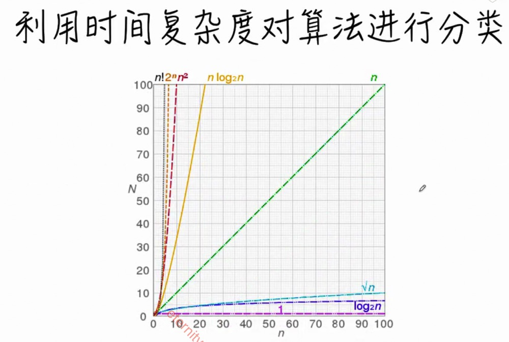
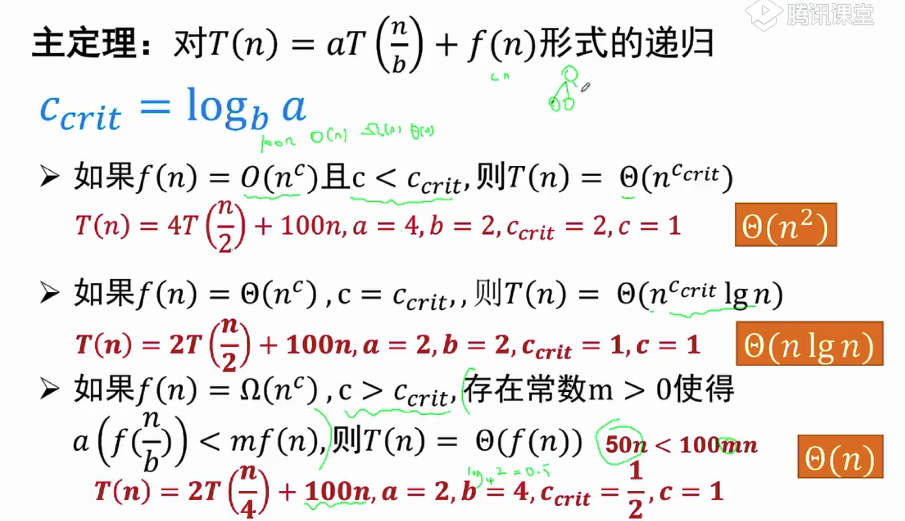
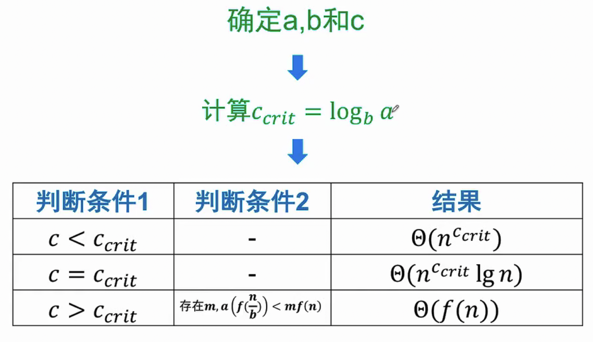
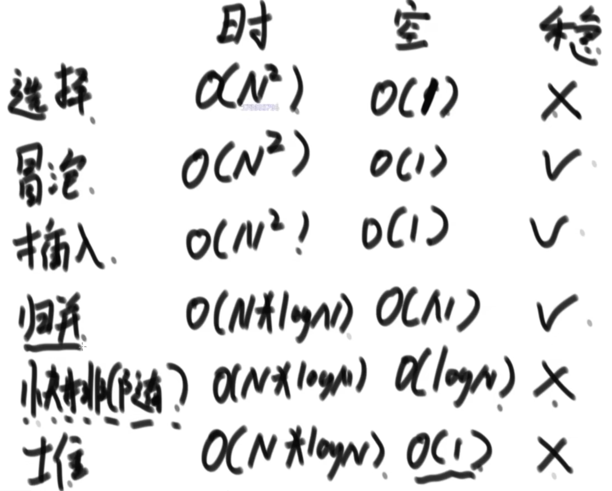

### 复杂度分类



### master公式

适用于子问题规模等规模的递归。





```js
function getMax(A) {
    return process(A, 0, A.length - 1)
}

function process(A, l, r) {
    if (l == r) {
        return A[l]
    }

    for (let i = l; i <= r; i++) {
        console.log(A[i]);
    }

    const mid = l + ((r - l) >> 1)
    const lMax = process(A, l, mid)
    const rMax = process(A, mid + 1, r)
    return Math.max(lMax, rMax)
}
```

例如，以上递归可用master公式表示为：T(n) = 2 * T(1 * n/2) + O(n)，如果没有中间for循环的console.log(A[i])，其表达式则为：T(n) = 2 * T(1 * n/2) + O(1)。

### 排序算法的稳定性及其汇总

同样值的个体之间，如果不因为排序而改变相对次序，那这个排序就是有稳定性的，否则就没有。

不具备稳定性的排序：选择排序、快速排序、堆排序

具备稳定性的排序：冒泡排序、插入排序、归并排序、一切桶排序思想下的排序

目前没有找到时间复杂度O(n*logn)，额外空间复杂度O(1)，又稳定的排序。



基于比较的排序，目前无法找到时间复杂度O(n*logn)以下的排序。

基于比较的排序，目前也无法找到时间复杂度O(n*logn)，空间复杂度O(n)以下，又稳定的排序。

常见的坑：

- 归并排序的额外空间复杂度可以变成O(1)，但非常难：归并排序内部缓存法。
- “原地归并排序”都不靠谱，会让归并排序的时间复杂度变为O(n^2)。
- 快速排序可以做到稳定性，但是非常难，会将空间复杂度变为O(n)，参考论文：“01 table sort”。
- 所有的改进都不重要，因为目前没有找到时间复杂度O(n*logn)，额外空间复杂度O(1)，又稳定的排序。
- 有一个题：奇数放在数组左边，偶数放在数组右边，要求原始相对次序保持不变。奇偶问题属于01问题，可以使用快排实现(partition的左右划分)，但是很难保持其有序。

工程上对排序的改进：

- 充分利用O(n*logn)和O(n^2)排序各自的优势。例如：

  ```java
  public static void quickSort(int[] arr, int l, int r) {
    if (l == r) {
      return
    }
    if (l > r -60) {
      // 在arr[l, r]范围内进行插入排序
      // O(n^2)在小样本量的时候更快
      return
    }
    swap(arr, l + (int)(Math.random() * (r - l + 1)), r)
    int[] p = partition(arr, l, r);
    quickSort(arr, l, p[0] - 1)
    quickSort(arr, p[1] + 1, r)
  }
  ```

- 稳定性考虑。例如：系统自带的sort方法，对于基础类型数据使用快排，无需考虑稳定性问题，非基础类型使用归并排序，保持稳定性。

### 哈希表、有序表

哈希表：

- 有无伴随数据是HashMap和HashSet的唯一区别，底层的实际结构是一致的。(JS中的Map和Set在内部表示为哈希表，但表现上来看并不属于严格的哈希表，比如它保证插入顺序。)
- 使用哈希表增删改查的操作，可以认为时间复杂度为O(1)，但是常数时间比较大。
- 放入哈希表的数据，基础类型使用值传递，非基础类型按引用传递。

有序表：

- 有序表和哈希表的区别是，有序表把key按照顺序组织起来，而哈希表不组织。
- 红黑树、AVL树、size-balance-tree和跳表等都属于有序表结构，只是底层具体实现不同。
- 有序表具有：firstKey、lastKey、floorKey、ceillingKey等操作。
- 有序表增删改查的操作，时间复杂度为O(logn)。
