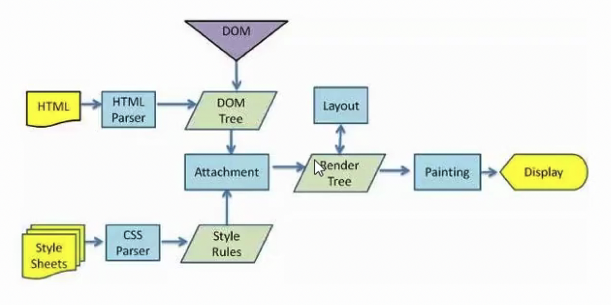
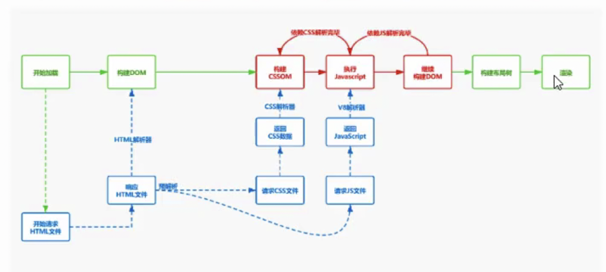
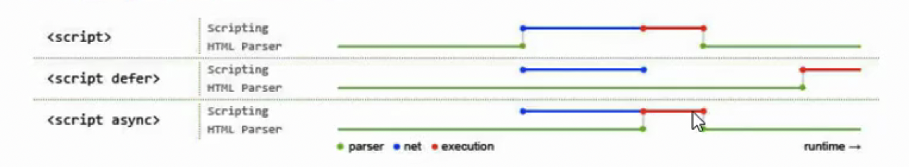

# 浏览器渲染原理

### 渲染流程

#### 浏览器的五个进程


- 浏览器进程：负责页面显示、用户交互、子进程管理、提供存储等。
- 渲染进程：每个页卡有单独的渲染进程，用于渲染页面。
- 网络进程：主要处理网络资源加载。
- GPU进程：动画、3D等的绘制、提高性能。
- 插件进程：处理插件。

#### 从输入URL到浏览器显示，页面发生了什么？

从进程角度：

- 用户输入url（如果输入关键字，会将关键字生成地址），开始导航，该过程发生在浏览器进程中。
- 浏览器进程会准备一个渲染进程用于渲染页面。
- 网络进程加载资源，最终加载的交给渲染进程处理。
- 渲染进程进行渲染。

从网络角度：

- 根据url，先去查找缓存，查找缓存是否过期，如果没过期则直接返回缓存内容。
- 如果没有缓存，需要发起请求。通过DNS协议，将域名解析成ip地址。
- 如果请求是HTTPS，则需要进行SSL协商。
- 根据ip地址来寻址，由于同一个域名最多能建立6个tcp连接，因此请求需要排队等待。
- tcp创建连接，传输数据。
- 浏览器根据服务响应的http状态码进行不同的操作。如接收到301、302响应，浏览器会根据重定向地址，重新进行新的网络请求。如果接受到304则会去查询浏览器缓存等等。

http历史：

- http 0.9：只负责传输html，最早没有请求头和响应头，无法传输文本之外的数据。
- http 1.0：提供了http header，可以根据不同的header处理不同的资源。
- http 1.1：默认开启keep-alive，保持连接，可以在一个tcp连接上进行多个http的请求，对链路进行了复用。但是每个域名仍可以同时建立6个tcp连接，但服务器处理请求是管线化的，会产生队头阻塞。
- http 2.0：用同一个tcp链接来发送数据，一个域名一个tcp连接，解决服务器队头阻塞问题。
- http 3.0：不再基于tcp，解决tcp的队头阻塞问题。

浏览器接受到资源后如何处理：



- 浏览器无法直接使用HTML，需要将HTML转化成DOM树（document）。
- 浏览器无法解析纯文本的CSS样式，需要对CSS进行解析，解析成CSSOM（document.styleSheets）。
- 计算出DOM树中每个节点的具体样式（Attachment）。
- 创建渲染（布局）树，将DOM树中可见节点添加到布局树中，并结算节点渲染到页面的坐标位置。（layout）
- 通过布局树，进行分层（根据定位属性、透明属性、transform属性、clip属性等）生成图层树。
- 将不同图层进行绘制，转交给合成线程处理，最终生成页面并显示到浏览器上。（Painting、Display）

细化流程：

- 当服务器返回的类型是`text/html`时，浏览器会将收到的数据通过HTMLParse进行解析(边下载边解析)。
- 在解析前会进行预解析操作，会预先加载js、css等文件。
- 然后边解析html边生成DOM树。
- 遇到js时，HTMLPrase会停止解析，下载对应的js脚本并执行。
- 在执行js前，还需要等待当前脚本之上的所有css加载并解析完成(也就是说js依赖css的加载和解析完成)。
- js执行完毕后继续解析剩下的html。



### Perfomance API


| 关键时间节点 | 描述                               | 含义                                          |
| ------ | -------------------------------- | ------------------------------------------- |
| TTFB   | time of first byte(首字节时间)        | 从请求到数据返回第一个字节所消耗的时间                         |
| TTI    | Time of Interactive(可交互时间)       | DOM树构建完毕，代表可以绑定事件                           |
| DCL    | DOMContentLoaded（事件耗时）           | 当HTML文档被完全加载和解析完成之后触发，DOMContentLoaded事件被触发 |
| L      | onLoad（事件耗时）                     | 当依赖的资源全部加在完毕之后触发                            |
| FP     | First Paint（首次绘制）                | 当第一个像素点绘制到屏幕的时间                             |
| FCP    | First Contentful Paint（首次内容绘制）   | 首次绘制任何文本，图像，非空白节点的时间                        |
| FMP    | First Meaningful paint（首次有意义绘制）  | 首次有意义绘制是页面可用性的量度标准                          |
| LCP    | Largest Contentful Paint（最大内容渲染） | 在viewport中最大的页面元素加载的时间                      |
| FID    | First Input Delay（首次输入延迟）        | 用户首次和页面交互（单击链接、点击按钮等）到页面响应交互的时间             |

### 网络优化策略

- 减少HTTP请求数，合并JS、CSS，合理内嵌CSS、JS。

- 合理设置服务器缓存，提高服务器处理速度。（强制缓存、对比缓存）

- 避免重定向，重定向会降低响应速度（301、302）

- 使用dns-prefetch，进行NDS预解析。

- 采用域名分片技术，将资源放到不同的域名下。

- 采用CDN加速访问速度。

- gzip压缩优化，对传输资源进行体积压缩（html、js、css）

- 加载数据优先级：preload（预先请求当前页面需要的资源），prefetch（将来页面中使用的资源），将数据缓存到HTTP缓存中。
  
  ```html
  <link rel="preload" href="style.css" as="style">
  ```

### 关键渲染路径


重排（回流）Reflow：添加元素、删除元素、修改大小、移动元素位置、获取位置相关信息。

重绘Repaint：页面中元素样式的改变并不影响它在文档流中的位置。

> 我们应该尽可能减少回流和重绘


#### 减少回流和重绘

- 脱离文档流

- 渲染时给图片增加固定宽高

- 尽量使用css3动画

- 可以使用will-change提取到单独的图层中

### 静态文件优化

#### 图片优化

##### 图片格式

- jpg：适合彩色丰富的照片、banner图，不适合图形文字、图标(纹理边缘有锯齿感)，不支持透明度。
- png：适合纯色、透明、图标，支持半透明；不适合色彩丰富图片，因为无损存储会导致存储体积大。
- gif：适合动画，可以动的图标，不支持半透明，不适合存储色彩图片。
- webp：适合半透明图片，可以保证图片质量和较小的体积。
- svg：相对比jpg和png，它的体积更小，渲染成本过高，适合小且色彩单一的图标。

##### 图片优化

- 避免空src的图片

- 减少图片尺寸，节约用户流量。

- img标签设置alt属性，提升图片加载失败时的用户体验。

- 原生`load:lazy`图片懒加载，图片进入到可视区域内才会被加载。

- 不同环境下，加载不同尺寸和像素的图片。

  ```html
  
  ```

- 对于较大的图片可以采用渐进式图片。

- 采用base64减少图片请求。

- 采用雪碧图合并图标图片等。

#### HTML优化

- 语义化HTML，代码简介清晰，利于搜索引擎，便于团队开发。
- 提前声明字符编码，让浏览器快速确定如何渲染网页内容。
- 减少HTML嵌套关系，减少DOM节点数量。
- 删除多余空格、空行、注释、及无用的属性等。
- HTML减少iframe使用(父页面需要等待子页面加载完才会加载，因此iframe会阻塞onload事件，所以可以使用动态加载iframe。)
- 避免使用table布局。

#### CSS优化

- 减少样式层数，减少使用通配符，减少伪类选择器。

- 避免使用css表达式，css表达式会频繁求值，当页面滚动或者鼠标移动时都会重新计算。

  ```css
  background-color: expression((new Date()).getHours() % 2 ? "red" : "yellow");
  ```

- 删除空行、注释，减少无意义的单位，进行css压缩。

- 使用外链css可以对css进行缓存。

- 添加媒体字段，只加载有效的css文件。

  ```css
  <link href="index.css" rel="stylesheet" media="screen and (min-width:1024px)" />
  ```

- CSS contain属性将元素进行隔离。

- 减少@import使用，由于@import采用的是串行加载。

#### JS优化

- 通过async、defer异步加载文件。



- 减少DOM操作，缓存访问过的元素。

- 操作不直接应用到DOM上，而应用到虚拟DOM上，最后一次性应用到DOM上。

- 使用webworker解决程序阻塞问题。

- IntersectionObserver

  ```js
  const observer = new IntersectionObserver((changes) => {
      changes.forEach((element, index) => {
          // 如果元素出现到可视区，则把真实src赋给src
          if (element.intersectionRatio > 0) {
              observer.unobserve(element.target);
              element.target.src = element.target.dataset.src;
          }
      });
  });
  function initObserver() {
      const listItems = document.querySelectorAll("img");
      listItems.forEach((item) => {
          observer.observe(item);
      });
  }
  initObserver();
  ```

- 虚拟滚动vertual-scroll-list

- 使用requestAnimationFrame、requestIdleCallback优化。

  

- 尽量避免使用eval，消耗时间久。
- 使用事件委托，减少事件绑定个数。
- 尽量使用canvas动画、css动画，而不是js动画。

#### 字体优化

```css
@font-face {
  font-family: "Bmy";
  src: url("./HelloQuincy.ttf");
  font-display: block;
}
```

FOUT(Flash Of Unstyled Text)：等待一段时间，如果没有加载完成，先显示默认，加载后再进行切换。

FOIT(Flash Of Invisible Text)：字体加载完毕后显示，加载超时降级系统字体。

### 优化策略

- 关键资源个数越多 ，首次页面加载时间就会越长。
- 关键资源的大小，内容越小，下载时间越短。
- 优化白屏：使用内联css和内联js，减少文件下载，减少文件体积。
- 预渲染，打包时进行预渲染。
- 使用SSR加速首屏加载(耗费服务端资源)，有利于SEO优化。首屏利用服务端渲染，后续交互采用客户端渲染。

### 浏览器的存储优化

- cookie：cookie过期时间内一直有效，存储大小4k左右，同时限制字段个数，不适合大量的数据存储，每次请求会携带cookie，主要可以用作身份检查。

  - 设置cookie有效期
  - 根据不同子域划分cookie，减少传输。
  - 静态资源域名和cookie域名采用不同域名，避免静态资源访问时携带cookie。

- localStorage：chrome下最大存储5M，除非手动清除，否则一直存在。利用localStorage存储静态资源，如下：

  ```js
  function cacheFile(url) {
    let fileContent = localStorage.getItem(url);
    if (fileContent) {
      eval(fileContent); // 虽然eval消耗性能，但是比资源请求要好。
    } else {
      let xhr = new XMLHttpRequest();
      xhr.open("GET", url, true)
      xhr.onload = function () {
        let responseText = xhr.responseText;
        eval(responseText);
        localStorage.setItem(url, responseText)
      }
      xhr.send()
    }
  }
  
  cacheFile('/index.js')
  ```

- sessionStorage：会话级别存储，可以用于页面间的穿值。

- indexDB：浏览器的本地数据库（无上限）。

  ```js
  let request = window.indexedDB.open("student", 1);
  
  request.onsuccess = function (event) {
    let db = request.result;
  
    let ts = db.transaction(["student"], "readwrite");
  
    let objectStore = ts.objectStore("student");
  
    objectStore.add({
      name: "Walk dog",
    });
  
    let r = objectStore.get(1);
  
    r.onsuccess = function (e) {
      console.log(e.target.result);
    };
  };
  
  request.onupgradeneeded = function (event) {
    let db = event.target.result;
  
    if (!db.objectStoreNames.contains("student")) {
      let store = db.createObjectStore("student", { autoIncrement: true });
    }
  };
  ```

### 增加体验PWA(Progressive Web App)

webapp用户体验差（不能离线访问），用户粘性低（无法保存入口），pwa就是为了解决这一系列问题，让webapp具有快速、可靠、安全等特点。

- Web App Mainfest：将网站添加到桌面、更类似native的体验。
- Service Worker：离线缓存内容，配合cache API。
- Push Api & Notification Api：消息推送与提醒。
- App Shell & App Skeleton App壳、骨架屏

### LightHouse

使用LightHouse检测页面可优化的项目。