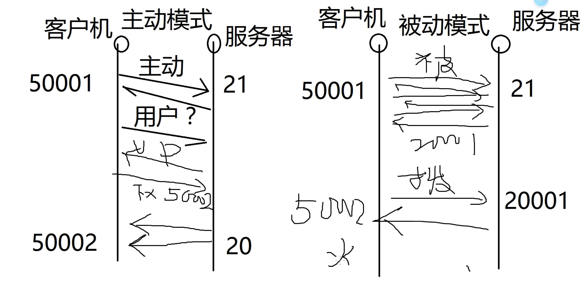

### 一、了解ip地址

#### 1、ip地址

由4个字节，每个4个字节共8位，总和32位组成（xxxxxxxx.xxxxxxxx.xxxxxxxx.xxxxxxxx）

点分十进制（xxx.xx.xxx.x）

ip地址的形式：x.x.x.x x的范围：0-255

#### 2、子网掩码

局域网通信规则：在同一局域网中，所有的ip必须在同一网段中才可以互相通信！

ip地址构成：网络位+主机位（网络位相同的ip地址，为同一网段）

子网掩码：用来确定ip地址的网络位

子网掩码如何确认网络位：与255对应的数字为网络位，与o对应的数字为主机位

常见的子网掩码：

255.0.0.0

255.255.0.0

255.255.255.0

注意：一个ip地址，必须配备一个子网掩码

#### 3、ip地址详解

国际标准组织ISO定义地址分类：五类地址（以ip地址的第一位进行区分）

A类：1-126 默认子网掩码：255.0.0.0

B类：128-191 默认子网掩码：255.255.0.0

C类：192-223 默认子网掩码：255.255.255.0

D类：224-239 组播地址

E类：240.254 科研使用

（如：10.1.1.1属于A类；192.168.1.1属于C类）

总结：当主机位全部置0代表网段，主机位全部置255代表该网段的广播地址

127.0.0.1 是回环地址

#### 4、网关

网关：一个网络的出口，Gateway=GW，一般网关是在路由器上

路由器：可用于连接内外网的设备。

#### 5、DNS

DNS：Domain Name Service 域名服务

1、首先：开始-运行-输入cmd-进入命令行窗口 或者win+r打开运行窗口

ipconfig=查看ip地址基本信息

ipconfig /all=查看IP地址详细信息

 2、测试网络连通性

ping 目标ip地址=测试网络联通性，有去有回即为可以成功通信！

ping -t 目标ip地址=一直ping（不停的ping，除非ctrl+c停止）

ping -n 数字 目标ip地址=修改ping包的数量

ping -l 数字 目标ip地址=修改ping包的大小

注：如ping不通，可能对方不在线，或对方开着防火墙！

 3、手工解析域名

nslookup www.jd.com=手工解析域名的ip地址

### **二、dos基本命令**

#### **1.1 dos命令**

##### **1）基本命令**

```
1、命令：color f0
 帮助：cloor ？
 作用：改变背景及字体颜色
 
2、命令：cls
 作用：清屏
```

##### **2）目录相关命令**

```
3、命令：dir
 作用：浏览当前文件夹的内容（带<dir>标识的为文件夹，否则为文件）
 其他用法：
   dir 指定路径
   dir d:\
   dir d:\pic
   dir /a    #浏览所有内容，包括隐藏内容
 
4、命令：盘符
 作用：切换盘符，如：c: d: e:
 
5、命令：cd..
 作用：退出一级目录

6、命令：cd 文件夹名
 作用：进入文件夹
 
7、Tab键：补全路径功能

8、命令：cd \
 作用：直接退到根目录
 
9、命令：md 文件夹 [文件夹 文件夹...]
 作用：创建文件夹
 
10、命令：rd 文件夹 [文件夹 文件夹...]
 作用：删除空文件夹
 命令：rd 文件夹 /s /q
 作用：无提示删除文件夹
  
11、路径：
  相对路径：针对当前路径有效，如：..\456
  绝对路径：从根开始写路径，如：\123\345
```

##### **3）文件相关命令**

```
12、创建文件方法
  echo 字符串 >> [路径\] 文件名.扩展名
  # >>为追加，>为覆盖
  
13、命令：type 文件名.扩展名
 作用：浏览一个文件内容
 命令：type 文件名.扩展名 | more
 作用：分页显示文件内容

14、命令：del 文件名.扩展名
 作用：删除文件
  del *.txt   # 删除所有txt结尾的文件
  del *.*    # 删除所有文件
  del *.* /s /q # 无提示删除所有文件
```

##### **4）隐藏命令**

```
15、修改文件或文件夹隐藏属性
 命令：
 attrib +h +s +a 文件夹/文件夹名 # 增加隐藏、系统保护、只读属性
 # + 改为 - 为取消修改文件属性
```

##### **5）复制和移动**

```
16、命令：
 复制文件：copy [路径]源文件名 [目标路径]新文件名 
   copy con 1.txt  # 复制屏幕内容到1.txt
 移动文件：move [路径]源文件名 [目标路径]新文件名  #同路径默认改名
 改文件名：ren [路径]源文件名 新文件名
```

##### **6）定时关机或重启**

```
17、命令：定时关机或重启
 shutdown -s -t 秒    # 定时关机
 shutdown -s -f -t 秒  # 定时强制关机
 shutdown -r -t 秒    # 定时重启，同上加上-f，为强制重启
 shutdown -a       # 取消定时
 shutdown -l       # 注销，同logoff命令相同
```

##### **7）其他**

```
18、命令：fsutil file createnew 文件名.扩展名 字节
 作用：生成一个固定字节的空文件
 示例：fsutil file createnew 1.txt 4096000
 
19、命令：accoc.扩展名=扩展名file 
 作用：修改后缀关联性
 示例：accoc.txt=exefile
 
20、命令：taskkill /im 进程名
 作用：关闭进程
 命令：taskkill /im explorer.exe /f
 作用：强制杀死桌面进程
 
21、命令：netstat -ano
 作用：使用ip地址显示本机所有开放的端口，并显示pid
 
22、命令：net share
 作用：显示所有共享
 命令：net share 共享名 /del
 作用：删除共享
 命令：net share net share text=D:\桌面\text
 作用：共享D:\桌面\text
```

#### 	**1.2  批处理**

​	自上而下成批的处理每一条命令，直到执行最后一条!

```
@echo off          # 关闭回显功能，也就是屏蔽过程
title 标题          # 为批处理脚本设置标题
color 0a          # 设置底色为黑，字为绿，color ？可以查看颜色
pause            # 暂停批处理运行
echo.            # 在执行批处理脚本时，可以空一行
>nul 2>nul         # 执行结果不管报不报错都不提示
:1             # 定义标签名 
goto 1           # 实现跳转到区块1
start            # 打开一个文件，什么都不写就打开cmd
%userprofile%        # 取变量userprofile的值
set a=100          # 定义变量a=100
set /p a=          # 定义变量a，用户输入值
taskkill /im explorer.exe /f # 强制杀死桌面进程
ping -n 5 127.0.0.1     # 延迟5s
```

### **三、用户与组管理**

#### **2.1  用户概述**

- 每一个用户登陆系统后，拥有不同的操作权限。
- 每个账户有自己唯一的SID（安全标志符）
- 用户SID：S-1-5-21-426206823-2579496042-14852678-500
- 系统SID：S-1-5-21-426206823-2579496042-14852678
- 用户UID：500
- windows系统管理员 administrator 的UID是 500
- 普通用户的UID是1000开始
- 不同的账户拥有不同的权限，为不同的账户赋权限，也就是为不用账户的SID赋权限！查看SID值：whoami /user
- 账户密码存储的位置：C:\Windows\System32\config\SAM 
- windows系统上，默认密码最长有效期为42天

#### **2.2  内置账户**

- 给人使用的账户：
- administrator  #管理员账户
- guest  #来宾账户（默认禁用，权限最低）
- 计算机服务组件相关的系统账号
- system  #系统账户 == 权限至高无上
- local services  #本地服务账户 == 普通权限
- network services  #网络服务账户 == 普通权限

**配置文件**

每个用户都有自己的配置文件（家目录），在用户第一次登陆时自动产生，路径：

win7/win8/win10  C:\用户\用户名

 xp/win2003          C:\Documents and Settings\用户名

```
net user                       # 查看用户列表
net user 用户名                 # 查看用户详细信息
net user 用户名 密码             # 改密码
net user 用户名 密码 /add        # 创建一个新用户
net user 用户名 /del            # 删除一个用户
net user 用户名 /active:yes/no  # 激活或禁用账户
```

#### **2.3  组管理**

- 组的作用：简化权限的赋予
- 赋权限方式：
- 用户-组-赋权限
- 用户-赋权限

#### **2.4  内置组**

内置组的权限默认已经被系统赋予

- administrators      #管理员组
- guests      #来宾组
- users      #普通用户组，默认
- network      #网络适配组
- print      #打印机组
- Remote Desktop      #远程桌面组

```
net localgroup                  # 查看组列表
net localgroup 组名              # 查看组的成员
net localgroup 组名 /add         # 创建一个新的组
net localgroup 组名 用户名 /add   # 添加用户到组
net localgroup 组名 用户名 /del   # 将用户从组中删除
net localgroup 组名 /del         # 删除组
```

### **四、服务器的远程管理**

#### **3.1  远程管理类型**

windows远程管理有2中类型：

- 远程桌面（图形）
- telnet（命令行）

#### **3.2  远程桌面**

```
步骤：
1、首先将配置网络，并实现客户机与服务器可以互通。
2、服务器开启允许被远程控制：桌面右键属性 -- 远程设置 -- 选择允许 -- 确定。
3、客户机上：开始 -- 运行 -- 输入mstsc打开远程连接工具。
4、在mstsc工具上输入服务器的IP并点击确定
5、输入服务器的账号及密码。

注意：如使用非管理员账户登录远程，需要在服务器上将用户加入到远程桌面内置组Remote Desktop Users中
```

#### **3.3  telnet**

```
步骤：
1、首先将配置网络，并实现客户机与服务器可以互通。
2、服务器上：开始 -- 运行 -- 输入services.msc，打开服务管理，开启telnet服务
3、客户机上：打开cmd，输入telnet 服务器IP
4、输入服务器的账号及密码。

注意：如使用非管理员账户登录远程，需要在服务器上将用户加入到telnet内置组TelnetClients中
```

### **五、破解windows系统密码**

#### **4.1 利用5次shift漏洞破解win7密码**

**1）漏洞**

```
1、在末登录系统时，连续按5次shift键，弹出程序c:\windows\system32\sethc.exe
2、部分win7及w1n18系统在未进入系统时，可以通过系统修复漏洞篡改系统文件名！
注：如win7或win10系统已修补漏洞2，则无法利用
```

**2）破解过程相关知识**

```
1、Cnd工具路径
	c:\windows\system32\cmd
2、用户/账户密码存储位置
	c:\windows\system32\config\SAM
	#非逆转型加密、使用hash值类似的方法、MD5 SHA
3、修改账户密码
	net user 用户名 新密码
```

**3）漏洞利用过程**

```
案例：破解win7系统密码
实验步骤：
1、开启win7虚拟机，开机，并设置一个复杂密码：
2、关机，并开机，在出现windows/启动界面时强制关机；
3、再开机，出现“启动修复（推荐）”及选择该项：  #如为出现，多尝试几次第2步，如还不行，请换其他方法
4、出现系统还原提示，点击取消，等待几分钟后，会出现问题原因，点击查看详细信息；
5、打开最后一个链接即一个记事本；
6、记事本中点打开，并选择显示所有文件;
7、找到sethc并改名sethc-bak,再找到cmd,复制一份cmd改名为sethc
8、全部关闭，重启。
9、系统启动完毕后，连续按5次shift键，将弹出cmd工具，使用命令net user用户名 新密码，将当前用户密码修改掉即可，或者另外建立1个用户，并提升为管理员，注销后，可再删除新建的用户，这样的好处为不修改当前用户的密码即可登录系统。
```

#### **4.2  利用PE系统破解XP密码**

**1）漏洞**

```
PE系统，独立于硬盘系统的微型系统，过PE系统启动可以对系统的SAM文件做修改
无论计算机系统本身有无漏洞，都可以通过PE系统打开计算机，从而修改密码。
```

**2）破解过程相关知识**

```
账户密码存储文件：c:\windows\system32\config\SAM
U盘引导系统：开机修改启动顺序，并将U盘设置为第一启动顺序！
```

**3）漏洞利用过程**

```
1、U盘启动进入PE
2、打开c:\windows\system32\config\SAM，SAM文件采用hash算法，用新密码hash将其覆盖
3、重启进入系统，用新密码登录

思路：计算机正常启动时，SAM文件禁止被访问，进入PE后，U盘可以当作计算机的硬盘，原硬盘可以看作移动硬盘，可以对移动硬盘进行修改控制，因此原SAM文件可以被访问修改，将自己创建的密码得出的hash值替换原SAM文件。
```

### **六、NTFS安全权限**

#### **5.1  NTFS权限概述**

- 通过设置NTFS权限,实现不同用户访问不同对象（文件，文件夹）的权限
- 分配了正确访问权限后，用户才能访问不同的权限
- 设置权限防止资源被篡改、删除

#### **5.2  文件系统概述**

文件系统即在外部存储设备上组织文件的方法

- 常见的文件系统
- FAT            windows
- NTFS          windows
- EXT             linux常见

#### **5.3  NTFS特点**

- 提高磁盘读写性能
- 可靠性
- 加密文件系统
- 访问控制列表（设置权限）
- 磁盘利用率
- 压缩
- 磁盘配额
- 支持单个文件大于4个G

#### **5.4  修改NTFS权限**

**1）取消权限继承**

作用：取消后，可以任意修改权限列表

方法：文件右键属性 -- 安全 -- 高级 -- 禁用继承

**2）文件及文件夹权限**

文件权限权限内容完全控制拥有读取、写入、修改、删除文件、及特殊权限修改拥有读取、写入、修改、删除文件的权限读取和执行拥有读取、及执行文件的权限读取拥有读取文件的权限写入拥有修改文件内容的权限特殊权限控制文件权限列表的权限

文件夹权限权限内容完全控制拥有对文件及文件夹读取、写入、修改、删除文件、及特殊的权限修改拥有对文件及文件夹读取、写入、修改、删除文件的权限读取和执行拥有对文件夹中的问价下载、读取、及执行的权限列出文件夹内容可以列出文件夹的内容读取拥有对文件夹中的文件下载、读取的权限写入拥有对文件夹中创建新的文件的权限特殊权限控制文件夹权限列表的权限

**3）权限累加**

当用户同时属于多个组，权限是可以累加的

案列： 用户a同时属于IT组和HR组，IT组对文件夹text可以读取，HR组可以堆text文件夹写入，则a用户最终的权限为读取和写入。

**4）拒绝最大**

当用户权限累加时，遇到拒绝权限，拒绝最大

案例： 用户a属于财务部组，财务部组成员为10个用户，财务部组拥有对文件夹xxx访问权限，现要求a用户不能脱离财务部组， 同时要求a没有访问文件夹xxx的权限。

**5）取得所有权**

默认只有administrator有这个权限！

作用：可以将人和文件夹的所有者改为administrator

方法：文件夹右键属性 -– 安全 -– 高级 -- 所有者更改

案例： 用户a已离职，但xxx文件夹的属主是a，由于a用户对xx文件夹做过权限修改，导致其他用户对xxx文件夹没有任何权限， 现需要管理员administrator用户将xxx文件夹重新修改权限。

**6）强制继承**

作用 ：对下强制继承父子关系!

方法:文件夹右键属性 -– 安全 -– 高级 -- 启用继承

案例： xxx文件夹下有多个子文件夹及文件，由于长时间的权限管理，多个子文件夹的权限都做过不同的权限修改，先需要 xxx下的所有文件及文件夹的权限全部同意。

**7）文件复制剪切对权限的影响**

文件复制后，文件的权限会被目标文件覆盖

文件同分区移动，文件的权限不会被目标文件覆盖

### **七、文件共享服务器**

#### **6.1  概述**

**CIFS：** 通用Internet文件系统,微软开发，对内偏多

**FTP：**文件传输协议（File Transfer Protocol，FTP）全球通用 对外偏多

通过网络提供文件共享服务，提供文件下载和上传服务（类似于FTP）

#### **6.2  创建共享**

方法：文件夹右键属性–共享–开启共享–设置共享名称–设置共享权限

```
注：
1）在本地登录时，只受NTFS权限的影响  
2）在远程登录时，将受共享及NTFS权限的共同影响，且取交集。
3）所以建议设置共享权限为everyone完全控制，然后具体的权限在NTFS中设置即可。
```

#### **6.3  访问共享**

在开始运行或我的电脑地址栏中，输入 \地址 或 计算机名

#### **6.4  隐藏共享**

在共享时将共享名后面添加$符号

若要查看隐藏分享文件夹，可以手动地址栏后输入隐藏文件夹名

（例：\\10.1.1.2\key$）

#### **6.5  屏蔽系统隐藏共享自动产生**

- 打开注册表编辑器：regedit
- 定位共享注册表位置：HKEY_Local_MACHINE\System\CurrentControlSet\Services\LanmanServer\Parameters\
- 右键新建REG_DWORD类型的AutoShareServer 键，值为 0
- AutoShareWks项，也把键值由1改为0，关闭 admin$共享
- 定位共享注册表位置： HKEY_LOCAL_MACHINE\SYSTEM\CurrentControlSet\Control\Lsa
- restrictanonymous，键值由0改为1

即使你的软件安装在其他盘，但是注册表时始终在c盘，你这个软件在本机上的相关信息都会记录在c盘注册表中。那么现在如果重装系统，c盘就被重装了。即使你的软件所在的盘没有影响，但是由于注册表中该软件的相关信息都不在了，那么这个软件可能就会启动失败或者不好用了。

现在有些软件为绿色软件，不需要注册表了

#### **6.6  关闭共享服务**

可以通过关闭445端口来屏蔽病毒传入（如：勒索病毒等）

**方法一：** 打开services.msc ，并停止及禁用server服务

**方法二：** 禁止被访问445，配置高级安全防火墙-入站规则（win7、win8 及以上系统）

### **八、DHCP部署与安全**

#### **7.1  DHCP概述**

- (Dynamic Host Configure Protocol)自动分配IP地址
- 地址池/作用域：(IP、子网掩码、网关、DNS、租期)，
- DHCP协议端口是 UDP 67/68
- DHCP优点：减少工作量、避免IP冲突、提高地址利用率

#### **7.2  DHCP原理**

也成为DHCP租约过程，分为4个步骤：

**1）客户机发送DHOP Discovery广播包**

​		客户机广播请求IP地址(包含客户机的MAC地址)

**2）服务器响应DHCP Offer广播包**

​		服务器响应提供的IP地址、子网掩码、网关等参数

**3）客户机发送DHCP Request广播包**

​		客户机选择先响应的服务器

**4）服务器发送DHCP ACK广播包**

​	服务器确定了租约，并提供网卡详细参数IP、掩码、网关、DNS、租期等

#### **7.3 DHCP续约**

​	当50%过后，客户机会再次发送OHCP Request包，进行续约，如服务器无响应，则继续使用。

​	并在87.5%再次 DHCP Request包，进行续约，如仍然无响应，并释放IP地址，及重新发送DHCP Discovery广播包来获取IP地址。

​	当无任何服务器响应时，自动给自己分配一个169.254.×.x/16,属于全球统一无效地址，用于临时内网通信！

#### **7.4  部署DHCP服务器**

1）IP地址固定(服务器必须固定IP地址)

2）安装DHCP服务插件

3）新建作用域及作用域选项

4）激活

5）客户机验证：

```
ipconfig /release       # 释放ip（取消租约）
ipconfig /renew         # 重新获取IP（有IP时，发送request续约，无IP时发送Discovery重新获取IP）
```

#### **7.5  地址保留**

对指定的MAC地址，固定动态分配IP地址

#### **7.6  DHCP攻击与防御**

**1）攻击DHCP服务器：**频繁的发送伪装DHCP请求，直到将DHCP地址池资源耗尽

​	  防御：在交换机（管理型）的端口上做动态MAC地址绑定

**2）伪装DHCP服务器攻击：**hack通过将自己部署为DHCP服务器，为客户机提供非法ip地址

​	  防御：在交换机上（管理型），除合法的DHCP服务器所在接口外，全部设置为禁止发送dhcp offer包

### **九、DNS部署与安全**

#### **8.1  DHCP**

- 域名服务（Domain Name Service）
- 作用：为客户机提供域名解析服务器

#### **8.2  域名组成**

​	如w.sina.com.cn"是一个域名，从严格意义上讲，"sina.com.cn"才被称为域名（全球唯一），而"www"是主机 名。

​	"主机名.域名" 称为完全限定域名(FQDN)。一个域名下可以有多个主机，域名全球唯一，那么"主机.名域名"肯定也 是全球唯一的。

​	以"sina.com.cn"域名为例，一般管理员在命名其主机的时候会根据其主机的功能而命名，比如网站的是ww,博 客的是blog,论坛的是bbs,那么对应的FQDN为www.sina.com.cn，blog.sina.com.cn，bbs.sina.com.cn。这么 多个FQDN,然而我们只需要申请一个域名即"sina.com.cn"即可。

​	

```
如：www.baidu.com.
.为根域，一般情况下浏览器自动补全
.com为顶级域
baidu为一级域名
www为主机名

FQDN=主机名.DNS后缀
DQDN（完整合格的域名）
```

#### **8.3  监听端口**

- TCP 53
- UDP 53

#### **8.4  DNS解析种类**

**按照查询方式分类**

- 递归查询：客户机与本地DNS服务器之间（所问即所答）
- 迭代查询：本地DNS服务器与根等其他DNS服务器的解析过程（所问非所答）

​	

**按照查询内容分类**

- 正向解析：已知域名，解析IP地址
- 反向解析：已知IP地址，解析域名

#### **8.5  解析过程**

**客户机域名请求解析顺序：**

​	DNS缓存 -- 本地hosts文件 -- 本地DNS服务器

**服务器对域名请求的处理顺序：**

​	DNS高速缓存 -- 本地区域解析文件 -- 转发器 -- 根

#### **8.6  DNS服务器搭建过程**

1）网卡设置静态ip

2）安装DNS服务器插件

3）开始->所有程序->管理工具->DNS->找到正向查找区域->右击->新建区域->主要区域->创建区域文件（负责一个域名后缀的解析，如baidu.com为域名后缀，一台DNS服务器内可存放多个区域文件）

4）右击->新建主机A记录 ->添加主机

5）查看创建的A记录。

**DNS转发器设置**

在服务器上右击属性->转发器->编辑->添加 8.8.8.8 dns服务器

**服务器上清除缓存**

windows服务器：dns工具–查看–高级，调出缓存来，然后右键清除缓存

#### **8.7  相关命令**

```
nslookup 域名/ip            # 查询DNS的记录，查看域名解析
ipconfig /flushdns         # 清除dns缓存
ipconfig /displaydns       # 查看dns缓存
```

#### **8.8  域名解析记录类型**

- A记录： 正向解析记录
- CNAME记录：别名
- PTR记录：反向解析记录
- MX：邮件交换记录
- NS：域名服务器解析

#### **8.9  DNS服务器分类**

- 主要名称服务器
- 辅助名称服务器  (备份服务器)
- 根名称服务器
- 高速缓存名称服务器

### **十、WEB服务器和FTP服务器**

#### **9.1  WEB服务器**

- 也称网页服务器或HTTP服务器
- web服务器使用的协议是HTTP或HTTPS
- HTTP协议端口号：TCP80，HTTPS协议端口号：443

**WEB服务器发布软件：**

微软：IIS（Internet Information Service 可发布web网站和FTP站点）

Linux：Apache／LAMP／Tomcat／Nginx.etc

第三方：phpstudy、XAMPP

#### **9.2  部署WEB服务器**

1）配置静态IP地址

2）安装IIS-WEB插件

3）停用默认站点

4）新建网站 -- 地址端口绑定 -- 指定站点路径 -- 设置权限

5）设置默认文档（设置首页）

6）一台服务器同时发布多个WEB站点

#### **9.3  网站类型**

**1）静态网站：**一般扩展名为.html或.htm

静态网站没有后台数据库，不支持与用户互动；

**2）动态网页：**一般扩展名为.asp或.php

动态网站有后台数据库，asp或php可以连接前台页面与后台数据库

#### **9.4  FTP服务器**

- 文件传输协议 File Transfor Protocol
- 端口号：TCP 20/21

**FTP工作模式**

- 主动模式
- 21端口：控制端口
- 20端口：数据端口
- 服务器主动发送
- 被动模式
- 21端口+随机端口作为数据传输端口



主动模式：

1. 客户端主动连接服务器21端口。
2. 客户端发送下载文件请求。
3. 服务器开启20端口主动与客户端进行连接。
4. 服务器往客户端发送数据。

这种模式如果客户端开启防火墙时无法使用，因为当服务器20端口访问客户端时会被拦截。

被动模式：

1. 客户端主动连接服务器21端口。
2. 客户端发送下载文件请求。
3. 服务器响应客户端，告诉客户端需要向服务器的某个端口建立连接。
4. 客户端向服务器某个端口建立连接。
5. 服务器向客户端传输数据。

这种模式即使客户端开启防火墙也可以使用，但需要服务器关闭防火墙，因为客户端需要向服务器某个端口主动建立连接。

#### **9.5  部署FTP服务器**

1）配置静态IP

2）安装IIS-ftp软件

3）使用默认站点或创建新的站点

> 注意：用户最终权限为FTP权限与NTFS权限取交集

> 建议：FTP权限全部勾选，然后具体在NTFS里做！

4）去掉匿名登录

### **十一、域**

#### **10.1  Domain**

**内网环境**

- 工作组：默认模式，人人平等，不方便管理
- 域：人人不平等，集中管理，统一管理

**域的组成**

- 域控制器：DC（Domain Controller ）
- 成员机

#### **10.2  域的部署**

1）安装域控制器 -- 就生成域环境

2）安装了活动目录 -- 就生成了域控制器

3）活动目录：Active Directory = AD

**部署安装活动目录**

1）开始 -- 运行 -- 输入dcpromo，安装活动目录  弹出向导：  勾选DNS -- 新林中新建域 -- 功能级别都设置为2003 -- 域的FQDN（yage.com） -- 设置目录服务还原密码 -- 勾选重启 

2）登录域账号（yage.com/administrarot），DC的本地管理员升级为域管理员  

3）验证AD是否安装成功     

​	1-计算机右键属性--所属域    

​	2-DNS服务器中是否自动创建yage.com区域文件    

​	3-自动注册DC的域名解析记录    

​	4-开始--管理工具--AD 用户和计算机 

​		computer：普通域成员机列表  

​		Domain Controller：DC列表  

​		users：域帐号

**PC加入域**

1）配置IP，并DNS指向域服务器

2）计算机右键属性 -- 更改 -- 加入yage.com域

3）重启加入域后，成功使用用户登录成员机

#### **10.3  OU：组织单元**

​	 域中OU指的是组织单位(Organizational Unit)，组织单元是可以将用户、组、计算机和其它组织单位放入其中的AD(Active Directory，活动目录)容器，是可以指派组策略设置或委派管理权限的最小作用域或单元 。性质是最小作用域或单元 。

​	作用：用来归类域资源（域用户、与计算机、域组）

​	AD 用户和计算机 -- 域名右键 -- 新建 -- 组织单位（按组织架构来建）-- 把电脑和用户移动到相应组织单位 （电脑和用户是两种资源）

#### **10.4  组策略：Group Policy = GPO**

​	作用：通过组策略可以修改计算机的各种属性，如开始菜单、桌面背景、网络参数等。

​	**重点：组策略在域中，是基于OU来下发的！！**如统一改壁纸，使用路径需网络路径，例：\\10.1.1.1\share\a.jpg，共享文件夹需给相应权限才可下发。

​	打开组策略管理 -- 对着相应组织架构右键 -- 在这个域中创建GPO（建议名字和组织单位一样）-- 右键编辑

```
LSDOU（策略优先级）
L 应用本地组策略
S 应用站点组策略
D 应用域的组策略
OU 应用OU组策略
在应用过程中，如果出现冲突，后应用的生效

组策略的阻止继承及强制！
组策略右键强制 -- 强制对下级OU组策略生效（强制最大）
组织单元右键阻止继承 -- 上级所有OU不再有影响
```