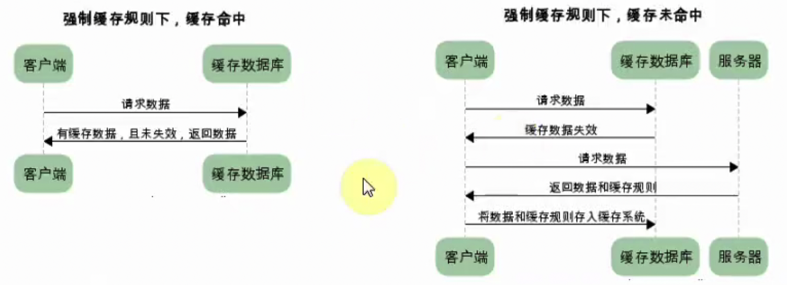
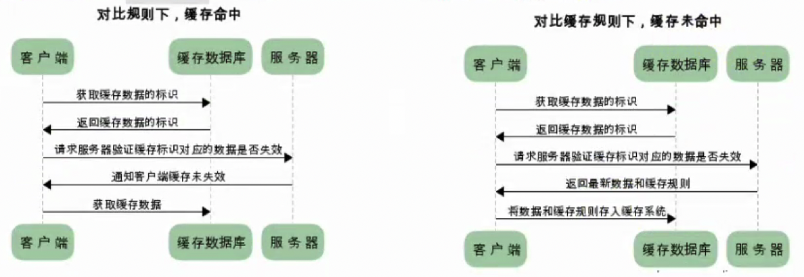
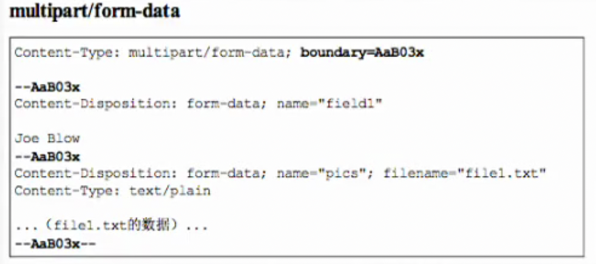
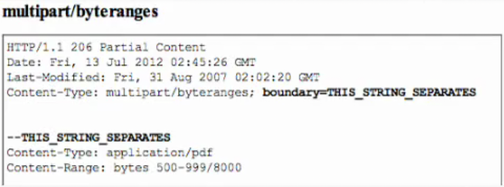
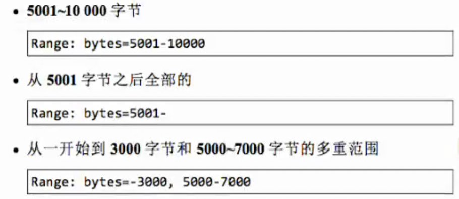
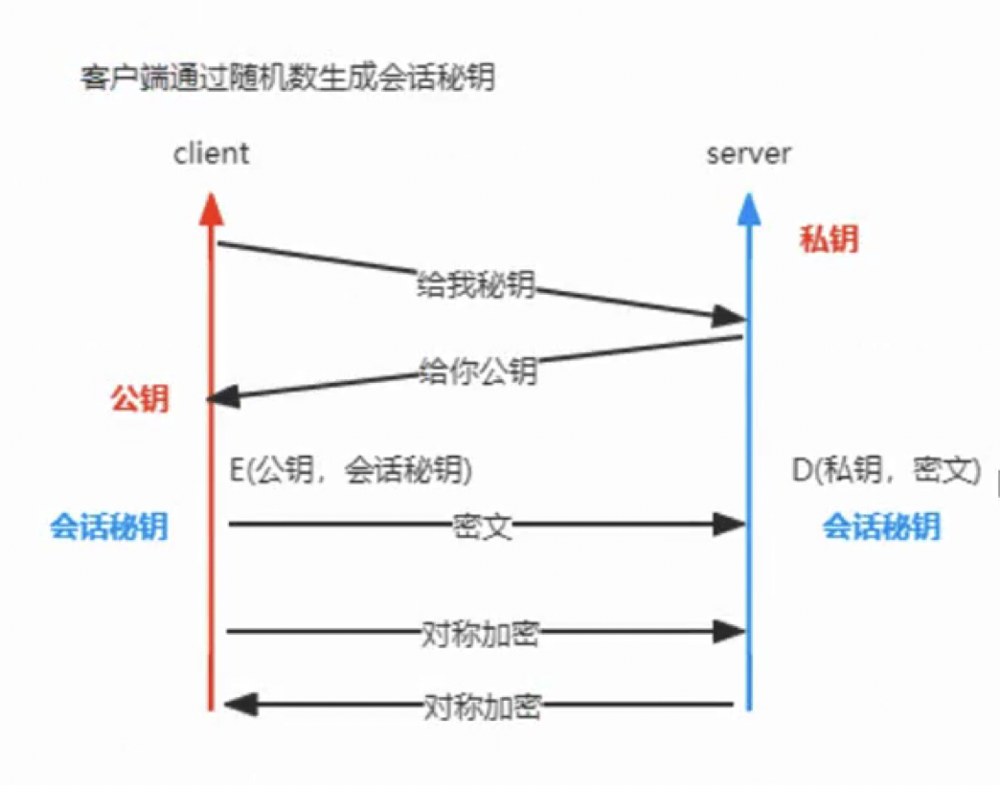
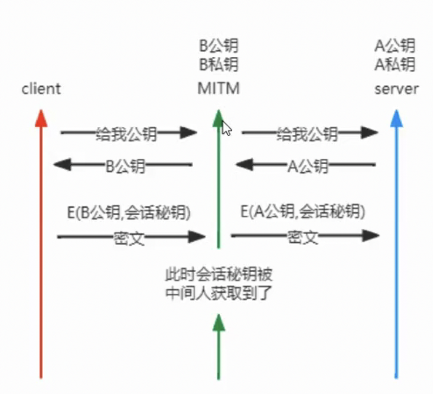
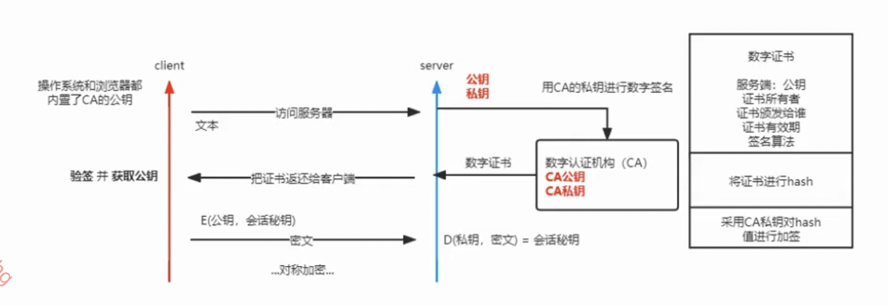

# HTTP

### TCP的问题

- 队头阻塞
- 慢启动
- 客户端连接服务器最后不会立即断开，需要等待一段时间再关闭，在高并发、短连接的情况下会出现大量端口被占用的情况。
- ...

### HTTP发展历程

- 1990年`HTTP/0.9`为了便于服务器和客户端处理，采用了纯文本格式，只允许使用GET请求，在响应请求之后就会立即关闭连接。
- 1996年`HTTP/1.0`增强了0.9版本，引入了HTTP Header概念，传输的数据不再限于文本，可以解析图片音乐等，增加了响应状态码和POST、HEAD等请求方法。
- 1999年`HTTP/1.1`被广泛使用，成为正式标准，允许持久连接，允许响应数据分块，增加了缓存管理和控制，增加了PUT、DELETE等方法。
- 2015年`HTTP/2`，使用HPACK算法压缩头部，减少数据传输量，允许服务器主动向客户端推送数据，二进制协议可以发起多个请求，使用时需要对请求加密通信。
- 2018年`HTTP/3`基于UDP的QUIC协议。

### HTTP1.1

特点：

- 内容协商
- 允许长连接(connection: keep-alive)，复用TCP通道传输数据(必须在一次请求应答之后才能复用)。

HTTP对头阻塞：https://cloud.tencent.com/developer/article/1509279

### 首部

#### 通用首部字段

| 首部字段名             | 说明            |
| ----------------- | ------------- |
| Cache-Control     | 控制缓存行为        |
| Connection        | 链接的管理         |
| Date              | 报文日期          |
| Pragma            | 报文指令          |
| Trailer           | 报文尾部的字段       |
| Transfer-Encoding | 指定报文主体的传输编码方式 |
| Upgrade           | 升级为其他协议       |
| Via               | 代理服务器信息       |
| Warning           | 错误通知          |

#### 请求首部字段

| 首部字段名               | 说明                              |
| ------------------- | ------------------------------- |
| Accept              | 用户代理可处理的媒体类型                    |
| Accept-Charset      | 优先的字符集                          |
| Accept-Encoding     | 优先的编码                           |
| Accept-Langulage    | 优先的语言                           |
| Authorization       | 认证信息                            |
| Expect              | 期待服务器的特定行为                      |
| From                | 用户的电子邮箱地址                       |
| Host                | 请求资源所在的服务器                      |
| If-Match            | 比较实体标记                          |
| If-Modified-Since   | 比较资源的更新时间                       |
| If-None-Match       | 比较实体标记                          |
| If-Range            | 资源未更新时发送实体Byte的范围请求             |
| If-Unmodified-Since | 比较资源的更新时间(和If-Modified-Since相反) |
| Max-Forwards        | 最大传输条数                          |
| Proxy-Authorization | 代理服务器需要客户端认证                    |
| Range               | 实体字节范围请求                        |
| Referer             | 请求中的URI的原始获取方                   |
| TE                  | 传输编码的优先级                        |
| User-Agent          | HTTP客户端程序的信息                    |

#### 响应首部字段

| 首部字段名              | 说明             |
| ------------------ | -------------- |
| Accept-Ranges      | 是否接受字节范围       |
| Age                | 资源的创建时间        |
| ETag               | 资源的匹配信息        |
| Location           | 客户端重定向至指定的URI  |
| Proxy-Authenticate | 代理服务器对客户端的认证信息 |
| Retry-After        | 再次发送请求的时机      |
| Server             | 服务器的信息         |
| Vary               | 代理服务器缓存的管理信息   |
| www-Authenticate   | 服务器对客户端的认证     |

#### 实体首部字段

| 首部字段名            | 说明           |
| ---------------- | ------------ |
| Allow            | 资源可支持的HTTP方法 |
| Content-Encoding | 实体的编码方式      |
| Content-Language | 实体的自然语言      |
| Content-Length   | 实体的内容大小(字节)  |
| Content-Location | 替代对应资源的URI   |
| Content-MD5      | 实体的报文摘要      |
| Content-Range    | 实体的位置范围      |
| Content-Type     | 实体主体的媒体类型    |
| Expires          | 实体过期时间       |
| Last-Modified    | 资源的最后修改时间    |

#### 内容协商

- 首部字段
  - Accept
  - Accept-Charset
  - Accept-Encoding
  - Accept-Language
  - Content-Language
- 协商类型
  - 服务器驱动
  - 客户端驱动协商
  - 透明协商

#### 状态码

状态码负责表示客户端请求的返回结果、标记服务器端是否正常、通知出现的错误

##### 状态码类别

| 类别  | 原因短语                   |
| --- | ---------------------- |
| 1XX | Infomational(信息性状态码)   |
| 2XX | Success(成功状态码)         |
| 3XX | Redirection(重定向)       |
| 4XX | Client Error(客户端错误状态码) |
| 5XX | Server Error(服务器错误状态码) |

##### 2XX 成功

- 200：OK 客户端发过来的数据被正常处理
- 204：Not Content 正常响应，没有实体
- 206：Partial Content 范围请求，返回部分数据，响应报文中由Content-Range指定实体内容

##### 3XX 重定向

- 301：Moved Permanently 永久重定向
- 302：Found 临时重定向，规范要求方法名不变，但是实际上方法名都会被改变
- 303：See Other 和302类似，但必须用GET方法
- 304：Not Modified 状态未改变，配合(If-Match、If-Modified-Since、If-None_Match、If-Range、If-UnModified-Since)
- 307：Temporary Redirect 临时重定向，不改变请求方法

##### 4XX 客户端错误

- 400：Bad Request 请求报文语法错误
- 401：unauthorized 需要认证
- 403：Forbidden 服务器拒绝访问的资源
- 404：Not Found 服务器上无法找到资源

##### 5XX 服务器端错误

- 500：Internal Server Error 服务器故障
- 503：Service Unavailable 服务器处于超负载或者正在停机维护

#### 缓存

##### 缓存的作用

- 减少冗余的数据传输，节省了网费。
- 减少了服务器的负担，大大提高了网站的性能。
- 加快了客户端加载网页的速度。

##### 缓存的分类

强制缓存如果生效，不需要和服务器发生交互，而对比缓存不管是否生效，都需要与服务器发生交互。

两类缓存规则可以同时存在，强制缓存优先级高于对比缓存，也就是说，当执行强制缓存的规则时，如果缓存生效，直接使用缓存，不再执行对比缓存规则。

###### 强制缓存

强制缓存，在缓存数据未失效的情况下，可以直接使用缓存数据，那么浏览器是如何判断缓存数据是否失效呢？我们知道，在没有缓存数据的时候，浏览器向服务器请求数据时，服务器会将数据和缓存规则一并返回，缓存规则信息包含在响应header中。



###### 对比缓存

对比缓存，顾名思义，需要进行比较判断是否可以使用缓存。

浏览器第一次请求数据时，服务器会将缓存标识与数据一起返回给客户端，客户端将二者备份至缓存数据库中。

再次请求数据时，客户端将备份的缓存标识发送给服务器，服务器根据缓存标识进行判断，判断成功后，返回304状态码。通知客户端比较成功，可以使用缓存数据。



##### 通过最后修改时间来判断缓存是否可用

1. 响应时服务端通过响应头`Last-Modified`来告诉客户端次资源的最后修改时间。
2. 下次请求该资源时发现资源具有`Last-Modified`声明，则把请求头`If-Modified-Since`设置为上次响应的`Last-Modified`的时间。
3. 服务器收到请求后，将请求头`If-Modified-Since`的时间和请求资源的最后修改时间做对比，若有变动，则响应最新的资源并返回200状态码。
4. 若时间相等，则说明资源没有被修改，直接响应304状态码，客户端会直接从缓存中获取。

###### 最后修改时间存在的问题

- 某些服务器不能精确得到文件的最后修改时间，这样无法通过最后修改时间来判断文件是否更新了。
- 某些文件的修改非常频繁，能精确到秒级以下的修改，但是最后修改时间只能精确到秒。
- 一些文件的最后修改时间改变了，但是文件内容没变，我们不希望客户端认为这个文件修改了。
- 如果同样的一个文件位于多个CDN服务器上的时候，内容虽然一样，但修改时间不一样。

##### Etag

ETag是实体标签的缩写，根据实体内容生成的一段hash字符串，可以标识资源的状态。当资源发生改变时，ETag也随之发生变化。ETag是服务端产生的，然后发给客户端。

1. 客户端想判断缓存是否可用，可以先获取缓存中文档的ETag，然后通过`If-None-Match`发送请求给Web服务器询问此缓存是否可用。
2. 服务器收到请求，将服务器中此资源的ETag，跟请求头中的`If-None-Match`相比较，如果值是一样的，说明缓存还是最新的，服务器将发送304响应码给客户端表示缓存未修改过，可以使用。
3. 如果不一样则服务器将发送新的资源给客户端。

##### 如何强制缓存

浏览器会将文件缓存到Cache目录，第二次请求时浏览器会先检查Cache目录下是否含有该文件，如果有，并且还没到`Expires`设置的时间，即文件还没有过期，那么此时浏览器将直接从Cache目录中读取文件，而不再发送请求。

`Expires`是服务器响应消息头字段，在响应http请求时告诉浏览器在过期时间前浏览器可以直接从浏览器缓存取数据，而无需再次请求，这是HTTP1.0的内容，现在浏览器均默认使用HTTP1.1，所以基本可以忽略。

`Cache-Control`与Expires的作用一致，都是指明当前资源的有效期，控制浏览器是否直接从浏览器缓存取数据还是重新发请求到服务器取数据，如果同时设置的话，其优先级高于Expires。

###### Cache-Control

- private：客户端可以缓存
- public：客户端和代理服务器都可以缓存
- max-age=60：缓存内容将在60s之后失效
- no-cache：需要使用对比缓存验证数据，强制向服务器再次验证
- no-store：所有内容都不会缓存，强制缓存和对比缓存都不会触发

如：Cache-Control: private, max-age=60, no-cache

#### 编码

HTTP可以在传输过程中通过编码提升传输效率，但是会消耗更多的CPU时间。

##### 编码压缩

发送文件时可以先用ZIP压缩功能后再发送文件。

如：gizp、compress、deflate、identify

##### 分割发送的分块传输编码

请求的实体在尚未传输完成前浏览器不能显示，所以在传输大容量数据时，通过吧数据分割成多块，能让

##### 多部分对象集合

- 一份报文主体中可以包含多类型实体。
- 使用boundary字符串来划分多部分对象指名的各类实体。在各个实体起始行之前插入--标记，多部分对象集合最后插入--标记。

###### multipart/form-data

上传表单时使用multipart/form-data



###### multipart/byteranges

状态码(Partical Content)响应报文中包含多个范围时使用



##### 获取部分内容的范围请求

为了实现中断恢复下载的需求，需要能下载指定的下载的实体范围。

- 请求头中的Range来指定资源的byte范围。
- 响应会返回状态码206响应报文
- 对于多重范围的范围请求，响应会在首部字段 `Content-Type`中标明 `multipart/byteranges`

byte范围的指定形式：



#### 多语言切换

可以通过Accept-Language检测浏览器的语言。

- 请求头格式Accept-Language: zh-CN,zh;q=0.9

- 响应头格式Content-Language: zh-CN

#### 图片防盗链

从一个网站跳转，或者网页引用到某个资源文件时，HTTP请求中带有Referer表示来源网页的URL。

通过检查请求头中的Referer来判断来源网页的域名，如果来源域名不在白名单内，则返回错误提示。如果浏览器直接访问图片地址是没有referer的。

#### 代理服务器

代理(Proxy)，也称网络代理，是一种特殊的网络服务，允许一个网络终端(一般称为客户端)通过这个服务与另一个网络终端(一般为服务器)进行费直接的连接。一些网关、路由器等网络设备具备网络代理功能。一般认为代理服务有利于保障网络终端的隐私或安全，防止攻击。

```bash
npm install http-proxy --save
```

- web代理普通的http请求
- listen port
- close 关闭内置的服务

```js
let proxy = require('http-proxy')
let http = require('http')
let proxyServer = proxy.createProxyServer();

// 正向代理 帮助局域网内访问外网
// 反向代理 用来代理局域网内的服务器

let server = http.createServer((req, res) => {
  proxyServer.web(req, res, {
    target: 'http://localhost:9000'
  })
}).listen(8000)
```

#### 虚拟主机

通过Host实现一个网站共用一个端口，多个网站共用一个服务器。

```js
// 类似nginx
let http = require('http')
let proxyServer = require('http-proxy')

let ps = proxyServer.createProxyServer()

let config = {
  'baidu.com': 'http://localhost:8000',
  'ali.com': 'http://localhost:9000'
}

let server = http.createServer((req, res) => {
  let host = req.header['host']
  let target = config[host]
  if (target) {
    ps.web(req, res, {
      target,
    })
  } else {
    res.end(host)
  }
})

// 由于是同一个服务器，所以该服务需要占用80端口，目标地址代理到该端口，然后该服务进行代理
server.listen(80)
```

#### User-Agent

User-Agent用户代理，简称UA，它是一个特殊字符串头，使得服务器能够识别客户使用的操作系统版本、CPU类型、浏览器及版本、浏览器渲染引擎、浏览器语言、浏览器插件等。

请求头User-Agent: Mozilla/5.0 (Macintosh; Intel Mac OS X 10_15_7) AppleWebKit/537.36 (KHTML, like Gecko) Chrome/109.0.0.0 Safari/537.36

服务器解析通过`user-agent-parser`库。

### Web服务器

#### 虚拟主机

一台HTTP服务器上搭建多个Web站点，客户端发送请求时必须在Host首部完整指定主机名或域名的URL。

#### 通信转发程序：代理、网关

##### 代理

代理就是客户端和服务器的中间人

###### 为啥使用代理？

- 利用缓存技术减少网络流量
- 组织内部针对网站进行访问控制
- 获取访问日志

###### 代理的分类

- 缓存代理：会预先吧资源副本保存在服务器上
- 透明代理：不对报文进行任何加工

##### 网关

接收从客户端发来的数据时，会转发给其他服务器处理，再由自己返回。

- 使通信线路上的服务器提供非HTTP协议服务
- 提高通信安全性

### HTTPS

HTTP采用明文传输，能被获取和篡改，从而有了HTTPS。

HTTPS = HTTP + SSL/TLS，SSL安全套接层(Secure Socket Layer)发展到v3时改名为TLS传输层安全(Transport Layer Security)，主要目的是提供数据的完整性和保密性。

> **讨论使用其他加密方法的的缺陷**
> 
> **对称加密**
> 
> 密钥在传输过程中容易被盗取。
> 
> **非对称加密**
> 
> 非对称加密的特点是共钥加密私钥解密，私钥加密公钥解密。
> 
> 该方法公钥会发给客户端，客户端向服务器传输数据使用公钥加密，服务端使用私钥解密，服务器发送数据给客户端使用私钥加密，客户端使用公钥解密。如果公钥被盗取，即可拦截服务器发给客户端的使用私钥加密的数据，也不安全。
> 
> **客户端服务端各一对公钥/私钥采用非对称加密**
> 
> 该方法中客户端和服务端各一对公钥和私钥，并把各自的公钥传给对方，客户端发送数据使用客户端的私钥加密，服务端用客户端的公钥解密。服务器发送数据给客户端时，使用服务器的私钥加密，客户端使用服务器的公钥解密。
> 
> 能够解决一对公私钥非对称加密的问题，但是非对称加密本身效率低。
> 
> **混合加密(对称+非对称)**
> 
> 使用非对称加密加密对称加密的密钥，防止了密钥在传输过程中的泄漏，再使用对称加密加密数据。
> 
> 该方法服务端将公钥发送给客户端，客户端生成一个随机串(实际情况下，不同算法中随机串的生成方式有所不同，也有客户端和服务端协商生成的。)，然后使用公钥对该随机数进行加密，加密后的结果作为一个密钥，发送给服务器，后续传输数据即可使用该密钥进行对称加密。由于暴露在外的只有公钥，因此对称加密的密钥暴露后由于没有私钥也无法解密。
> 
> 
> 
> 漏洞：无法知道非对称加密的公钥是谁发送的，无法防止中间人攻击。例如，存在一个第三方，在服务器和客户端之间，第三方模拟服务器产生一个非对称加密的公私钥，将自己的公钥发给客户端，然后在客户端和服务器中间做代理。对于客户端来说，并不知道公钥是否是真正的服务器发送来的。
> 
> 
> 
> 因此，就需要SSL中的数字证书和CA机构来验证发送公钥人的身份。



1. 客户端访问服务器，服务器将公钥给CA，CA产生一个数字证书，并将证书使用签名算法产生一个摘要，然后使用CA私钥再对摘要进行签名得到最终的一个密钥。
2. 服务端把证书、签名算法、密钥等发送给客户端，客户端使用内置的CA公钥对密钥进行解密得到证书的摘要，再将证书使用签名算法产生摘要，如果和解密得到的密钥一致，则代表证书没有被更改，即可得到正确的服务端的公钥。
3. 拿到服务端的公钥后，再创建回话密钥和服务端使用对称加密进行数据传输。

### HTTPS服务器

- HTTPS使用https协议，默认端口号443

- HTTPS需要向证书授证中心申请证书

- HTTPS服务器与客户端之间传输是经过SSL安全加密后的密文数据，在创建HTTPS服务器之前，服务器首先需要创建公钥、私钥及证书。

**创建私钥**

```bash
openssl genrsa -out rsa_private.key 1024
```

**创建证书签名请求**

```bash
openssl req -new -key rsa_private.key -out certrequest.csr
```

**获取证书**

线上证书需要经过证书授证中心签名的文件，这里只创建一个自己签名的学习使用证书。

```bash
openssl x509 -req -in certrequest.csr -signkey rsa_private.key -out certificate.pem
```

**创建pfx文件**(可省略)

```bash
openssl pkcs12 -export -in certificate.pem -inkey rsa_private.key -out certificate.pfx
```

**创建服务器**

创建HTTPS服务器同HTTP服务器大致相同，需要添加证书，创建HTTPS服务器时通过options参数设置。

```bash
https.createServer(options,[requestListener])
```

options如下：

- pfx：私钥、公钥以及证书

- key：私钥

- passphrase：为私钥指定密码

- cert：公钥

- ca：证书，用于指定一组证书，默认属性值为几个著名的证书授权中心，例如：VeriSign

- crl：指定证书吊销主
