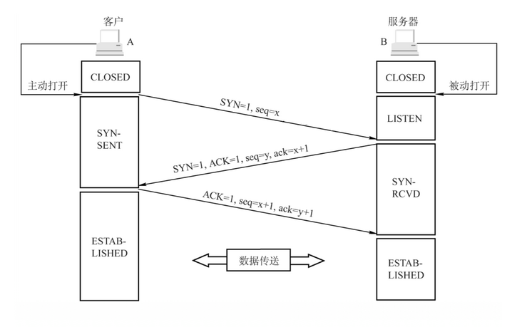

# 计算机网络

### OSI七层协议

应用层：网络服务与最终用户的一个接口

表示层：数据的表示、安全、压缩

会话层：建立、管理、中止会话

传输层：定义数据的协议端口号，以及流控和差错校验

网络层：进行逻辑地址寻址，实现不同网络之间的路径选择

数据链路层：建立逻辑连接，进行硬件地址寻址，差错校验等功能

物理层：建立、维护、断开物理连接

> 网络分层的好处：
>
> - 各层独立：限制了依赖关系的范围，各层之间使用标准化的接口，各层不需要知道上下层是如何工作的，增加或修改一个应用层协议不会影响传输层协议。
> - 灵活性：比如路由器不需要应用层和传输层，分层以后路由器就可以只用加载更少的几个协议层。
> - 易于测试和维护：提高了可测试性，可以独立测试特定层，某层有了更好的实现可以整体替换。
> - 能促进标准化：每层指责清楚，方便进行标准化。

### TCP/IP模型

四层：应用层、传输层、网络层、网络接口层

五层：应用层、传输层、网络层、数据链路层、物理层


### 网络接口层

网络接口层是TCP/IP模型的最底层，负责接收从上一层交来的数据报并将数据报通过底层的物理网络发送出去，比较常见的就是设备的驱动程序，此层没有特定的协议。

网络接口层又分为物理层和数据链路层。

### 物理层

计算机在传递数据的时候传递的都是0和1的数字，而物理层关心的是用什么信号来表示0和1，是否可以双向通信，最初的连接如何建立以及连接完成如何终止，物理层是为数据传输提供可靠的环境。

尽可能的屏蔽掉物理设备和传输媒介，使数据链路层不考虑这些差异，只考虑本层的协议和服务。

为用户提供在一条物理传输媒介上提供传送和接收比特流的能力。

需要解决物理连接、维护和释放的问题。

### 数据链路层

数据链路层在物理层提供的服务基础上向网络层提供服务，其最基本的服务是将源自网络层的数据可靠地传输到相邻节点的目标机网络层。

如何将数据组合成数据块，在数据链路层中称这种数据块为帧(frame)，帧是数据链路层的传送单位。

如何控制帧在物理信道上的传输，包括如何处理传输差错，如何调节发送速率以使与接收方相匹配。

以及在两个网络实体之间提供数据链路通路的建立、维持和释放的管理。

#### MAC地址

在通信过程中是用内置网卡内的地址来标识计算机身份的，每个网卡都有一个全球唯一的地址来标识自己，不会重复。

MAC地址也叫物理地址，大多数网卡厂商把MAC地址烧入了网卡的ROM中，即存在于网卡的一块内存中。

MAC地址由48位的二进制组成，通常分为6段，用16进制表示，如：00-0d-28-be-b6-42

交换机：用于转发光电信号的网络设备。它可以为接入交换机的任意两个网络节点提供独享的电信号通路。一般来说，在局域网内它可以用于将信号转发到目标MAC地址的设备上。

#### 以太网帧

在以太网链路上的数据包称作以太帧，以太帧封装完成后会通过物理层转换成比特流在物理介质上传输。

以太网帧大小必须在64~1518字节（不包含前导码和定界符），即包括目的地址（6B）、源地址（6B）、类型（2B）、数据、FCS（4B）在内，其中数据段大小在46~1500字节之间。

以太网帧由前导码（7B）、定界符（1B）、目的地址（6B）、源地址（6B）、类型（2B）、数据、FCS（4B）组成。


以太网上使用两种标准帧格式：Ethernet II、IEEE802.3


各字段说明如下：

1. **DMAC**（Destination MAC）是目的MAC地址。DMAC字段长度为6个字节，标识帧的接收者。
2. **SMAC**（Source MAC）是源MAC地址。SMAC字段长度为6个字节，标识帧的发送者。
3. **类型字段**（**Type**）Ethernet II格式中包含一个Type字段，用于标识数据字段中包含的高层协议，该字段长度为2个字节。IEEE802.3格式中，同样的位置是长度字段。不同的Type字段值可以用来区别这两种帧的类型，当Type字段值小于等于1500（或者十六进制的0x05DC）时，帧使用的是IEEE 802.3格式。当Type字段值大于等于1536 （或者十六进制的0x0600）时，帧使用的是Ethernet II格式。
4. **数据字段**(**Data**)是网络层数据，最小长度必须为46字节以保证帧长至少为64字节，数据字段的最大长度为1500字节。
5. **循环冗余校验字段**（**FCS**）提供了一种错误检测机制。该字段长度为4个字节。

### 网络层

位于传输层和网络接口层之间，把数据从源主机经过若干个中间节点传送到目标主机，并向传输层提供最基础的数据传输服务，它提供路由和选址的工作。

#### 选址

交换机是靠MAC地址来寻址的，但MAC地址是无层次的，需要靠IP地址来确认计算机的位置，这就是选址。

#### ARP协议

ARP(Address Resolution Protocol)协议，地址解析协议，是根据IP获取MAC地址的一个TCP/IP协议。在TCP/IP协议中，主机之间通过IP地址来定位，但实际定位则是通过主机硬件地址来确认。

严格来说ARP属于数据链路层和网络层之间的协议。

主机发送信息时将包含目标IP地址的ARP广播到网络上的所有主机，并接收返回消息，以此确定目标的物理地址。收到返回消息后将该IP地址和物理地址存入本机ARP缓存中并保留一定时间，下次请求时直接查询ARP缓存以节约资源。


ARP是个独立的三层协议，并不需要IP协议封装，而是直接生成自己的报文，到达数据链路层后，由数据链路层协议进行封装，一般是以太网协议。封装的过程，就是在ARP报文的前面加上以太网帧头，再加上4字节的冗余校验码结尾，校验码用于检验数据传输是否出现损坏。


ARP协议是建立在网络中各个主机相互信任的基础上的，网络上的主机可以自主发送ARP应答消息，其主机接收到应答报文时不会检测该报文的真实性就会将其记入本机ARP缓存。由此攻击者就可以向某一主机发送伪ARP应答报文，使其发送的消息无法达到预期的主机或达到错误的主机，这就构成了一个ARP欺骗。

ARP协议属于广播，只在局域网内，如果目标端口不在局域网，则将主机会将数据包转发给网关，通过网关来转发。

交换机记录的是交换机端口和MAC地址的映射表，而ARP协议记录的是ip地址和MAC地址的映射表。

#### 路由

在能够选择的多条网络路线之间选择一条最短的路径就是路由的工作。

#### IP

##### IP协议

IP协议（Internet Protocol，互联网协议），是TCP/IP协议栈中最核心的协议之一，通过IP地址，保证了联网设备的唯一性，实现了网络通信的面向无连接和不可靠的传输功能。

IP协议提供了IP地址，并将源目IP地址夹带在通信数据包里面，为路由器指明通信方向。

IP协议只能指明数据包的源目通信方即"这是谁的送给谁的"，但不能保证数据包一定能到达对方，数据是否会被丢弃以及丢弃之后如何处理。那么，如果出现丢包且需要重传时，谁来解决呢？这就需要TCP协议。

##### IP协议头部


Version（版本号）：标识IP协议的版本，目前V4版本地址已经枯竭，V6慢慢成为主流。

Header Length（头部长度）：默认为20字节，最大为60字节。

Differentiated Services Field （服务区分符）：用于为不同的IP数据包定义不同的服务质量，一般应用在QoS技术中。

Total Length （总长度）：标识IP头部加上上层数据的数据包大小，IP包总长度最大为65535个字节。

Identification （标识符）：用来实现IP分片的重组，标识分片属于哪个进程，不同进程通过不同ID区分。

Flags（标志符）：用来确认是否还有IP分片或是否能执行分片。

Fragment offset （分片偏移量）：用于标识IP分片的位置，实现IP分片的重组。

Time to live （生存时间）：标识IP数据包还能生存多久，根据操作系统不同，TTL默认值不同，每经过一个三层设备如路由器的处理，则TTL减去1，当TTL=0时，则此数据包被丢弃。

Protocol （协议号）：标识IP协议上层应用。当上层协议为ICMP时，协议号为1，TCP协议号为6，UDP的协议号为17。

Header checksum （头部校验）：用于检验IP数据包是否完整或被修改，若校验失败则丢弃数据包。

Source（源IP地址）：标识发送者IP地址，占用32bit。

Destination （目的IP地址）：标识接收者IP地址，占用32bit。

总结：

- Source和Destination即IP源目地址字段，是IP协议最核心的字段。
- Id+Flags+FO三个字段可以实现IP数据分片和重组。
- Total Length和Header Length标记IP头部和上层数据的边界。
- TTL生存时间字段可以实现通信防环。
- DSCP服务区分符可以实现流量控制。
- Checksum字段可以数据包完整性校验。
- Protocol字段标记上层应用。

##### IP地址

IP地址是一个网络编码，用来确定网络中的一个节点，一个ip地址由32位(4B)二进制组成的点分十进制。

##### IP地址的分类

IP地址由网络位和主机位组成。

IP地址的网络部分是由Internet地址分配机构来统一分配的，这样可以保证IP的唯一性。


###### 保留地址

255.255.255.255，对本机来说，这个地址指本网段内（同一广播域）的所有主机。这个地址不能被路由器转发。

主机位全为1的IP地址如：192.255.255.255，固定为该网段的广播地址，如果将其作为数据包的目标地址可以理解为发送到该网段的所有主机。

0.0.0.0，它表示的是这样一个集合：所有不清楚的主机和目的网络。它表示本机中所有的IPV4地址。监听0.0.0.0的端口，就是监听本机中所有IP的端口。

主机位全为0的IP如：192.0.0.0，表示该网络启动时的IP地址，其含义就是尚未分配时的IP地址。

网络位为127的开头的都是用来进行本机测试的，除了127.255.255.255外，其他127开头的地址都代表本机。

###### 公有地址和私有地址

公有地址就是分配给公共网络可以直接访问互联网的地址。

私有地址就是属于非注册地址，可以给每个组织机构内部使用。


##### 子网掩码

子网掩码顾名思义是用于划分子网的，是将某个IP地址划分成网络地址和主机地址两部分。

子网掩码不能单独存在，它必须结合IP地址一起使用。子网掩码和IP地址一样，也是一个32位二进制的点分十进制。

子网掩码由连续的1和0组成，连续的1表示网络地址，连续的0表示主机地址，通过0的个数可以计算出子网的容量（子网中主机的IP地址范围）。

255.255.255.0为默认的子网掩码，该子网掩码的二进制由24个1和8个0组成，8个0表示该子网掩码划分出的子网容量(每个子网下的ip个数)为256（2的8次方），也就是说192.168.1.0-255都在同一个子网中，这256个地址中可用地址只有254个，因为规定每个子网的第一个IP地址为网段地址，最后一个IP地址为广播地址，都不可用。

实例：

某个小型公司有四个部门：行政、研发、营销、售后，每个部门各40台计算机接入公司局域网交换机，如果要在192.168.1.0网段为每个部门划分子网，子网掩码应该怎么设置，每个子网的地址范围分别是什么？

192.168.1.0网段共256个地址，划分4个子网，每个子网需要64个地址；64是2的6次方，子网掩码应该以6个0结尾，剩下的用1补齐，由26个1和6个0组成，转换成十进制是255.255.255.192；每个子网共64个IP地址，掐头去尾后可用地址只有62个，第1个子网的可用IP地址范围是：192.168.1.1-62，第2个子网可用IP地址范围是192.168.1.65-126，第3个子网的可用IP地址范围是：192.168.1.129-190，第4个子网可用IP地址范围是192.168.1.193-254；该公司各部门计算机按照3中的IP地址范围进行设置，所有计算机的子网掩码都必须设置为255.255.255.192，设置完毕后各部门内的计算机能正常联网，不同部门间的计算机无法直接联通。

### 传输层

位于应用层和网络接口层之间，是面向连接的、可靠的进程到进程通信的协议。

TCP提供全双工服务，即数据可在同一时间双向传播。

TCP将若干个字节构成一个分组，此分组称为报文段(Segment)。

TCP的作用在于：在不可靠的协议上提供可靠的传输。网络层IP协议只负责数据传输，TCP负责在不可靠的IP协议上提供可靠的传输。

#### TCP

- Transmission Control Protocol传输控制协议
- 可靠的，面向连接的协议
- 传输效率低

tcp协议对数据进行分段打包传输，对每个数据包编号控制顺序，运输中丢失会进行重发或丢弃处理，还能实现流量控制避免拥塞。

##### TCP数据包格式


源端口：发送数据端套接字的端口号。

目的端口：目的套接字端口号。

顺序号(seq)：该数据报第一个数据字节的序列号，用作标识该报文段序列号。

应答号(ack)：存放的是发送方期望收到的数据段序号，算作是对收到报文的一个确认。ACK标志为 0 时，应答号部分无效(例如首个连接的[SYN]数据包)，ACK标志为1时应答号才有效。

TCP首部长度：标明TCP协议报头长度，占4位，单位为4字节(32bit)。其最小值为5，`5 x 4 = 20 byte`，可得首部最小为20字节(除去可选项的长度)。4位2进制能表示的最大数为 15， `15 x 4 = 60 byte`，可得首部最大长度为60字节，可选项长度大为40个字节(`60 byte - 20 byte = 40 byte`)。

保留位：保留字段长度为3位，必须全置为0。

标记：

| 标志位简写 | 全写                      | 含义                                                                                                                         |
| :--------: | ------------------------- | ---------------------------------------------------------------------------------------------------------------------------- |
|     NS     | Nonce                     | 有效排除潜在的ECN滥用                                                                                                        |
|    CWR    | Congestion Window Reduced | 拥塞窗口减少标志                                                                                                             |
|    ECE    | ECN-Echo                  | ECN标志                                                                                                                      |
|    URG    | Urgent                    | 紧急指针有效性标志                                                                                                           |
|    ACK    | Acknowledgment            | 确认序号有效性标志，其含义为：为下一个预期的序列编号，该标志位和应答号ack并不是同一个，一旦一个连接建立起来，该标志被置为1。 |
|    PSH    | Push                      | Push标志（接收方应尽快将报文段提交至应用层）                                                                                 |
|    RST    | Reset                     | 重置连接标志                                                                                                                 |
|    SYN    | Synchronization           | 同步序号标志(建立连接时候使用)                                                                                               |
|    FIN    | Fin                       | 传输数据结束标志(断开连接时使用)                                                                                             |

窗口：表示发送方还可以接受数据大小，防止对方发送数据大于自己的缓冲数据区，从应答字段的顺序号开始计。这个值的大小是可变的，当网络通畅时这个窗口值变大加快传输速度，当网络不稳定时减少这个值可以保证网络数据的可靠传输，它是用来在TCP传输中进行流量控制的。当窗口为0时，发送方会进行窗口探测。

效验和：效验和覆盖整个TCP报文段，强制字段，由发送端计算存储，接收端进行验证。

紧急指针：当Urgent标志置1时，紧急指针才有效。传输中会优先处理标识为紧急的数据。

可选项：可选项可以有 0 到多个，可选项字段以第一个字节表明其类型，第二个字节表示该可选项的总长度，后面紧跟可选项的值(长度为可选项的总长度-2)。可选项字段可以从任何字节边界开始，但若最后选项长度不足的话，要填充以补足定义的数据段长度。

##### 三次握手



第一次握手：

- 客户端什么都不能确认。
- 服务器确认了：对方发送正常，自己接收正常。

第二次握手：

- 客户端确认了：自己发送、接收正常，对方发送、接收正常。
- 服务器确认了：对方发送正常，自己接收正常。

由于第二次握手兼顾了服务端对客户端第一次连接请求的回应和服务端向客户端发送的连接请求，所以建立连接只需要三次握手。

第三次握手：

- 客户端确认了：自己发送、接收正常，对方发送、接收正常。
- 服务器确认了：自己发送、接收正常，对方发送、接收正常。

##### 四次挥手


第一次挥手：客户端发送关闭连接请求。

第二次挥手：服务端回应收到关闭连接请求，此时的 TCP 处于半关闭状态，客户端到服务端的连接释放。由于 TCP 的半关闭（half-close）特性，TCP 提供了连接的一端在结束它的发送后还能接收来自另一端数据的能力。任何一方都可以在数据传送结束后发出连接释放的通知，待对方确认后进入半关闭状态。当另一方也没有数据再发送的时候，则发出连接释放通知，对方确认后就完全关闭了TCP连接。

第三次挥手：服务端发送断开连接请求。这里的第三次挥手和第二次挥手不能合并，因为当第二次挥手服务端回应收到客户端的关闭连接请求时，服务端可能仍有数据需要向客户端发送，此时需要等服务端的事务处理完毕，才会主动向客户端发送第三次挥手。

第四次挥手：客户端回应服务端发送的断开连接请求。

注意：在客户端发送第四次挥手之后，这个时候由服务端到客户端的 TCP 连接并未释放掉，客户端需要经过时间等待计时器设置的时间 2MSL（一个报文的来回时间） 后才会进入 `CLOSED` 状态（这样做的目的是确保服务端收到自己的 ACK 报文。如果服务端在规定时间内没有收到客户端发来的 ACK 报文的话，服务端会重新发送 FIN 报文给客户端，客户端再次收到 FIN 报文之后，就知道之前的 ACK 报文丢失了，然后再次发送 ACK 报文给服务端）。服务端收到 ACK 报文之后，就关闭连接了，处于 `CLOSED` 状态。

> 所以如果最后一次客户端的ACK丢包了，并且服务端重新发送FIN时客户端已经处于COLSED状态时，就会造成服务端解析错误而占用资源。

##### 三次握手四次挥手实例

server.js

```js
let net = require('net')

let server = net.createServer((socket) => {
    // 监听客户端发送过来的数据
    socket.on('data', (data) => {
        console.log(data.toString())
        // 收到客户端的数据之后立即将客户端发送来的数据写回给客户端
        socket.write(data)
    })
    // 监听客户端断开连接
    socket.on('end', (data) => {
        console.log('end')
    })
})

server.listen(8080, () => {
    console.log('server started at 8080 port!')
})
```

client.js

```js
let net = require('net')

let socket = net.Socket()

socket.connect(8080, 'localhost')

// 监听连接成功之后往服务端发送数据
socket.on('connect', (data) => {
    socket.write('hello')
})

// 监听服务端发来的数据
socket.on('data', (data) => {
    console.log(data.toString())
})
```

wireshark截图


前三次为三次握手的过程。

第四次服务端向客户端发送的(Seq=1 Ack=1)请求暂时未理解。

中间四次为客户端向服务端发送“hello”和服务端向客户端发送“hello”的过程。

最后四次为断开连接的四次挥手过程。

图中的Seq=0，这里的Seq为相对序列号，真实序列号为图下部分的Sequence Number (raw): 2397654859。

客户端向服务端发送“hello”的请求为Seq=1 Ack=1 Len=5(数据‘hello’的长度为5字节)，因此服务器响应和服务端下一次发送的请求的Seq=1 Ack=6。

##### 滑动窗口

滑动窗口协议（Sliding Window Protocol），属于TCP协议的一 种应用，用于网络数据传输时的流量控制，以避免拥塞的发生。该协议允许发送方在停止并等待确认前发送多个数据分组。由于发送方不必每发一个分组就停下来等待确认，因此该协议可以加速数据的传输，提高网络吞吐量。

TCP通过滑动窗口的概念来进行流量控制。设想在发送端发送数据的速度很快而接收端接收速度却很慢的情况下，为了保证数据不丢失，显然需要进行流量控制， 协调好通信双方的工作节奏。所谓滑动窗口，可以理解成接收端所能提供的缓冲区大小。TCP利用一个滑动的窗口来告诉发送端对它所发送的数据能提供多大的缓冲区。由于窗口由16位bit所定义，所以接收端TCP 能最大提供65535个字节的缓冲。由此，可以利用窗口大小和第一个数据的序列号计算出最大可接收的数据序列号。

滑动窗口本质上是描述接受方的TCP数据报缓冲区大小的数据，发送方根据这个数据来计算自己最多能发送多长的数据，从而控制发送方的发送速度。如果发送方收到接受方的窗口大小为0的TCP数据报，那么发送方将停止发送数据，等到接受方发送窗口大小不为0的数据报的到来。

当接收方的缓存区满了，每隔一段时间，发送方会发送一个探测包，来询问能否调整窗口大小，上层协议消耗掉了接收方的数据，接收方也会主动通知发送方调整窗口，继续发送数据。

优点：

- 流量限制：接收方限制发送方发送数据的频率。

缺点：

- 队头阻塞：接收方收到的数据包是乱序的，如果之前的某个包没收到，此时需要等待前面的包到了才可以继续。
- 超时重传：如果某个包一直无法收到(丢包)，则需要发送方重新发送。

##### 拥塞窗口

一个连接的TCP双端只是网络最边缘的两台主机，他们不知道整个网络是如何工作的，因此他们不知道彼此之间的有效吞	吐量。因此，他们必须找到一种方法来确定它，我们称之为拥塞窗口 (CWND)，初始为1kb。

拥塞窗口是决定任何时候可以发出的字节数的因素之一。拥塞窗口由发送方维护，是阻止发送方和接收方之间的链路因流量过多而过载的一种手段。这不应与发送方维护的滑动窗口相混淆，滑动窗口的存在是为了防止接收方过载。拥塞窗口是通过估计链路上有多少拥塞来计算的。

拥塞控制：

- 拥塞窗口从一个段的大小开始（大约 1KB）
- 定义了一个拥塞窗口阈值（ssthresh）
- 如果收到确认，并且当前拥塞窗口大小小于 ssthresh，则拥塞窗口加倍
- 如果收到确认，但拥塞窗口大于或等于 sshthresh，则拥塞窗口增加其初始值（例如 1KB）
- 如果一个段没有被确认从而触发重传，拥塞窗口就会减半并且 ssthresh 被放置在这个值
- 拥塞窗口不能大于接收器窗口

该规则中包括我们经常听过的几种算法：

- 慢启动(slow-start)
- 拥塞避免(congestion avoidance)
- 快速重传(fast retransmit)：在发送过程中出现丢包的情况，此时不会立即回退到慢开始阶段，而是对已经收到的豹纹重复确认，如果确认次数到达3次，则立即进行重传。
- 快速恢复(fast recovery)，其流程如下：
  1. 收到第3个重复的ACK时，将ssthresh设置为当前cwnd的一半。(4-5阶段)
  2. 设置cwnd=ssthresh+3
  3. 重传丢失的报文段
  4. 每收到一个重复的ACK，cwnd+1
  5. 确认新数据的ACK到达时，设置cwnd=ssthresh。

图例如下：


##### 滑动窗口与拥塞窗口有什么区别？

滑动窗口：接受数据端使用的窗口大小，用来告知发送端接收端的缓存大小，以此可以控制发送端发送数据的大小，从而达到流量控制的目的。

拥塞控制：防止过多的数据注入到网络中，这样可以使网络中的路由器或链路不致过载。拥塞控制所要做的都有一个前提：网络能够承受现有的网络负荷。拥塞控制是一个全局性的过程，涉及到所有的主机、路由器，以及与降低网络传输性能有关的所有因素。

TCP通过滑动窗口来做流控（Flow Control），但是TCP觉得这还不够，因为滑动窗口需要依赖于连接的发送端和接收端，其并不知道网络中间发生了什么。TCP的设计者觉得，一个伟大而牛逼的协议仅仅做到流控并不够，因为流控只是网络模型4层以上的事，TCP的还应该更聪明地知道整个网络上的事。

具体一点，我们知道TCP通过一个timer(定时器)采样了RTT(一个连接的往返时间，即数据发送时刻到接收到确认的时刻的差值)并计算RTO(重传超时时间，即从数据发送时刻算起，超过这个时间便执行重传)，但是，如果网络上的延时突然增加，那么，TCP对这个事做出的应对只有重传数据，但是，重传会导致网络的负担更重，于是会导致更大的延迟以及更多的丢包，于是，这个情况就会进入恶性循环被不断地放大。试想一下，如果一个网络内有成千上万的TCP连接都这么行事，那么马上就会形成“网络风暴”，TCP这个协议就会拖垮整个网络。这是一个灾难。

所以，TCP不能忽略网络上发生的事情，而无脑地一个劲地重发数据，对网络造成更大的伤害。对此TCP的设计理念是：TCP不是一个自私的协议，当拥塞发生的时候，要做自我牺牲。就像交通阻塞一样，每个车都应该把路让出来，而不要再去抢路了。

综上，滑动窗口与拥塞窗口的区别就在于，滑动窗口取决于接收端的缓存大小，拥塞窗口取决于当前网络的负载能力。滑动窗口位于传输层（区别于数据链路层的），拥塞控制更关注网络层。

##### Nagle算法与Cork算法

###### Nagle算法

TCP/IP协议中，无论发送多少数据，总是要在数据前面加上协议头，同时，对方接收到数据，也需要发送ACK表示确认。为了尽可能的利用网络带宽，TCP总是希望尽可能的发送足够大的数据。（一个连接会设置MSS参数，因此，TCP/IP希望每次都能够以MSS尺寸的数据块来发送数据）。Nagle算法就是为了尽可能发送大块数据，避免网络中充斥着许多小数据块。

Nagle算法的基本定义是任意时刻，最多只能有一个未被确认的小段。 所谓“小段”，指的是小于MSS尺寸的数据块，所谓“未被确认”，是指一个数据块发送出去后，没有收到对方发送的ACK确认该数据已收到。

Nagle算法的规则：

（1）如果包长度达到MSS，则允许发送；

（2）如果该包含有FIN，则允许发送；

（3）设置了TCP_NODELAY选项，则允许发送；

（4）未设置TCP_CORK选项时，若所有发出去的小数据包（包长度小于MSS）均被确认，则允许发送；

（5）上述条件都未满足，但发生了超时（一般为200ms），则立即发送。

默认情况下，发送数据采用Nagle算法。这样虽然提高了网络吞吐量，但是实时性却降低了，在一些交互性很强的应用程序来说是不允许的，使用TCP_NODELAY选项可以禁止Nagle算法。 此时，应用程序向内核递交的每个数据包都会立即发送出去。需要注意的是，虽然禁止了Nagle算法，但网络的传输仍然受到TCP确认延迟机制的影响。

###### Cork算法

CORK就是塞子的意思,形象地理解就是用CORK将连接塞住,使得数据先不发出去,等到拔去塞子后再发出去。设置该选项后，TCP会尽力把小数据包拼接成一个大的数据包（一个MTU）再发送出去(粘包特性)，当然若一定时间后（一般为200ms，该值尚待确认），TCP仍然没有组合成一个MTU时也必须发送现有的数据

Nagle算法主要避免网络因为太多的小包（协议头的比例非常之大）而拥塞，而CORK算法则是为了提高网络的利用率，使得总体上协议头占用的比例尽可能的小。

CORK算法通过TCP_CORK 选项控制，为提升性能及吞吐量，Web Server、文件服务器这一类一般会使用该选项。

##### ACK延迟确认机制

接收方在收到数据后，并不会立即回复ACK,而是延迟一定时间。一般ACK延迟发送的时间为200ms，但这个200ms并非收到数据后需要延迟的时间。系统有一个固定的定时器每隔200ms会来检查是否需要发送ACK包。这样做有两个目的。
1、这样做的目的是ACK是可以合并的，也就是指如果连续收到两个TCP包，并不一定需要ACK两次，只要回复最终的ACK就可以了，可以降低网络流量。
2、如果接收方有数据要发送，那么就会在发送数据的TCP数据包里，带上ACK信息。这样做，可以避免大量的ACK以一个单独的TCP包发送，减少了网络流量。

与Nagle算法一样，延迟ACK的目的也是为了减少网络中传输大量的小报文数，但该报文数是针对ACK报文的。 可以通过设置TCP_QUICKACK选项来取消确认延迟。

##### TCP的问题

- 队头阻塞
- 慢启动
- 短连接

#### UDP

- User Datagram Protocol用户数据报协议
- 不可靠的，无连接的服务
- 传输效率高

UDP协议无需建立连接，发送端不关心发送的数据是否达到目标主机、数据是否出错等，接收方也不会告诉发送方是否收到了数据，它的可靠性由上层协议来保障。

##### UDP协议头部格式


源端口号：16位，

目标端口号：16位。

UDP长度：16位，包括首部长度和数据长度。

UDP校验和：16位，包含UDP头和数据部分。这是一个可选的选项，并不是所有的系统都对UDP数据包加以检验和数据(相对TCP协议的必须来说)，但是RFC中标准要求，发送端应该计算检验和。

应用：DNS服务器、DHCP服务器

### 应用层

应用层是计算机网络体系结构的最顶层，是设计和建立计算机网络的最终目的，也是计算机网络中发展最快的部分。

数据->传输层(包)->网络层(段Segment)->数据链路层(帧)

##### 发送方总是从高层到低层封装数据

- 在应用层要把各式各样的数据如数字、字符串、图片等转换成二进制。
- 在TCP传输层中，上层的数据被分割成小的数据段，并为每个分段后的数据封装成TCP报文头部。
- 在TCP头部有一个关键的字段信息：端口号，它用于标识上层的协议或应用程序，确保上层数据的正常通信。计算机可以多进程并发运行，例如在发邮件的同时也可以通过浏览器浏览网页，这两种应用通过端口号进行区分。
- 在网络层，上层数据被封装上IP头部。IP协议最关键的字段信息就是IP地址，用于标识网络的逻辑地址。
- 数据链路层，上层数据被封装上MAC头部，内部最有用的信息是MAC地址。MAC地址就是固化在硬件设备内部的全球唯一的物理地址。
- 在物理层，无论之前在哪层封装的报文头和数据都是由二进制组成，物理层将这些二进制比特流转换成电信号在网络中传输。

##### 接收方总是从低层到高层解封装数据

- 数据传输到接收方后，接收方将数据进行解封。
- 在物理层，先把电信号转换成二进制数据，并将数据传送至数据链路层。
- 在数据链路层，把MAC头部拆掉，并将剩余的数据传送至上一层。
- 在网络层，数据的IP头部被拆掉，并将剩余的数据传送至上一层。
- 在传输层，把TCP头部拆掉，将真实的数据传送至应用层。

##### DHCP服务器

动态主机配置协议DHCP（Dynamic Host Configuration Protocol）是一种网络管理协议，用于集中对用户IP地址进行动态管理和配置。

- 保证任何IP地址在同一时刻只能由一台DHCP客户机所使用。
- DHCP应当可以给用户分配永久固定的IP地址。
- DHCP应当可以同其他方法获得IP地址的主机共存（如手工配置IP地址的主机）。
- DHCP服务器应当向现有的BOOTP客户端提供服务。

##### DNS服务器

Domain Name System的缩写，DNS服务器进行域名和与之对应的IP地址转换的服务器。

- 顶级域名如 `.com`
- 二级域名如 `.com.cn`
- 三级域名如 `www.baidu.com`

总之有几个点就是几级域名。

按照如下顺序依次寻找：

1. 本地缓存
2. 本地host文件
3. 请求本机配置的本地区DNS服务器
4. 根域名服务器


