# 操作系统

**功能**

- 管理系统的硬件、软件、数据资源
- 控制程序运行
- 人机之间的接口
- 应用软件与硬件之间的接口

**任务**

- 进程管理

- 存储管理

- 文件管理

- 作业管理

- 设备管理

**例题**
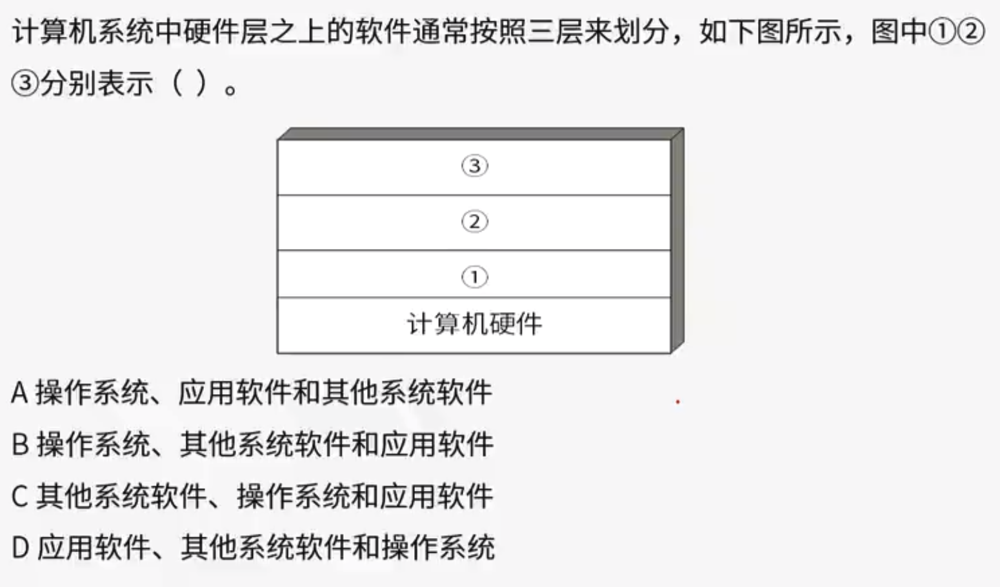

答案：B

## 进程管理

进程是程序在一个数据集合上运行的过程，它是系统进行资源分配和调度的一个独立单位。它由程序块、进程控制块（PCB）和数据块三部分组成。

PCB：PCB是进程存在的唯一标志。内容包含进程标识符、状态、位置信息、指针队列（链接同一状态的进程）、优先级、保护现场等。

### 程序与进程

**进程与程序的区别**

程序是一个文件，进程是程序的一次执行过程，没有程序就没有进程。

程序是一个静态的概念，而进程是一个动态的概念，它由创建而产生，完成任务后因撤销而消亡。进程是系统进行资源分配和调度的独立单位，而程序不是。

### 进程与线程

进程的两个基本属性：

- 可拥有资源的独立单位。
- 可独立调度和分配资源的基本单位。

但是线程只能够独立调度，不具备资源独立分配的功能，多个线程可以共享某些资源。

**例题**

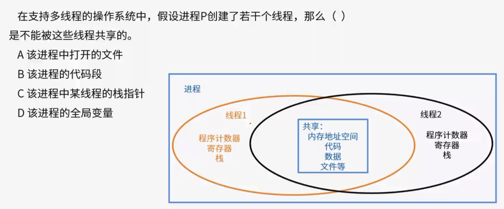

答案：C

### 进程控制块（PCB）

进程控制块是操作系统用来管理和跟踪进程的一个数据结构，它保存了进程相关的各种信息。PCB中记录了操作系统所需的用于描述进程当前情况以及控制进程运行的全部信息，系统根据PCB感知进程的存在。

#### PCB中的信息

**进程标识符**

唯一标识一个进程。

- 内部标识符：操作系统为每一个进程赋予的唯一数字标识符，系统使用。
- 外部标识符：由创建者提供，通常有字母与数字组成，往往是由用户(进程)在访问该进程时使用。描述进程的家族关系，设置父进程标识及子进程标识，还可设置用户标识，以指示拥有该进程的用户。

**处理机状态**

处理机状态信息也称为处理机的上下文，主要是由处理机的各种寄存器中的内容组成的。也就是中断现场的保留区，当进程被切换时，处理机状态信息必须都保存在相应的PCB中，以便该进程在重新执行时能再从断点继续执行。

**进程调度信息**

- 进程状态：就绪、阻塞、执行等
- 进程优先级：是分配CPU的重要依据
- 其他信息：进程已等待时间的总和、已执行时间总和
- 事件：阻塞原因

**进程控制信息**

- 程序和数据的首地址
- 进程同步和通信机制
- 资源清单：列出了该进程运行期间所需的全部资源
- 链接指针：给出了该进程所在队列中下一个进程的PCB首地址

#### PCB的组织方式

##### 线性方式

系统中所有PCB都组织在一张线性表中，表的首地址存放在内存专用区。

优点：实现简单、开销小。

缺点：每次查找时都要扫描一整张表，因此适合进程数目不多的系统。

##### 链表方式

具有相同状态进程的PCB分别通过PCB中的链接字链接成一个队列。

##### 索引方式

系统根据所有进程状态的不同，建立几张索引表，并把索引表的首地址记录在内存的专用单元中。在每个索引表的表目中，记录具有相应状态的PCB在PCB表中的首地址。

### 进程的状态

进程的三态模型和五态模型

#### 三态模型

将资源分为CPU资源和非CPU资源，其转化过程如下：

- CPU资源和非CPU资源都不满足的情况下，处于阻塞态。
- CPU资源不满足，非CPU资源满足的情况下，处于就绪态。
- CPU资源和非CPU资源都满足的情况下，处于运行态。

#### 五态模型

> 五态模型也有多种，这里考虑的是挂起状态的五态模型。

以三态模型为基础，三态模型在五态模型中表现为：运行、活跃就绪、活跃阻塞。

静止就绪、静止阻塞与活跃就绪、活跃阻塞的主要考虑的是内存资源的情况，挂起的过程可以当作程序从内存放到磁盘的过程，活跃状态就是程序从磁盘进入到内存的状态。

一般挂起状态的原因有：系统故障、程序调试。挂起可以由程序进行控制。

**例题**

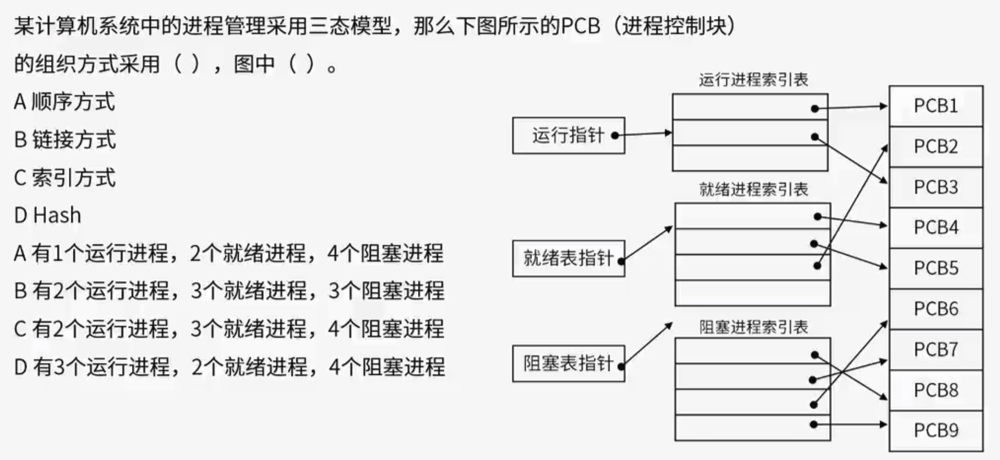

答案：C、C

### 进程的制约关系

进程之间存在着直接制约和间接制约两种制约关系。

#### 直接制约

同步关系，进程间的相互合作而引起的。

#### 间接制约

竞争关系，进程间共享临界资源而引起的。

### 进程的同步与互斥

**临界资源**

多进程需要互斥方式对其进行访问的共享资源，比如缓冲区。

**临界区**

每个进程中访问临界资源的那段代码称为临界区。

**进程同步**

进程同步是指多个进程中发生的事件存在某种时序关系，必须协同动作共同完成一个任务。简单来讲同步是一种协作关系。

**进程互斥**

多个进程在运行过程中，都需要某一个资源时，它们便产生了竞争关系，它们可能竞争某一块内存空间，也可能竞争某一个IO设备。当一方获取资源时，其他进程只能在该进程释放资源之后 才能去访问该资源，这就是进程互斥。简单来说互斥是一种竞争关系。

#### PV操作

信号量与 PV 操作是常见的处理进程同步与互斥机制之一。

信号量就是一个变量，可以用来代表系统中某种资源的数量。

**P 操作**：将信号量值减 1，表示**申请占用一个资源**。如果结果小于 0，表示已经没有可用资源，则执行 P 操作的进程被阻塞。如果结果大于等于 0，表示现有的资源足够你使用，则执行 P 操作的进程继续执行。

**V 操作**：将信号量值加 1，表示**释放一个资源**，即使用完资源后归还资源。若加完后信号量的值小于等于 0，表示有某些进程正在等待该资源，由于我们已经释放出一个资源了，因此需要唤醒一个等待使用该资源（就绪态）的进程，使之运行下去。

##### 生产者消费者问题

**例题**

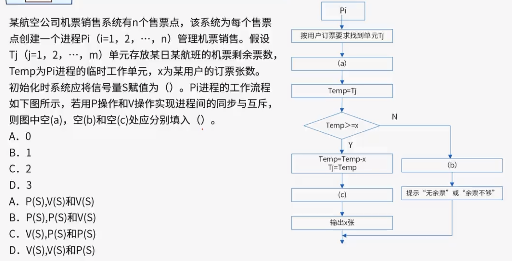

答案：B、A

### 前趋图

前趋图是一种用于表示任务或进程间顺序关系的有向无环图（DAG，Directed Acyclic Graph）。在这种图中，节点表示任务（或进程），而有向边表示一个任务必须在另一个任务之前完成的顺序关系。

前趋图常用于任务调度、项目规划和管理等领域，帮助项目管理者识别任务间的依赖关系，计划项目的最优执行顺序，以及识别关键路径（即项目完成时间最长的路径）。

#### 前趋图与PV操作

在执行D操作的时候，必须先去验证前趋节点是否已经准备就绪，也就是说，需要P(Sa)、P(Sb)、P(Sc)操作去验证ABC三个前趋节点是否已经完成。而PV操作是成对出现的，因此有了P操作，还需要三个V操作与之对应。 A完成之后，会有V(Sa)； B完成之后，会有V(Sb)； C完成之后，会有V(Sc)。

也就是说，**在前趋图中，所有的箭线中的箭头流出会对应一个V操作，箭头流入对应一个P操作**。

**例题**

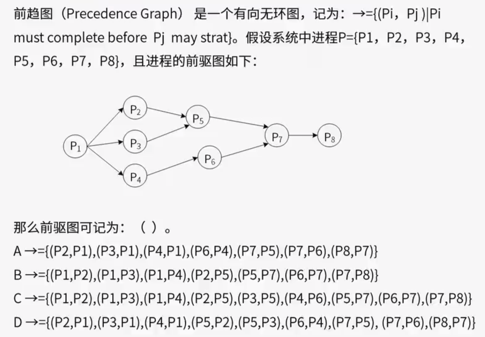

答案：C

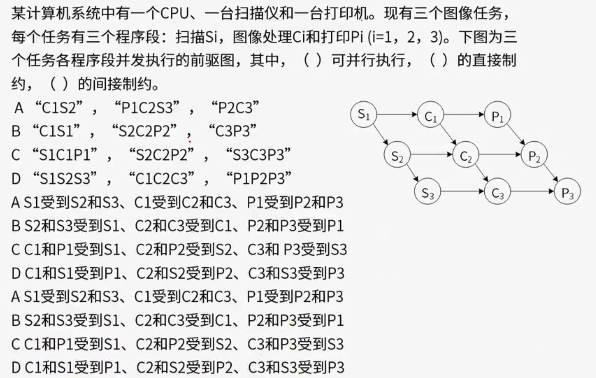

答案：A、C、B

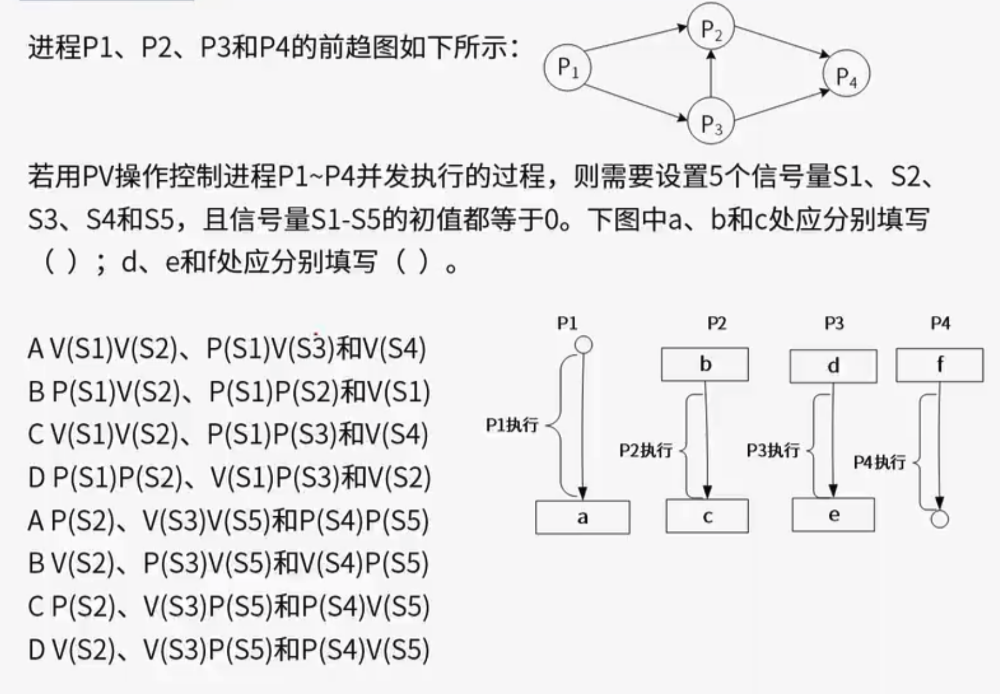

答案：C、A

### 死锁

进程管理是操作系统的核心，但如果设计不当，就会出现死锁的问题。如果一个进程在等待一件不可能发生的事情，则进程就死锁了。而如果多个进程死锁，就会造成系统死锁。

#### 死锁、饥饿、死循环

死锁：各进程相互等待对方手里的资源，导致各个进程都阻塞，无法向前推进的现象。

饥饿：由于长期得不到想要的资源，某个进程无法向前推进的现象。

死循环：某个进程执行过程中一直跳不出某个循环的现象。

死锁描述的是多个进程，饥饿描述的是某个进程。

#### 死锁产生的原因

- 对系统资源的竞争。当系统中供多个进程共享的资源数目不满足进程的需要，会引起进程的竞争而产生死锁。
- 进程推进顺序非法。请求和释放资源的顺序不当，也可能会导致死锁。

总之，对临界资源的不合理分配，可能导致死锁。

#### 产生死锁的必要条件

产生死锁必须同时满足以下四个条件：

- 互斥条件：指进程对所分配到的资源进行排他性使用，即在一段时间内某资源只由一个进程占用。
- 不剥夺条件：指进程已经获得的资源，在未使用完之前，不能被剥夺，只能在使用完时由自己来释放。
- 请求保持条件：指进程已经至少保持一个资源，但又提出来对新的资源的请求，而该资源已经被其它进程占用，此时请求进程阻塞，但又对自己已获得的资源保持不放。
- 循环等待条件：指发生进程死锁时，必然存在一个由进程组成的资源环形链。系统中的若干进程组成环路，该环路中的每个进程都在等待相邻的进程正占用的资源。

#### 死锁处理的策略

##### 预防死锁

通过设置某些限制条件，去破坏产生死锁的四个必要条件中的一个或几个，来预防发生死锁。该方法较易实现且已经广泛使用，但所施加的限制条件往往都会太严格，可能会导致资源利用率和系统吞吐量降低。

##### 避免死锁

但它并不采用各种限制条件和措施去破坏产生死锁的四个必要条件，而是在资源动态分配的过程中，采用某种方法防止系统进入不安去区，从而避免发送死锁。比如：有序资源分配法，银行家算法。

##### 死锁的检测和解除

事先不采取任何限制措施，也不检查系统是否进入不安全区，该方法允许死锁发生。但可以通过系统设置的检测机构，及时检测出死锁的发生，并精确的确定与死锁有关的进程和资源，然后采取措施，将已经发生的死锁清除掉。

有可能使系统获得较好的资源利用率和吞吐量，但实现难度最大。

##### 死锁资源数计算

当资源总数小于单个进程所需资源数（n<5），肯定死锁。

当资源总数满足一个进程所需资源数（n>=5），但小于等于所有进程所需资源数-1的总和（n<=12）,可能死锁。

当资源总数大于所有进程所需资源数-1的总和（n>12）,则某个进程完成之后就能释放至少一个资源给其他进程，其他进程也正好缺少一个资源，因此不可能发生死锁。

## 存储管理

存储管理中，操作系统会将外存当中的文件调用到内存给CPU使用，如果调用的内容不在内存中，就会产生一种中断：缺页中断。一般不会将文件全部加载到内存中，而是将内容切割进程放置，切割的方式有所不同，如：页式存储、段式存储。

### 页式存储

页式管理的基本原理是将各程序的虚拟空间划分为若干个长度相等的页。把内存空间按页的大小划分为片或者页面，然后把页式逻辑地址与物理内存地址建立一一对应的页表，并用相应的硬件地址转换机构来解决离散地址变换问题。

优点：利用率高，碎片小，分配及管理简单。

缺点：增加了系统开销，可能产生抖动现象。

#### 地址转换

高级程序语言使用逻辑地址，运行状态，内存中使用物理地址。

逻辑地址=页号+页内地址

物理地址=页帧号+页内地址

同一个块的页内地址在逻辑地址和物理地址中都是相同的。页表映射的是物理地址和逻辑地址的页号。

例如，页式存储系统中，每个页的大小为4K，即地址段大小为2^12，逻辑地址：10 1100 1101 1110，对应的物理地址为：110 1100 1101 1110。

页内地址的计算方法：由于一页的地址段大小为2^12，如果是按字节编址，则就有2^12个地址，用2进制表示一个地址就有12位，除去因此后面的12位就是页内地址，剩下前面的数就是页号或者页帧号。因此本题中，逻辑地址中10就是页号，十进制就是2，根据上面的页表映射对应的物理地址块号为6，转为二进制为110，因此物理地址中的页帧号为110。

#### 缺页调度

如图是一张页表信息，当CPU需要某个访问某个程序内容但内存中又没有，内存又有限时，就需要从内存中移除某些页块。

按照局部性原理，优先移除没访问过没修改过的页块，也就是访问位为0的页块，如果访问位相同则优先移除修改位为0的页块。

**例题**

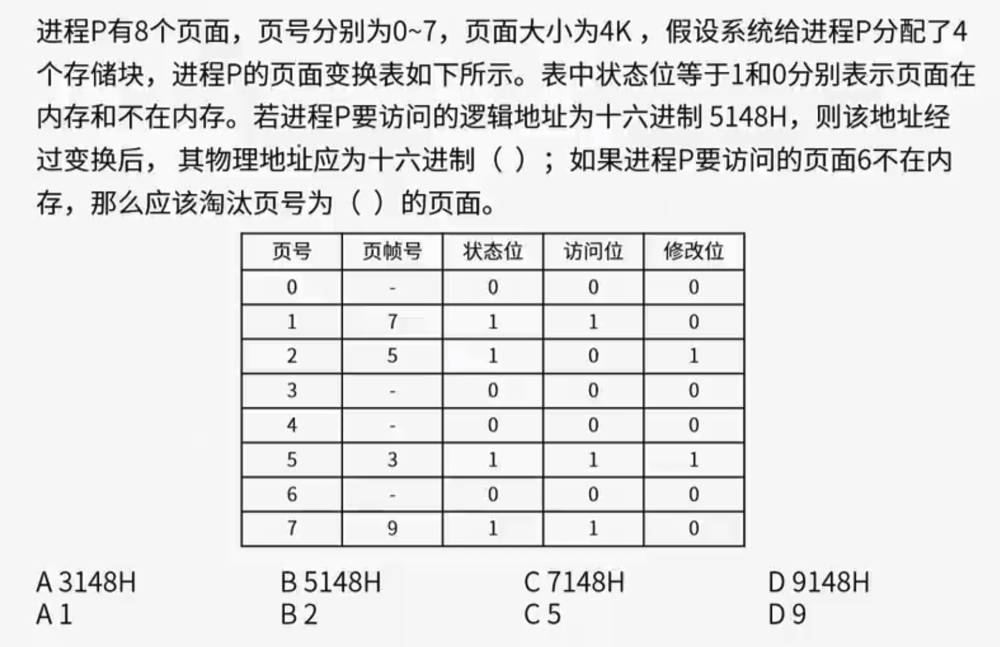

答案：A、B

### 段式存储

段式管理的基本思想是把程序按内容或过程函数关系分成段，一个用户作业或者进程所包含的段对应一个二维线性虚拟空间。段式管理程序以段为单位分配内存，然后通过地址映射机构把段式虚拟地址转换为实际内存物理地址，段的长度可以不一样。

优点：可以分别编写和编译，可以针对不同类型的段采取不同的保护，可以按段为单位来进行共享，包括通过动态链接进行代码共享，各段程序互不影响。

 缺点：会产生碎片，内存利用率低，内存碎片浪费大。

### 段页式存储

段式页式存储是段式和页式的综合体，先分段，再分页。一个程序有若干段，每个段有若干页，每个页的大小相同，但每个段的大小不同。

优点：空间浪费小，存储共享容易，存储保护容易，能动态链接。

缺点：地址管理的复杂性和开销增加，需要的硬件以及占用的内容也增加，执行速度下降。

地址格式：段号+页号+页内地址

**例题**

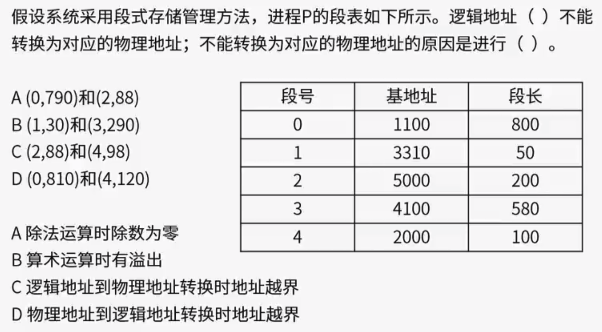

答案：D、C

## 文件管理

### 文件的物理存储结构

按照文件的物理存储结构，可以分为：

- 顺序文件结构：文件数据按照逻辑序号顺序地存储到连续的物理盘块中，顺序文件所记录的次序，与它们存储在物理介质上存放的次序是一致的。
- 链接文件结构：文件数据按照逻辑序号存储在不相临接的物理块中，数据通过物理块中的链接指针组成链表结构进行管理。
- 索引文件结构：文件数据按照逻辑序号存储在不相临接的物理块中，数据和物理块之间通过索引表按逻辑序号存储文件。

> 文件逻辑序号都是从0开始。

#### 顺序文件结构

是一种最简单的物理结构，它把逻辑上连续的文件信息依次存放在连续编号的物理块中。只要知道文件在存储设备上的起始地址（首块号）和文件长度（总块数），就能很快地进行存取。顺序存取效果好,也一定程度支持随机存取。

**优点**

结构简单，访问速度快。

**缺点**

文件长度动态增加困难，不适合某些需要经常修改的文件。

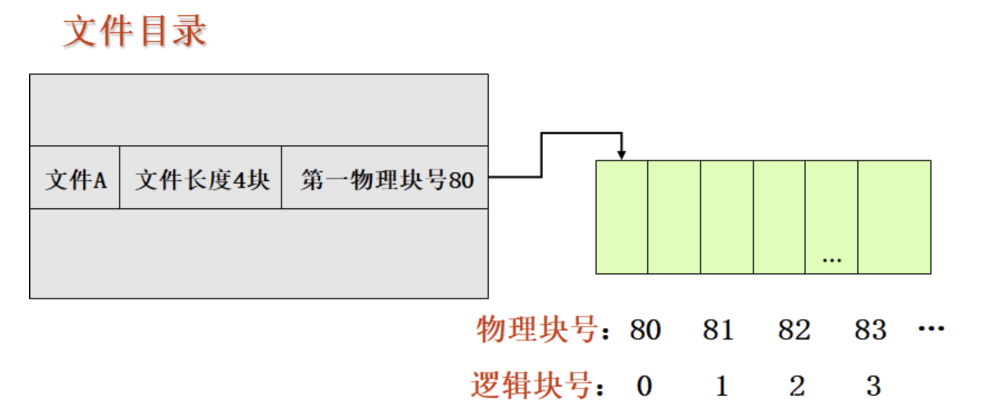

#### 链接文件结构

这种结构将逻辑上连续的文件分散存放在若干不连续的物理块中，每个物理块设有一个指针，指向其后续的物理块。只要指明文件的第一个块号，就可以按链指针检索整个文件（隐式链接）。

**优点**

文件长度容易动态变化，

**缺点**

指针占用存储空间，适合依据指针顺序存取，不适合随机存取访问。

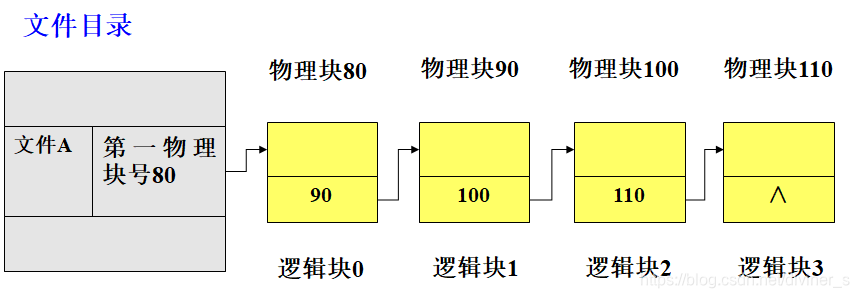

#### 索引文件结构

这种结构逻辑上连续的文件存放在若干不连续的物理块中，系统为每个文件建立一张索引表，索引表记录文件信息所在的逻辑块号和与之对应的物理块号。

**优点**

访问速度快，文件长度可动态变化，适合随机存取，顺序存取性能也可以。

**缺点**

存储开销大，因为每个文件有一个索引表，而索引表亦由物理块存储，故需要占用额外的外存空间。另外，当文件被打开时，索引表需要读入内存，否则访问速度会降低一半，故又需要占用额外的内存空间，当同时打开的文件很多时，内存开销是可观的。这种结构限制了文件的最大长度。

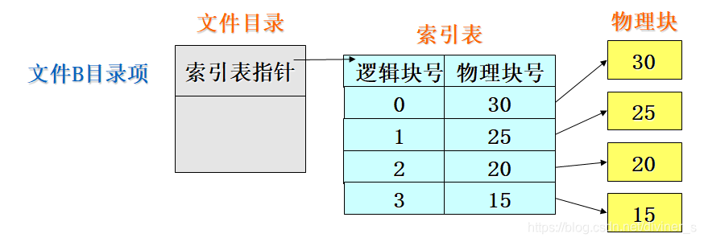

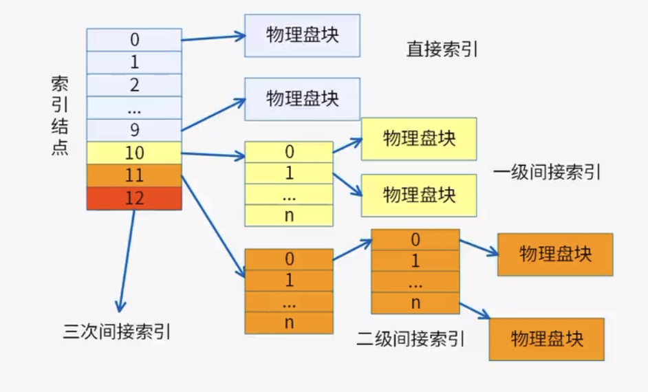

假设磁盘索引块和磁盘数据块大小均为1KB，若索引表每个地址项大小为4字节。每个直接索引存放的逻辑块号/物理块号数量为1，一个一级间接索引能存放的逻辑块号/物理块号数量为1KB / 4B = 2^8 = 256，一个二次间接索引能存放的逻辑块号/物理块号数量为2^8 * 2^8 = 2^16 = 65,536，依此类推，一个三级索引能存放的地址数量为2^24 = 16,777,216。

直接索引的磁盘访问数为1次（如果不包含第一次索引表的访问），一级间接索引则需要2次，依此类推，每多一级就需要多一次磁盘访问。

**例题**

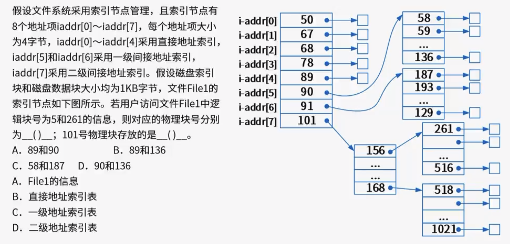

答案：C、D

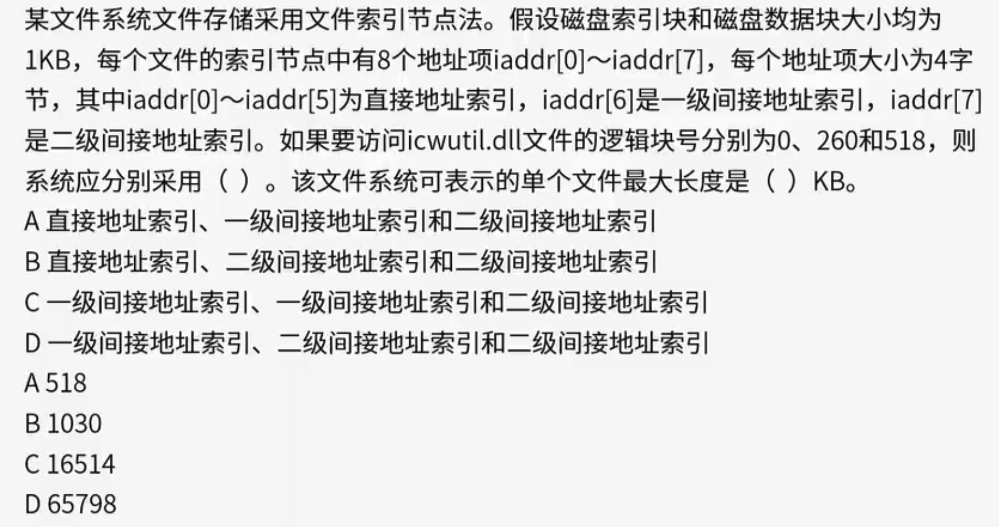

答案：D

### 空闲存储空间管理

在磁盘上面，会有大量的空间，我们需要把空闲的空间管理起来，以便在某个文件申请空间时，能够有依据的分配给他相应的空间。

空闲存储空间管理方法：

- 空闲区表法
- 空闲链表法
- 位示图法
- 成组链接法

#### 位示图

在给文件分配空间时，是以磁盘的盘块为基本单位分配的，必须记录磁盘可用于分配的盘块(即空闲盘块)，以及提供磁盘分配和回收的手段。文件存储空间管理就是用来完成上述功能的，位示图法文件存储空间管理的几种方法之一。

利用二进制的一位来表示磁盘中的一个盘块的使用情况。当其值为“0”时，表示对应的盘块空闲；为“1”时，表示已经分配。磁盘上的所有盘块都有一个二进制位与之对应，这样，由所有盘块所对应的位构成一个集合，称为位示图。通常可用`m*n`个位数来构成m行n列的位示图，并使`m*n`等于磁盘的总块数。

位示图中通常按固定长度的字来划分位示图，位号代表列号，每个字占多少二进制位就有多少列，行号代表字号，有多少行就代表这个位示图需要多少个字。

比如下图中，如果操作系统一个字16位，16个字的位示图能表示的磁盘物理块数为16 * 16 = 256个。

> 注意，做题时要区分第几个和第几号，比如第1个物理块其实是第0号物理块。

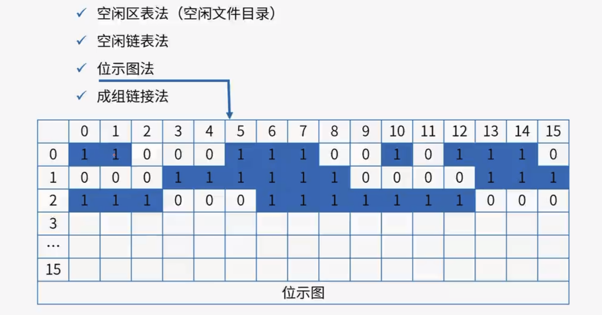

**例题**

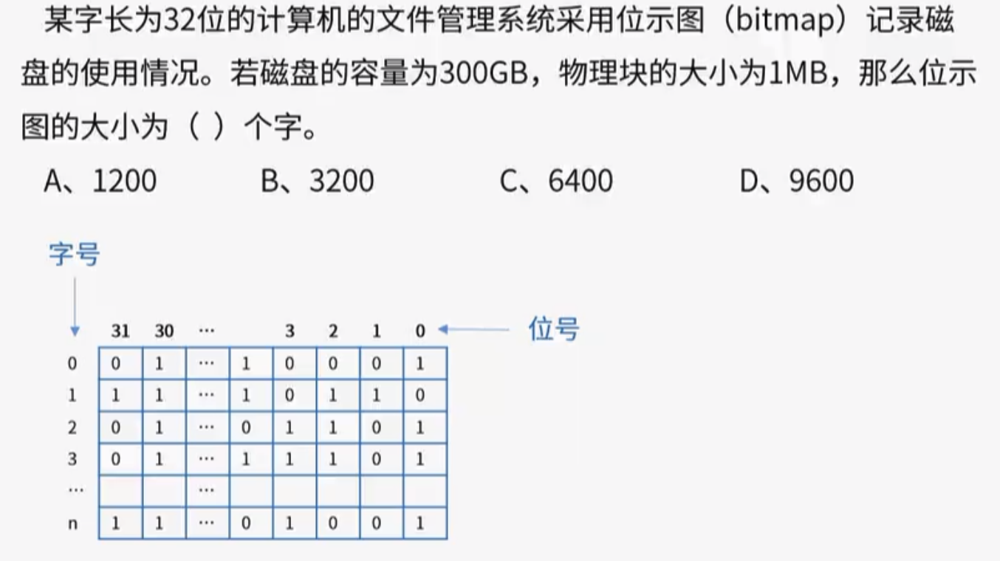

答案：D

### 树形目录结构

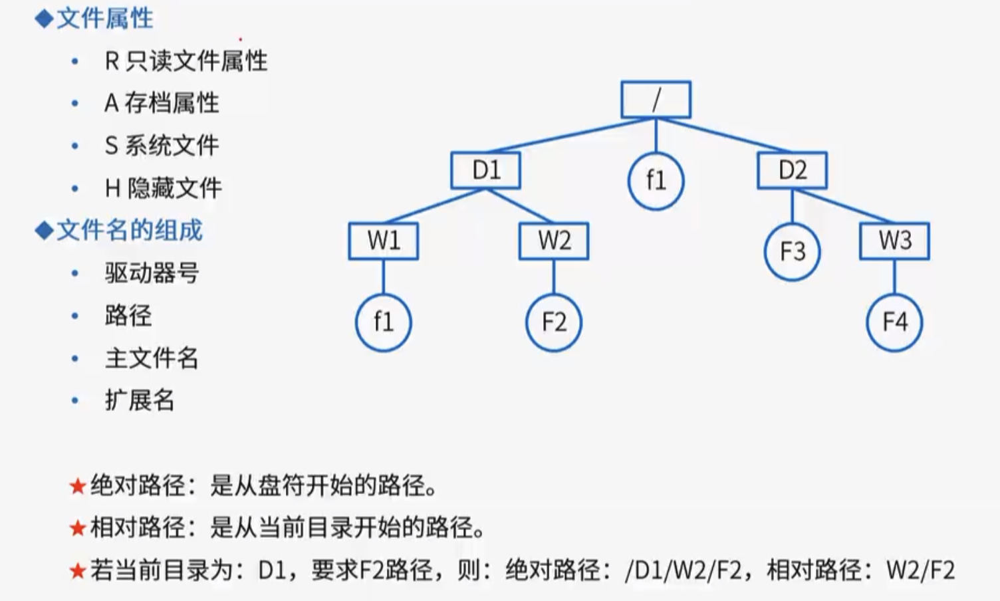

## 嵌入式系统

嵌入式系统主要由嵌入式硬件平台、相关支撑硬件、嵌入式操作系统、支撑软件、应用软件组成。其中，嵌入式、专用性和计算机系统是嵌入式系统的三个核心要素。

典型的嵌入式系统具有以下特点：

- 系统专用性强
- 系统实时性强
- 软硬件依赖性强
- 处理器专用
- 多种技术紧密结合
- 系统透明性
- 系统资源受限

### 嵌入式操作系统

**特点**

- 微型化
- 代码质量高
- 专业化
- 实时性强
- 可裁减、可配置
- 可靠性高

针对不同的硬件平台，操作系统通常建立在一个硬件抽象层（HAL）上，该层位于底层硬件和内核之间，为内核提供各种方便移植的宏定义接口，在不同的平台间移植时，只需要修改宏定义即可。

**例题**

答案：B，嵌入式操作系统也需要支持多任务。

#### 驱动

驱动程序是直接与硬件设备交互的软件组织，它们为操作系统或应用程序提供控制硬件的接口。

**功能**

- 控制和管理硬件设备。
- 处理设备特定的操作，例如初始化、读写数据、中断处理等。
- 提供标准化的接口，使得上层应用无需关心硬件的具体实现细节。

#### BSP板级支撑包

BSP是用于特定硬件平台的一组软件组件，通常包括启动代码、驱动程序和其他与硬件相关的软件库。

**功能**

- 提供对特定硬件平台的支持，使操作系统能够在该平台上运行。
- 包含初始化代码（如启动代码和引导加载程序）和硬件抽象层（HAL）。
- 集成各种驱动程序，确保操作系统能够正确识别和使用硬件功能。

#### HAL硬件抽象层

HAL是介于底层硬件和上层软件之间的一层抽象层，用于隐藏硬件的具体实现细节，提供统一的接口。

**功能**

- 抽象硬件细节，提供易于使用的API。
- 提高代码的可移植性，使得上层应用和中间件无需关心底层硬件的具体实现。
- 通常由硬件厂商提供，帮助开发者快速开发和移植应用。

#### 驱动、BSP、HAL三者的区别和联系

**区别**

- 驱动：专注于与特定硬件设备的直接交互，实现设备的操作功能。
- BSP：针对特定的硬件平台，包含启动代码、HAL以及驱动等，是使操作系统能够运行在硬件上的一整套方案。
- HAL：提供硬件的抽象接口，隐藏具体硬件实现细节，提高代码的可移植性。

**联系**

- 驱动与BSP：BSP包含了驱动程序，驱动是BSP中的一部分，通过BSP，操作系统可以直接调用驱动程序来控制硬件。
- 驱动与HAL：HAL可以调用底层驱动程序实现硬件操作，驱动实现硬件的具体操作，HAL则提供更高层次的抽象接口。
- BSP与HAL：BSP包含HAL，HAL是BSP的一部分，提供硬件访问的抽象接口。

驱动、BSP和HAL在嵌入式系统中分别扮演着不同但互补的角色，驱动程序直接与硬件交互，BSP提供特定硬件平台的全面支持，而HAL则通过抽象硬件细节来提高代码可移植性，三者的协同工作是实现嵌入式系统软硬件结合的关键。

**例题**

答案：D，任务调度属于操作系统的功能。

### 嵌入式系统开发设计

#### 交叉开发环境

**例题**

答案：C

#### 低功耗设计

- 基于硬件的低功耗设计
  - 板级电路低功耗设计
  - 选择低功耗处理器
  - 总线的低功耗设计
  - 接口驱动电路的设计
  - 分区分时供电技术
- 基于软件的低功耗设计
  - 编译优化技术（降低指令开销）
  - 软件与硬件的协同设计（硬件功能交由软件完成，降低硬件功耗）
  - 算法优化（降低时间复杂度）

### 实时操作系统（RTOS）

实时操作系统（Real-time operating system, RTOS），又称即时操作系统，它会按照排序运行、管理系统资源，并为开发应用程序提供一致的基础。

实时操作系统与一般的操作系统相比，最大的特色就是“实时性”，如果有一个任务需要执行，实时操作系统会马上（在较短时间内）执行该任务，不会有较长的延时。这种特性保证了各个任务的及时执行。大多数实时操作系统都是嵌入式操作系统。

#### 实时性能指标

- 任务切换时间
- 中断处理相关的事件指标
  - 中断延迟时间
  - 中断响应时间
- 系统响应时间（对用户的输入或请求做出反应的时间）
- 信号量混洗时间（指从一个任务释放信号量到另一个等待该信号量的任务被激活的时间延迟）

#### 多任务调度算法

实时操作系统存在多种调度算法。

**优先级调度算法**

分配一个相对固定的优先顺序，然后调度程序根据优先级的高低排序，按时间顺序进行高优先级任务优先调度。（非抢占式）

**抢占式优先级调度算法**

是在优先级调度算法基础上，允许高优先级任务抢占低优先级任务而运行。

**时间轮转调度算法**

调度程序会一次调度每个任务运行一个小的时间片，然后再调度另一个任务。每个任务运行完成一个时间片，无论是否结束都会释放CPU让下一个任务运行。（纯粹的时间轮转调度无法满足实时系统的要求，取而代之的是基于优先级的抢占式时间轮转调度。）

**最晚截止期调度算法**

指调度程序按每个任务的最接近其截止期末端的时间进行调度。

**最早截止期调度算法**

指调度程序按每个任务的截止期时间，选择最早到截止期头端时间的任务进行调度。

在RTOS中，大多数的RTOS调度算法都是抢占式的。

#### 常见的嵌入式RTOS

常见的嵌入式RTOS有：VxWorks、RT-Linux、QNX、pSOS

**例题**

答案：A

答案：B

## 微内核操作系统

### 宏内核与微内核

#### 宏内核

宏内核又称为单内核，宏内核简单理解其实就是把上面所有的功能都整合在一起。我们可以把进程管理、管理内存、管理硬盘、管理各种I/O设备……这些功能看作一个个模块。在宏内核中，这些模块都是集成在一起的，运行在内核进程中，只有处于内核态下才能运行。

宏内核被视作为运行在单一地址空间（核心空间）的单一的进程，核心提供的所有服务，都以特权模式进行。

宏内核中是如何工作的呢？

假设现在有一个应用程序需要使用到内存分配的功能，那么首先该应用程序会调用到系统提供的内存分配的接口（系统调用），此时CPU就会切换到内核态，并执行内存分配相关的代码。内核里的内存管理代码按照特定的算法，分配一块内存。并将分配的内存块的首地址，返回给内存分配的接口函数。当内存分配的接口函数返回时，此时CPU又会切换回用户态，应用程序会得到返回的内存块首地址，并开始使用该内存。

现在我们常用的操作系统多为宏内核，比如Linux、安卓系统、IOS。

宏内核结构的优点就是它的性能十分好，像Linux就是传统的宏内核结构。其性能极高，但其缺点也很明显，就是其耦合度高，一旦其中一个模块出现问题，其他所有的模块都可能会受到影响。

#### 微内核

微内核则和宏内核结构相反，它提倡内核中的功能模块尽可能的少。内核只提供最核心的功能，比如任务调度，中断处理等等。其他实际的模块功能如进程管理、存储器管理、文件管理……这些则被移出内核，变成一个个服务进程，和用户进程同等级，只是它们是一种特殊的用户进程。

微内核中定义一种进程间通信的机制——消息。当应用程序请求相关服务时，会向微内核发送一条与此服务对应的消息，微内核再把这条消息发送给相关的服务进程（特殊的用户进程），接着服务进程会完成相关的服务。

微内核是如何工作的呢？

还是刚刚内存分配的例子。这个时候应用程序首先会发送内存分配的消息，这个发送消息的接口函数是由微内核提供的。此时CPU切换到内核态，开始执行该函数的代码，微内核的代码会使当前进程停止运行，并将消息发送给内存管理的服务进程。内存管理服务进程收到该消息后，就会分配一块内存，并且也会通过消息的形式将分配的内存块的地址返回给内核。微内核再将该消息返回给发送内存分配消息的应用程序。此时CPU切换到用户态，应用程序会得到返回的内存块首地址，并开始使用该内存。

对比宏内核中，微内核结构主要是多了接收和发送消息的这一过程，实际上也是系统调用，只是并不是直接调用内存管理的接口函数，因为微内核中内存管理功能模块已经不属于系统调用了。所以对比起宏内核，微内核结构的性能会差不少。

但微内核降低了耦合度，模块移除内核后后使得即使某一个模块出现问题，只要重启这个模块的进程即可，不会影响到其他模块，更加的稳定。并且微内核有相当好的伸缩性、扩展性，因为模块功能只是一个进程，可以随时增加或减少系统功能。

#### 对比

**例题**

答案：A