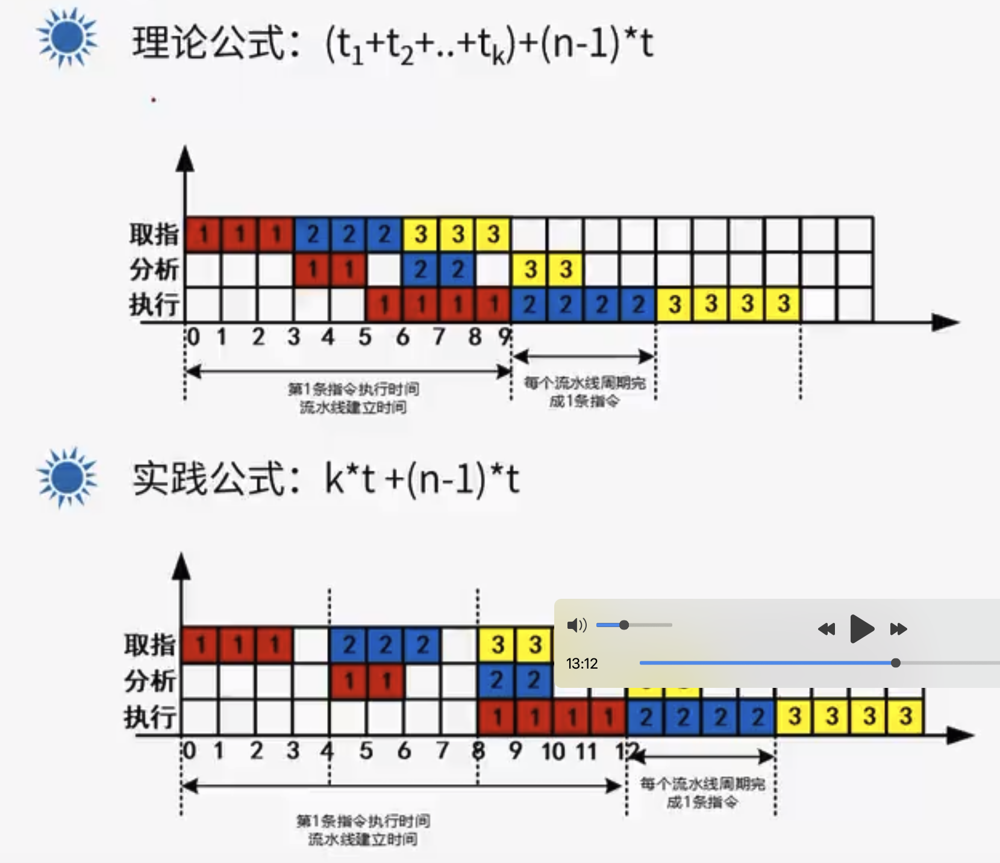

# 计算机组成结构

## 计算机结构

## CPU组成

### 运算器

1. 算术逻辑单元ALU：数据的算术运算和逻辑运算
2. 累加寄存器AC：通用寄存器，为ALU提供一个工作区，用于暂存数据
3. 数据缓冲寄存器DR：写内存时，暂存指令或数据
4. 状态条件寄存器PSW：存状态标志与控制标志

### 控制器

1. 程序计数器PC：存储下一条要执行指令的地址
2. 指令寄存器IR：存储即将要执行的指令
3. 指令译码器ID：对指令中的操作码字段进行分析解释
4. 时序部件：提供时序控制信号

## 冯·诺依曼结构和哈佛结构

### 冯·诺依曼结构

冯·诺依曼结构也称普林斯顿结构，是一种将程序指令存储器和数据存储器合并在一起的存储结构。

特点：

- 一般用于PC处理器，如I3、I5、I7处理器
- 指令与数据存储器合并在一起
- 指令与数据都通过相同的数据总线传输

### 哈佛结构

哈佛结构是一种将指令存储和数据存储分开的存储器结构。哈佛结构是一种并行体系结构，它的主要特点是将程序和数据存储在不同的存储空间中，即程序存储器和数据存储器是两个独立的存储器，每个存储器独立编址、独立访问。

特点：

- 一般用于嵌入式系统处理器、数字信号处理器（DSP）
- 指令与数据分开存储，可以并行读取，有较高的数据吞吐率
- 有4条总线：指令的数据总线、指令的地址总线、数据的数据总线、数据的地址总线

**嵌入式-芯片**

## 存储系统-层次化存储结构

## Cache

提高CPU数据输入输出的速率，突破冯诺依曼瓶颈，即CPU与存储系统之间数据传输带宽限制。

在计算机的存储系统中，Cache是访问速度最快的。

Cache对程序员来说是透明的。

使用Cahce改善系统性能的依据是程序的局部性原理：时间局部性、空间局部性。

### 局部性原理

#### 时间局部性

指程序中的某条指令一旦执行，不久之后该指令可能再次执行，典型原因是由于程序中存在大量的循环操作。

#### 空间局部性

指程序一旦访问了某个存储单元，不久之后，其附近的单元也将被访问，即程序在一段时间内所访问的地址可能集中在一定的范围内，其典型的情况是程序的顺序执行。

Cache 通常分为三级（现代 CPU）：

- **L1 Cache**（一级缓存）：速度最快，容量最小（KB 级），每个 CPU 核心独享。
- **L2 Cache**（二级缓存）：速度稍慢，容量较大（MB 级），可能共享或独享。
- **L3 Cache**（三级缓存）：速度较慢，容量更大（MB 级），通常由多个核心共享。

#### Cache 的访问机制

当 CPU 需要读取数据时，会按照以下顺序查找：

1. **L1 Cache** → 命中？直接返回数据（1-3 个时钟周期）
2. **L2 Cache** → 命中？返回数据（约 10 个周期）
3. **L3 Cache** → 命中？返回数据（约 30-50 个周期）
4. **RAM（主存）** → 若都不命中，从 RAM 读取（约 100-300 个周期）

如果数据最终在 RAM 中都不存在（例如被换出到磁盘），还会触发**缺页中断（Page Fault）**，导致更严重的延迟（毫秒级）。

#### Cache命中率

命中率是指 CPU 访问 Cache 时，数据在 Cache 中找到的概率。

如果以h代表对Cache的访问命中率，t表示Cache的周期时间，t,表示主存储器周期时间，以读操作为例，使用“Cache+主存储器”的系统的平均周期为t3,则：**t3=h×t1+(1-h)Xt2**，其中，(1-h)又称为失效率(未命中率)。

#### 影响 Cache 命中率的因素

**Cache 大小**

- Cache 越大，能存储的数据越多，命中率越高。

- 但 Cache 成本高，不能无限增大。

**Cache 替换策略**

当 Cache 满时，需要决定**替换哪些数据**，常见策略：

- LRU（Least Recently Used）：替换最久未使用的数据（命中率高，但实现复杂）。
- FIFO（First-In-First-Out）：替换最早进入的数据（简单，但命中率较低）。
- Random：随机替换（简单，但性能不稳定）。

**程序访问模式**

- 局部性好的程序（如循环访问数组）→ 高命中率。
- 随机访问的程序（如哈希表查询）→ 低命中率。

## 工作集理论

工作集（Working Set）或驻留集是计算机操作系统中一个重要的内存管理概念，指的是一个进程在某段时间间隔内实际需要访问的页面集合。

在理解工作集之前，需要先明白"页面"（Page）的概念：

- **页面是虚拟内存管理的基本单位**：现代操作系统使用虚拟内存技术，将程序使用的内存地址（虚拟地址）映射到实际的物理内存地址。这种映射不是以字节为单位，而是将内存划分为固定大小的块，称为"页面"。
- **典型页面大小**：通常是4KB（但不同系统可能不同，如2KB、8KB或更大）
- **页面与物理内存**：当程序访问某个虚拟地址时，操作系统会检查该地址所在的页面是否已加载到物理内存中。如果没有，则会发生"页面错误"（Page Fault），需要从磁盘调入该页面。

### 工作集的作用

1. **防止抖动（Thrashing）**：当系统内存不足时，操作系统可能频繁地将页面换入换出，导致CPU大部分时间用于处理页面调度而非实际工作，这种现象称为"抖动"。合理的工作集大小可以帮助避免这种情况。
2. **内存分配依据**：操作系统可以根据进程的工作集大小来决定为其分配多少物理内存。
3. **页面置换策略**：工作集模型指导哪些页面应该保留在内存中，哪些可以置换出去。

**页面置换机制**：

- 当物理内存不足时，操作系统会将部分内存页**换出**到磁盘。
- 这些被换出的页面虽然"属于"进程，但实际不在物理内存中。
- 当进程再次访问这些页面时，会产生**缺页中断**(Page Fault)，需要从磁盘重新加载。

此外，工作集管理的"物理内存" = RAM。Cache是CPU内部的优化，独立于操作系统的内存管理。

工作集机制避免了频繁的**RAM↔磁盘**交换，而Cache机制避免了频繁的**CPU↔RAM**访问，二者协同提升性能。

## 主存编址

**最小存储单位 :** 1 bit 是 计算机中最小的 容量单位，只能表示 0 或 1 。

**存储单元 :** 在 存储器 中，查找 1 bit 是比较困难的，这里将比特位进行分组，每组称为一个存储单元，存储单元就是内存地址编址的最小单位。

**编址内容**：

编址内容定义每个存储单元的具体长度，分以下两种：

- 按字编址：存储体的存储单元是字存储单元，即最小寻址单位是一个字。这种不同情况长度不一样，需要看具体计算机定义的字宽。
- 按字节编址：存储体的存储单元是字节存储单元，即最小寻址单位是一个字节，即8bit。

**容量=存储单元个数*编址内容长度**

根据存储器所需的容量和选定的存储芯片的容量可以计算出所需芯片数量：
**芯片数=总容量/每片的容量**

## 磁盘管理

### 磁盘结构

针对一个磁盘，它是一个立体的结构形态，里面会有多个盘面，每个盘面都可以存在一个读写的磁头，磁头通过硬件连接在一个主杆上面，固定围绕轴心来运动。

一个盘面上可以划分成多个一圈一圈的同心圆，这个同心圆我叫做磁道。

磁道的一圈数据量相对较大，将磁道按角度来切割，切出来的这些角度的内容叫做扇区。

在实际读取的过程当中是以扇区来读取数据块的。 磁道可以有自己的编号，一般从外往里会从0到N号磁道。扇区也可以有编号。 

盘面从立体的角度来看，每一个盘面都会有0号磁道，所有的0号磁道可以形成一个圆柱，每一个圆柱称之为柱面，也就是说同一个柱面编号，它所对应的是所有磁盘上这样的一个磁道。 

磁盘读取数据的过程分为步：

- 磁头垂直向圆心移动，移动的过程会跨越不同的磁道，直到找到我们需要的磁道为止。
- 找到对应磁道之后，磁盘匀速转动，将扇曲位置转到磁头的下方。

这两个过程对应的时间分别为：寻道时间、旋转延迟时间。**取址时间=寻道时间+旋转延迟时间**

### 磁盘优化分布存储

C、B

### 磁盘单缓冲区与双缓冲区读取

D、C

### 磁盘移臂调度算法

磁盘读取数据时，旋转延迟时间是磁盘匀速转动产生的，这个行为无法进行调度，但是磁头垂直寻道是可以调度的。

#### 先来先服务（FCFS）

先来先服务，FCFS，First Come First Served，谁先申请，就先让谁访问磁盘数据，这是最简单的磁盘调度算法，按照请求到达的顺序依次处理。

先来先服务 FCFS 算法的缺点是磁头在磁盘上无规律地移动，造成平均等待时间较长，效率很低。

#### 最短寻道时间优先（SSTF）

最短寻道时间优先，SSTF，Shortest Seek Time First，每次选择 最靠近当前磁头位置的请求 进行处理，以最小化寻道时间。

最短寻道时间优先 SSTF 算法 相比于 先来先服务算法 在效率上是有提升的。

最短寻道时间优先 SSTF 算法的 缺点是可能会因为频繁访问某些区域而导致其他区域的请求长时间等待，可能产生饥饿现象。

#### 扫描算法（SCAN）

扫描算法 SCAN 又叫做 电梯算法 Elevator Algorithm。

扫描算法 SCAN 的运行机制是模拟电梯的运行方式，沿着一个方向移动磁头，直到遇到最边缘的请求，然后改变方向移动。

扫描算法 SCAN 适合处理相对均匀分布的请求，能有效减少平均等待时间。

#### 循环扫描算法（C-SCAN）

循环扫描算法，C-SCAN，Circular SCAN，沿着一个方向移动磁头，直到磁头移动到最边缘，当到达最边缘时直接跳到另一边的最边缘，形成一个循环。

和扫描算法不同的是，扫描算法到达最边缘会调转方向，而循环扫描不会调转方向，而是跳转到另一个起始点。

循环扫描算法适合处理特定模式的请求分布，可以减少平均等待时间。

## 数据传输控制方式

I/O输入输出设备与计算机系统进行交互，由以下要素组成 :

- IO 设备
- IO 接口
- IO 控制软件

IO设备通过IO接口接入到计算机系统中，当IO设备产生输入，输入的数据传输到内存中，然后由CPU处理这些数据，再产生输出信息，再将输出信息对应的数据输出到 IO设备中。

如：键盘/鼠标操作产生输入数据，传输键盘/鼠标事件到内存中，然后CPU处理这些事件，产生结果输出到屏幕中 ;整个过程中，IO设备需要进行数据传输，在传输过程中需要进行传输控制。

IO设备的数据传输控制方式，指的是在数据从一处传输到另一处的过程中，所采用的控制机制和控制方法。

常见的数据传输控制方式如下（效率从高到低进行排列）：

- 程序直接控制方式
- 程序中断控制方式：鼠标键盘
- DMA ( 直接内存访问 ) 控制方式：移动硬盘
- 通道控制方式
- IO处理机方式

### 程序直接控制方式

程序直接控制方式，分为以下两种情况 :

- 无条件传送：这是最简单的数据传送方式，适用于那些总是处于准备好状态的外设，外设无条件地随时接收CPU发来的输出数据，也能够无条件地随时向CPU提供需要输入的数据。这种传输方式的前提是外设始终处于准备好状态，在实际应用中受到很大的限制。
- 程序查询方式：又称为轮询方式 ，在这种方式下，CPU 需要不断查询外设的状态，判断外设是否准备好进行输入或输出操作。

#### 程序查询方式

程序直接控制方式中的程序查询方式，CPU直接控制内存或CPU与外围设备之间的数据传送，CPU会不断地检测设备控制器的状态，确定数据是否传输完毕。如果传输完毕，则开始进行下一次的数据传输，如果没有传输完毕，则继续等待，CPU 继续进行重复检测。

**优点**

实现比较简单，成本低廉。

**缺点**

- 效率低 : CPU 与 外围设备串行工作，在同一时间只能与一台外设通信，无法与多态设备并行通信，工作效率低下。
- 时效差 : 对于需要实时响应的外设，CPU需要等待大量时间，程序查询方式可能无法满足要求。

### 程序中断方式

程序中断方式传输数据，当外围设备准备好数据或需要CPU处理时，向CPU发送中断信号，CPU暂停当前任务，转而处理中断服务程序，完成数据传输后再返回原任务。

数据传输时由于不需要CPU等待，提高了数据传输的响应速度。

程序被中断后，断点位置的程序状态，会存放到栈中，这个过程称为"保护现场"，会增加额外的开销。CPU终止当前程序的执行，保护现场后，需要响应中断，查询"中断向量表" （中断向量表中保存中断服务程序的入口地址）, 通过对应的入口，找到中断程序，查询是由什么原因导致的中断，然后处理对应的IO数据传输。外设IO数据传输处理完毕后，需要返回原来的"断点"，继续执行原来的程序。

程序中断方式适用于处理情况紧急，必须马上处理的特殊情况。

**优点**

- 支持多个程序进程和外围设备的并行数据传输操作，提高了CPU的利用率。

**缺点**

- 每次数据传输都需要向CPU发送中断信号，如果中断次数较多，会占用大量CPU时间。
- 外围设备数量较大时，过多的中断次数导致CPU无法及时响应中断，出现数据丢失的情况。

### DMA 方式

DMA全称为"Direct Memory Access"，直接内存访问。DMA由硬件执行I/O数据交换，核心在于DMA控制器完全接管对总线的控制，数据交换直接在内存和 I/O设备之间进行，无需CPU参与。 DMA可以实现高速批量数据交换，数据传输的基本单位是数据块。

**DMA 工作流程 :**

- 首先，DMA控制器向总线裁决逻辑，提出总线请求。
- 然后，等待CPU完成当前的总线周期，释放总线控制权。
- 最后，响应DMA，通过DMA控制器通知IO设备开始进行数据传输。

## 总线

总线是一组能为多个部件分时共享的公共信息传送路线。

共享：指总线上面挂载了很多的部件，这些部件之间可以进行信息的相互交换。

分时：指同一时刻仅允许一个部件向总线发送信息，但允许多个部件同时从总线上接收信息。

**串行、并线**

串行总线：通信速率低，吞吐量小，但简单方便，适合长距离传输。

并线总线：通信速度快、实时性好，适合近距离连接，不宜过长。

**单工、全双工、半双工**

单工：总线只能实现发送或者接收的功能，叫做单工的总线。

全双工：总线如果既能实现发送，又能实现接收的功能，叫做全双工的总线。

半双工：总线在线路上，可以轮流的实现发送，和接收的功能，叫做半双工的总线。

**数据总线**

在CPU与RAM之间来回传送需要处理或是需要存储的数据。

**地址总线**

是CPU与RAM之间的“寻址通道”，用于传输内存地址。

**控制总线**

将微处理器控制单元的信号，传送到周边设备。

**总线宽度**

总线宽度，指的就是总线里面的线数，里面决定总线所占的物理空间，和它的成本。

针对总线宽度，它会影响到地址线和数据线，比如32位操作系统，64位操作系统。地址总线的位数决定了CPU能生成多少个唯一的内存地址，32位地址总线 → 可生成2^32个地址不同地址，如果按字节编址(每个地址指向1字节)，32位地址总线的寻址范围：2^32 个地址×1 字节/地址=4,294,967,296 字节=4 GB

**总线带宽**

总线宽度是由线的数量来决定的，它可以理解为一个脉冲下，一次性可以通过的比特位的数量，而总线带宽的话，会涉及到一个时间观念，它所对应的是每秒传输的字节数，单位是B/s。

 一个脉冲可以通过多少比特位称为总线宽度，而1s有多少个脉冲，这个其实就是总线频率、或者叫时钟频率。

总线带宽=总线宽度×时间频率

## 指令系统

指令（又称机器指令）是指示计算机执行某种操作的命令，是计算机运行的最小功能单位。一台计算机的所有指令的集合构成该机的指令系统/指令集。

## 流水线技术

流水线是指在程序执行时，多条指令重叠进行操作的一种准并行处理实现技术。各种部件同时处理是针对不同指令而言的，它们可同时为多条指令的不同部分进行工作，以提高各部件的利用效率和指令的平均执行速度。

### 流水线执行时间计算

### 流水线吞吐率计算

### 流水线加速比计算

## 校验码

校验码是指能够发现或能够自动纠正错误的数据编码，也称作检错纠错码。原理是通过增加一些冗余码，来检验或纠错编码。

通常某种编码有许多码字构成，任意两个合法码字之间最少变化的二进制位数，称为数据校验码的码距，如 1100 和 1101 之间的码距为 1，因为只有最低位翻转了；而 1001 和 0010 之间的码距为 3，因为只有 1 位没有变化。

对于码距不小于 2 的数据校验码，开始具有检错的能力。码距越大，检错纠错的能力越强，而且检错能力总是大于等于纠错能力。

### 奇偶校验

在被传送的 n 位代码上增加一位校验位（一般在最高位），并使其配置后的 n+1 位代码中“1”个数为奇数，则称为奇校验；若配置后“1”的个数为偶数，则称为偶校验。

奇偶校验码的码距为 2，可以检测出一位错误（或奇数错误），但不能确定出错的位置，也不能够检测出偶数位错误。

### CRC循环冗余校验

CRC的编码方法是在k位信息码之后拼接r位校验码，应用CRC码的关键是如何将k位信息位简便的得到r位校验码，以及如何从k+r位信息码判断是否出错。

编码方法：

1. 通过生成多项式获取除数。
2. 使用原始数据，通过模2除法除以除数，得到校验编码，校验码的位数为生成多项式最高次幂的大小。
3. 将校验编码拼接在原始数据后面。
4. 接收收到编码后的数据，将数据同样通过生成多项式做模2除法，若余数为0，则无错误。

### 海明校验

海明码是一种多重奇偶校验码，原理是在有效信息位中加入几个校验位形成海明码，并把海明码的每个二进制位分配到几个奇偶校验组中；当某一位出错后，就会引起有关的几个校验位的值发生变化，不但可以发现错位，还能指出出错的位置，为自动纠错提供依据。

**海明校验码位数计算**

满足公式：`2^r >= m + r + 1`

r为校验码的位数，m为有效信息位位数。

### 校验码对比

