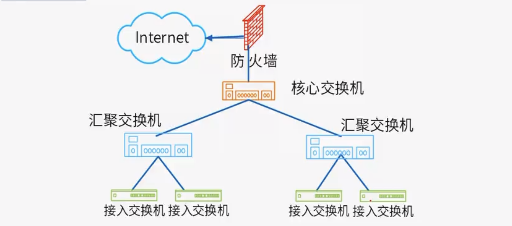

# 计算机网络

## TCP/IP协议簇

**例题**

答案：C

前向纠错（FEC）是一种错误控制技术，发送端在数据中添加冗余信息，使接收端能够检测并纠正错误，而无需请求重传。

数据报系统（如IP网络）是无连接的，每个数据包独立路由，没有预先建立的路径。虚通路（virtual circuit）是面向连接的系统（如ATM或帧中继）的特征，在数据传输前建立固定路径，但数据报系统不提供此功能。

## DNS协议应用

**主域名服务器**

主域名服务器接收到的请求通常来源于递归 DNS 服务器，当递归 DNS 服务器在查询链中最终定位到目标域名的 权威服务器（主/辅域名服务器） 时，会直接向其发起请求。

当主域名服务器收到查询请求（如 `www.example.com`)时，按以下顺序处理：

| **步骤**                    | **处理动作**                        | **说明**                                                     |
| :-------------------------- | :---------------------------------- | :----------------------------------------------------------- |
| **1. 查询本地缓存记录**     | 检查近期解析结果缓存                | 若缓存中有有效记录（未过期），直接返回结果，避免重复查询。   |
| **2. 查询区域记录**         | 检索自身管理的域名配置（Zone File） | 若请求的域名属于其管辖范围（如 `example.com`），返回对应的解析记录（如IP地址）。 |
| **3. 转发至转发域名服务器** | 将请求转发给上游服务器（若配置）    | 若自身无记录且配置了转发器（Forwarder），则转交给其他DNS服务器（如ISP的递归DNS）。 |
| **4. 查询根域名服务器**     | 从根域（`.`）开始逐级查询           | 若前两步未解决，向根服务器获取顶级域（如 `.com`）的地址，再逐级向顶级域、权限域查询，直至获得最终结 |

**例题**

答案：A

答案：C

## DHCP协议应用

当DHCP获取地址异常时可能会获取到无效地址，在windows中地址段为169.254.X.X，Linux中则为0.0.0.0。

**例题**

答案：A

在一个网络中，可以部署多台DHCP服务器以提高冗余性和负载均衡。客户端通过广播方式发送DHCPDISCOVER消息，所有DHCP服务器均可响应。客户端通常接受第一个收到的DHCPOFFER，但多台服务器共存是允许且常见的（例如，通过划分地址池或使用DHCP故障转移机制避免冲突）。

DHCP客户端在初始启动时不知道DHCP服务器的地址，因此会发送广播消息（DHCPDISCOVER）来主动发现服务器。服务器响应后，客户端才得知其地址。客户端无需（也无法）预先指定服务器地址。

DHCP客户端不会主动选择IP地址，地址分配完全由DHCP服务器控制。

在大多数操作系统中（如Windows Server、Linux的`isc-dhcp-server`），DHCP服务默认是禁用的。管理员必须手动安装、配置并启动服务（例如，在Windows中需添加角色，在Linux中需编辑`dhcpd.conf`并启用服务）。

## 网络规划与设计

网络规划与设计的五个阶段：

- 需求分析
- 通信规范分析
- 逻辑网络分析
- 物理网络分析
- 实施阶段

### 需求分析

确定需求，包括：业务需求，用户需求，应用需求，计算机平台需求，网络通信需求等。

产物：需求规范

### 通信规范分析

对现有的网络体系进行分析，估计和测量通信量及设备利用率。

产物：通信规范

### 逻辑网络设计

逻辑网络设计是体现网络设计核心思想的关键阶段，在这一阶段根据需求规范和通信规范，选择一种比较适宜的网络逻辑结构，并基于该逻辑结构实施后续的资源分配规划，安全规划等内容。

产物：逻辑设计文档

利用需求分析和现有网络体系分析的结果来设计逻辑网络结构，最后得到一份逻辑网络设计文档。

逻辑网络设计工作内容：

- 网络结构的设计
- 物理层技术的选择
- 局域网技术的选择与应用
- 广域网技术的选择与应用
- 地址设计和命名模型
- 路由选择协议
- 网络管理
- 网络安全
- 逻辑网络设计文档

逻辑网络设计文档的输出内容包括以下：

- 逻辑网络设计图
- IP地址方案
- 安全管理方案
- 具体的软/硬件、广域网连接设备和基本的网络服务（这里只是规划网络层次以及各个层次选择什么样的设备，但不设计具体的设备选型。）
- 招聘和培训网络员工的具体说明
- 对软/硬件费用、服务提供费用、员工和培训的费用初步估计

### 物理网络设计

物理网络设计是对逻辑网络设计的物理实现，通过对设备的具体物理分析，运行环境等确定，确保网络的物理连接符合逻辑连接的要求。在这一阶段，网络设计者需要确定具体的软/硬件、连接设备、布线和服务的部署方案。

产物：物理结构设计文档

物理结构设计文档的输出内容包括以下：

- 网络物理结构图和布线方案
- 设备和部件得详细列表清单
- 软硬件和安装费用得估算
- 安装日程表，详细说明服务得时间以及期限
- 安装后的测试计划
- 用户的培训计划

### 实施阶段

实现物理网络设计，安装和维护。

**例题**

答案：A

答案：A

答案：A

答案：D

## 层次化网络设计

**核心层**

主要是高速数据交换，实现高速数据传输、出口路由，而且由于比较重要，为了提高可靠性，通常需要冗余机制。

**汇聚层**

网络访问策略控制、数据包处理和过滤、策略路由、广播域定义、寻址。

**接入层**

主要是针对用户端，实现用户接入、计费管理、MAC地址认证、MAC地址过滤、收集用户信息，早期实现中可能 使用集线器代替交换机。

**例题**

答案：A

答案：C